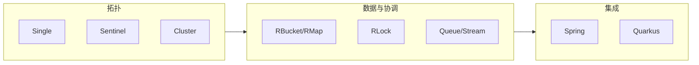

# Redisson 修炼手册（分章版）

> 叙事：**大师 × 小白**。技术细节以 [Redisson 官方文档](https://redisson.org/docs/) 与本仓库 [docs/](../overview.md) 为准。  
> 默认讨论 **Community Edition**（`org.redisson:redisson`）；**PRO** 能力以 [功能对比](https://redisson.pro/feature-comparison.html) 为准。

## 写给读者

- **读者**：Java 8+，用过 Redis 或任意 Java Redis 客户端即可。  
- **每章结构**：茶馆闲话（趣味）→ **需求落地（由浅入深：业务痛点 → 架构取舍 → Redisson/API）** → 对话钩子（可多轮追问）→ 核心概念 → **纯 Java + Spring Boot 实战片段** → 生产清单 → **本章实验室** → 大师私房话（深度）。  
- **姊妹篇**：合订本见 [../Redisson修炼手册-大师与小白.md](../Redisson修炼手册-大师与小白.md)。

## 章节目录

| 章 | 文件 | 主题 |
|----|------|------|
| 第零章 | [第零章-序章-为什么选Redisson.md](第零章-序章-为什么选Redisson.md) | 定位、选型、心智模型 |
| 第一章 | [第一章-跑起来-依赖与首个Client.md](第一章-跑起来-依赖与首个Client.md) | Maven/YAML、shutdown |
| 第二章 | [第二章-配置-拓扑与调参.md](第二章-配置-拓扑与调参.md) | Single/Sentinel/Cluster… |
| 第三章 | [第三章-线程模型与三种API.md](第三章-线程模型与三种API.md) | 同步/异步/Reactive、Pipeline |
| 第四章 | [第四章-Codec与序列化.md](第四章-Codec与序列化.md) | JSON/Kryo、演进、安全 |
| 第五章 | [第五章-分布式对象基础.md](第五章-分布式对象基础.md) | Bucket、Map、限流、Bloom |
| 第六章 | [第六章-分布式集合选型.md](第六章-分布式集合选型.md) | ZSet、时间序列、热 key |
| 第七章 | [第七章-队列与流.md](第七章-队列与流.md) | 语义、Stream、幂等 |
| 第八章上 | [第八章上-分布式锁-RLock与看门狗.md](第八章上-分布式锁-RLock与看门狗.md) | 租约、反模式 |
| 第八章下 | [第八章下-公平锁读写锁联锁与RedLock.md](第八章下-公平锁读写锁联锁与RedLock.md) | MultiLock、争议 |
| 第九章 | [第九章-发布订阅.md](第九章-发布订阅.md) | Topic、可靠投递边界 |
| 第十章 | [第十章-事务批处理与Lua.md](第十章-事务批处理与Lua.md) | 事务误区、原子脚本 |
| 第十一章 | [第十一章-分布式服务.md](第十一章-分布式服务.md) | Remote、Executor、Scheduler |
| 第十二章 | [第十二章-Spring生态集成.md](第十二章-Spring生态集成.md) | Starter、Cache、Session |
| 第十三章 | [第十三章-框架矩阵速览.md](第十三章-框架矩阵速览.md) | Quarkus、Micronaut… |
| 第十四章 | [第十四章-可观测与上线清单.md](第十四章-可观测与上线清单.md) | 指标、演练、Checklist |
| 第十五章 | [第十五章-附录与延伸阅读.md](第十五章-附录与延伸阅读.md) | PRO、迁移、术语、资源 |

## 能力地图（速查）

