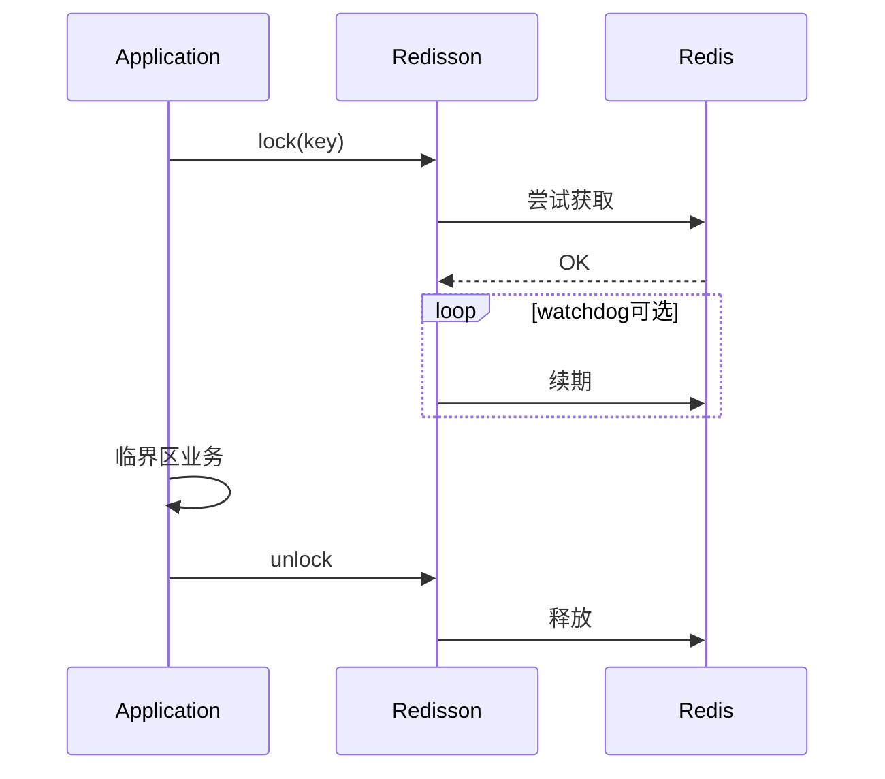

# 第八章（下）：公平锁、读写锁、信号量、联锁与 RedLock

[← 目录](README.md)

---

## 趣味：十八般兵器陈列架

小白望着满墙锁具眼花：「公平锁、读写锁、信号量……我全挂上是不是更安全？」  
大师：「镖局里挂十八般兵器，不代表出门要**背十八般**。多一把锁，就多一条 **泄漏、死锁、监控盲区**。」

---

## 需求落地（由浅入深）

1. **浅**：业务从「单资源互斥」扩展到 **多读少写**、**并发槽位**、**多账户转账顺序**——对应才会想到 `RReadWriteLock`、`RSemaphore`、`RedissonMultiLock`。  
2. **中**：公平与吞吐权衡；信号量 **permit 泄漏** 与 **超时回收**；多锁 **固定加锁顺序** 防死锁——**先画资源依赖图，再调 API**。  
3. **深**：RedLock 争议涉及 **时钟、多数派、故障域**；关键路径要有 **书面失效模式**：锁丢了系统是否仍 **不超卖、不少付**——通常靠 **DB、fencing、对账**。

---

## 对话钩子

**小白**：我们要「绝对公平排队」，上 `RFairLock`？  
**大师**：先确认 **公平成本**（吞吐下降）产品是否接受；多数场景 **统计饥饿** 比「绝对公平」更实在。

**小白**：RedLock 是不是终极方案？  
**大师**：它是 **一种多节点租约协议**，不是 **数学证明题的标准答案**。答不出「主从切换时最坏会怎样」，就别拿它签 **资金安全责任书**。

---

## `RFairLock`

- **更公平的排队**，可能 **降低吞吐**——公平不是免费午餐。  
- 适用：线程饥饿不可接受的场景；否则默认锁可能更简单。

---

## `RReadWriteLock`

- **读共享、写独占**；适合读多写少、且 **持锁时间可控**。  
- **深度**：读写锁防不了 **业务逻辑错误**（例如读到过期缓存当真理）；它只管 **并发维度**。

---

## `RSemaphore` / `RPermitExpirableSemaphore` / `RCountDownLatch`

- **限并发**、**分阶段栅栏**、**多实例协调**。  
- **许可泄漏**：拿到 permit 不释放、进程崩溃 → 设计 **超时回收** 与 **监控可用 permit 数**。  
- **反例**：信号量当「精确计数器」却不处理崩溃恢复 → 长期「名额被幽灵占满」。

---

## `RedissonMultiLock` 与 RedLock

- **MultiLock**：组合多个 `RLock`，用于 **多资源** 或 **固定加锁顺序** 规避死锁。  
- **RedLock**：业界有 **广泛争议**（时钟、故障域、主从切换下的边界）。  
  - **诚实结论**：先写清 **SLO 与失效模式** 能否接受；关键路径建议 **DB 唯一约束、fencing token、或对账**。  
  - **勿银弹叙事**：没有「上了 RedLock 就 100% 不会卖超」这种简单故事。

---

## 与 ZooKeeper / etcd / DB 锁（一句话框架）

| 方案 | 味道 |
|------|------|
| Redis / Redisson | 低延迟、高吞吐；语义绑 **租约与拓扑** |
| ZK / etcd | 强协调、watcher；运维与延迟模型不同 |
| 数据库 | 慢；常作 **最终兜底**（唯一索引） |

生产常见 **混合拳**：Redis 锁控并发，DB 约束保正确性。

---

## 锁生命周期（mermaid）

**故障路径**：进程崩溃未 unlock → 依赖 **lease 过期**；续期失控 → **长期占锁**——所以 **监控持锁时间** 不是可选项。

---

## 本章实验室（下）（约 90～120 分钟）

**环境**：单 Redis；`ExecutorService` 固定 10+ 线程；准备一个 **共享计数目标**（Redis 中 `RAtomicLong` 或 `RBucket<Long>`，或进程内 `AtomicLong` 仅作对照——建议至少一组走 Redis 以观察真实延迟）。

### 步骤

1. **无锁竞态基线**  
   - 10 线程各执行 1000 次：`read` → `+1` → `write`（非原子三步）。  
   - 记录最终值：应 **远小于** 10000；截图或日志 **期望值 vs 实际值**。

2. **`RLock` 互斥**  
   - 同结构，临界区用 `RLock` 包住 **整段 read-modify-write**。  
   - 验证：最终值 **等于** 10000；记录 **总耗时** 与无锁版本对比。

3. **`RReadWriteLock`**  
   - 配置例如 8 读线程循环读、2 写线程循环写（各带短随机 sleep）。  
   - 运行 30s，日志打点：**写线程成功次数、读线程平均等待**；观察是否出现 **写长期抢不到锁**（与实现与负载有关）。  
   - 结论一句话：**读写锁解决了什么、没解决什么**（业务脏读仍可能发生）。

4. **`RSemaphore`（可选）**  
   - `trySetPermits(3)`，10 线程并发「申请 permit → 模拟工作 200ms → release」。  
   - 验证：任意时刻 **最多 3 个** 在执行工作段（用计数器或日志）；故意 **不 release** 一条，观察 **泄漏后** 系统行为，再对照 **可过期 permit** API 文档。

5. **`RedissonMultiLock`（可选）**  
   - 两把锁 `lock1`、`lock2`：两线程 **相反顺序** 加锁，观察死锁；再改为 **字典序固定顺序** 加锁，确认 **死锁消失**。

6. **RedLock 讨论（无代码也可）**  
   - 小组书面回答：主从切换、时钟跳变时 **最坏丢锁窗口** 能否接受；关键资金路径 **DB 唯一约束 / fencing** 是否已具备。

### 验证标准

- 实验 1～2：**数值正确性** 与 **锁的必要性** 有可展示数据。  
- 实验 3：能描述 **是否观察到写饥饿** 及与负载的关系。  
- 实验 6：**书面结论** 存档（可附在团队 Wiki）。

### 记录建议

- 表格：| 场景 | 无锁结果 | 有锁结果 | 耗时 |  
- RedLock 一节单独 **风险登记**（谁签字接受何种失效模式）。

---

## 大师私房话

**分布式锁题的终极考法**：不是「会不会调 API」，而是 **「锁失效时系统是否仍安全」**。答不上来，就别上生产护核心资金。

**上一章**：[第八章上](20-分布式锁-RLock与看门狗.md)｜**下一章**：[第九章](22-发布订阅.md)
