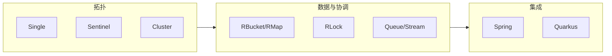

# Redisson 修炼手册（分章版）

> 叙事：**大师 × 小白**。技术细节以 [Redisson 官方文档](https://redisson.org/docs/) 与本仓库 [docs/](../overview.md) 为准。  
> 默认讨论 **Community Edition**（`org.redisson:redisson`）；**PRO** 能力以 [功能对比](https://redisson.pro/feature-comparison.html) 为准。

## 写给读者

- **读者**：Java 8+，用过 Redis 或任意 Java Redis 客户端即可。  
- **每章结构**：茶馆闲话（趣味）→ **需求落地（由浅入深：业务痛点 → 架构取舍 → Redisson/API）** → 对话钩子（可多轮追问）→ 核心概念 → **纯 Java + Spring Boot 实战片段** → 生产清单 → **本章实验室** → 大师私房话（深度）。  
- **姊妹篇**：合订本见 [../Redisson修炼手册-大师与小白.md](../Redisson修炼手册-大师与小白.md)。

## 章节目录

**文件名**：`NN-主题.md`（`NN` 为 **00–41** 的全书唯一序号，按推荐阅读顺序递增；资源管理器里按名称排序即与目录一致）。正文标题里仍保留「第N章 / 分篇」等叙事称呼，与序号并行不悖。

| 序号 | 文件 | 主题 |
|------|------|------|
| 00 | [00-序章-为什么选Redisson.md](00-序章-为什么选Redisson.md) | 定位、选型、心智模型 |
| 01 | [01-跑起来-依赖与首个Client.md](01-跑起来-依赖与首个Client.md) | Maven/YAML、shutdown |
| 02 | [02-配置-拓扑与调参.md](02-配置-拓扑与调参.md) | Single/Sentinel/Cluster… |
| 03 | [03-线程模型与三种API.md](03-线程模型与三种API.md) | 同步/异步/Reactive、Pipeline |
| 04 | [04-Codec与序列化.md](04-Codec与序列化.md) | JSON/Kryo、演进、安全 |
| 05 | [05-分布式对象基础.md](05-分布式对象基础.md) | 分布式对象 **导览** |
| 06 | [06-RBucket单值与配置.md](06-RBucket单值与配置.md) | `RBucket` |
| 07 | [07-RMap与本地缓存.md](07-RMap与本地缓存.md) | `RMap` / `RLocalCachedMap` |
| 08 | [08-Bloom与基数估算.md](08-Bloom与基数估算.md) | `RBloomFilter`、基数工具 |
| 09 | [09-分布式限流.md](09-分布式限流.md) | `RRateLimiter` |
| 10 | [10-分布式集合选型.md](10-分布式集合选型.md) | 集合 **导览** |
| 11 | [11-RList-列表与顺序.md](11-RList-列表与顺序.md) | `RList` |
| 12 | [12-RSet-集合与去重.md](12-RSet-集合与去重.md) | `RSet` |
| 13 | [13-ZSet与排行榜.md](13-ZSet与排行榜.md) | `RScoredSortedSet` |
| 14 | [14-队列与流.md](14-队列与流.md) | 队列与流 **导览** |
| 15 | [15-RQueue与RDeque.md](15-RQueue与RDeque.md) | `RQueue` / `RDeque` |
| 16 | [16-RBlockingQueue.md](16-RBlockingQueue.md) | `RBlockingQueue` |
| 17 | [17-RReliableQueue.md](17-RReliableQueue.md) | `RReliableQueue` |
| 18 | [18-RStream.md](18-RStream.md) | `RStream` |
| 19 | [19-RRingBuffer.md](19-RRingBuffer.md) | `RRingBuffer` |
| 20 | [20-分布式锁-RLock与看门狗.md](20-分布式锁-RLock与看门狗.md) | 租约、看门狗、反模式 |
| 21 | [21-公平锁读写锁联锁与RedLock.md](21-公平锁读写锁联锁与RedLock.md) | MultiLock、RedLock 争议 |
| 22 | [22-发布订阅.md](22-发布订阅.md) | Topic、可靠投递边界 |
| 23 | [23-事务批处理与Lua.md](23-事务批处理与Lua.md) | 事务误区、原子脚本 |
| 24 | [24-分布式服务.md](24-分布式服务.md) | 分布式服务 **导览** |
| 25 | [25-RemoteService.md](25-RemoteService.md) | `RRemoteService` |
| 26 | [26-RExecutorService.md](26-RExecutorService.md) | `RExecutorService` |
| 27 | [27-RScheduledExecutorService.md](27-RScheduledExecutorService.md) | `RScheduledExecutorService` |
| 28 | [28-LiveObject.md](28-LiveObject.md) | Live Object |
| 29 | [29-Spring生态集成.md](29-Spring生态集成.md) | Spring **导览** |
| 30 | [30-SpringBoot-Starter.md](30-SpringBoot-Starter.md) | Spring Boot Starter |
| 31 | [31-SpringCache.md](31-SpringCache.md) | Spring Cache |
| 32 | [32-SpringSession.md](32-SpringSession.md) | Spring Session |
| 33 | [33-框架矩阵速览.md](33-框架矩阵速览.md) | 多框架 **导览** |
| 34 | [34-Quarkus.md](34-Quarkus.md) | Quarkus |
| 35 | [35-Micronaut.md](35-Micronaut.md) | Micronaut |
| 36 | [36-Helidon.md](36-Helidon.md) | Helidon |
| 37 | [37-Hibernate二级缓存.md](37-Hibernate二级缓存.md) | Hibernate 二级缓存 |
| 38 | [38-MyBatis.md](38-MyBatis.md) | MyBatis |
| 39 | [39-Tomcat-Session.md](39-Tomcat-Session.md) | Tomcat Session |
| 40 | [40-可观测与上线清单.md](40-可观测与上线清单.md) | 指标、演练、Checklist |
| 41 | [41-附录与延伸阅读.md](41-附录与延伸阅读.md) | PRO、迁移、术语、资源 |

## 能力地图（速查）

