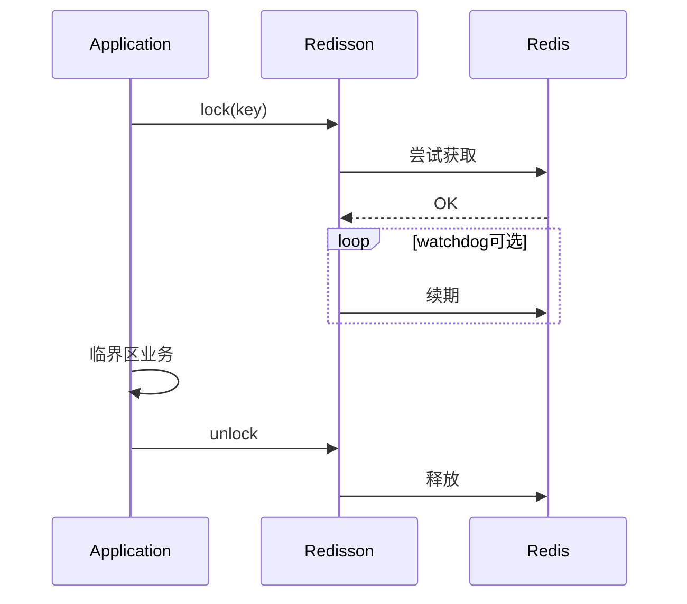

# 第八章（下）：公平锁、读写锁、信号量、联锁与 RedLock

[← 目录](README.md)

---

## 趣味：十八般兵器陈列架

小白望着满墙锁具眼花：「公平锁、读写锁、信号量……我全挂上是不是更安全？」  
大师：「镖局里挂十八般兵器，不代表出门要**背十八般**。多一把锁，就多一条 **泄漏、死锁、监控盲区**。」

---

## 需求落地（由浅入深）

1. **浅**：业务从「单资源互斥」扩展到 **多读少写**、**并发槽位**、**多账户转账顺序**——对应才会想到 `RReadWriteLock`、`RSemaphore`、`RedissonMultiLock`。  
2. **中**：公平与吞吐权衡；信号量 **permit 泄漏** 与 **超时回收**；多锁 **固定加锁顺序** 防死锁——**先画资源依赖图，再调 API**。  
3. **深**：RedLock 争议涉及 **时钟、多数派、故障域**；关键路径要有 **书面失效模式**：锁丢了系统是否仍 **不超卖、不少付**——通常靠 **DB、fencing、对账**。

---

## 对话钩子

**小白**：我们要「绝对公平排队」，上 `RFairLock`？  
**大师**：先确认 **公平成本**（吞吐下降）产品是否接受；多数场景 **统计饥饿** 比「绝对公平」更实在。

**小白**：RedLock 是不是终极方案？  
**大师**：它是 **一种多节点租约协议**，不是 **数学证明题的标准答案**。答不出「主从切换时最坏会怎样」，就别拿它签 **资金安全责任书**。

---

## `RFairLock`

- **更公平的排队**，可能 **降低吞吐**——公平不是免费午餐。  
- 适用：线程饥饿不可接受的场景；否则默认锁可能更简单。

---

## `RReadWriteLock`

- **读共享、写独占**；适合读多写少、且 **持锁时间可控**。  
- **深度**：读写锁防不了 **业务逻辑错误**（例如读到过期缓存当真理）；它只管 **并发维度**。

---

## `RSemaphore` / `RPermitExpirableSemaphore` / `RCountDownLatch`

- **限并发**、**分阶段栅栏**、**多实例协调**。  
- **许可泄漏**：拿到 permit 不释放、进程崩溃 → 设计 **超时回收** 与 **监控可用 permit 数**。  
- **反例**：信号量当「精确计数器」却不处理崩溃恢复 → 长期「名额被幽灵占满」。

---

## `RedissonMultiLock` 与 RedLock

- **MultiLock**：组合多个 `RLock`，用于 **多资源** 或 **固定加锁顺序** 规避死锁。  
- **RedLock**：业界有 **广泛争议**（时钟、故障域、主从切换下的边界）。  
  - **诚实结论**：先写清 **SLO 与失效模式** 能否接受；关键路径建议 **DB 唯一约束、fencing token、或对账**。  
  - **勿银弹叙事**：没有「上了 RedLock 就 100% 不会卖超」这种简单故事。

---

## 与 ZooKeeper / etcd / DB 锁（一句话框架）

| 方案 | 味道 |
|------|------|
| Redis / Redisson | 低延迟、高吞吐；语义绑 **租约与拓扑** |
| ZK / etcd | 强协调、watcher；运维与延迟模型不同 |
| 数据库 | 慢；常作 **最终兜底**（唯一索引） |

生产常见 **混合拳**：Redis 锁控并发，DB 约束保正确性。

---

## 锁生命周期（mermaid）

**故障路径**：进程崩溃未 unlock → 依赖 **lease 过期**；续期失控 → **长期占锁**——所以 **监控持锁时间** 不是可选项。

---

## 本章实验室（下）

1. 10 线程竞争 `RLock` 更新共享计数 → 对比 **无锁错误结果**。  
2. `ReadWriteLock`：多读一写，观察 **写饥饿** 是否出现（与实现与配置有关）。  
3. 小组讨论：**你们业务** 能否接受 RedLock 争议中的失效窗口？写下 **书面结论**。

---

## 大师私房话

**分布式锁题的终极考法**：不是「会不会调 API」，而是 **「锁失效时系统是否仍安全」**。答不上来，就别上生产护核心资金。

**上一章**：[第八章上](第八章上-分布式锁-RLock与看门狗.md)｜**下一章**：[第九章](第九章-发布订阅.md)
