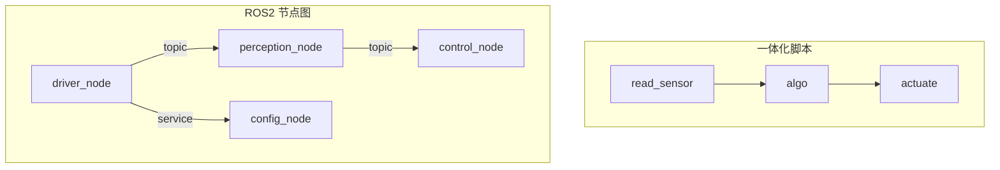

# B01 · ROS 2 是什么：节点图与「没有中间件会怎样」

> 本章目标字数：3000–5000。统一环境见 [ENV.md](../ENV.md)。

## 1 项目背景

### 业务场景

一家移动机器人创业公司接下了「仓库夹抱 + 简单导航」的交付单：硬件来自三家供应商——底盘、深度相机、机械臂，软件团队四人，工期三个月。最初技术负责人写了一个 `main.py`：循环读串口、读相机、发 CAN 指令，UI 用另一个脚本起进程互相 `zmq` 怼。演示日能跑通；进入联调周问题来了：**谁改 PID 谁就要重启整个 Python**，视觉同学想单独跑检测，还要把整个串口逻辑拉起来装假数据。

产品经理念出一句话：「我们要的不是脚本，是**能插拔的软件架构**。」这恰恰是 ROS 2 的定位：用一套**约定俗成的进程模型**（节点）、**通信原语**（话题/服务/动作）和**工具链**（CLI、日志、录制、可视），把「机器人应用」从「脚本的堆叠」推向「分布式系统的工程化」。ROS 2 名字里虽有 Operating System，它并不是 Linux 替代品，而是**跑在操作系统之上的中间件与框架**。

### 痛点放大

若没有 ROS 2 这类中间件，团队在业务上通常会遇到：

1. **集成成本高**：每人一套 IPC（管道/共享内存/Socket），接口文档靠口头；换一个传感器，上下游全改。
2. **可观测性缺失**：不知道是哪个模块卡住了 50 ms，没有统一的节点列表、话题列表、时间戳约定。
3. **复用困难**：算法写了跑在笔记本上，搬到车载工控机要重写线程与调度。

下图对比「脚本一体化」与「节点图」的认知模型：



**本章目标**：在 **Ubuntu 22.04 + ROS 2 Humble** 上完成最小环境自检，运行官方示例节点，建立对 **Graph（节点/话题）** 与 **DDS 发现** 的直观认识；并和 ROS 1 的 **Master** 心智模型做一次对照（仅作迁移提示，本书主线是 ROS 2）。

---

## 2 项目设计

### 剧本对话

**小胖**：我懂了，ROS 2 就是给我们机器人用的「微信群」嘛，节点都在群里喊话？

**小白**：群里有群主吗？以前听人说 ROS 有个 Master，断了全瞎？

**大师**：ROS 1 时代确实有 **Master** 做名字服务，单点问题让人头疼。ROS 2 把发现和匹配交给 **DDS**（Data Distribution Service）标准实现：**分布式发现**，没有中央「群主」——大家都是平等参与者。你可以把「谁在发什么话题」想成**贴满便签的公告墙**，谁来了谁在墙上登记，彼此对齐。

**技术映射**：**ROS 1 Master** ≈ 集中式注册中心；**ROS 2 + DDS** ≈ **分布式发现（discovery）**。

---

**小胖**：那如果两个人同时登记同一个话题名，会不会抢？

**小白**：还有，我和同事的笔记本不在一个网段，能互相看见吗？

**大师**：同名话题**类型必须兼容**，多发布者要慎用（后面 **B04** 细讲）。网络层面，** DDS 域（Domain）**、**防火墙多播**、**ROS_DOMAIN_ID** 都会影响「看得见/看不见」。单机联调往往没问题，一上多机就要学 **M01**。

**技术映射**：**ROS_DOMAIN_ID** 与 **DDS Domain** 对齐；发现流量与 **RTPS** 相关。

---

**小胖**：行吧，所以 ROS 2 核心价值就是「少写胶水代码」？

**小白**：我更关心：**和直接用 ZeroMQ / gRPC 比**，我们多付出了什么学习成本？换来了什么？

**大师**：ROS 2 卖的是**生态与工具**：消息类型仓库、`rviz2` 可视化、`ros2 bag` 录制、`launch` 描述多进程、**TF** 统一坐标、导航/控制开源栈（Nav2、ros2_control）。代价是你要接受 **QoS、生命周期、DDS 实现差异** 这些概念。选型上：强定制点对点通信可只用 ZMQ；要做标准化机器人软件栈，ROS 2 通常是默认答案。

**技术映射**：ROS 2 = **rmw（middleware）抽象** + **rcl/rclcpp/rclpy** + **工具与生态**。

---

## 3 项目实战

### 环境准备

与 [ENV.md](../ENV.md) 一致：**Ubuntu 22.04**，安装 `ros-humble-desktop`。终端执行：

```bash
source /opt/ros/humble/setup.bash
```

本章额外依赖：无（使用系统自带的 `demo_nodes_cpp` / `demo_nodes_py` 即可）。

### 分步实现

#### 步骤 1：`ros2 doctor` 自检

- **目标**：确认发行版与环境变量是否健康。
- **命令**：

```bash
ros2 doctor --report
```

- **预期输出**：报告中含 `distribution name: humble`、`rmw` 实现（如 `rmw_fastrtps_cpp`）等；若有 WARNING，按提示补装 locale 或依赖。
- **坑与解法**：若 `command not found`，说明未 `source /opt/ros/humble/setup.bash` 或未安装 desktop 元包。

#### 步骤 2：运行官方 Talker / Listener

- **目标**：看见「节点 + 话题」在真机上跑起来。
- **终端 A**：

```bash
ros2 run demo_nodes_cpp talker
```

- **终端 B**：

```bash
ros2 run demo_nodes_py listener
```

- **预期输出**：Listener 终端持续打印收到的字符串；Talker 打印发布日志。
- **坑与解法**：若 Listener 无输出，检查两终端是否同一 `ROS_DOMAIN_ID`（`echo $ROS_DOMAIN_ID`）。

#### 步骤 3：观察计算图

- **目标**：用 CLI 对齐「大脑里的架构图」与真实进程。
- **命令**（Talker/Listener 保持运行时另开终端）：

```bash
ros2 node list
ros2 topic list
ros2 topic info /chatter
ros2 interface show std_msgs/msg/String
```

可选安装图形化工具（若未装）：`sudo apt install ros-humble-rqt-graph`，然后：

```bash
rqt_graph
```

- **预期输出**：能看到 `/chatter` 话题，类型 `std_msgs/msg/String`，发布者与订阅者节点名。
- **坑与解法**：`rqt_graph` 空白——先确认 talker/listener 仍在跑。

#### 步骤 4（对照心智）：ROS 1 与 ROS 2 一句清单

- **目标**：建立迁移读者的「对照表」，避免混淆。
- **不必运行代码**，阅读下表即可：

| 概念 | ROS 1 常见说法 | ROS 2 |
|------|----------------|------|
| 注册中心 | `roscore` / Master | 无独立 master；DDS 发现 |
| 节点命令 | `rosnode` | `ros2 node` |
| 构建 | `catkin_make` / `catkin build` | `colcon build`（**B02**） |

### 完整代码清单

- 本章以官方 `demo_nodes_*` 为主，无自研仓库；若需固定版本可记录：`ros-humble-demo-nodes-cpp` / `ros-humble-demo-nodes-py`。
- Git 外链：随书仓库占位 **待补充**。

### 测试验证

1. `ros2 doctor` 无致命 ERROR。
2. Talker + Listener 连通，`ros2 topic hz /chatter` 显示稳定频率（约 1 Hz，取决于 demo 配置）。

```bash
ros2 topic hz /chatter
```

---

## 4 项目总结

### 优点与缺点

| 维度 | 优点 | 缺点 |
|------|------|------|
| 架构 | 节点化、可替换、多语言混编 | 概念多，入门曲线陡 |
| 生态 | 工具链与社区包丰富 | 版本与发行版需锁定（见 ENV） |
| 通信 | DDS 成熟标准、可跨机 | 网络与 QoS 排障需要中级篇 |
| vs 自研 IPC | 省大量胶水与约定 | 对极简嵌入式可能「过重」 |

### 适用场景

- 多传感器、多算法协作的移动操作机器人。
- 需要录制、回放、可视、仿真的研发流程。
- 团队希望「对齐业界默认分工方式」时。

### 不适用场景

- 单 MCU 裸机、无 Linux；或极度资源受限且无 `rcl` 移植计划。
- 强实时硬同步全部在 FPGA 完成，上层仅收结果——未必需要完整 ROS 2 栈。

### 注意事项

- **ROS_DISTRO** 与书中 **Humble** 不一致时，命令与包名需自行替换。
- 不要把「ROS 2」与「Ubuntu」画等号：`rcl` 可移植，但教程默认 Linux。

### 常见踩坑经验

1. **双环境混用**：同一机器装了 Foxy 与 Humble，`setup.bash` source 错顺序——根因是 **overlay 链**未理解（**B02**）。
2. **看得见节点看不见话题**：域名或 `ROS_LOCALHOST_ONLY` 配置异常。
3. **Windows 原生**：官方支持有限，教程默认 WSL2 或 Linux。

### 思考题

1. 为什么说 ROS 2 的「去 Master 化」并不等同于「没有任何中心化配置」？
2. `ros2 topic info` 里列出的 **Publisher/Subscription count** 对排障有何帮助？

**答案**：见 [APPENDIX-answers.md](../APPENDIX-answers.md#b01)；工作空间与 overlay 深入见 [B02](第14章：工作空间、包与 colcon-可复现构建.md)。

### 推广计划提示

- **开发**：全队统一一份「环境自检脚本」（封装 `ros2 doctor` + 域 ID 提示）。
- **测试**：把「官方 talker/listener + hz」作为**冒烟测试**第一步。
- **运维**：记录现场工控机的 **ROS_DOMAIN_ID**、**防火墙策略**（为 **M01** 铺垫）。

---

**导航**：上一章无（见 [总目录](../INDEX.md)）｜ [总目录](../INDEX.md) ｜ [下一章：B02](第14章：工作空间、包与 colcon-可复现构建.md)
