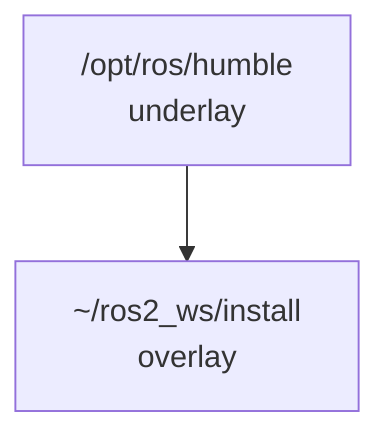

# 第14章：工作空间、包与 colcon-可复现构建

> 本章目标字数：3000–5000。统一环境见 [ENV.md](../ENV.md)。

## 1 项目背景

### 业务场景

公司新建了一条「AMR 软件产品线」：算法、驱动、仿真分别由三位同学维护。第一周还能互相发压缩包；第二周开始，群里变成：「我这边能编你那边 `find_package` 找不到」「你用的到底是不是 Humble？」——根因只有一个：**没有可复现的工作空间与依赖声明**。ROS 2 的标准做法是把源码放在 **workspace（工作空间）** 里，用 **包（package）** 描述依赖，用 **colcon** 批量编译，再用 **overlay** 把自定义包叠在系统安装（underlay）之上。

### 痛点放大

没有规范工作空间时常见问题：

1. **不可复现**：同事 A 手动 `cmake` 成功，同事 B clone 后失败，缺的是「元数据依赖」而非智商。
2. **路径地狱**：`PYTHONPATH`、`CMAKE_PREFIX_PATH` 手工 export，换机器全崩。
3. **集成成本高**：CI 无法一条命令编出安装包，版本回归靠运气。



**本章目标**：在单机新建 `ros2_ws`，创建 **ament_cmake** 与 **ament_python** 包各一，演示 **colcon build**、**overlay source**、依赖在 `package.xml` 中声明。

---

## 2 项目设计

### 剧本对话

**小胖**：工作空间不就是个文件夹嘛，我 `git clone` 一堆代码进去不就行了？

**小白**：那 `CMakeLists.txt` 里 `find_package` 为啥有时找得到 `rclcpp` 有时爆炸？还有 `install/setup.bash` 和 `/opt/ros/...` 谁先谁后？

**大师**：文件夹只是壳。关键是 **underlay + overlay**：系统装好的 Humble 是 **underlay**；你的工作空间编出来的是 **overlay**。运行时要 **先 source underlay，再 source 工作空间的 `install/local_setup.bash`**——后者覆盖前者同名包。

**技术映射**：**overlay** = 用户工作空间对系统安装的**遮蔽/扩展**。

---

**小胖**：colcon 和 catkin 啥关系？我搜老教程全是 catkin。

**大师**：ROS 2 默认 **colcon**（ament 构建系统）。ROS 1 才是 **catkin**。你可以把 colcon 想成「项目经理」：它读每个包的 `package.xml`，调度 **CMake** 或 **Python setuptools** 构建。别混用术语跟老同事聊天会懵。

**技术映射**：**colcon** ≈ 多包编排器；**ament_cmake / ament_python** ≈ 单包构建后端。

---

**小胖**：那我 `colcon build` 一次十分钟，太慢了咋整？

**小白**：能只编改动的包吗？并行线程呢？

**大师**：常用 **`--packages-select`** 只编目标包；**`--parallel-workers N`** 控制并行。开发时配合 **`--symlink-install`**（Python 包免复制源码）提速迭代。CI 里再全量 `colcon build` 做门禁。

**技术映射**：增量构建 + 并行 + symlink 安装 = 开发体验三角。

---

## 3 项目实战

### 环境准备

与 [ENV.md](../ENV.md) 一致。**额外安装**：`sudo apt install python3-colcon-common-extensions`。

```bash
source /opt/ros/humble/setup.bash
```

### 分步实现

#### 步骤 1：创建工作空间骨架

- **目标**：`~/ros2_ws/src` 就绪。
- **命令**：

```bash
mkdir -p ~/ros2_ws/src
cd ~/ros2_ws/src
```

#### 步骤 2：创建 `ament_cmake` 示例包

- **目标**：最小 **C++** 节点包 `cpp_demo`。
- **命令**：

```bash
cd ~/ros2_ws/src
ros2 pkg create cpp_demo --build-type ament_cmake --dependencies rclcpp std_msgs
```

- **在 `cpp_demo/src/minimal_node.cpp` 写入**（覆盖或新建）：

```cpp
#include "rclcpp/rclcpp.hpp"
#include "std_msgs/msg/string.hpp"

int main(int argc, char * argv[])
{
  rclcpp::init(argc, argv);
  auto node = rclcpp::Node::make_shared("minimal_cpp");
  auto pub = node->create_publisher<std_msgs::msg::String>("hello_cpp", 10);
  std_msgs::msg::String msg;
  msg.data = "from colcon workspace";
  pub->publish(msg);
  rclcpp::spin_some(node);
  rclcpp::shutdown();
  return 0;
}
```

- **在 `cpp_demo/CMakeLists.txt` 末尾添加** `add_executable` 与 `ament_target_dependencies`、`install`。

简化完整 `CMakeLists.txt` 关键段：

```cmake
find_package(ament_cmake REQUIRED)
find_package(rclcpp REQUIRED)
find_package(std_msgs REQUIRED)

add_executable(minimal_node src/minimal_node.cpp)
ament_target_dependencies(minimal_node rclcpp std_msgs)

install(TARGETS minimal_node DESTINATION lib/${PROJECT_NAME})

ament_package()
```

- **坑与解法**：若忘记 `ament_package()`，`colcon` 会报包配置不完整。

#### 步骤 3：创建 `ament_python` 空包

```bash
ros2 pkg create py_demo --build-type ament_python --dependencies rclpy
```

保留默认节点或后续 **B04** 再写 publisher 亦可；本章只验证能 **被 colcon 编过**。

#### 步骤 4：构建与 overlay

```bash
cd ~/ros2_ws
colcon build --symlink-install --packages-select cpp_demo py_demo
source install/setup.bash
ros2 run cpp_demo minimal_node
```

- **预期输出**：节点打印/退出（依实现）；`ros2 pkg list | grep demo` 能看到包名。
- **坑与解法**：若 `ros2 run` 找不到包，检查是否执行了 **`source ~/ros2_ws/install/setup.bash`**。

#### 步骤 5：验证 overlay 优先级

```bash
# 新开终端
source /opt/ros/humble/setup.bash
source ~/ros2_ws/install/setup.bash
echo $AMENT_PREFIX_PATH
```

**预期**：路径列表前部含 `~/ros2_ws/install`。

### 完整代码清单

- 目录：`~/ros2_ws/src/cpp_demo`、`py_demo`；版本控制时**不要提交** `build/`、`install/`、`log/`。
- `.gitignore` 建议忽略上述三目录。

### 测试验证

```bash
colcon test --packages-select cpp_demo --event-handlers console_direct+
```

若未写 test，可仅用「能运行 `minimal_node`」作为手工通过标准。

---

## 4 项目总结

### 优点与缺点

| 维度 | 优点 | 缺点 |
|------|------|------|
| 可复现 | `package.xml` 声明依赖 | 依赖写错仍可能链接期才发现 |
| 增量 | `--packages-select` 缩短反馈 | 大型工作空间首次全量仍慢 |
| 与 CI | `colcon` 命令式易脚本化 | 需统一 Docker 镜像 |

### 适用场景

- 团队协作与多包仓库。
- 需要对外交付「可编译源码」的客户项目。

### 不适用场景

- 单文件脚本试验：可直接 `python3`，不必上 colcon。

### 注意事项

- **`source` 顺序**：underlay → overlay。
- **混合 ROS1**：不要在同一 shell 混 `ros1` 与 `ros2` 环境（除非清楚后果）。

### 常见踩坑经验

1. **找不到包**：忘记 source `install/setup.bash`（根因：**环境未 overlay**）。
2. **`Peer dependency` 版本冲突**：同一工作空间两包要求不同版本 `tf2`——需升级系统或 vendor。
3. **WSL 路径**：Windows 盘挂载导致符号链接失败——关闭 `--symlink-install` 或把工程放 Linux 文件系统。

### 思考题

1. 说明 **underlay** 与 **overlay** 的差别；若两个 overlay 都 `source`，谁生效？
2. `colcon build` 生成的 **`install/`** 与 **`build/`** 各自用途是什么？

**答案**：见 [APPENDIX-answers.md](../APPENDIX-answers.md#b02)；节点与回调模型见 [B03](第15章：节点与执行器-回调与单线程-多线程.md)。

### 推广计划提示

- **开发**：仓库根提供 **`README` 一页**：如何 `colcon build`、如何跑 smoke test。
- **测试**：CI 缓存 **apt** 与 **`ccache`**，缩短流水线。
- **运维**：交付物包含 **`install` tarball** 或 deb 时，标明 **GLIBC 版本**。

---

**导航**：[上一章：B01](第13章：ROS 2 是什么-节点图与「没有中间件会怎样」.md) ｜ [总目录](../INDEX.md) ｜ [下一章：B03](第15章：节点与执行器-回调与单线程-多线程.md)
