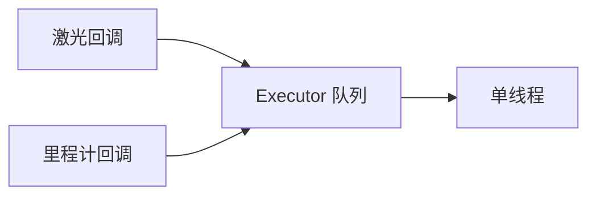

# B03 · 节点与执行器：回调与单线程/多线程

> 本章目标字数：3000–5000。统一环境见 [ENV.md](../ENV.md)。

## 1 项目背景

### 业务场景

导航组报告：激光订阅回调里做了**点云滤波**，偶发卡顿 80 ms，同一时间底盘**里程计**回调「像断了」。调试发现：用的是默认 **单线程执行器**，所有回调排队在同一个队列里——**重回调饿死了轻回调**。执行器（**Executor**）与**回调组（callback group）**选型，直接决定「你的 ROS 2 节点是不是伪实时」。

### 痛点放大

1. **饥饿**：计时器、订阅、服务回调共享 single-threaded executor，长任务阻塞全图。
2. **死锁**：在回调里 synchronous 调用另一个会回到同线程的服务，若未用可重入组会自锁。
3. **误解 spin**：以为 `spin()`「只有一个循环」，实际背后是可配置的调度策略。



**本章目标**：用 **rclpy** 演示 **MutuallyExclusive** 与 **Reentrant** 回调组、**单线程**与 **多线程执行器**差异；给出可运行的最小例子与日志对照。

---

## 2 项目设计

### 剧本对话

**小胖**：执行器不就是 `while true` 吗？搞这么玄乎？

**小白**：如果一个回调里 `sleep(1)`，另一个紧急话题是不是整整一秒收不到？

**大师**：在**默认单线程执行器 + 互斥回调组**里，是的：回调**串行**。解决思路三条：**别在回调里睡**、**多线程执行器**、或 **Reentrant** 组让某些回调可嵌套。工程上优先把重计算扔线程池，回调里只做轻量转发。

**技术映射**：**Executor** = 回调调度器；**Callback group** = 可重入/互斥语义。

---

**小胖**：那多线程会不会把 CPU 打爆？

**小白**：Python GIL 算不算一道坎？

**大师**：`rclpy` 受 GIL 影响，CPU 密集仍建议 **C++** 或 **numpy 释放 GIL 的段**。多线程主要解放 **I/O 等待** 与 **可并行回调**。别指望多线程魔法解决算法复杂度本身。

**技术映射**：语言运行时 + Executor 共同决定真实并发度。

---

**小胖**：节点名和进程啥关系？一个进程能跑多个节点吗？

**大师**：ROS 2 常见「**一进程一节点**」；也支持 **component（组件）** 同进程多节点（高级话题）。入门先把「一节点一意图」写清楚最重要。

**技术映射**：**Node** ≈ `rclcpp::Node` / `rclpy.node.Node` 实体；**进程**可承载多个 Node（不常用）。

---

## 3 项目实战

### 环境准备

与 [ENV.md](../ENV.md) 一致。本章使用 **Python**。工作空间见 [B02](第14章：工作空间、包与 colcon-可复现构建.md)。

```bash
cd ~/ros2_ws/src
ros2 pkg create exec_demo --build-type ament_python --dependencies rclpy std_msgs
```

### 分步实现

#### 步骤 1：互斥组 + 故意阻塞

- **目标**：观察「一回调慢，全慢」。
- **文件** `exec_demo/exec_demo/blocking_demo.py`：

```python
import time
import rclpy
from rclpy.node import Node
from rclpy.callback_groups import MutuallyExclusiveCallbackGroup
from std_msgs.msg import String


class Demo(Node):
    def __init__(self):
        super().__init__('blocking_demo')
        self.group = MutuallyExclusiveCallbackGroup()
        self.create_timer(0.1, self.heavy, callback_group=self.group)
        self.create_timer(0.1, self.light, callback_group=self.group)

    def heavy(self):
        self.get_logger().warn('heavy START')
        time.sleep(0.2)
        self.get_logger().warn('heavy END')

    def light(self):
        self.get_logger().info('tick light')


def main():
    rclpy.init()
    node = Demo()
    try:
        rclpy.spin(node)
    except KeyboardInterrupt:
        pass
    node.destroy_node()
    rclpy.shutdown()


if __name__ == '__main__':
    main()
```

- **`setup.py` 注册**：`'blocking_demo = exec_demo.blocking_demo:main'`。
- **运行**：`ros2 run exec_demo blocking_demo`
- **预期**：`light` 被 `heavy` 拉长间隔——**互斥 + 单线程**串行。

#### 步骤 2：多线程执行器

- **目标**：两回调并行。
- **文件** `mt_demo.py`（节选逻辑）：

```python
import rclpy
from rclpy.executors import MultiThreadedExecutor
# ... 同上定义节点 ...
def main():
    rclpy.init()
    node = Demo()
    executor = MultiThreadedExecutor()
    executor.add_node(node)
    try:
        executor.spin()
    finally:
        executor.shutdown()
        node.destroy_node()
        rclpy.shutdown()
```

- **预期**：`heavy` sleep 时 `light` 仍周期打印（注意日志交错）。

#### 步骤 3：可重入组（了解）

- **目标**：同一节点内**嵌套服务调用**场景才需要 **ReentrantCallbackGroup**；初学者慎用，易死锁。

### 完整代码清单

- 包 `exec_demo`：`blocking_demo.py`、`mt_demo.py`、`setup.py`、`package.xml`。
- 外链：待补充。

### 测试验证

- 观察日志时间戳：单线程下 `light` 间隔 ≈ `heavy` 时长 + 自身周期。

---

## 4 项目总结

### 优点与缺点

| 维度 | 优点 | 缺点 |
|------|------|------|
| 单线程 | 行为可预测、易推理 | 易阻塞 |
| 多线程 | 吞吐高 | 竞态与线程安全成本 |
| 回调组 | 灵活表达重入需求 | API 细节多，误用死锁 |

### 适用场景

- 传感高频 + 控制低频同节点：**分回调组 + 多线程**。
- 简单日志节点：默认即可。

### 不适用场景

- 需要硬实时保证：Executor 不够，请考虑 **实时调度/PREEMPT_RT**（**A09**）。

### 注意事项

- **互斥锁与其它线程**：回调里加锁若与其它模块交锁，易成隐蔽死锁。

### 常见踩坑经验

1. **在 timer 回调里同步 call 自己的 service**：默认互斥组 → 死锁；改 **Reentrant** 或异步。
2. **MultiThreadedExecutor + Python CPU 密集**：GIL 导致「假多线程」。
3. **`spin_once` 忘记**：自己写循环时的节奏错误。

### 思考题

1. 为何默认推荐 **MutuallyExclusiveCallbackGroup**？
2. 多线程执行器下，对同一话题的回调是否一定并行？与 **QoS** 有何关系？

**答案**：见 [APPENDIX-answers.md](../APPENDIX-answers.md#b03)；话题与发布订阅实战见 [B04](第16章：话题与消息-发布订阅第一印象.md)。

### 推广计划提示

- **开发**：代码评审 checklist：**回调里禁止长 sleep**。
- **测试**：压测时同时 `ros2 topic hz` 与 CPU 曲线。
- **运维**：若现场「偶发卡顿」，优先要**执行器与回调耗时日志**。

---

**导航**：[上一章：B02](第14章：工作空间、包与 colcon-可复现构建.md) ｜ [总目录](../INDEX.md) ｜ [下一章：B04](第16章：话题与消息-发布订阅第一印象.md)
