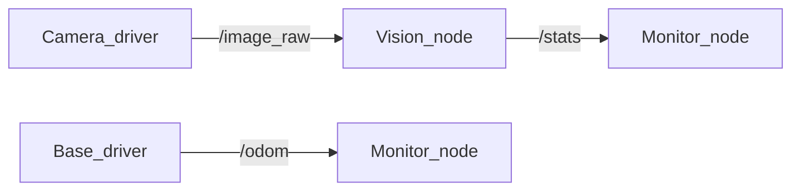

# 第16章：话题与消息-发布订阅第一印象

> 本章目标字数：3000–5000。统一环境见 [ENV.md](../ENV.md)。

> **版本**：ROS 2 Humble（Ubuntu 22.04，统一环境见 [ENV.md](../ENV.md)）
> **定位**：基础篇 · 面向新人开发与测试，强调最小可运行闭环、CLI 观察与概念落地。
> **前置阅读**：建议按章节顺序阅读；若跳读，请先完成 ENV.md 中的环境准备。
> **预计阅读**：35 分钟 | 实战耗时：45–90 分钟

## 1. 项目背景

### 业务场景

某仓储巡检团队为货架通道部署了一台**轮式底盘 + 单目摄像头**的巡检原型机：机器人沿轨道缓慢行驶，工控机运行 ROS 2 驱动栈，将**图像帧**送给视觉节点做读码与异常检测，同时将**底盘里程计**与**任务心跳**发给监控屏。项目经理的要求很朴素：「传感数据要像水管一样流过去，各模块松耦合，谁挂了别拖死整机。」

团队最初用「一个 Python 大脚本」串起摄像头、串口与 UI：脚本里顺序读图、调算法、再 `print` 日志。单机演示尚可；一旦要把**视觉**与**底盘控制**分给两位同学并行开发，脚本立刻变成「谁改一行谁背锅」的冲突现场。于是他们决定：把数据流拆成**可命名的管道**——这正是 ROS 2 里 **Topic（话题）** 与 **Message（消息）** 要解决的问题：用**发布/订阅**把进程间通信从「硬编码函数调用」变成「按话题名对接」。

### 痛点放大

若没有话题抽象，常见后果包括：

1. **耦合与可维护性**：模块间直接 import 或共享全局队列，接口变更牵一发动全身；新人无法只复现「半条流水线」。
2. **性能与可观测性**：不知道数据**实际频率**与**带宽**；CPU 飙高时无法判断是解码、算法还是锁竞争。
3. **一致性与调试**：多源数据没有统一时间基准与字段约定时，联调只能靠「谁先谁后」的口头约定，线上问题难复现。

下图给出「从传感器到消费端」的最小数据流（单话题示意）：



**本章目标**：在同一台 Ubuntu 22.04 + ROS 2 Humble 上，用**最小可运行**的 Python 节点演示：如何**发布**与**订阅**标准消息类型，如何用 CLI 观察话题与流量，为后续 **QoS（B05）**、**自定义消息（B08）** 打基础。

---

### 业务指标与交付边界

本章不追求“把所有概念一次讲完”，而是交付一个可复现的工程切片：

1. **可运行**：至少有一组命令、脚本或配置能够在 Humble 环境中执行。
2. **可观察**：运行后能用 `ros2` CLI、日志、RViz、rosbag2 或系统工具看到明确现象。
3. **可交接**：读者能把 **话题与消息-发布订阅第一印象** 的关键假设、输入输出、失败模式写进项目 README 或排障手册。

**本章交付目标**：完成一个围绕 **话题与消息-发布订阅第一印象** 的最小闭环，并留下可复盘的命令、截图或日志证据。

## 2. 项目设计

### 总体架构图


这张图用于对齐 `example.md` 的“端到端项目链路”写法：先从业务需求出发，再落到配置/代码，最后用观测与验收把结论闭环。

### 剧本对话

**小胖**：这不就跟食堂窗口贴告示一样吗？后厨炒好菜，往「窗口」一摆，谁排队谁拿——为啥还要搞话题名、消息类型这么文绉绉？

**小白**：等等，如果两个窗口都贴「今日套餐」，我拿错算谁的？还有，有人吃得快有人慢，队尾会不会堆到马路上？

**大师**：你可以把 **Topic** 想成「**告示栏上的栏目名**」，比如「今日套餐 A」；**Message** 是栏目里**一张结构化表格**（几荤几素、辣度、价格）。大家约定好栏目名，后厨**发布**，食客**订阅**——谁也不用认识后厨的门朝哪开。

**技术映射 #1**：**Topic** ≈ 逻辑通道名；**Message** ≈ 通道上传输的数据类型（字段固定、可版本化）。

---

**小胖**：那我只关心「有没有菜」，能不能别管表格长啥样？

**小白**：不行吧——视觉要 `sensor_msgs/Image`，监控要 `std_msgs/String` 统计，字段不对，订阅端根本解不出来。还有，**一个话题能有两个后厨同时往上贴吗？**

**大师**：可以，但要非常谨慎。ROS 2 允许多个 **Publisher** 往同名 topic 发**兼容类型**的消息（通常不推荐多源混发，除非你很清楚 DDS 的保序语义）。更常见的模式是**一个主发布源**，或**分话题**（`/front_cam/image` 与 `/rear_cam/image`）。

**技术映射 #2**：**单话题多 Publisher** 可能带来**顺序与来源语义模糊**；工程上优先 **分话题** 或 **单源**。

---

**小胖**：那我吃得慢，窗口一直上新，我会不会拿到十份冷饭？

**小白**：这就是**积压**问题。默认缓存多深？满了丢新的还是旧的？延迟会不会越来越大？

**大师**：窗口后厨通常不会无限堆盘——ROS 2 用 **QoS**（服务质量）描述「缓存几份、可靠与否、是否允许丢包」。基础篇里你只要记住：**发布快、处理慢**时，要么**降频**，要么**换 QoS**，要么**异步处理**。我们在 **B05** 专门讲「可靠 vs 尽力」。

**技术映射 #3**：**背压**与**队列深度**由 **QoS History/Depth** 等控制；本章先用默认，避免一次塞太多概念。

---

**小胖**：行，那我先跑起来再说——至少让我看见「水在流」。

**小白**：还要约定 **同一 ROS_DOMAIN_ID**、**消息类型一致**、**话题名拼写一致**——不然 `ros2 topic list` 看得见却对不上。

**大师**：对。再补一句：**话题是「多对多」逻辑拓扑**，底层由 **DDS** 发现与传输；你 `ros2 topic echo` 看到的，是**反序列化后的消息**，方便人类调试。

**技术映射 #4**：**ROS 2 CLI** 基于同一套类型支持与 graph 信息；与 **DDS 发现** 一致（中级篇 **M01** 展开）。

---

**小白**：那 **消息类型**本身谁保证前后向兼容？我加个字段会不会把老节点搞崩？

**大师**：接口演进靠 **IDL 规则**与团队纪律：新增字段多用「可选/默认」语义，**不要改字段含义**；配套 **CI** 里用 **不同版本节点**互连做烟测。**Bag 回放**与**跨团队依赖**最怕**悄悄改 `.msg`**——这比 DDS 本身更常出事。

**技术映射 #5**：**`.msg` 版本策略** ∈ **契约测试**；DDS 只保证「**类型匹配才能建链**」。

---

**小胖**：我懂了，先把「水管」接通，再谈流体力学——那下一步是不是该学 **QoS**？

**大师**：对，先让数据**可观测、可复现**，再用 **B05** 给管道装「**阀门与蓄水池**」。

---

## 3. 项目实战

### 环境准备

与 [ENV.md](../ENV.md) 一致：**Ubuntu 22.04**，已安装 `ros-humble-desktop` 并 `source /opt/ros/humble/setup.bash`。

本章额外依赖：`python3`、`colcon`。工作空间任选，例如 `~/ros2_ws`。

**项目目录结构**（建议随章落地到自己的工作区）：

```text
ros2_ws/
  src/
    话题与消息_发布订阅第一印象/
      package.xml
      launch/
      config/
      scripts/
      test/
  docs/
    runbook.md      # 记录命令、预期输出、截图或日志
```

说明：若本章以阅读源码、配置或运维演练为主，可以把 `scripts/` 换成 `notes/`，但仍建议保留 `config/` 与 `test/`，方便后续复盘。

### 分步实现

#### 步骤 1：创建工作空间与功能包骨架

- **目标**：建立 `ament_python` 包 `demo_pubsub`，后续放节点脚本。
- **命令**：

```bash
mkdir -p ~/ros2_ws/src
cd ~/ros2_ws/src
ros2 pkg create demo_pubsub --build-type ament_python --dependencies rclpy std_msgs
cd ~/ros2_ws
colcon build --packages-select demo_pubsub --symlink-install
source install/setup.bash
```

- **预期输出**：`colcon` 报告 `Summary: 1 package finished`，`install/demo_pubsub` 下生成可执行入口占位。
- **坑与解法**：若提示找不到 `ros2`，先 `source /opt/ros/humble/setup.bash`；Windows 用户请用 WSL2 或按官方文档调整路径。

#### 步骤 2：实现发布节点（`chatter_pub`）

- **目标**：以 2 Hz 发布 `std_msgs/String`，模拟「巡检心跳」。
- **代码**：在包内创建 `demo_pubsub/chatter_pub.py`：

```python
import rclpy
from rclpy.node import Node
from std_msgs.msg import String


class ChatterPub(Node):
    def __init__(self):
        super().__init__('chatter_pub')
        self.publisher_ = self.create_publisher(String, 'chatter', 10)
        self.timer = self.create_timer(0.5, self.timer_callback)  # 2 Hz
        self.i = 0

    def timer_callback(self):
        msg = String()
        msg.data = f'heartbeat {self.i}'
        self.publisher_.publish(msg)
        self.get_logger().info(f'publish: {msg.data}')
        self.i += 1


def main(args=None):
    rclpy.init(args=args)
    node = ChatterPub()
    try:
        rclpy.spin(node)
    except KeyboardInterrupt:
        pass
    node.destroy_node()
    rclpy.shutdown()


if __name__ == '__main__':
    main()
```

- **注册入口**：在 `setup.py` 的 `entry_points` 增加：

```python
entry_points={
    'console_scripts': [
        'chatter_pub = demo_pubsub.chatter_pub:main',
    ],
},
```

- **预期输出**：构建后运行 `ros2 run demo_pubsub chatter_pub`，终端周期性打印 `publish: heartbeat N`。
- **坑与解法**：若 `ModuleNotFoundError: demo_pubsub`，确认在包目录下有 `demo_pubsub/__init__.py`，且 `--symlink-install` 已启用。

#### 步骤 3：实现订阅节点（`chatter_sub`）

- **目标**：订阅 `chatter`，打印收到的数据。
- **代码**：`demo_pubsub/chatter_sub.py`：

```python
import rclpy
from rclpy.node import Node
from std_msgs.msg import String


class ChatterSub(Node):
    def __init__(self):
        super().__init__('chatter_sub')
        self.subscription = self.create_subscription(
            String,
            'chatter',
            self.listener_callback,
            10)

    def listener_callback(self, msg):
        self.get_logger().info(f'received: {msg.data}')


def main(args=None):
    rclpy.init(args=args)
    node = ChatterSub()
    try:
        rclpy.spin(node)
    except KeyboardInterrupt:
        pass
    node.destroy_node()
    rclpy.shutdown()


if __name__ == '__main__':
    main()
```

- **注册入口**：`'chatter_sub = demo_pubsub.chatter_sub:main'`。
- **预期输出**：先起 `chatter_pub`，再起 `chatter_sub`，订阅端打印 `received: heartbeat N`。

#### 步骤 4：用 CLI 观察图与流量

- **目标**：熟悉调试入口。
- **命令**（新开终端，已 `source install/setup.bash`）：

```bash
ros2 topic list
ros2 topic echo /chatter
ros2 topic hz /chatter
ros2 topic bw /chatter
ros2 node info /chatter_pub
```

- **预期输出**：`list` 含 `/chatter`；`hz` 约 2 Hz；`bw` 显示极低带宽（字符串很小）。
- **坑与解法**：若看不到话题，检查 **是否同一 `ROS_DOMAIN_ID`**、防火墙是否拦截 **DDS 多播**（单机一般无此问题）。

### 完整代码清单

- 本仓库路径：`column/chapters/` 随书示例可同步到 Git；正式外链占位：**待补充远程 Git 地址**。
- 最小文件集：`package.xml`（依赖 `rclpy`、`std_msgs`）、`setup.py`、`demo_pubsub/chatter_pub.py`、`chatter_sub.py`、`setup.cfg`（若需要）。

### 交付物清单

- **README**：说明 **话题与消息-发布订阅第一印象** 的业务背景、运行命令、预期输出与常见失败。
- **配置/代码**：保留本章涉及的 launch、YAML、脚本或源码片段，避免只存截图。
- **证据材料**：至少保留一份终端输出、RViz 截图、rosbag2 片段、trace 或日志摘录。
- **复盘记录**：记录“为什么这样配置”，尤其是 QoS、RMW、TF、namespace、安全和性能相关取舍。

### 测试验证

```bash
cd ~/ros2_ws
colcon test --packages-select demo_pubsub --event-handlers console_direct+
```

若尚未编写 `pytest`，可用手动验收：

1. 终端 A：`ros2 run demo_pubsub chatter_pub`
2. 终端 B：`ros2 run demo_pubsub chatter_sub`
3. 终端 C：`ros2 topic hz /chatter` 接近 2 Hz 即通过。

### 验收清单

- [ ] 能在干净终端重新 `source /opt/ros/humble/setup.bash` 后复现本章命令。
- [ ] 能指出 **话题与消息-发布订阅第一印象** 的核心输入、输出、关键参数与失败边界。
- [ ] 能把至少一条失败案例写成“现象 → 排查命令 → 根因 → 修复”的四段式记录。
- [ ] 能说明本章内容与相邻章节的依赖关系，避免把单点技巧误当成系统方案。

---

## 4. 项目总结

### 优点与缺点

| 维度 | 优点 | 缺点 |
|------|------|------|
| 解耦 | 进程间只认话题名与类型，团队可并行开发 | 话题名/类型约定失控会导致「连得上但不对」 |
| 调试 | `ros2 topic` 工具链丰富，易观测 | 大带宽话题（图像点云）需配合压缩与 QoS |
| 扩展 | 一对多、多对一 naturally | 多源同 topic 易产生顺序/语义歧义 |
| 与 Service 比 | 适合连续流数据 | 不适合「一问一答」强同步（见 **B06**） |
| 与 Action 比 | 轻量、易上手 | 长任务、可取消进度需 **Action（B12）** |

### 适用场景

- 传感器流、状态广播、日志型事件（配合合适 QoS）。
- 多消费者并行处理同一数据（如一张图给检测与录像）。
- 教学与原型：快速验证算法链路。

### 不适用场景

- 强一致「调用一次必须返回一次结果」：优先 **Service**。
- 长时任务、需取消与反馈：优先 **Action**。

### 注意事项

- **话题名**建议带命名空间（如 `/robot1/scan`），避免多机冲突（**M03**）。
- **默认 QoS** 在跨机与传感器上未必合适，务必读 **B05**。
- **消息定义变更**需兼容策略（`interface` 版本与 `bag` 回放）。

### 常见踩坑经验

1. **类型不匹配**：订阅 `String` 却发布 `Image`，`echo` 可能报错或无回调——根因是 **类型契约**未对齐。
2. **域名隔离**：两终端 `ROS_DOMAIN_ID` 不同，列表为空——根因是 **DDS 域**不一致。
3. **伪连接**：`ros2 topic pub` 手动发包能通，自己节点不通——常是 **未 source 工作空间** 或 **可执行名写错**。

### 思考题

1. 若发布端频率高于订阅端处理能力，默认会发生什么？可如何缓解（至少两种思路）？
2. `ros2 topic echo` 看到的消息顺序是否一定与网络发送顺序一致？

**答案**：要点见 [APPENDIX-answers.md](../APPENDIX-answers.md#b04)；**深入**（QoS、队列）见下一章 [B05 · QoS 入门](第17章：QoS 入门-可靠与尽力而为.md)。

### 推广计划提示

- **开发**：把本章示例包纳入团队「最小模板」，规范话题命名与 `launch`（**B10**）。
- **测试**：将 `ros2 topic hz/bw` 纳入性能基线；对关键 topic 做阈值告警。
- **运维**：关注 DDS 端口与主机防火墙策略；多机场景提前规划 **DOMAIN_ID** 与网段（**M01**）。

---

**导航**：[上一章：B03](第15章：节点与执行器-回调与单线程-多线程.md) ｜ [总目录](../INDEX.md) ｜ [下一章：B05](第17章：QoS 入门-可靠与尽力而为.md)

> **本章完**。你已经完成 **话题与消息-发布订阅第一印象** 的端到端学习：从业务场景、设计对话、实战命令到验收清单。下一步建议把本章交付物纳入自己的 ROS 2 工作区，并在后续章节中持续复用同一套 README、配置和测试记录方式。
