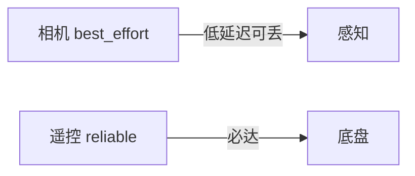

# 第17章：QoS 入门-可靠与尽力而为

> **承接上一章**：[B04](第16章：话题与消息-发布订阅第一印象.md) 思考题的背压与顺序要点见 [APPENDIX B04](../APPENDIX-answers.md#b04)；本章从 **QoS** 给默认行为一个**可调旋钮**。

> 本章目标字数：3000–5000。统一环境见 [ENV.md](../ENV.md)。

> **版本**：ROS 2 Humble（Ubuntu 22.04，统一环境见 [ENV.md](../ENV.md)）
> **定位**：基础篇 · 面向新人开发与测试，强调最小可运行闭环、CLI 观察与概念落地。
> **前置阅读**：建议按章节顺序阅读；若跳读，请先完成 ENV.md 中的环境准备。
> **预计阅读**：35 分钟 | 实战耗时：45–90 分钟

## 1. 项目背景

### 业务场景

无人车团队把「激光点云」与「遥控指令」都放在 ROS 2 上：**激光**每秒几十 MB，偶尔丢一帧可以接受；**急停指令**一个字节也不能丢。若两类数据都用同一套「可靠、无限缓存」策略，车机 CPU 与内存会被历史消息拖垮——这就是 **QoS（Quality of Service）** 要解决的**第一性矛盾**：**不只有一种正确的传输策略**。

### 痛点放大

1. **不可靠传感器 + 可靠 QoS**：老数据无限堆积，延迟飙升。
2. **跨 Wi‑Fi 仍用默认 reliable**：网络抖动时重传放大卡顿。
3. **联调「我这边能收到你那边收不到」**：常常是 **QoS 不兼容**（reliable 与 best_effort 配对失败）。



**本章目标**：在 Humble 上用 **rclpy** 为 publisher/subscriber **显式设置 QoS**，演示 **Reliability RELIABLE vs BEST_EFFORT**、**history depth** 的最小例子，并用 `ros2 topic info -v` 观察合约。

---

### 业务指标与交付边界

本章不追求“把所有概念一次讲完”，而是交付一个可复现的工程切片：

1. **可运行**：至少有一组命令、脚本或配置能够在 Humble 环境中执行。
2. **可观察**：运行后能用 `ros2` CLI、日志、RViz、rosbag2 或系统工具看到明确现象。
3. **可交接**：读者能把 **QoS 入门-可靠与尽力而为** 的关键假设、输入输出、失败模式写进项目 README 或排障手册。

**本章交付目标**：完成一个围绕 **QoS 入门-可靠与尽力而为** 的最小闭环，并留下可复盘的命令、截图或日志证据。

## 2. 项目设计

### 总体架构图


这张图用于对齐 `example.md` 的“端到端项目链路”写法：先从业务需求出发，再落到配置/代码，最后用观测与验收把结论闭环。

### 剧本对话

**小胖**：不就发个消息吗，为啥还要签「服务等级合同」？

**小白**：合同里写什么？**丢了咋办、缓存几条、过时了算谁的**？

**大师**：对，QoS 就是这些条款的集合。最常用的是 **Reliability**：**RELIABLE** 像挂号邮件——尽量送到；**BEST_EFFORT** 像贴便签——到了就行，拥挤就撕。还有 **History**：**KEEP_LAST** 只保留最近 N 条，**KEEP_ALL** 在资源允许下尽量全存（慎用）。

**技术映射 #1**：**QoS profile** = DDS QoS 子集的 ROS 2 封装。

---

**小胖**：那我和同事一个 reliable 一个 best_effort，还能连吗？

**大师**：**订阅者与发布者的 QoS 要「兼容」**。规则粗记：**可靠性上谁更弱听谁的**有官方兼容表；不匹配时**可能根本建不上连接**或静默无数据（视 RMW）。所以团队要有 **topic QoS 规范表**。

**技术映射 #2**：**QoS compatibility** 由 **RMW** 实现；用 `ros2 topic info -v` 看双方合约。

---

**小胖**：深度 `depth=10` 就是缓存 10 条对吧？

**小白**：传感器 30 Hz，处理 10 Hz，10 条够吗？会不会仍丢？

**大师**：**KEEP_LAST(depth)** 是在**订阅端/中间件缓存语义**的一部分，实际表现还跟**处理速度**、**网络**有关。处理慢时要么**降传感器频率**，要么**异步管线**，不能只指望「我 depth 设大就不会丢」。

**技术映射 #3**：**背压**是系统问题；QoS 只管「管线里放多少、怎么丢」。

---

## 3. 项目实战

### 环境准备

与 [ENV.md](../ENV.md) 一致。

```bash
cd ~/ros2_ws/src
ros2 pkg create qos_tutorial --build-type ament_python --dependencies rclpy std_msgs
```

**项目目录结构**（建议随章落地到自己的工作区）：

```text
ros2_ws/
  src/
    QoS_入门_可靠与尽力而为/
      package.xml
      launch/
      config/
      scripts/
      test/
  docs/
    runbook.md      # 记录命令、预期输出、截图或日志
```

说明：若本章以阅读源码、配置或运维演练为主，可以把 `scripts/` 换成 `notes/`，但仍建议保留 `config/` 与 `test/`，方便后续复盘。

### 分步实现

#### 步骤 1：发布端 BEST_EFFORT

- **文件** `qos_tutorial/qos_tutorial/be_pub.py`：

```python
import rclpy
from rclpy.node import Node
from rclpy.qos import QoSProfile, ReliabilityPolicy, HistoryPolicy
from std_msgs.msg import String


class BePub(Node):
    def __init__(self):
        super().__init__('be_pub')
        qos = QoSProfile(
            depth=5,
            reliability=ReliabilityPolicy.BEST_EFFORT,
            history=HistoryPolicy.KEEP_LAST,
        )
        self.pub = self.create_publisher(String, 'qos_demo', qos)
        self.create_timer(0.1, self.cb)

    def cb(self):
        m = String(data='be')
        self.pub.publish(m)


def main():
    rclpy.init()
    n = BePub()
    rclpy.spin(n)
    n.destroy_node()
    rclpy.shutdown()


if __name__ == '__main__':
    main()
```

#### 步骤 2：订阅端 RELIABLE（故意不兼容演示）

- **文件** `qos_tutorial/qos_tutorial/rel_sub.py`：

```python
import rclpy
from rclpy.node import Node
from rclpy.qos import QoSProfile, ReliabilityPolicy, HistoryPolicy
from std_msgs.msg import String


class RelSub(Node):
    def __init__(self):
        super().__init__('rel_sub')
        qos = QoSProfile(
            depth=5,
            reliability=ReliabilityPolicy.RELIABLE,
            history=HistoryPolicy.KEEP_LAST,
        )
        self.create_subscription(String, 'qos_demo', self.cb, qos)

    def cb(self, msg: String):
        self.get_logger().info(f'got {msg.data}')


def main():
    rclpy.init()
    n = RelSub()
    rclpy.spin(n)
    n.destroy_node()
    rclpy.shutdown()


if __name__ == '__main__':
    main()
```

- **运行**：先 `be_pub`，再 `rel_sub`。
- **预期（可能）**：无输出或 `ros2 topic info -v /qos_demo` 显示 QoS 不匹配警告（依 RMW 版本而异）。
- **修正**：把订阅改为 **BEST_EFFORT** 或发布改为 **RELIABLE**，双方 **reliability 对齐**后再测。

#### 步骤 3：使用 CLI 观察

```bash
ros2 topic info /qos_demo -v
ros2 run qos_tutorial be_pub
ros2 topic echo /qos_demo --qos-profile sensor_data
```

（`sensor_data` 为常见预置 profile，可对照学习。）

### 完整代码清单

- 包 `qos_tutorial`；入口在 `setup.py` 注册 `be_pub`、`rel_sub`。
- 外链待补充。

### 交付物清单

- **README**：说明 **QoS 入门-可靠与尽力而为** 的业务背景、运行命令、预期输出与常见失败。
- **配置/代码**：保留本章涉及的 launch、YAML、脚本或源码片段，避免只存截图。
- **证据材料**：至少保留一份终端输出、RViz 截图、rosbag2 片段、trace 或日志摘录。
- **复盘记录**：记录“为什么这样配置”，尤其是 QoS、RMW、TF、namespace、安全和性能相关取舍。

### 测试验证

- **对齐版本**：`rel_sub` 与 `be_pub` 同用 `BEST_EFFORT` 时，`echo` 有数据。
- 记录一次「改坏」与「改好」的 `ros2 topic info -v` 输出对比，作为团队培训素材。

### 验收清单

- [ ] 能在干净终端重新 `source /opt/ros/humble/setup.bash` 后复现本章命令。
- [ ] 能指出 **QoS 入门-可靠与尽力而为** 的核心输入、输出、关键参数与失败边界。
- [ ] 能把至少一条失败案例写成“现象 → 排查命令 → 根因 → 修复”的四段式记录。
- [ ] 能说明本章内容与相邻章节的依赖关系，避免把单点技巧误当成系统方案。

---

## 4. 项目总结

### 优点与缺点

| 策略 | 优点 | 缺点 |
|------|------|------|
| RELIABLE | 尽量不丢 | 延迟与资源占用高 |
| BEST_EFFORT | 低延迟 | 丢包由上层兜底 |
| depth 增大 | 削峰 | 内存与陈旧数据风险 |

### 适用场景

- 图像/点云：常 **BEST_EFFORT + 合理 depth**。
- 关键安全指令：**RELIABLE** + 业务层_ack（若需要）。

### 不适用场景

- 需要「强一致事务」：应 **Service** 或应用层协议。

### 注意事项

- 跨 ROS 1 桥接时 QoS 映射更复杂（本书不展开）。

### 常见踩坑经验

1. **RViz 与传感器 QoS 不一致**导致黑屏——改 RViz 的 QoS override。
2. **bag 回放**时 QoS 与录制时不一致。
3. **多机**仅改代码未改 **Discovery** 与防火墙。

### 思考题

1. 为何「一个 RELIABLE 发布 + BEST_EFFORT 订阅」有时仍能工作，但不建议依赖这种偶然？
2. `depth` 与 **发布频率**、**处理频率**之间如何粗算队列占用？

**答案**：见 [APPENDIX-answers.md](../APPENDIX-answers.md#b05)；QoS 深度参数见 [M02](第27章：QoS 深度-history、deadline、durability.md)。

### 推广计划提示

- **开发**：维护「按 topic 划分的 QoS 表」，Code Review 必查。
- **测试**：增加「QoS 不匹配」用例（应失败或告警）。
- **运维**：抓包困难时先看 `ros2 topic info -v`。

---

**导航**：[上一章：B04](第16章：话题与消息-发布订阅第一印象.md) ｜ [总目录](../INDEX.md) ｜ [下一章：B06](第18章：服务-同步请求响应.md)

> **本章完**。你已经完成 **QoS 入门-可靠与尽力而为** 的端到端学习：从业务场景、设计对话、实战命令到验收清单。下一步建议把本章交付物纳入自己的 ROS 2 工作区，并在后续章节中持续复用同一套 README、配置和测试记录方式。
