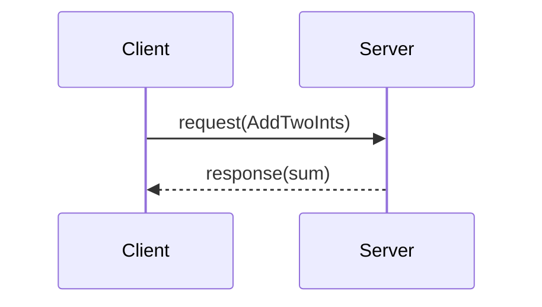

# B06 · 服务：同步请求响应

> 本章目标字数：3000–5000。统一环境见 [ENV.md](../ENV.md)。

## 1 项目背景

### 业务场景

工厂 AGV 需要在任务开始前**读取 PLC 里的工单号**，读一次即可，不需要 30 Hz 推送。用 **Topic** 也能做「最新一条缓存」，但语义别扭：谁发布？何时更新？用 **Service**（客户端/服务端）模型更符合「**一次请求，一次答复**」——像打 HTTP，只不过走 ROS 2 的 **srv 类型定义** 与 **DDS RPC 语义**。

### 痛点放大

1. **误用 topic 模拟 RPC**：无「成功/失败」边界，调试靠猜最后一帧。
2. **阻塞与超时**：服务回调里写死 `sleep`，会拖垮所有客户端。
3. **并发**：多客户端同时 call，服务端是否线程安全取决于实现与 **executor**（**B03**）。



**本章目标**：自定义 **srv** `AddTwoInts`（或使用 **example_interfaces**），用 **rclpy** 起 **server + client**，并在 CLI 用 `ros2 service call` 验证。

---

## 2 项目设计

### 剧本对话

**小胖**：服务不就是函数吗？我直接 Python import 不行？

**小白**：跨进程、跨语言、跨机呢？还有服务名冲突呢？

**大师**：**Service** 帮你统一了**名字**、**类型**、**发现**与**调用路径**——和 Topic 一样接入 DDS 图里，只是语义是**请求-响应**。适合配置查询、标定触发、一次动作。

**技术映射**：**Service** ≈ 类型化 RPC；接口在 `*.srv` 定义。

---

**小胖**：那服务卡住了咋办？客户端一直等？

**小白**：默认有没有 timeout？重试谁负责？

**大师**：`rclpy` 的 `call_async` + `future` 可做超时；**同步 `call`** 会**阻塞** spin 线程——小心死锁。生产环境多用 **async + timeout + 熔断**。

**技术映射**：**同步调用** = 易写难扩；**异步** = 复杂可控。

---

**小胖**：服务和 Action 有啥差别？

**大师**：**Service** 一次性结果；**Action** 长任务 + 可取消 + 过程反馈（**B12**）。

**技术映射**：选型看**时长**与**是否需要中间状态**。

---

## 3 项目实战

### 环境准备

与 [ENV.md](../ENV.md) 一致。本章直接用 **`example_interfaces`** 包中的 **`AddTwoInts`**，省去自定义 srv 编译步骤（自定义见 **B08**）。

```bash
source /opt/ros/humble/setup.bash
```

### 分步实现

#### 步骤 1：服务端节点

- **包**：`ros2 pkg create srv_demo --build-type ament_python --dependencies rclpy example_interfaces`
- **文件** `srv_demo/srv_demo/add_two_server.py`：

```python
import rclpy
from rclpy.node import Node
from example_interfaces.srv import AddTwoInts


class AddTwoServer(Node):
    def __init__(self):
        super().__init__('add_two_server')
        self.srv = self.create_service(AddTwoInts, 'add_two', self.callback)

    def callback(self, request, response):
        response.sum = request.a + request.b
        self.get_logger().info(f'{request.a} + {request.b} = {response.sum}')
        return response


def main():
    rclpy.init()
    node = AddTwoServer()
    rclpy.spin(node)
    node.destroy_node()
    rclpy.shutdown()


if __name__ == '__main__':
    main()
```

- **`setup.py`**：`add_two_server = srv_demo.add_two_server:main`

#### 步骤 2：客户端节点

- **文件** `srv_demo/srv_demo/add_two_client.py`：

```python
import sys
import rclpy
from rclpy.node import Node
from example_interfaces.srv import AddTwoInts


class AddTwoClient(Node):
    def __init__(self):
        super().__init__('add_two_client')
        self.cli = self.create_client(AddTwoInts, 'add_two')
        while not self.cli.wait_for_service(timeout_sec=1.0):
            self.get_logger().info('service not available, waiting...')

    def send_request(self, a, b):
        req = AddTwoInts.Request()
        req.a = a
        req.b = b
        future = self.cli.call_async(req)
        rclpy.spin_until_future_complete(self, future)
        return future.result()


def main():
    rclpy.init()
    node = AddTwoClient()
    a, b = int(sys.argv[1]), int(sys.argv[2])
    resp = node.send_request(a, b)
    node.get_logger().info(f'Result: {resp.sum}')
    node.destroy_node()
    rclpy.shutdown()


if __name__ == '__main__':
    main()
```

#### 步骤 3：CLI 调用

```bash
ros2 run srv_demo add_two_server
ros2 service call /add_two example_interfaces/srv/AddTwoInts "{a: 2, b: 3}"
```

- **预期**：`sum: 5`。
- **坑**：类型名必须完整 **`example_interfaces/srv/AddTwoInts`**。

### 完整代码清单

- `srv_demo` 包 + `example_interfaces` 依赖。
- 自定义 `.srv` 见 **B08**。

### 测试验证

```bash
python3 -m pytest  # 若编写单测可测 service mock
```

手工：随机输入 `(a,b)` 核对 `sum`。

---

## 4 项目总结

### 优点与缺点

| 维度 | 优点 | 缺点 |
|------|------|------|
| 语义 | 清晰的一次性交互 | 不适合流数据 |
| 工具 | `ros2 service list/type/call` 完整 | 长阻塞易伤执行器 |
| 类型 | `.srv` 强类型 | 变更需兼容策略 |

### 适用场景

- 参数查询、模式切换、标定触发。
- 低频控制（仍要注意实时性）。

### 不适用场景

- 视频流、连续传感器：用 **Topic**。
- 长时任务：用 **Action**。

### 注意事项

- **在服务回调里 topic 发布**可以，但要避免**重入死锁**。
- **服务无内建 QoS** 与 topic 同一套概念不完全相同（实现层关注 RMW）。

### 常见踩坑经验

1. **wait_for_service 死等**：服务端未起或命名空间错了。
2. **类型写错**：YAML 里字段名与 `.srv` 不一致。
3. **spin 线程里同步 call 自己**：死锁（见 B03）。

### 思考题

1. 若服务回调执行 2 s，多个客户端并发调用会发生什么？
2. 何时应把 Service 改为 Action？

**答案**：见 [APPENDIX-answers.md](../APPENDIX-answers.md#b06)；参数与 YAML 见 [B07](第19章：参数与 YAML-可配置行为.md)。

### 推广计划提示

- **开发**：对外 API（给其他组）优先 Service + 清晰错误码字段。
- **测试**：混沌工程里**随机 kill server**，客户端应超时退出。
- **运维**：监控 **service 响应时间 P99**。

---

**导航**：[上一章：B05](第17章：QoS 入门-可靠与尽力而为.md) ｜ [总目录](../INDEX.md) ｜ [下一章：B07](第19章：参数与 YAML-可配置行为.md)
