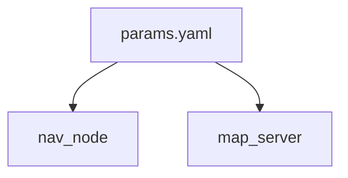

# B07 · 参数与 YAML：可配置行为

> 本章目标字数：3000–5000。统一环境见 [ENV.md](../ENV.md)。

## 1 项目背景

### 业务场景

同一套导航程序要跑在 **仿真**与**实车**上：最大线速度、代价地图膨胀半径都不同。把魔法数写死在源码里，就意味着发版才能改 0.1 m/s——现场调试无法接受。**ROS 2 参数（Parameter）** 允许你在**运行时**查询、（在权限允许下）修改标量与字符串，并可用 **YAML** 文件批量加载，再配合 **Launch**（**B10**）做场景切换。

### 痛点放大

1. **全局变量式配置**：多台车复制多份源码。
2. **缺乏类型与命名空间**：分不清是「谁的参数」。
3. **缺少文档**：运维不敢动。



**本章目标**：用 **rclpy** `declare_parameter`、`get_parameter`，从 **YAML** 加载；演示 `ros2 param` CLI。

---

## 2 项目设计

### 剧本对话

**小胖**：不就是读个配置文件吗，Python `open` 不就完了？

**小白**：那别的节点咋知道我刚改了速度？UI 面板咋统一展示？

**大师**：参数进 ROS 2 后，有**标准列出、获取、设置 API**，还能（可选）**动态通知**。YAML 只是「初次灌溉」的水源之一。

**技术映射**：**Parameter** = 节点命名空间下的键值存储 + **ParameterDescriptor**。

---

**小胖**：参数和话题有啥区别？

**大师**：**Topic** 是数据流；**Parameter** 是**元数据/旋钮**，变化频率低、带类型与范围更佳。

**技术映射**：低变更频率 + 类型约束 → Parameter。

---

**小白**：重名了咋办？

**大师**：靠 **节点命名空间**（`/robot1/nav` vs `/robot2/nav`）与 **全限定参数名**。Launch 里统一设 `namespace`（**B10**）。

**技术映射**：**FQDN 风格参数名**减少碰撞。

---

## 3 项目实战

### 环境准备

与 [ENV.md](../ENV.md) 一致。

```bash
ros2 pkg create param_demo --build-type ament_python --dependencies rclpy
mkdir -p param_demo/config
```

### 分步实现

#### 步骤 1：带声明与默认值的节点

- **文件** `param_demo/param_demo/param_node.py`：

```python
import rclpy
from rclpy.node import Node


class ParamNode(Node):
    def __init__(self):
        super().__init__('param_node')
        self.declare_parameter('max_speed', 0.5)
        self.declare_parameter('robot_name', 'ugv01')
        self.create_timer(2.0, self.print_params)

    def print_params(self):
        s = self.get_parameter('max_speed').get_parameter_value().double_value
        name = self.get_parameter('robot_name').get_parameter_value().string_value
        self.get_logger().info(f'{name} max_speed={s}')


def main():
    rclpy.init()
    node = ParamNode()
    rclpy.spin(node)
    node.destroy_node()
    rclpy.shutdown()


if __name__ == '__main__':
    main()
```

#### 步骤 2：YAML 加载

- **`param_demo/config/demo_params.yaml`**：

```yaml
param_node:
  ros__parameters:
    max_speed: 1.2
    robot_name: "sim_car"
```

- **运行**：

```bash
ros2 run param_demo param_node --ros-args --params-file $(ros2 pkg prefix param_demo)/share/param_demo/config/demo_params.yaml
```

（需把 `config` 安装到 share，在 `setup.py`/`CMakeLists` 里 `install(DIRECTORY config DESTINATION share/${PROJECT_NAME})`；开发期可用绝对路径测通。）

#### 步骤 3：CLI 交互

```bash
ros2 param list /param_node
ros2 param get /param_node max_speed
ros2 param set /param_node max_speed 0.8
```

### 完整代码清单

- `param_demo` + `config/demo_params.yaml` + `install` 规则。
- 外链待补充。

### 测试验证

- `get` 与 `set` 后日志变化；重启后恢复 YAML 初值。

---

## 4 项目总结

### 优点与缺点

| 维度 | 优点 | 缺点 |
|------|------|------|
| 运维 | 现场改参不发版 | 误改风险 → 要权限与范围 |
| 类型 | 声明时约束 | API 略冗长 |
| 生态 | 与 Launch 组合强 | 学多个文件协作 |

### 适用场景

- 算法阈值、车辆几何参数、话题名前缀。
- 功能开关。

### 不适用场景

- 高频状态估计结果：用 **Topic**。

### 注意事项

- **私有参数前缀**（若使用）与 **rclcpp** / **rclpy** 差异可读官方文档。

### 常见踩坑经验

1. **YAML 缩进错误**导致静默未加载。
2. **未 declare** 就 `get` 抛异常。
3. **命名空间**与文件中 **节点名** 不匹配。

### 思考题

1. `ros2 param set` 修改的是**内存**还是**磁盘文件**？
2. 多机器人同机运行时如何避免 `max_speed` 碰撞？

**答案**：见 [APPENDIX-answers.md](../APPENDIX-answers.md#b07)；自定义消息见 [B08](第20章：自定义 msg-srv.md)。

### 推广计划提示

- **开发**：参数变更写 **CHANGELOG**。
- **测试**：对关键参数做 **边界单测**。
- **运维**：生产环境可关闭 `set` 权限或审计日志。

---

**导航**：[上一章：B06](第18章：服务-同步请求响应.md) ｜ [总目录](../INDEX.md) ｜ [下一章：B08](第20章：自定义 msg-srv.md)
