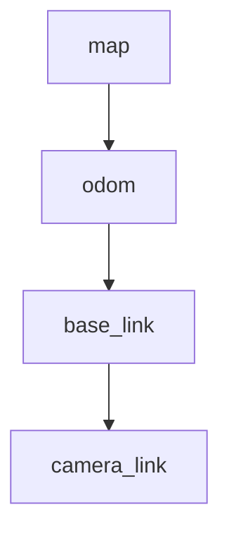

# 第21章：TF2-坐标系与静态变换

> 本章目标字数：3000–5000。统一环境见 [ENV.md](../ENV.md)。

> **版本**：ROS 2 Humble（Ubuntu 22.04，统一环境见 [ENV.md](../ENV.md)）
> **定位**：基础篇 · 面向新人开发与测试，强调最小可运行闭环、CLI 观察与概念落地。
> **前置阅读**：建议按章节顺序阅读；若跳读，请先完成 ENV.md 中的环境准备。
> **预计阅读**：35 分钟 | 实战耗时：45–90 分钟

## 1. 项目背景

### 业务场景

机械臂要把**相机看到的物体点**转换到**基座坐标系**再规划抓取：涉及多个连杆与传感器外参。若在代码里手写一堆三角函数矩阵，团队协作与调试会崩溃。**tf2** 提供「**谁相对于谁在何时**」的**有向树**查询，支持**静态**与**动态**变换，与 **ROS 2 时间**（`tf2_ros::Buffer`）一起解决「**延迟与插值**」问题。

### 痛点放大

1. **各算各的矩阵**：标定改 1°，全局算错。
2. **时间不同步**：用错时刻的里程计会把点云甩飞。
3. **闭环检测**：是否出现多父节点或断裂。



**本章目标**：发布 **`map`→`odom` 静态 demo** 简化版：使用 **`static_transform_publisher`** 与 **tf2_echo**；并阅读 **`tf2_ros`** Python 监听样板。

---

### 业务指标与交付边界

本章不追求“把所有概念一次讲完”，而是交付一个可复现的工程切片：

1. **可运行**：至少有一组命令、脚本或配置能够在 Humble 环境中执行。
2. **可观察**：运行后能用 `ros2` CLI、日志、RViz、rosbag2 或系统工具看到明确现象。
3. **可交接**：读者能把 **TF2-坐标系与静态变换** 的关键假设、输入输出、失败模式写进项目 README 或排障手册。

**本章交付目标**：完成一个围绕 **TF2-坐标系与静态变换** 的最小闭环，并留下可复盘的命令、截图或日志证据。

## 2. 项目设计

### 总体架构图


这张图用于对齐 `example.md` 的“端到端项目链路”写法：先从业务需求出发，再落到配置/代码，最后用观测与验收把结论闭环。

### 剧本对话

**小胖**：tf 不就是存 4x4 矩阵吗？

**小白**：那为什么还有 **buffer**、**listener**？谁负责插值？

**大师**：机器人动时，变换是**时间序列**。tf2 **Buffer** 缓存历史片段，查询 `(target, source, time)` 时可在相邻样本间**插值**（若可用）。静态变换时间无关，走 **StaticTransformBroadcaster**。

**技术映射 #1**：**tf2** = 坐标系图 + 时间参数化查询。

---

**小胖**：`map` 和 `odom` 到底啥关系？

**大师**：经典分工：**odom** 连续平滑但会漂移；**map** 全局一致但可能跳变。中间 **`map->odom`** 由定位修正（AMCL 等）发布。入门先记住：**根到叶不要成环**。

**技术映射 #2**：Nav2 栈里常见三线：`map`-`odom`-`base_link`。

---

## 3. 项目实战

### 环境准备

与 [ENV.md](../ENV.md) 一致，安装：

```bash
sudo apt install ros-humble-tf2-tools ros-humble-tf2-ros
```

**项目目录结构**（建议随章落地到自己的工作区）：

```text
ros2_ws/
  src/
    TF2_坐标系与静态变换/
      package.xml
      launch/
      config/
      scripts/
      test/
  docs/
    runbook.md      # 记录命令、预期输出、截图或日志
```

说明：若本章以阅读源码、配置或运维演练为主，可以把 `scripts/` 换成 `notes/`，但仍建议保留 `config/` 与 `test/`，方便后续复盘。

### 分步实现

#### 步骤 1：命令行发布静态变换

```bash
ros2 run tf2_ros static_transform_publisher 0 0 0 0 0 0 world base_link
```

#### 步骤 2：查看

```bash
ros2 run tf2_ros tf2_echo world base_link
```

**预期**：平移旋转恒等（依参数）。

#### 步骤 3：Python 监听（节选）

```python
import rclpy
from rclpy.node import Node
import tf2_ros
from geometry_msgs.msg import TransformStamped


class TfListenerDemo(Node):
    def __init__(self):
        super().__init__('tf_listener_demo')
        self.tf_buffer = tf2_ros.Buffer()
        self.tf_listener = tf2_ros.TransformListener(self.tf_buffer, self)
        self.create_timer(0.5, self.on_timer)

    def on_timer(self):
        try:
            t = self.tf_buffer.lookup_transform(
                'world', 'base_link', rclpy.time.Time())
            self.get_logger().info(f' trans z={t.transform.translation.z}')
        except tf2_ros.TransformException as ex:
            self.get_logger().warn(f'could not transform: {ex}')


def main():
    rclpy.init()
    n = TfListenerDemo()
    rclpy.spin(n)
    rclpy.shutdown()
```

### 完整代码清单

- `static_transform_publisher` 命令行 + `tf2_demo` 包（可选）。
- 外链待补充。

### 交付物清单

- **README**：说明 **TF2-坐标系与静态变换** 的业务背景、运行命令、预期输出与常见失败。
- **配置/代码**：保留本章涉及的 launch、YAML、脚本或源码片段，避免只存截图。
- **证据材料**：至少保留一份终端输出、RViz 截图、rosbag2 片段、trace 或日志摘录。
- **复盘记录**：记录“为什么这样配置”，尤其是 QoS、RMW、TF、namespace、安全和性能相关取舍。

### 测试验证

- `view_frames`（`tf2_tools`）生成 PDF（若装 graphviz）。

```bash
ros2 run tf2_tools view_frames
```

### 验收清单

- [ ] 能在干净终端重新 `source /opt/ros/humble/setup.bash` 后复现本章命令。
- [ ] 能指出 **TF2-坐标系与静态变换** 的核心输入、输出、关键参数与失败边界。
- [ ] 能把至少一条失败案例写成“现象 → 排查命令 → 根因 → 修复”的四段式记录。
- [ ] 能说明本章内容与相邻章节的依赖关系，避免把单点技巧误当成系统方案。

---

## 4. 项目总结

### 优点与缺点

| 维度 | 优点 | 缺点 |
|------|------|------|
| 统一坐标 | 全栈对齐 | 学习成本 |
| 时间查询 | 抗传感器延迟 | 错误配置难察觉 |
| 工具 | `tf2_echo`、RViz | 大系统 Debug 仍痛 |

### 适用场景

- 移动机器人、机械臂、多相机融合。

### 不适用场景

- 纯 2D 屏幕 UI，与物理空间无关。

### 注意事项

- **频率**：动态 transform 发布频率与上游传感器一致。
- **命名**：`base_link` 等遵循 [REP-105](https://www.ros.org/reps/rep-0105.html)。

### 常见踩坑经验

1. **时间戳为 0** 导致插值失败。
2. **无外参**：相机图像与激光对不齐。
3. **多父节点**（非树）：tf2 拒绝。

### 思考题

1. 为何查询时经常传 **`rclpy.time.Time()`** 与 **`now()`** 区别？
2. 静态与动态 Broadcaster 选型依据？

**答案**：见 [APPENDIX-answers.md](../APPENDIX-answers.md#b09)；Launch 见 [B10](第22章：Launch-XML-Python 与参数替换.md)。

### 推广计划提示

- **开发**：标定文件进 Git，Launch 加载。
- **测试**：比对 RViz 与实际钢卷尺距离。
- **运维**：记录各传感器 **frame_id** 合同。

---

**导航**：[上一章：B08](第20章：自定义 msg-srv.md) ｜ [总目录](../INDEX.md) ｜ [下一章：B10](第22章：Launch-XML-Python 与参数替换.md)

> **本章完**。你已经完成 **TF2-坐标系与静态变换** 的端到端学习：从业务场景、设计对话、实战命令到验收清单。下一步建议把本章交付物纳入自己的 ROS 2 工作区，并在后续章节中持续复用同一套 README、配置和测试记录方式。
