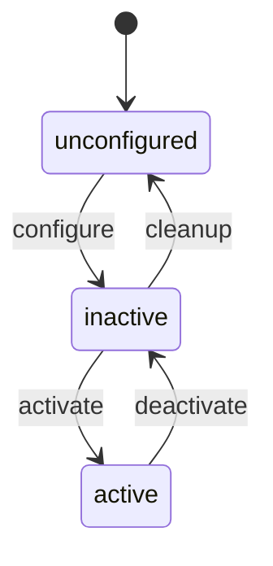

# 第23章：生命周期节点（Lifecycle）

> 本章目标字数：3000–5000。统一环境见 [ENV.md](../ENV.md)。

## 1 项目背景

### 业务场景

无人驾驶项目要求：**传感器就绪 → 定位收敛 → 再开放运动控制**。若所有节点上电就对 `cmd_vel` 响应，轻则乱动，重则伤人。**Managed/Lifecycle 节点**把启动拆成 **Unconfigured → Inactive → Active** 等态迁，配合 **Launch** 与**监督器**实现「**按剧本上戏**」。

### 痛点放大

1. **sleep 固定秒数**等传感器：现场环境变化就翻车。
2. **无统一状态**：运维不知道系统是否可对外。
3. **错误恢复路径**：宕机后是重新 Launch 还是就地 resume？



**本章目标**：理解 **lifecycle_msgs**、**lc_talker** 官方示例或用 **rclpy_lifecycle** 骨架说明状态机；运行 `ros2 lifecycle` CLI。

---

## 2 项目设计

### 剧本对话

**小胖**：我不就多个 `bool ready` 吗，整啥状态机？

**小白**：那谁有权把 `ready` 改 `true`？失败回滚呢？

**大师**：Lifecycle 把**责任**写在转移函数里：**on_configure、on_activate**……可审计、可组合。适合 **Nav2**、相机驱动等**有明确上电顺序**的模块。

**技术映射**：**LifecycleNode** = 受限转移 + **transition services**。

---

**小胖**：和普通 Node 比多了啥开销？

**大师**：多一套 **服务接口** 与 **状态缓存**，但换来**运维可读性**。轻量节点可不用 Lifecycle。

---

## 3 项目实战

### 环境准备

```bash
sudo apt install ros-humble-lifecycle ros-humble-rclcpp-lifecycle
```

### 分步实现

#### 步骤 1：运行示例（若包内含 `lifecycle_chat`）

部分发行版提供：

```bash
ros2 run lifecycle lifecycle_listener  # 名称随 distro 调整，可用 apt search lifecycle
```

更稳妥：阅读 **Nav2** 自带 **lifecycle_manager** 源码文档。

#### 步骤 2：CLI 体验

起 **lc_talker**（参考 Humble 文档 `lifecycle` 教程包）后：

```bash
ros2 lifecycle nodes
ros2 lifecycle get /lc_talker
ros2 lifecycle set /lc_talker configure
ros2 lifecycle set /lc_talker activate
```

（具体服务名以 `ros2 lifecycle -h` 为准。）

#### 步骤 3：Launch 管理

在 Python Launch 中 `Include` Nav2 的 **`lifecycle_manager`** 可作为最佳实践范本阅读。

### 完整代码清单

- 以官方 **lifecycle_examples** + 本项目附 stub（若需要）组成。
- C++ 实现请用 `rclcpp_lifecycle::LifecycleNode`。

### 测试验证

- 状态按序可达；非法转移被拒绝并日志提示。

---

## 4 项目总结

### 优点与缺点

| 维度 | 优点 | 缺点 |
|------|------|------|
| 安全 | 明确何时输出控制量 | 样板代码多 |
| 运维 | 可读状态 | 学习曲线 |
| 与 Nav2 对齐 | 生态一致 | 小项目偏重 |

### 适用场景

- 安全相关系统、需要监管认证的项目。

### 不适用场景

- 工具节点、一次性标定脚本。

### 常见踩坑经验

1. **未 activate 已发 topic**：下游以为在工作。
2. **错误处理**里未 `on_error` 清理。
3. **Launch 顺序**与 lifecycle 转移 race。

### 注意事项

- **版本兼容**：所有命令以 Humble 与 [ENV.md](../ENV.md) 为基线，其他发行版需查 `--help` 与官方文档。
- **配置边界**：不要把实验参数直接带入生产；先记录硬件、RMW、QoS、网络与时钟条件。
- **安全边界**：涉及远程调试、容器权限、证书或硬件接口时，先按最小权限原则收敛。

### 思考题

1. Lifecycle 与 **Action** 的「可取消」有何不同层次？
2. 为何 Nav2 大量组件选 Lifecycle？

**答案**：见 [APPENDIX-answers.md](../APPENDIX-answers.md#b11)；Action 见 [B12](第24章：Action-长时间任务与可取消.md)。

### 推广计划提示

- **开发**：画**状态转移表**进设计文档。
- **测试**：对非法转移做自动化用例。
- **运维**：监控面板展示 lifecycle 状态。

---

**导航**：[上一章：B10](第22章：Launch-XML-Python 与参数替换.md) ｜ [总目录](../INDEX.md) ｜ [下一章：B12](第24章：Action-长时间任务与可取消.md)
