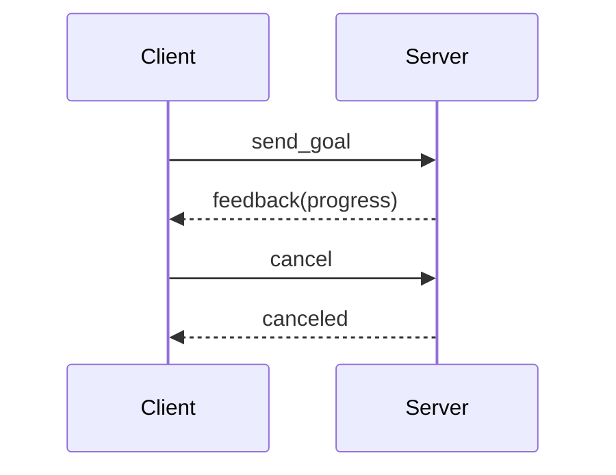

# 第24章：Action-长时间任务与可取消

> 本章目标字数：3000–5000。统一环境见 [ENV.md](../ENV.md)。

> **版本**：ROS 2 Humble（Ubuntu 22.04，统一环境见 [ENV.md](../ENV.md)）
> **定位**：基础篇 · 面向新人开发与测试，强调最小可运行闭环、CLI 观察与概念落地。
> **前置阅读**：建议按章节顺序阅读；若跳读，请先完成 ENV.md 中的环境准备。
> **预计阅读**：35 分钟 | 实战耗时：45–90 分钟

## 1. 项目背景

### 业务场景

机器人从当前点到目标货架：**路径规划可能要数秒**，中途可能收到**更高优先级任务**或**急停**——这既不是 **Topic**（没有「完成」语义），也不适合 **Service**（会长时间阻塞）。**Action** 提供 **Goal / Result / Feedback** 三段式协议，client 可**取消**、server 可**抢占**，与 **Nav2**、机械臂 `move_group` 的长期任务天然契合。

### 痛点放大

1. **Service + 假进度 topic**：协议碎、难测试。
2. **自研状态机**：每家一套，不可互操作。
3. **取消语义**：资源未释放导致撞车。



**本章目标**：使用 **`action_tutorials`** 或 **`example_interfaces`**（若可用 Fibonacci）跑通 **Action server/client**；熟悉 `ros2 action` CLI。

---

### 业务指标与交付边界

本章不追求“把所有概念一次讲完”，而是交付一个可复现的工程切片：

1. **可运行**：至少有一组命令、脚本或配置能够在 Humble 环境中执行。
2. **可观察**：运行后能用 `ros2` CLI、日志、RViz、rosbag2 或系统工具看到明确现象。
3. **可交接**：读者能把 **Action-长时间任务与可取消** 的关键假设、输入输出、失败模式写进项目 README 或排障手册。

**本章交付目标**：完成一个围绕 **Action-长时间任务与可取消** 的最小闭环，并留下可复盘的命令、截图或日志证据。

## 2. 项目设计

### 总体架构图


这张图用于对齐 `example.md` 的“端到端项目链路”写法：先从业务需求出发，再落到配置/代码，最后用观测与验收把结论闭环。

### 剧本对话

**小胖**：Action 不就是带进度的 RPC 嘛？

**小白**：反馈频率、目标 ID、并发多目标怎么定？

**大师**：**Action** 在 DDS 上映射为**多个隐藏 topic + service**（实现细节依 RMW）；你只需要遵守 **`action` 定义文件** 的 Goal/Result/Feedback 字段。Nav2 的 **`NavigateToPose`** 就是典型 Action。

**技术映射 #1**：**`.action`** = 三态接口契约。

---

**小胖**：那我还用不用 Service？

**大师**：短平快查询 **Service**；**秒级以上**且需要**过程反馈/取消**→ **Action**。

---

## 3. 项目实战

### 环境准备

```bash
sudo apt install ros-humble-action-tutorials-cpp ros-humble-action-tutorials-py
```

**项目目录结构**（建议随章落地到自己的工作区）：

```text
ros2_ws/
  src/
    Action_长时间任务与可取消/
      package.xml
      launch/
      config/
      scripts/
      test/
  docs/
    runbook.md      # 记录命令、预期输出、截图或日志
```

说明：若本章以阅读源码、配置或运维演练为主，可以把 `scripts/` 换成 `notes/`，但仍建议保留 `config/` 与 `test/`，方便后续复盘。

### 分步实现

#### 步骤 1：运行 Fibonacci Server / Client

```bash
# 终端 A
ros2 run action_tutorials_py fibonacci_action_server
# 终端 B
ros2 run action_tutorials_py fibonacci_action_client
```

#### 步骤 2：CLI

```bash
ros2 action list
ros2 action info /fibonacci
```

#### 步骤 3：阅读 `.action` 文件

```bash
ros2 interface show action_tutorials/action/Fibonacci
```

### 完整代码清单

- `action_tutorials` 官方源码；自建业务 `DockRobot.action` 可参考 **Nav2**。

### 交付物清单

- **README**：说明 **Action-长时间任务与可取消** 的业务背景、运行命令、预期输出与常见失败。
- **配置/代码**：保留本章涉及的 launch、YAML、脚本或源码片段，避免只存截图。
- **证据材料**：至少保留一份终端输出、RViz 截图、rosbag2 片段、trace 或日志摘录。
- **复盘记录**：记录“为什么这样配置”，尤其是 QoS、RMW、TF、namespace、安全和性能相关取舍。

### 测试验证

- 发送 goal 后中途 `Ctrl+C` client，观察 server 侧取消处理日志。

### 验收清单

- [ ] 能在干净终端重新 `source /opt/ros/humble/setup.bash` 后复现本章命令。
- [ ] 能指出 **Action-长时间任务与可取消** 的核心输入、输出、关键参数与失败边界。
- [ ] 能把至少一条失败案例写成“现象 → 排查命令 → 根因 → 修复”的四段式记录。
- [ ] 能说明本章内容与相邻章节的依赖关系，避免把单点技巧误当成系统方案。

---

## 4. 项目总结

### 优点与缺点

| 维度 | 优点 | 缺点 |
|------|------|------|
| 语义 | 长任务一等公民 | 比 Topic 重 |
| 取消 | 标准化 | 实现调试稍繁 |
| 生态 | Nav2 一致 | 需理解 preempt |

### 适用场景

- 导航、抓取流水线、扫描覆盖。

### 不适用场景

- 纯数据流：Topic。

### 常见踩坑经验

1. **忘记处理 cancel**。
2. **Feedback 过快**淹没网络。
3. **Goal ID** 客户端混淆。

### 注意事项

- **版本兼容**：所有命令以 Humble 与 [ENV.md](../ENV.md) 为基线，其他发行版需查 `--help` 与官方文档。
- **配置边界**：不要把实验参数直接带入生产；先记录硬件、RMW、QoS、网络与时钟条件。
- **安全边界**：涉及远程调试、容器权限、证书或硬件接口时，先按最小权限原则收敛。

### 思考题

1. Action Server 若**单线程**，同时两客户端 goal 会怎样？
2. Result 与 Feedback 在 QoS 语义上的差异？

**答案**：见 [APPENDIX-answers.md](../APPENDIX-answers.md#b12)；日志与 bag 见 [B13](第25章：日志、rosbag2 入门与最小集成测试.md)。

### 推广计划提示

- **开发**：**Goal 超时**、**重试策略**写进需求文档。
- **测试**：fuzz cancel/replace goal。
- **运维**：记录 action P99 延迟。

---

**导航**：[上一章：B11](第23章：生命周期节点（Lifecycle）.md) ｜ [总目录](../INDEX.md) ｜ [下一章：B13](第25章：日志、rosbag2 入门与最小集成测试.md)

> **本章完**。你已经完成 **Action-长时间任务与可取消** 的端到端学习：从业务场景、设计对话、实战命令到验收清单。下一步建议把本章交付物纳入自己的 ROS 2 工作区，并在后续章节中持续复用同一套 README、配置和测试记录方式。
