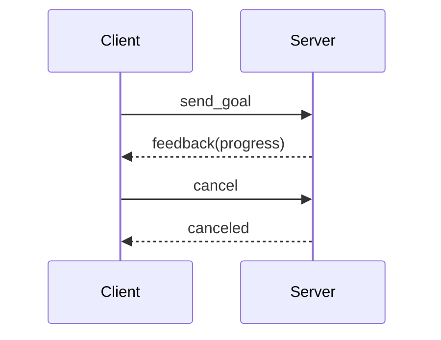

# B12 · Action：长时间任务与可取消

> 本章目标字数：3000–5000。统一环境见 [ENV.md](../ENV.md)。

## 1 项目背景

### 业务场景

机器人从当前点到目标货架：**路径规划可能要数秒**，中途可能收到**更高优先级任务**或**急停**——这既不是 **Topic**（没有「完成」语义），也不适合 **Service**（会长时间阻塞）。**Action** 提供 **Goal / Result / Feedback** 三段式协议，client 可**取消**、server 可**抢占**，与 **Nav2**、机械臂 `move_group` 的长期任务天然契合。

### 痛点放大

1. **Service + 假进度 topic**：协议碎、难测试。
2. **自研状态机**：每家一套，不可互操作。
3. **取消语义**：资源未释放导致撞车。



**本章目标**：使用 **`action_tutorials`** 或 **`example_interfaces`**（若可用 Fibonacci）跑通 **Action server/client**；熟悉 `ros2 action` CLI。

---

## 2 项目设计

### 剧本对话

**小胖**：Action 不就是带进度的 RPC 嘛？

**小白**：反馈频率、目标 ID、并发多目标怎么定？

**大师**：**Action** 在 DDS 上映射为**多个隐藏 topic + service**（实现细节依 RMW）；你只需要遵守 **`action` 定义文件** 的 Goal/Result/Feedback 字段。Nav2 的 **`NavigateToPose`** 就是典型 Action。

**技术映射**：**`.action`** = 三态接口契约。

---

**小胖**：那我还用不用 Service？

**大师**：短平快查询 **Service**；**秒级以上**且需要**过程反馈/取消**→ **Action**。

---

## 3 项目实战

### 环境准备

```bash
sudo apt install ros-humble-action-tutorials-cpp ros-humble-action-tutorials-py
```

### 分步实现

#### 步骤 1：运行 Fibonacci Server / Client

```bash
# 终端 A
ros2 run action_tutorials_py fibonacci_action_server
# 终端 B
ros2 run action_tutorials_py fibonacci_action_client
```

#### 步骤 2：CLI

```bash
ros2 action list
ros2 action info /fibonacci
```

#### 步骤 3：阅读 `.action` 文件

```bash
ros2 interface show action_tutorials/action/Fibonacci
```

### 完整代码清单

- `action_tutorials` 官方源码；自建业务 `DockRobot.action` 可参考 **Nav2**。

### 测试验证

- 发送 goal 后中途 `Ctrl+C` client，观察 server 侧取消处理日志。

---

## 4 项目总结

### 优点与缺点

| 维度 | 优点 | 缺点 |
|------|------|------|
| 语义 | 长任务一等公民 | 比 Topic 重 |
| 取消 | 标准化 | 实现调试稍繁 |
| 生态 | Nav2 一致 | 需理解 preempt |

### 适用场景

- 导航、抓取流水线、扫描覆盖。

### 不适用场景

- 纯数据流：Topic。

### 常见踩坑经验

1. **忘记处理 cancel**。
2. **Feedback 过快**淹没网络。
3. **Goal ID** 客户端混淆。

### 思考题

1. Action Server 若**单线程**，同时两客户端 goal 会怎样？
2. Result 与 Feedback 在 QoS 语义上的差异？

**答案**：见 [APPENDIX-answers.md](../APPENDIX-answers.md#b12)；日志与 bag 见 [B13](第25章：日志、rosbag2 入门与最小集成测试.md)。

### 推广计划提示

- **开发**：**Goal 超时**、**重试策略**写进需求文档。
- **测试**：fuzz cancel/replace goal。
- **运维**：记录 action P99 延迟。

---

**导航**：[上一章：B11](第23章：生命周期节点（Lifecycle）.md) ｜ [总目录](../INDEX.md) ｜ [下一章：B13](第25章：日志、rosbag2 入门与最小集成测试.md)
