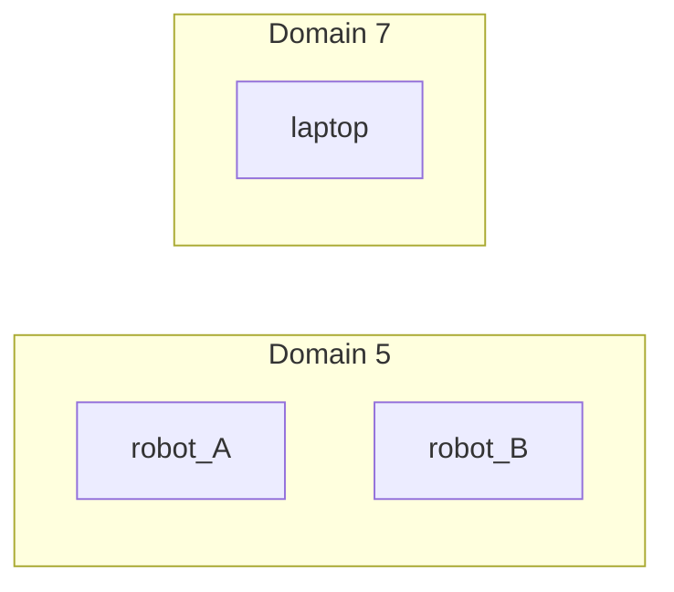

# M01 · DDS 发现、域（Domain）与跨机通信

> 本章目标字数：3000–5000。统一环境见 [ENV.md](../ENV.md)。

## 1 项目背景

### 业务场景

仓库里同时跑 **20 台 AMR**，调试笔电也开 ROS 2 ——若都在 **默认域**里，话题名一旦冲突，A 车会订阅到 B 车的 `/scan`。**ROS_DOMAIN_ID** 与 **DDS Domain** 把「**谁能看见谁**」切开；再加上 **多播/单播** 与 **防火墙**，构成**现场组网第一课**。

### 痛点放大

1. **互相串台**：移动小车与固定工控机同一 `ROS_LOCALHOST_ONLY=0` 误配。
2. **发现风暴**：上百节点时 DDS 发现流量拖垮交换机。
3. **VPN**：多播不通导致「单机 OK 跨机失联」。



**本章目标**：实验 **不同 ROS_DOMAIN_ID** 隔离；查阅 **Fast-DDS** 的 **Discovery Server**（概念级）；列出跨机 checklist。

---

## 2 项目设计

### 剧本对话

**小胖**：域不就是个整数吗？我设 42 有啥讲究？

**小白**：和 **UDP 端口**、防火墙放行有关吗？会不会和人家端口撞车？

**大师**：更准确的姿势是：**同一 `ROS_DOMAIN_ID` → 同一 DDS 逻辑域**，域内的 **DomainParticipant** 才参与彼此的**发现与匹配**。实现上通常会把 RTPS 流量映射到**一段 UDP 端口区间**（细节看 **Fast-DDS / Cyclone** 文档与 `ros2 doctor`），所以「防火墙怎么开」不能只验 `ping`，要按**端口表**或抓包对齐。团队规范建议：**一车一域（或一仿真会话一域）**，笔单独进 **`DEBUG_DOMAIN`**，避免和产线车「串门」。

**技术映射**：**DomainParticipant + DomainId** → **发现范围 + 传输绑定**；端口策略因 **rmw** 而异。

---

**小胖**：那新节点启动，别人怎么知道又多了一个 `/scan`？总得有个「登记处」吧？

**小白**：ROS 1 不是有 roscore 吗？ROS 2 到底谁在广播？

**大师**：没有独立 Master，但 DDS 里有**标准化发现**：可粗分为「参与者先互相看见 → 再交换 Reader/Writer 端点信息」。现场常见两种：**去中心化多播发现**（交换机/firmware 需放行）与 **Discovery Server 居中登记**（适合**大规模、受控网络、跨子网多播不通**——比盲改域更接近「工程解」）。

**技术映射**：**SPDP/SEDP**（语义层面）→「谁在线上、谁能和谁建 **Matching**」；**Discovery Server** = 可运维的**发现汇聚点**。

---

**小胖**：为啥实验室里我 `topic list` 能刷到隔壁组的激光？我们机器人明明名字不一样。

**大师**：**名字不一样≠域不一样**。只要 **同二层广播域 + 同一 `ROS_DOMAIN_ID`**，多播发现可能把参与者互相拉进同一张**逻辑图**——你就能「看见」隔壁的话题。**隔离**优先手段：**改域**（成本最低）、或 **VLAN 切广播域**、或 **`ROS_LOCALHOST_ONLY=1`** 强制本机回环调试。注意：**域隔离不是安全**，抓包仍可能读到明文（加密走 **SROS 2 / DDS Security**，见 **M13**）。

**技术映射**：**逻辑隔离（Domain）** ≠ **机密性/身份认证**。

---

**小白**：我们现场走 **企业 VPN**，跨城联调，topic 时好时坏，这跟域有关系还是跟 QoS 有关系？

**大师**：先分层：**网络可达性**优先于 QoS。典型雷区包括：**多播被禁 / 非对称 NAT / MTU 黑洞 / 时钟漂移（TF 与时间戳怪）**。对策链条一般是：`ping` 与 **单播 locator** 验证 → 考虑 **Discovery Server** 或厂商推荐 **unicast 表** → 再谈 **QoS** 与 **带宽**。**chrony** 先把时钟对齐，否则你会在 **TF** 和 **bag** 上看见「玄学」。

**技术映射**：**跨网 ROS** = **DDS 可达性 + 时间同步 + QoS** 三元组。

---

## 3 项目实战

### 环境准备

与 [ENV.md](../ENV.md) 一致：**Ubuntu 22.04 + ROS 2 Humble**，两台或更多主机时：

- **有线同网段**优先（避免 AP 漫游干扰结论）；或 **单机双终端**做域隔离实验。
- **防火墙**：`sudo ufw status`；若 **active**，按 **DDS/RTPS 端口**放行或临时 `ufw disable`（**仅实验环境**）。
- 每终端执行：`source /opt/ros/humble/setup.bash`。

本章额外依赖：无（使用 `demo_nodes_*`）。

### 分步实现

#### 步骤 1：同域互通（基线）

- **目标**：验证 **同一 `ROS_DOMAIN_ID`** 下 **Talker/Listener** 可见。
- **命令**（终端 A / B，各新开 shell）：

```bash
export ROS_DOMAIN_ID=0
source /opt/ros/humble/setup.bash
ros2 run demo_nodes_cpp talker
```

```bash
export ROS_DOMAIN_ID=0
source /opt/ros/humble/setup.bash
ros2 run demo_nodes_py listener
```

- **预期输出**：Listener 持续打印收到的字符串；`ros2 topic list` 含 `/chatter`。
- **坑与解法**：若收不到，先 `echo $ROS_DOMAIN_ID` 对齐；再查 **防火墙**（**M01 背景**）。

#### 步骤 2：异域隔离

- **目标**：证明 **不同域互不可见**。
- **命令**：**终端 B** 改为：

```bash
export ROS_DOMAIN_ID=1
source /opt/ros/humble/setup.bash
ros2 run demo_nodes_py listener
```

（**终端 A** 仍为 `ROS_DOMAIN_ID=0` 的 Talker。）

- **预期输出**：Listener **无输出** 或 `ros2 topic list` **无**对方 `/chatter`（与 **RMW** 展示方式有关）。
- **坑与解法**：若仍看见，检查是否 **未重启 listener**、或 **混用 shell 环境**。

#### 步骤 3：`ROS_LOCALHOST_ONLY`（单机）

- **目标**：体验 **仅本机 loopback 发现**（发行版行为以文档为准）。
- **命令**：

```bash
export ROS_LOCALHOST_ONLY=1
export ROS_DOMAIN_ID=42
source /opt/ros/humble/setup.bash
ros2 run demo_nodes_cpp talker
# 另开终端同环境起 listener
```

- **预期输出**：**仅本机**进程互通；**局域网其他机器**默认**不应**发现。
- **坑与解法**：变量在 **systemd/Launch** 中需显式设置（见 [B10](第22章：Launch-XML-Python 与参数替换.md)、[A02](第02章：rmw 与 DDS 实现切换（Fast-DDS-Cyclone 等）.md)）。

#### 步骤 4：记录网络清单（工程交付）

- **目标**：为 **跨子网 / 禁多播** 场景留 **检查表**。
- **操作**：在笔记中勾选：**交换机是否禁多播**、**是否跨 VLAN**、**是否需要 Discovery Server**（[Fast-DDS 文档](https://fast-dds.docs.eprosima.com/)）、**chrony 是否同步**。
- **预期输出**：一页 **「现场网络假设」** 可交给运维。
- **坑与解法**：只改 **`ROS_DOMAIN_ID`** 无法解决 **路由/NAT** 问题 —— 需 **M01 剧本**中的分层手段。

### 完整代码清单

- **可选脚本** `export_domain.sh`：

```bash
#!/usr/bin/env bash
export ROS_DOMAIN_ID="${1:-0}"
source /opt/ros/humble/setup.bash
exec "$@"
```

- **外链**：**eProsima Discovery Server**、**Cyclone DDS 网络配置**（随 **RMW** 选型查阅 [A02](第02章：rmw 与 DDS 实现切换（Fast-DDS-Cyclone 等）.md)）。
- Git 占位：**待补充**。

### 测试验证

- **手工验收**：**同域通、异域不通**（或等效现象）；`ping` **通**不等于 **DDS 通**。
- **可选**：双机各 `tcpdump -i eth0 udp portrange 7400-7500`（端口范围以抓包为准）观察 **RTPS**。

---

## 4 项目总结

### 优点与缺点

| 维度 | 优点 | 缺点 |
|------|------|------|
| 域隔离 | 零配置切割 | 运维需编号体系 |
| DDS 自动发现 | 省手动注册 | 大规模需调参 |

### 适用场景

- 多机多车、仿真与真机并行。

### 不适用场景

- 需要互联网广域直连（应上 VPN + 专门路由）。

### 常见踩坑经验

1. **Docker 默认网络**与主机 domain 不一致。
2. **WSL2** 与 Windows 宿主机发现异常。
3. **时间不同步**导致 TF/bag 奇异（配 **chrony**)。

### 思考题

1. 域 ID 与 **防火墙端口段**大致关系？（提示：查 RMw 文档）
2. 何时引入 **Discovery Server**？

**答案**：见 [APPENDIX-answers.md](../APPENDIX-answers.md#m01)；QoS 深度 [M02](第27章：QoS 深度-history、deadline、durability.md)。

### 推广计划提示

- **运维**：现场贴在机器人上的 **DOMAIN_ID 标签**。
- **安全**：域隔离**不等于**认证加密（见 **M13**）。

---

**导航**：[上一章：B13](第25章：日志、rosbag2 入门与最小集成测试.md) ｜ [总目录](../INDEX.md) ｜ [下一章：M02](第27章：QoS 深度-history、deadline、durability.md)
