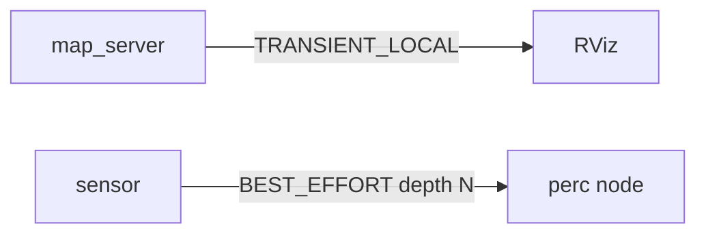

# 第27章：QoS 深度-history、deadline、durability

> 本章目标字数：3000–5000。统一环境见 [ENV.md](../ENV.md)。

## 1 项目背景

### 业务场景

团队已会用 **RELIABLE / BEST_EFFORT**（[B05](第17章：QoS 入门-可靠与尽力而为.md)），但现场仍出现两类「玄学报错」：**RViz 里 `/map` 偶发空白**，以及 **deadline missed** 红灯。中级篇要把 **History（KEEP_LAST / KEEP_ALL + depth）**、**Durability（VOLATILE / TRANSIENT_LOCAL）**、**Deadline**、**Lifespan** 与 **Resource limits** 放到一张「**合约表**」里，并能与 **Nav2、map_server、AMCL** 的常见话题对齐。

### 痛点放大

1. **map topic 用 VOLATILE**：后启动的 RViz 永远收不到历史栅格。
2. **KEEP_ALL + 相机**：无界内存增长拖垮进程。
3. **deadline 设成 1/相机频率**：网络抖动即假阳性告警。
4. **QoS 不一致**导致「CLI 能 echo、RViz 黑屏」。



**本章目标**：读懂 **`ros2 topic info -v`** 中各项；能为 **`/map`**、**`/scan`** 写出**成对的 QoS 表**；在代码里配置完整 **`QoSProfile`**（rclpy）。

---

## 2 项目设计

### 剧本对话

**小胖**：TRANSIENT_LOCAL 是不是「硬盘持久化」？

**小白**：那 bag 里的 map 也是 TRANSIENT_LOCAL 吗？

**大师**：它描述的是 **DDS 样本在 DataWriter 端对 late joiner 的可见性语义**，不是文件系统。**Map** 类「**先有后接**」场景常用 **TRANSIENT_LOCAL + RELIABLE**，让后起的订阅者仍能拿到**最后一帧有效地图**（受 **history depth** 约束）。

**技术映射**：**Durability::TRANSIENT_LOCAL** ≈ **带存活期的最近值广播**。

---

**小胖**：KEEP_ALL 不是最好吗？不丢！

**大师**：**KEEP_ALL** 需要 DDS **resource_limits** 支持，且对**高速持续流**极危险——更像给**极少量关键状态**用。传感器一般用 **KEEP_LAST(depth)**，depth 与 **处理周期、允许延迟**共同设计。

**技术映射**：**KEEP_LAST(depth)** = **有界环形缓冲**。

---

**小白**：Deadline 谁消费？

**大师**：用于**监控**「多久没新样本」——可作为**健康信号**，也可能成为**误报源**（如果和真实周期不配）。要与 **传感器标定帧率、网络抖动**留裕量。

**技术映射**：**Deadline** = **可观测 SLA（软）**。

---

**小胖**：`lifespan` 和 `deadline` 不是一个意思吗？文档里两个都有我头都大了。

**小白**：还有 **Liveliness**：是不是用来判断「节点死没死」？

**大师**：可以粗记：**Deadline** 约束「**相邻样本之间**别超过多久」；**Lifespan** 约束「这帧**在系统里还算数多久**」——对**传感器**有时用来丢**过期的 stale 数据**。**Liveliness** 更像**心跳契约**：约定 publisher 多久要「吱一声」，订阅侧可据此做 watchdog，和 **diagnostics**（**M10**）可以挂钩，但别和「应用业务心跳」混为一谈。

**技术映射**：**Deadline/Lifespan/Liveliness** 三元组分别从 **间隔/存活/参与意愿** 描述时间语义。

---

**小胖**：你刚说地图要 `TRANSIENT_LOCAL`，我又听说 **VOLATILE + 先发后播 bag** 也行？

**大师**：工程上两条路：**在线 late-join**（靠 durability） vs **回放/脚本重发**。**RViz 黑屏**九成是 **「订阅端 QoS  profile ≠ 地图发布端」**，而不是 RViz「坏了」。排障先看 **`ros2 topic info -v`** 的 **Compatibility** 段，比改代码快。

**技术映射**：**QoS 合约** 优先于 **GUI 玄学**。

---

**小白**：官方那张 **可靠性/ Durability 兼容表** 到底要不要背？

**大师**：背表不如背**方法论**：**先对齐 Reliability 档位**，再对齐 **Durability**（late join），再调 **depth**。**KEEP_ALL** 在多数传感器上都是**危险默认值**——除非你真理解 **resource_limits** 与 **内存上界**（否则别上生产）。

**技术映射**：**QoS 调参** = **合约思维 + 资源上界证明**。

---

## 3 项目实战

### 环境准备

与 [ENV.md](../ENV.md) 一致：**Ubuntu 22.04 + ROS 2 Humble**，每终端 `source /opt/ros/humble/setup.bash`。

本章额外依赖：沿用 [B05](第17章：QoS 入门-可靠与尽力而为.md) 实验包，或自建 **`qos_adv`**（`ament_python` + `rclpy`）；若跑 **Nav2 / map_server**，按需 `sudo apt install ros-humble-nav2-bringup ros-humble-map-server`（包名以 `apt search` 为准）。

### 分步实现

#### 步骤 1：打印 Nav2 相关话题 QoS

- **目标**：从 **`ros2 topic info -v`** 读出 **Reliability / Durability / History / Depth**，形成「合约表」。
- **命令**：运行最小导航或仅 **`map_server` + `rviz2`**，执行：

```bash
ros2 topic info /map -v
ros2 topic info /scan -v
```

- **预期输出**：`-v` 中 **Publisher/Subscriber** 与 **QoS** 段落完整；可截图存档。
- **坑与解法**：无话题时先起 **发布端**；**Compatibility** 若显示 **incompatible**，优先对齐 **Reliability** 再对齐 **Durability**（本章正文）。

#### 步骤 2：在 rclpy 里写 TRANSIENT_LOCAL 订阅

- **目标**：在代码里显式配置 **`QoSProfile`**，与 **`ros2 topic info -v`** 对照。
- **代码**：

```python
from rclpy.qos import QoSProfile, ReliabilityPolicy, DurabilityPolicy, HistoryPolicy

map_qos = QoSProfile(
    depth=1,
    reliability=ReliabilityPolicy.RELIABLE,
    durability=DurabilityPolicy.TRANSIENT_LOCAL,
    history=HistoryPolicy.KEEP_LAST,
)
self.sub = self.create_subscription(
    OccupancyGrid, '/map', self.cb, map_qos)
```

（消息类型按实际 `import`。）

- **预期输出**：节点启动后 **`/map` 回调** 有数据；`ros2 topic info /map -v` 与代码一致。
- **坑与解法**：**默认 QoS** 与 **显式 QoS** 混用 → **CLI 能 echo、RViz 黑屏** —— 以 **`-v` 兼容段** 为准。

#### 步骤 3：故意制造不匹配

- **目标**：复现 **「CLI 正常、RViz 异常」**，训练排障顺序。
- **命令**：固定 **RViz** 某 **Fixed Frame** 与 **Map** 插件；改 **map_server** 或自定义节点 **QoS** 为 **不兼容** 组合（如 **RELIABLE vs BEST_EFFORT**）。
- **预期输出**：RViz 日志或终端出现 **incompatible QoS** / 无显示。
- **坑与解法**：先 **`topic info -v`**，再改代码；勿先怀疑 **显卡/主题**。

#### 步骤 4：Deadline 实验（概念）

- **目标**：理解 **Deadline** 是**监控语义**，需与**真实周期**匹配。
- **命令**：查阅当前 **rclpy** 是否完整暴露 **deadline**；若仅 C++ 可用，在笔记中写「**线上以 `ros2 topic info -v` + 厂商说明为准**」。
- **预期输出**：**过严** deadline → **误报**；放宽后与 **传感器 Hz** 对齐（[M06](第31章：传感器驱动与标定流程.md)）。
- **坑与解法**：勿把 **deadline** 当业务超时 —— 那是**另一层**逻辑。

### 完整代码清单

- **`qos_adv`**：`package.xml`、`setup.py`、订阅节点源码、**对比截图/日志**（匹配 vs 不匹配）。
- **外链**：[B05](第17章：QoS 入门-可靠与尽力而为.md)、DDS QoS 兼容表（随 **RMW** 查阅）。
- Git 占位：**待补充**。

### 测试验证

- **late joiner**：先起 **`map_server`**，**后**开 RViz，地图仍能显示（**TRANSIENT_LOCAL** 正确时）。
- **手工验收**：一页 **Markdown 表**：话题名、四元组 QoS、**是否 late-join 成功**。

---

## 4 项目总结

### 优点与缺点

| 策略 | 优点 | 缺点 |
|------|------|------|
| TRANSIENT_LOCAL + RELIABLE | 适合 map 等「最新全貌」 | 内存与带宽成本高 |
| VOLATILE + BEST_EFFORT | 低延迟 | 不适合晚连接读者 |
| Deadline | 可监控「断流」 | 参数难一次调准 |

### 适用场景

- **/map / /tf_static** 类「**状态快照**」。
- **/scan / image** 类高频流：**KEEP_LAST** + 合适 **depth**。

### 不适用场景

- 强一致单次 RPC：**Service**（[B06](第18章：服务-同步请求响应.md)）。

### 注意事项

- **不同 RMW** 对 **KEEP_ALL** 支持度不同，生产先 **压测**。

### 常见踩坑经验

1. **RViz 默认 QoS** 与话题不一致 → 黑屏。
2. **回放 bag** 时 durability 与 live 建图不同。
3. **多机器人**命名空间正确但 **QoS** 仍错。

### 思考题

1. **TRANSIENT_LOCAL** 与 **RELIABLE** 联用时，哪类 topic 最容易出现「延迟累积」？
2. `depth=1` 对 ** map** 与 **scan** 的含义差异？

**答案**：见 [APPENDIX-answers.md](../APPENDIX-answers.md#m02)；命名空间 [M03](第28章：命名空间、重映射与多实例部署.md)。

### 推广计划提示

- **开发**：为每类传感器维护 **YAML QoS 模板**。
- **测试**：CI 增加 **QoS 兼容性矩阵**冒烟。
- **运维**：告警区分 **真断流**与 **deadline 过严**。

---

**导航**：[上一章：M01](第26章：DDS 发现、域（Domain）与跨机通信.md) ｜ [总目录](../INDEX.md) ｜ [下一章：M03](第28章：命名空间、重映射与多实例部署.md)
