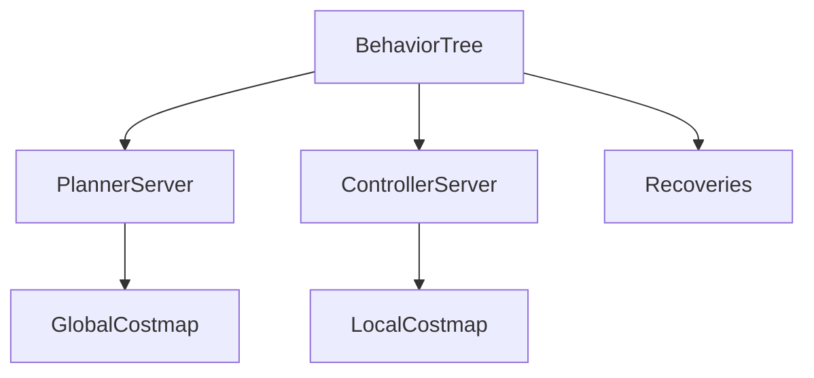

# 第29章：Nav2 栈概览与行为树入门

> 本章目标字数：3000–5000。统一环境见 [ENV.md](../ENV.md)。

> **版本**：ROS 2 Humble（Ubuntu 22.04，统一环境见 [ENV.md](../ENV.md)）
> **定位**：中级篇 · 面向核心开发与运维，强调多机、性能、可观测性与工程化交付。
> **前置阅读**：建议先掌握基础篇的 Topic、QoS、Launch、TF2、Action 与 rosbag2。
> **预计阅读**：40 分钟 | 实战耗时：60–120 分钟

## 1. 项目背景

### 业务场景

AMR 要在仓储通道里**自主导航**：输入目标位姿，系统在**静态/动态障碍**中规划路径并跟踪。**Nav2** 是 ROS 2 上的事实标准导航栈：由 **Planner、Controller、Recovery、行为树（BT）Orchestrator** 与 **map / localization** 等组件组成。中级读者需要一眼看懂「**谁在调用谁**」，并能打开 **Groot** 或 XML 理解 **NavigateToPose** 流程。

### 痛点放大

1. **只会拖 RViz 点 goal**：一旦行为不符合预期不知改哪个 yaml。
2. **recovery 无限循环**：卡在代价地图局部极小。
3. **生命周期**依赖：未 activate 控制器导致「无 cmd_vel」。



**本章目标**：安装 **nav2_bringup** 官方 TB3 仿真（或 readthedocs 最小例）；修改 **nav2_params.yaml** 两项参数观察现象；理解 **BT XML** 入口文件路径。

---

### 业务指标与交付边界

本章不追求“把所有概念一次讲完”，而是交付一个可复现的工程切片：

1. **可运行**：至少有一组命令、脚本或配置能够在 Humble 环境中执行。
2. **可观察**：运行后能用 `ros2` CLI、日志、RViz、rosbag2 或系统工具看到明确现象。
3. **可交接**：读者能把 **Nav2 栈概览与行为树入门** 的关键假设、输入输出、失败模式写进项目 README 或排障手册。

**本章交付目标**：完成一个围绕 **Nav2 栈概览与行为树入门** 的最小闭环，并留下可复盘的命令、截图或日志证据。

## 2. 项目设计

### 总体架构图


这张图用于对齐 `example.md` 的“端到端项目链路”写法：先从业务需求出发，再落到配置/代码，最后用观测与验收把结论闭环。

### 剧本对话

**小胖**：Nav2 和 move_base 最大区别？名字多了个 2？

**小白**：为啥有 **Planner、Controller、Behavior Tree** 三套，我记得以前就一个 **DWA** 啊？

**大师**：**move_base** 时代更像「**大一统状态机 + 插件堆叠**」；**Nav2** 把**生命周期**（配合硬件/地图就绪）、**行为树编排**（显式失败与恢复）、**成本地图与规划器/控制器解耦**拆开了。对外仍是 goal→cmd_vel，但**排障粒度**细了：**BT** 文件决定「**规划失败了先 rotate_recovery 还是 clear costmap**」，不再靠玄学参数耦在一坨。

**技术映射 #1**：**Nav2 = 一组 lifecycle 节点 + BT 编排器 + 插件化算法**。

---

**小白**：为啥 **Planner 报错** 了，小车还在沿「老路径」扭？

**大师**：要看 **BT 当前叶节点**是 **FollowPath** 还是 **ComputePathToPose**。控制器跟踪**局部轨迹**时，全局规划失败未必立刻让车停——有的策略先 **尝试恢复** 或 **减速**。读 **`bt_navigator`** 的 XML：条件节点如何读 **blackboard** 里的 **error code**，比盯着 `cmd_vel` 更有用。

**技术映射 #2**：**BT blackboard** = **任务上下文与错误码总线**。

---

**小胖**：参数那么多，**最小闭环**先调哪五个？

**大师**：实用顺序常是：**footprint/inflation → max vel/acc → costmap update frequency → planner tolerance → recovery 上限**。每改一项就 **记录 bag + KPI**（到达率、重试次数、是否 OSC），不然半年后没人知道「当时为啥好使」。

**技术映射 #3**：**调参** = **受控实验**，不是蒙旋钮。

---

**大师**：把 **NavigateToPose.action** 当作「**用户故事边界**」：客户只关心**到没到**；工程上要关心 **BT 叶片**是否 **卡死在某一 recovery**——那是**产品体验**问题，不只是参数。

---

## 3. 项目实战

### 环境准备

与 [ENV.md](../ENV.md) 一致：**Ubuntu 22.04 + ROS 2 Humble**，`source /opt/ros/humble/setup.bash`。

本章额外依赖：`sudo apt install ros-humble-nav2-bringup ros-humble-turtlebot3-gazebo ros-humble-turtlebot3-*`（按 [Nav2 文档](https://navigation.ros.org/) 选配；包名以 `apt search turtlebot3` / `nav2` 为准）。

**项目目录结构**（建议随章落地到自己的工作区）：

```text
ros2_ws/
  src/
    Nav2_栈概览与行为树入门/
      package.xml
      launch/
      config/
      scripts/
      test/
  docs/
    runbook.md      # 记录命令、预期输出、截图或日志
```

说明：若本章以阅读源码、配置或运维演练为主，可以把 `scripts/` 换成 `notes/`，但仍建议保留 `config/` 与 `test/`，方便后续复盘。

### 分步实现

#### 步骤 1：启动仿真（参考 Nav2 docs）

- **目标**：**TB3 + Nav2** 仿真跑通，**lifecycle** 可达 **active**。
- **命令**：

```bash
ros2 launch nav2_bringup tb3_simulation_launch.py
```

（具体入口以当前 **distro/包版本** 为准。）

- **预期输出**：Gazebo + RViz 启动；`ros2 lifecycle nodes` 列出 **bt_navigator、controller_server** 等。
- **坑与解法**：卡在 **inactive** → **`use_sim_time`**、**bond**、时钟（[B10](第22章：Launch-XML-Python 与参数替换.md)、[M10](第35章：可观测性-tracing、诊断话题与仪表盘.md)）。

#### 步骤 2：RViz 发 Goal

- **目标**：用 **NavigateToPose** 闭环验证 **规划 + 控制 + BT**。
- **命令**：RViz 中 **Nav2 Goal** 点选目标；或 `ros2 action send_goal`（见 Nav2 文档）。
- **预期输出**：小车向目标运动；`/cmd_vel` 非零（运动中）。
- **坑与解法**：**global plan 为空** → **frame_id / map** 与 **TF**（[B09](第21章：TF2-坐标系与静态变换.md)）。

#### 步骤 3：调参实验

- **目标**：体会 **footprint / 速度 / inflation** 与 **行为** 的因果链。
- **命令**：在 **nav2_params.yaml**（或 launch 传入的 overlay）中调整：

  - `controller_server.max_vel_x` 减半 → 观察到达时间。
  - `local_costmap.inflation_layer.inflation_radius` 增大 → **离障更远**、可能 **过不了窄道**。

- **预期输出**：**现象可重复**；建议 **每次改一项** 并 **记 bag**（[M08](第33章：rosbag2 进阶-录制策略与回放测试.md)）。
- **坑与解法**：多参数同时改 → **无法归因** —— 本章剧本强调 **受控实验**。

#### 步骤 4：打开 BT XML

- **目标**：定位 **NavigateToPose** 使用的 **行为树文件**，为 **自定义 Recovery** 铺路。
- **命令**：

```bash
ros2 pkg prefix nav2_bt_navigator
# 在 share 目录下查找 behavior_trees/*.xml
```

- **预期输出**：能打开 **默认 BT**；理解 **ComputePathToPose → FollowPath → Recoveries** 大致顺序。
- **坑与解法**：**params 里路径** 指向 **安装前缀** —— 改 XML 后 **`colcon build` + source** 或 **overlay 路径**。

### 完整代码清单

- **`nav2_params.yaml` 片段**：`bt_navigator`、`controller_server`、`local_costmap` 修改记录。
- **可选 `custom_nav2.xml`**（占位）：增加 **Recovery** 节点。
- Git 占位：**待补充**。

### 交付物清单

- **README**：说明 **Nav2 栈概览与行为树入门** 的业务背景、运行命令、预期输出与常见失败。
- **配置/代码**：保留本章涉及的 launch、YAML、脚本或源码片段，避免只存截图。
- **证据材料**：至少保留一份终端输出、RViz 截图、rosbag2 片段、trace 或日志摘录。
- **复盘记录**：记录“为什么这样配置”，尤其是 QoS、RMW、TF、namespace、安全和性能相关取舍。

### 测试验证

- 机器人从 **A → B** 成功；`ros2 topic echo /cmd_vel` 运动中非零。
- **手工验收**：**lifecycle get** 主要节点为 **active**；**故意挡路** 时 **recovery** 是否按 BT 触发（结合日志）。

### 验收清单

- [ ] 能在干净终端重新 `source /opt/ros/humble/setup.bash` 后复现本章命令。
- [ ] 能指出 **Nav2 栈概览与行为树入门** 的核心输入、输出、关键参数与失败边界。
- [ ] 能把至少一条失败案例写成“现象 → 排查命令 → 根因 → 修复”的四段式记录。
- [ ] 能说明本章内容与相邻章节的依赖关系，避免把单点技巧误当成系统方案。

---

## 4. 项目总结

### 优点与缺点

| 维度 | 优点 | 缺点 |
|------|------|------|
| 生态 | 大量样例 | 参数多 |
| 插件 | 可替换算法 | 需要读文档 |
| BT | 可视化行为逻辑 | 学习曲线 |

### 常见踩坑经验

1. **frame_id** 不一致导致 global plan 为空。
2. **footprint** 过大卡通道。
3. **CPU 不足**局部规划掉帧。

### 适用场景

- 团队需要把 **Nav2 栈概览与行为树入门** 从个人经验沉淀为可复用流程。
- 新人、测试与运维需要用同一套命令与术语对齐问题现象。
- 项目进入联调阶段，需要记录参数、话题、日志与验收结果。
- 需要为后续源码阅读、性能优化或生产复盘提供上下文。

### 不适用场景

- 只做一次性演示且不需要交接、回归或复盘的临时脚本。
- 现场约束尚未明确时，不宜把 **Nav2 栈概览与行为树入门** 的示例参数直接当作生产标准。

### 注意事项

- **版本兼容**：所有命令以 Humble 与 [ENV.md](../ENV.md) 为基线，其他发行版需查 `--help` 与官方文档。
- **配置边界**：不要把实验参数直接带入生产；先记录硬件、RMW、QoS、网络与时钟条件。
- **安全边界**：涉及远程调试、容器权限、证书或硬件接口时，先按最小权限原则收敛。

### 思考题

1. **GlobalCostmap** 与 **LocalCostmap** 的分工？
2. **行为树**里如何实现「重试 3 次 recovery」？

**答案**：见 [APPENDIX-answers.md](../APPENDIX-answers.md#m04)；SLAM [M05](第30章：SLAM-定位概念与工具链选.md)。

### 推广计划提示

- **开发**：把 **Nav2 栈概览与行为树入门** 的最小 demo、关键参数与失败日志写入项目 README。
- **测试**：抽取 1–2 条可重复的 smoke 用例，记录输入、预期输出与回归频率。
- **运维**：整理运行环境、启动命令、日志位置与告警阈值，便于现场排障。

---

**导航**：[上一章：M03](第28章：命名空间、重映射与多实例部署.md) ｜ [总目录](../INDEX.md) ｜ [下一章：M05](第30章：SLAM-定位概念与工具链选.md)

> **本章完**。你已经完成 **Nav2 栈概览与行为树入门** 的端到端学习：从业务场景、设计对话、实战命令到验收清单。下一步建议把本章交付物纳入自己的 ROS 2 工作区，并在后续章节中持续复用同一套 README、配置和测试记录方式。
