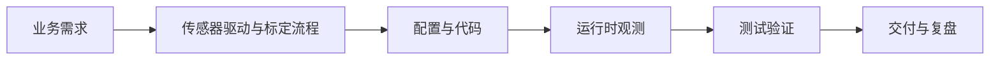

# 第31章：传感器驱动与标定流程

> 本章目标字数：3000–5000。统一环境见 [ENV.md](../ENV.md)。

> **版本**：ROS 2 Humble（Ubuntu 22.04，统一环境见 [ENV.md](../ENV.md)）
> **定位**：中级篇 · 面向核心开发与运维，强调多机、性能、可观测性与工程化交付。
> **前置阅读**：建议先掌握基础篇的 Topic、QoS、Launch、TF2、Action 与 rosbag2。
> **预计阅读**：40 分钟 | 实战耗时：60–120 分钟

## 1. 项目背景

### 业务场景

机器人「看得见却撞」多数是 **camera-lidar 外参**、**畸变**或 **time offset** 未校准。驱动层负责**稳定数据率**与**正确 frame_id**；标定层把**物理量**映射到 **TF** 与时间轴。

### 痛点放大

1. **默认 URDF** 与实际差 5 cm → 抓取全偏。
2. **时间戳用接收到时**而非硬件曝光中点 → 运动模糊。
3. **振动**导致_extrinsic 缓慢漂移。

**本章目标**：列出 **camera_calibration** / **imu_filter** / **lidar_image_align** 等工具心智图；给 **ROS 2 相机驱动**参数样板。

---

### 业务指标与交付边界

本章不追求“把所有概念一次讲完”，而是交付一个可复现的工程切片：

1. **可运行**：至少有一组命令、脚本或配置能够在 Humble 环境中执行。
2. **可观察**：运行后能用 `ros2` CLI、日志、RViz、rosbag2 或系统工具看到明确现象。
3. **可交接**：读者能把 **传感器驱动与标定流程** 的关键假设、输入输出、失败模式写进项目 README 或排障手册。

**本章交付目标**：完成一个围绕 **传感器驱动与标定流程** 的最小闭环，并留下可复盘的命令、截图或日志证据。

## 2. 项目设计

### 总体架构图



这张图用于对齐 `example.md` 的“端到端项目链路”写法：先从业务需求出发，再落到配置/代码，最后用观测与验收把结论闭环。

### 剧本对话

**小胖**：标定一次管多久？客户让我们「出厂标定管终身」。

**小白**：**相机内参**和 **lidar-camera 外参**，哪个更容易漂？

**大师**：**内参**主要随 **温漂、镜头松动**；**外参**对 **机械冲击、振动、拆装**极敏感。「终身」在工业里要定义：**允许误差上界 + 在线监控**。若 **TF 误差**超过业务容许（抓取、避障余量），就要**触发重标或自动微调**。把 **标定文件**当**版本化制品**：git hash + **标定场地**记录。

**技术映射 #1**：**Calibration** = **传感器模型参数**；需 **变更管理与追溯**。

---

**小胖**：驱动里 **`use_device_time` vs 用主机时间**咋选？

**大师**：若能拿到 **硬件曝光时间戳**并与 **主机时钟同步（PTP/chrony）**，优先走「**传感器时间域对齐** → **rcl Time**」；否则你会在 **快速运动**下看到 **重投影/点云配准**的系统误差。用「收到时刻」当时间戳是高危捷径。

**技术映射 #2**：**时间同步** = **多传感器融合** 的前置约束。

---

**小白**：**CameraInfo** 和 **TF** 冲突听谁的？

**大师**：**理想路径**是二者来自**同一标定链**：`CameraInfo` 管**投影模型**，`TF` 管**外参位姿**。现场争执多半来自 **URDF 未更新** 而 **yaml 已新**——需要**单一来源策略**（生成脚本）。

---

## 3. 项目实战

### 环境准备

与 [ENV.md](../ENV.md) 一致：**Ubuntu 22.04 + ROS 2 Humble**，`source /opt/ros/humble/setup.bash`。

本章额外依赖：

```bash
sudo apt install ros-humble-camera-calibration
```

（需 **真实相机** 或 **bag 回放** `/image_raw`；棋盘格打印件与 **尺寸** 与参数一致。）

**项目目录结构**（建议随章落地到自己的工作区）：

```text
ros2_ws/
  src/
    传感器驱动与标定流程/
      package.xml
      launch/
      config/
      scripts/
      test/
  docs/
    runbook.md      # 记录命令、预期输出、截图或日志
```

说明：若本章以阅读源码、配置或运维演练为主，可以把 `scripts/` 换成 `notes/`，但仍建议保留 `config/` 与 `test/`，方便后续复盘。

### 分步实现

#### 步骤 1：相机内参标定

- **目标**：生成 **`CameraInfo` 可用** 的标定 YAML，供 **投影/视觉/融合** 使用。
- **命令**：

```bash
ros2 run camera_calibration cameracalibrator --size 8x6 --square 0.024 image:=/image_raw
```

（`--size` 为**内角点数**，与棋盘格实物一致。）

- **预期输出**：标定程序提示 **reprojection error**；可保存 **`ost.yaml`** 等结果文件。
- **坑与解法**：**光照差 / 模糊 / 角点少** → 误差大；**square 尺寸填错** → 外参尺度全错。

#### 步骤 2：写入配置与 Launch

- **目标**：**单一来源**：标定文件只保留在 **`config/`**，Launch **引用**。
- **命令**：将生成 YAML 拷入 `robot_description/config/`，在 **相机驱动 launch** 中 **`camera_info_url`** 或等价参数指向该文件。
- **预期输出**：`ros2 topic echo /camera_info --once` 与文件一致；**RViz Camera** 无畸变异常。
- **坑与解法**：**URDF 未更新** 而 **yaml 已新** → 现场扯皮（本章剧本）；用 **生成脚本** 同步。

#### 步骤 3（可选）：雷达/手眼

- **目标**：建立「**标定→验证**」习惯：**标定后立即跑静态场景**（已知距离点云/像素）。
- **命令**：按项目选用 **Calibration 工具链**（**`lidar_camera_calibration`** 等，以仓库为准）。
- **预期输出**：**重投影误差** 或 **ICP 残差** 在阈值内。
- **坑与解法**：**只存 yaml 不复测** → 上线翻车 —— 记入 **测试验证** 一条。

### 完整代码清单

- **`config/camera_calib.yaml`**（占位名）+ **Launch 片段**。
- **标定过程记录**：棋盘格规格、**reprojection error** 截图。
- Git 占位：**待补充**。

### 交付物清单

- **README**：说明 **传感器驱动与标定流程** 的业务背景、运行命令、预期输出与常见失败。
- **配置/代码**：保留本章涉及的 launch、YAML、脚本或源码片段，避免只存截图。
- **证据材料**：至少保留一份终端输出、RViz 截图、rosbag2 片段、trace 或日志摘录。
- **复盘记录**：记录“为什么这样配置”，尤其是 QoS、RMW、TF、namespace、安全和性能相关取舍。

### 测试验证

- **`camera_calibration` 保存文件** 可被 **驱动节点加载**；**图像话题** 与 **标定话题** 一致。
- **手工验收**：**ArUco / 已知宽度物体** 在图像上量测尺度合理（粗验）。

### 验收清单

- [ ] 能在干净终端重新 `source /opt/ros/humble/setup.bash` 后复现本章命令。
- [ ] 能指出 **传感器驱动与标定流程** 的核心输入、输出、关键参数与失败边界。
- [ ] 能把至少一条失败案例写成“现象 → 排查命令 → 根因 → 修复”的四段式记录。
- [ ] 能说明本章内容与相邻章节的依赖关系，避免把单点技巧误当成系统方案。

---

## 4. 项目总结

### 优点与缺点

| 维度 | 优点 | 缺点 |
|------|------|------|
| 工程价值 | **传感器驱动与标定流程** 能把隐性经验显式化，便于新人复现与团队协作。 | 需要配套环境、日志与记录表，否则容易停留在概念层。 |
| 可维护性 | 通过标准命名、参数、Launch 或测试约束降低沟通成本。 | 规则一多会增加初期学习曲线。 |
| 可观测性 | 便于用 CLI、日志、bag 或监控指标定位问题。 | 指标若没有业务阈值，仍可能变成“看起来很多但不能决策”。 |
| 扩展性 | 可与前后章节串联，逐步走向真实系统。 | 跨 RMW、跨发行版或跨硬件时需要重新验证边界。 |

### 适用场景

- 团队需要把 **传感器驱动与标定流程** 从个人经验沉淀为可复用流程。
- 新人、测试与运维需要用同一套命令与术语对齐问题现象。
- 项目进入联调阶段，需要记录参数、话题、日志与验收结果。
- 需要为后续源码阅读、性能优化或生产复盘提供上下文。

### 不适用场景

- 只做一次性演示且不需要交接、回归或复盘的临时脚本。
- 现场约束尚未明确时，不宜把 **传感器驱动与标定流程** 的示例参数直接当作生产标准。

### 注意事项

- **版本兼容**：所有命令以 Humble 与 [ENV.md](../ENV.md) 为基线，其他发行版需查 `--help` 与官方文档。
- **配置边界**：不要把实验参数直接带入生产；先记录硬件、RMW、QoS、网络与时钟条件。
- **安全边界**：涉及远程调试、容器权限、证书或硬件接口时，先按最小权限原则收敛。

### 常见踩坑经验

1. **只看现象不记录环境**：同一命令在不同 RMW、Domain、QoS 或硬件上结果不同。根因通常是缺少版本与环境快照。
2. **一次改多个变量**：参数、Launch、网络与代码同时变化，导致无法归因。解决方法是每次只改一项并保存日志或 bag。
3. **忽略跨角色交接**：开发能跑通但测试/运维无法复现。根因是缺少最小验收命令、预期输出与失败处理路径。

### 思考题

1. **CameraInfo** 消息字段哪些影响 Nav2？
2. **IMU** 与 **odom** 融合常用哪类包？

**答案**：见 [APPENDIX-answers.md](../APPENDIX-answers.md#m06)；pluginlib [M07](第32章：pluginlib-算法可替换.md)。

### 推广计划提示

- **开发**：把 **传感器驱动与标定流程** 的最小 demo、关键参数与失败日志写入项目 README。
- **测试**：抽取 1–2 条可重复的 smoke 用例，记录输入、预期输出与回归频率。
- **运维**：整理运行环境、启动命令、日志位置与告警阈值，便于现场排障。

---

**导航**：[上一章：M05](第30章：SLAM-定位概念与工具链选.md) ｜ [总目录](../INDEX.md) ｜ [下一章：M07](第32章：pluginlib-算法可替换.md)

> **本章完**。你已经完成 **传感器驱动与标定流程** 的端到端学习：从业务场景、设计对话、实战命令到验收清单。下一步建议把本章交付物纳入自己的 ROS 2 工作区，并在后续章节中持续复用同一套 README、配置和测试记录方式。
