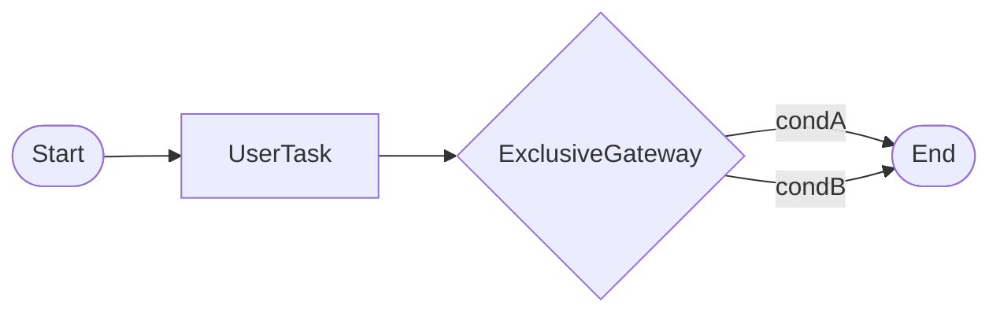

# 第 3 章：BPMN 2.0 核心元素：任务、网关、事件一张图讲清

## 元信息

| 项目 | 内容 |
|------|------|
| 章节编号 | 第 3 章 |
| 标题 | BPMN 2.0 核心元素：任务、网关、事件一张图讲清 |
| 难度 | 入门 |
| 预计阅读 | 30～35 分钟 |
| 受众侧重 | 开发 + 业务（旁听） |
| 依赖章节 | 第 2 章 |
| 环境版本 | 建模可用 Camunda Modeler，与引擎版本独立；执行语义以 Camunda 7.20+ 为准 |

---

## 1. 项目背景

BPMN 图一打开，满屏方框圆圈箭头，业务同事说「看得懂」，开发却担心**执行语义**和自己想的不一致：并行到底是「同时」还是「先后」？排他网关缺省走哪条？事件是「等消息」还是「等时间」？本章要解决的**一条主线问题**是：用**一张心智图**把 **任务（做什么）、网关（怎么分支）、事件（何时继续）** 三类元素的关系讲清，并列出**入门阶段最常见的误用**，让后续每一章都有共同的词汇表。

---

## 2. 项目设计（三角色对话）

*投影上是产品画的「箭头 PPT」，标题写着「并行审批」。*
**小胖**：这不就跟我年终述职的泳道图一个味吗？还要学 BPMN，**装**给谁看？  
**小白**：（拍桌）你先翻译「并行」——是**两个人同时点同意**，还是**两个系统自动跑**？PPT 可没规定 token 怎么走。  
**小胖**：……不都是同时进行吗？  
**大师**：BPMN 是**带执行语义**的规范：引擎推 token，网关怎么分叉、事件等什么信号，**不是美术课**。前者常是并行网关 + 两个用户任务；后者可能是并行分支上的服务任务——嘴上说「并行」三字，底下可能是两套完全不同的图。  
**小白**：那我追问三件：**子流程** vs **调用活动**什么时候拆？中间事件和**边界事件**对实例状态差在哪？还有你们 Camunda 那坨 `camunda:async` 扩展，换引擎会不会**一夜归零**？  
**大师**：拆段复用就子流程；跨共享定义用调用活动——跟组织建模洁癖有关。中间事件像「中场等铃」；边界事件挂在活动边上，典型**超时**，第九单讲。扩展能少用就少用，**业务语义**尽量压在标准元素 + 变量；真迁 **Camunda 8** 再算迁移账，第三十四单专门算。  
**小胖**：业务方说我看不懂 XML……  
**大师**：评审别看 XML，看 Modeler：**活动名、泳道、网关条件从哪几个变量来**——每节点回答**进什么、出什么、挂了咋整**。XML 是给引擎和 diff 看的。  

---

## 3. 项目实战

### 3.1 环境前提

- 安装 Camunda Modeler（或等价 BPMN 建模工具）。
- 可选：第 2 章工程，用于部署验证。

### 3.2 步骤说明

1. **画骨架**：从左到右拉一条「开始 → 用户任务 → 排他网关 → 结束」作为最小闭环。
2. **加并行**：在需要「两个分支都完成再汇合」处使用**并行网关分叉与汇合**，数清 token 数量直觉（入门可只记：分叉增并行，汇合收并行）。
3. **标事件**：在「等待外部系统回调」处尝试**消息中间捕获事件**（具体消息关联第 8 章）。
4. **自检清单**：每个网关是否都有默认流或完备条件；并行是否成对；结束事件是否可达。

### 3.3 源码与说明

BPMN 本质是 XML。入门不必手敲 XML，但应知道**流程 id**、**元素 id** 会在日志与 API 中出现：

```xml
<bpmn:process id="demo" isExecutable="true">
  ...
</bpmn:process>
```

**为什么 id 重要**：REST/Java API 启动流程、查询活动节点时常用 `processDefinitionKey`（通常与流程 id 对应）与 `activityId`。

可用 mermaid 画**概念**流程（与引擎无关），帮助和业务对齐：



**说明**：mermaid 用于讲解；真正执行仍以 BPMN XML 为准。

### 3.4 验证

- Modeler 无校验错误；部署到引擎后 Cockpit 可见 BPMN Diagram。
- 与业务方走读：能指着图说出**谁**在**哪个任务**停留，**什么条件**去下一节点。

### 3.5 建模自检清单（打印）

- [ ] 每个网关是否有完备条件或默认流  
- [ ] 并行是否分叉/汇合成对  
- [ ] 是否所有路径可达结束  
- [ ] 活动命名是否为业务语言（非 Task1/Task2）  
- [ ] 是否标注关键消息/定时器语义  

---

## 4. 项目总结

| 维度 | 内容 |
|------|------|
| 优点 | 统一语言，减少「我以为」类返工；图为可版本化交付物。 |
| 缺点 / 代价 | 学错语义比不画更危险；需要评审与测试兜底。 |
| 适用场景 | 任何正式流程建模前热身；架构/业务共读材料。 |
| 不适用场景 | 纯技术批处理管道（可能更适合批作业框架）。 |
| 注意事项 | 网关条件表达式与变量命名需规范（第 5、7 章）。 |
| 常见踩坑 | 排他网关无匹配分支；并行网关不成对；把业务规则全写进网关表达式。 |

**延伸阅读**：BPMN 2.0 规范导读（选读）；下一章深入用户任务与表单。

## 5. 附录：常见图标速记

| 元素 | 记忆 |
|------|------|
| 圆圈 | 事件 |
| 圆角矩形 | 活动/任务 |
| 菱形 | 网关 |
| 粗线 | 消息/序列流（注意实线虚线差异以规范为准） |

## 6. 课后作业（可选）

1. 用 Modeler 从头画 **自己业务**一个小流程（≤10 个节点）。  
2. 与业务方开 **30 分钟走读会**，记录三个改动点。  
3. 标注 **风险节点**（外部依赖、审批瓶颈）。  
4. 将 BPMN 导出 XML，圈出 **process id** 与 **三个 activity id**。  
5. 回答：若删掉一个网关，会影响哪些测试用例？  
