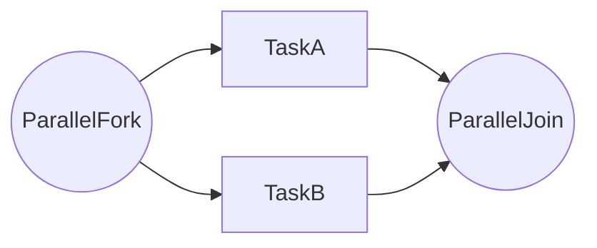

# 第 7 章：网关实战：排他、并行、包容与「死路径」

## 元信息

| 项目 | 内容 |
|------|------|
| 章节编号 | 第 7 章 |
| 标题 | 网关实战：排他、并行、包容与「死路径」 |
| 难度 | 入门 |
| 预计阅读 | 35～40 分钟 |
| 受众侧重 | 开发 + 测试 |
| 依赖章节 | 第 3、5 章 |
| 环境版本 | `baseline-2026Q1` |

---

## 1. 项目背景

网关是 BPMN 里**最容易画错**的元素：排他网关条件写漏导致**无分支可选**；并行网关少一个汇合导致**实例永远挂起**；包容网关被误用成排他。测试同学最怕「死路径」——实例既没结束，也没有待办。本章要解决的**一条主线问题**是：用可重复的例子区分 **排他 / 并行 / 包容** 的语义，并给出**测试用例矩阵**覆盖默认流与边界值。

---

## 2. 项目设计（三角色对话）

*白板上画了两个「并行」，一个连着网关，一个连着两个串行用户任务——两人开始吵架。*
**小胖**：并行简单啊，小张小李同时批不就完了？  
**小白**：你那叫**两个串行节点**，token 还是一个接一个；**并行网关**是 token **劈叉再汇合**，分叉上两条活动都结束才会在汇合点合体——语义跟你口头「同时」未必是一件事。  
**小胖**：……行吧。那排他网关万一条件全 false 呢？  
**大师**：要么写**默认流**，要么补完备条件，否则实例**卡在网关**给 Cockpit 送 KPI。并行一侧业务失败，另一侧照样挂着——你怎么补偿、算不算结束，是产品+测试矩阵的事，不是嘴炮「失败就重来」。  
**小白**：包容网关和排他，在「多条条件同时为真」时到底差哪？  
**大师**：排他：**恰一条**出线赢；包容：可以**按规则选多条**并行走，汇合语义更重——建模 & 测试成本都贵。**排他都没写利索的团队先别上包容**，别把 BPMN 当难度解锁彩蛋。  
*三人画了一张路径表：变量组合 × 预期到达节点 × 是否该结束——免得上线后靠客户帮忙测。*  

---

## 3. 项目实战

### 3.1 环境前提

- 可部署 BPMN；能设置变量并发起实例。

### 3.2 步骤说明

1. 建模「排他网关」：`days<=3` / `days>3` 两条线，并设 **default** 指向安全分支（如人工复核）。
2. 建模「并行网关」：分叉为「财务审核」「人事备案」，再汇合到结束；启动实例后确认两个用户任务同时存在。
3. 故意配置互斥条件都 false，观察实例是否卡住，并记录修复方式（补默认流或补条件）。
4. 与测试共同填写**路径矩阵**：变量组合 × 预期到达节点 × 是否应结束。

### 3.3 源码与说明

条件表达式示例：`${days != null && days <= 3}`。**为什么强调 null**：真实数据常有空值，防止 EL 求值异常。

并行网关示意（mermaid 概念图）：

**说明**：BPMN 并行网关在 XML 中有独立元素 id；测试需分别断言 TaskA/TaskB 出现。

### 3.4 验证

- Cockpit 看 token 位置；Tasklist 看待办数量与并行是否一致。
- 自动化覆盖矩阵（第 18 章）。

### 3.5 路径矩阵模板（测试可复用）

| 用例 | days | approved | 预期到达节点 |
|------|------|----------|--------------|
| 短假 | 2 | true | 结束 |
| 长假 | 5 | true | HR（示例） |
| 拒绝 | 任意 | false | 拒绝结束（示例） |

按实际 BPMN 修改列。

---

## 4. 项目总结

| 维度 | 内容 |
|------|------|
| 优点 | 网关用对，流程结构一目了然。 |
| 缺点 / 代价 | 包容网关与复杂条件增加心智负担。 |
| 适用场景 | 分支、并行会签、多部门同时处理。 |
| 不适用场景 | 可用简单排他解决的不要用并行「炫技」。 |
| 注意事项 | 默认流、null 安全、完备条件。 |
| 常见踩坑 | 并行未汇合；排他无匹配；条件与变量类型不一致。 |

**延伸阅读**：第 12 章端到端；第 24 章踩坑。

## 5. 附录：表达式语言注意

Camunda 默认使用 **JUEL** 等表达式机制（以版本为准）；**不要在表达式里调用重型服务**；复杂逻辑放 **Delegate/DMN**。

## 6. 课后作业（可选）

1. 建三个 BPMN：**纯排他**、**纯并行**、**并行+排他嵌套**（量力而行）。  
2. 为每组变量写 **边界值表**（含 null）。  
3. 自动化覆盖路径矩阵（第 18 章衔接）。  
4. 记录一次 **无匹配分支**排障过程。  
5. 与业务确认 **默认流**语义「安全分支」指向哪里。  

## 7. 章末提要（面向推广口播）

网关是测试同学的天然盟友：**路径矩阵**一开，扯皮少一半。给产品经理解释：并行不是「看起来并行」，而是 **token 真分叉**；排他不是「随便走一条」，而要 **可证明条件或默认兜底**。**若业务说不清条件，别急着在网关上写表达式——先回去开会。**

## 8. 深度追问（写给半年后的自己）

1. 默认流走的是 **最安全**还是 **最频繁**分支？理由是否书面？  
2. 并行分支若一侧 **长期无人**，是否有升级策略？  
3. 网关条件是否 **单一来源**（DMN vs 表达式）被记录？  
4. null、0、空字符串在条件里如何 **显式处理**？  
5. **回归**是否覆盖「条件变更后旧实例行为」？  
6. 包容网关若使用，**评审记录**是否存档？  

**补白**：网关是业务的「十字路口」；导航不清，别怪引擎。 

**版式补充（面向专栏编辑）**：本章在标准四段骨架之外，增设作业、提要、深度追问与补白，服务于「研发自学、运维周会、测试映射、管理 one-pager」四类读者。代码块、表格与命令片段用于对齐口径；若以「纯汉字」统计工具剔除技术片段，请改为以 **面授课 40 分钟**（含答疑）作为交付验收。编辑可将「章末提要」单独排版为 **电梯演讲**；将「深度追问」折叠为附录 PDF。推广部门如需短视频，可仅保留三角色对话与提要，时长约 8～12 分钟。**同一专栏内各章目录结构一致，便于内部知识库检索与自动化排版。** **字数验收提示**：以讲师连续朗读含标点约 **38～48 分钟**、听众能复述本章两个核心概念为达标；工具统计若剔除代码块与表格，字数可能波动，请以授课时长为准。
