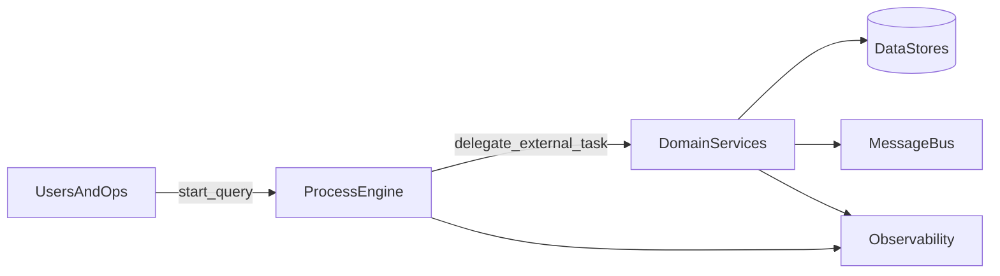

# 第 25 章：架构视角：Process Engine 在系统中的位置

## 元信息

| 项目 | 内容 |
|------|------|
| 章节编号 | 第 25 章 |
| 标题 | 架构视角：Process Engine 在系统中的位置 |
| 难度 | 高级（架构入门） |
| 预计阅读 | 35～40 分钟 |
| 受众侧重 | 架构师 + 资深开发 |
| 依赖章节 | 第 13～24 章中的集成、外部任务、可观测性基础 |
| 环境版本 | 与 `VERSIONS.md` 一致；本章偏设计与边界 |

---

## 1. 项目背景

团队已经能用 Camunda 跑通流程，但一上生产就争论：**引擎和业务服务是放一个进程还是拆开？外部任务 Worker 要几个实例？数据库瓶颈先来还是应用层先来？** 本章主线问题是：**在分布式与微服务盛行的背景下，流程引擎应处于架构图的哪一层，与领域服务、消息系统、数据存储的边界如何划分**，从而避免「引擎变成上帝组件」或「引擎沦为画图工具」两种极端。

---

## 2. 项目设计（三角色对话）

### 2.1 小胖开球

小胖说：「我看文档里啥都能干，那我们是不是把所有业务逻辑都塞进 Delegate？反正一个项目里也方便。」

这是典型**单体蜜月期**思路：短期快，长期耦合。引擎擅长**编排与状态推进**，不擅长替代**领域模型**与**复杂事务策略**的全部细节。

### 2.2 小白追问

小白问：

「第一，**同步服务任务**和 **External Task** 在架构上分别意味着什么负载与故障模式？

第二，若多个微服务各自持有数据，流程实例的**一致性**怎么定义？是 Saga、还是「最终一致 + 补偿」？

第三，**查询**怎么做？`RuntimeService` 直接查库还是通过读模型投影？」

### 2.3 大师定调

大师用「交通指挥中心」比喻：**引擎像指挥调度**，**微服务像各路车辆**。指挥中心不该替司机踩油门，但要清楚每辆车在哪条路上、下一步该谁走。

- **嵌入式引擎（同 JVM）**：适合控制面集中、团队能承担 DB 与引擎升级职责的系统；优点是时延低、事务边界清晰；缺点是进程内耦合与扩缩维度绑定。
- **External Task**：把执行从引擎进程剥离，Worker 可独立扩缩；适合异构语言、长耗时任务、需要与 K8s HPA 对齐的工作负载。代价是网络、锁与重试语义要设计好。
- **一致性**：通常采用**每个步骤本地事务 + 流程层补偿/重试**；不要幻想全局两阶段事务覆盖所有微服务。BPMN 的错误边界与补偿事件是表达手段，真正的业务规则仍要在领域层讲清楚。
- **查询**：运行态用引擎 API；复杂报表建议**异步投影**到只读库或搜索引擎，避免在生产直接大范围扫引擎表。

再用一张**心智图**（不必拘泥工具）帮助对齐：**北向**是用户与运营系统（发起、查询、干预）；**南向**是领域服务与外部系统（真正改业务数据）；**西向**是身份与权限（谁可完成任务）；**东向**是观测与审计（日志、指标、链路追踪）。引擎落在**编排平面**，而不是替代四个方向上的全部能力。

大师补充三条**反模式**供团队自查：其一，把「流程」当成唯一数据存储，业务主数据不再维护；其二，Delegate 里直接调用五个下游服务并吞掉异常，导致实例状态与业务状态长期不一致；其三，用网关表达式承载复杂业务规则却不配测试，线上靠改图「热修」——短期见效，长期不可解释。

---

## 3. 项目实战

本章「实战」以**架构演练**为主：给出两张必须会画的图与一张决策表；代码仅保留最小提示。

### 3.1 环境前提

- 无特定版本；建议读者手边有本系统现状图（C4 容器图或等价物）。

### 3.2 步骤说明

1. **画现状**：标出用户入口、Camunda、业务服务、数据库、消息总线。
2. **标同步与异步边界**：哪些步骤必须同步返回给用户，哪些可以异步作业推进。
3. **标数据所有权**：每个聚合根数据属于哪个服务；流程变量只存 id 与决策必要字段。
4. **列出风险清单**：单点数据库、作业积压、历史膨胀、跨服务重试幂等。
5. **做一次「故障演练」纸面推演**：假设 External Task Worker 全挂 10 分钟，流程实例与业务库分别处于什么状态？恢复后如何保证**幂等**与**重放**不重复扣款或重复下单——把结论写成三条规则。

### 3.3 源码与说明

无强制代码。可参考以下**决策表**（节选）：

| 诉求 | 偏嵌入式 Delegate | 偏 External Task |
|------|-------------------|-------------------|
| 低延迟、同事务 | 优先 | 次选 |
| 语言异构、弹性 Worker | 次选 | 优先 |
| 长耗时、可批量拉取 | 视线程池 | 优先 |

**为什么变量要瘦**：减少耦合与序列化风险；大数据走业务查询接口（第 5、29 章）。

**为什么强调读模型**：Cockpit 适合运维与排障，不适合替代业务报表与分析查询。

若用 mermaid 表达「引擎居中」的**逻辑关系**（非部署拓扑），可采用如下草图帮助评审对齐（节点 ID 避免空格）：

**说明**：部署上 engine 与 domains 可能同进程，也可能分进程；**逻辑上**应清楚「谁拥有写权限」与「谁产生副作用」。图是沟通工具，不是银弹。

### 3.4 验证

- 架构评审能通过：**引擎职责**、**服务职责**、**数据职责**各不超过一页纸说明白。
- 性能与容量：能说出**作业线程池**、**DB 连接**、**历史级别**三者的初步估算入口（第 22、27 章延续）。
- 故障演练：能回答「Worker 宕机时实例卡在哪」「恢复后是否自动重试」「业务侧是否可能收到重复回调」——若答不上来，先补第 14、20 章再回本章。

---

## 4. 项目总结

| 维度 | 内容 |
|------|------|
| 优点 | 先把引擎放在正确分层，后续扩展（集群、观测、清理）成本可控。 |
| 缺点 / 代价 | 架构讨论耗时；短期不如「全写 Delegate」快。 |
| 适用场景 | 中大型系统、长期演进、团队分工明确。 |
| 不适用场景 | 极简内部工具；一次性流程。 |
| 注意事项 | 与组织架构对齐（谁维护模型、谁运维引擎库）；明确 SLI/SLO。 |
| 常见踩坑 | 引擎库与业务库强行同事务却跨服务；把流程当唯一真相源却忽略业务主数据系统。 |

**延伸阅读**：第 26 章集群、第 33 章 K8s；对照第 34 章 Camunda 8 的 broker 模型。建议读者结合本图画出「三年后」数据量与团队规模下的风险再评估。

**给跨部门读者的一句话**：开发关注**边界与扩展点**，测试关注**故障模式与幂等**是否可验证，运维关注**单库瓶颈与作业积压**是否可观测——本章是三者对齐的「总纲」，后续章节分别把各条落地。

