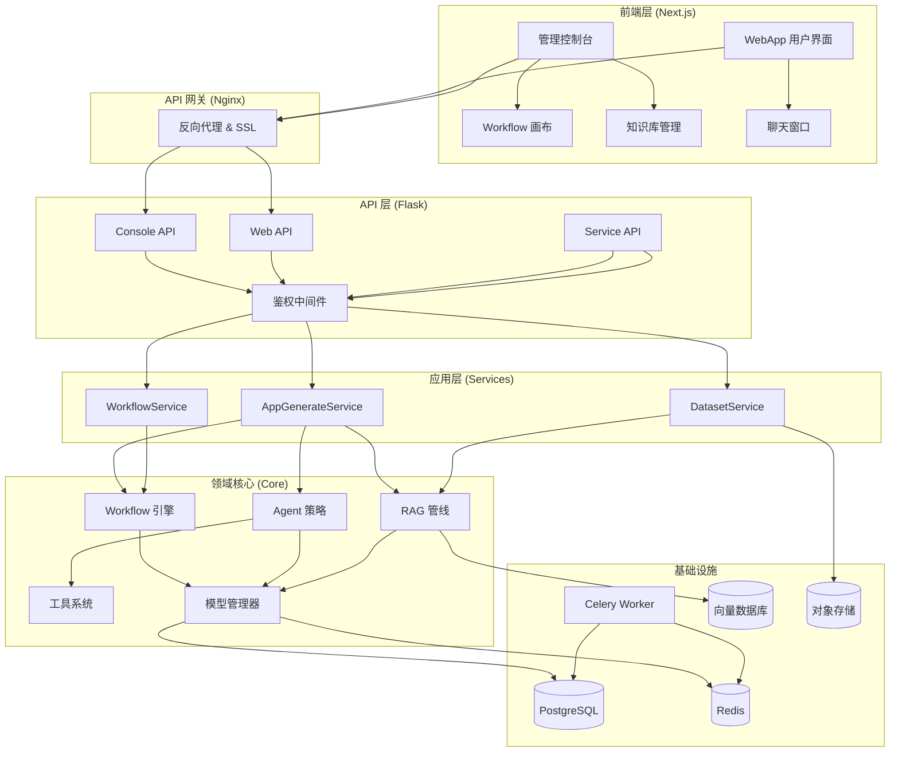

# 第1章：Dify 术语全景与平台架构原理

## 1. 项目背景

小王所在的公司最近接了一个大客户的 AI 转型项目——要在一个月内部署一套智能客服系统，支持文档问答、多轮对话、工单自动分类。领导拍板用开源方案，选型结果落在了 Dify 上。可小王第一天打开 Dify 的控制台就傻眼了："App？Chat？Agent？Workflow？Completion？这些词我都认识，但放在一起就不知道有什么区别了。还有 RAG、Embedding、Prompt Template、Tool……这术语词典比我大学四年的单词表还长。"

更扎心的是，小王试着创建了一个 Chat App，配好提示词，选了个模型，跑是跑起来了。但同事问他"这个和直接调 OpenAI API 有什么区别？Dify 到底帮你做了啥？"小王答不上来。他知道自己需要一张"全景地图"——搞清楚 Dify 的术语体系、核心组件之间的协作关系，以及一个请求从用户输入到 AI 回复到底走了哪些路径。

这不是小王一个人的困境。Dify 作为一个 LLM 应用开发平台，它承上启下：上面是业务场景（客服、营销、数据分析），中间是编排层（工作流、Agent、知识库），下面是模型层（GPT、Claude、本地模型）。如果你不清楚每个术语的"坐标"，那你永远只能在控制台上点点鼠标，出了问题也不知道从哪排查。本章的目的，就是为 Dify 绘制一张"术语全景地图"和"架构地形图"，让每一位读者在后续章节深入实战之前，先建立全局认知。

## 2. 项目设计——剧本式交锋对话

**小胖**：（推开会议室门，手里端着奶茶）"哎大师，我昨天终于把 Dify 跑起来了，那个聊天 App 也能回复我了。但我越用越懵——界面上到处都是 Chat、Agent、Workflow，这三个到底啥关系？是不是就像奶茶店有中杯、大杯、超大杯的区别？"

**大师**：（笑着摇头）"你这比喻有点意思，不过不准确。它们不是大小的区别，是'智能程度'和'自由度'的区别。Chat 模式就像你去快餐店点套餐——固定流程，你只能选汉堡配可乐。Agent 模式像是自助厨房——给你食材和工具，AI 自己决定怎么组合。Workflow 模式则是你自己设计后厨流水线——洗菜、切菜、炒菜、装盘，每一步你都画好。"

**小白**：（推了推眼镜）"那 Completion 模式呢？我好像看到还有一个这个选项。"

**大师**："Completion 是最原始的形态——你给一个 Prompt，模型给一个回复，没有对话记忆，没有工具调用，就像你对着山谷喊一句话，听到一句回声就结束了。它是最简单的，Chat 是在它的基础上加了对话历史和上下文管理。"

**小胖**："哦！那 RAG 又是什么？感觉这词出现频率巨高。"

**大师**："RAG 全称是 Retrieval-Augmented Generation——检索增强生成。打个比方：假设你是一个客服，但你不能记住公司的所有产品信息。所以你面前摆了一本产品手册，客户问问题的时候，你先翻手册找到相关内容，然后结合问题给出回答。'翻手册'就是检索（Retrieval），'给出回答'就是生成（Generation）。在 Dify 里，知识库就是那本手册，文档被切成小段，向量化后存到向量数据库里，用户提问时先去检索相关段落，再和问题一起塞给 LLM 生成答案。"

**技术映射**：RAG = 向量数据库检索（Retrieval）+ LLM 生成（Generation），本质是给 LLM 外挂一个"外部知识存储器"。

**小白**："那 Workflow 听起来像是核心？我看到画布上可以拖各种节点。"

**大师**："没错，Workflow 是 Dify 的'王牌'。它本质上是一个图执行引擎。你拖拽的每个节点都是一个处理单元——LLM 节点负责调模型，HTTP 节点负责调外部 API，代码节点可以在沙箱里跑你的 Python 代码，IF-ELSE 节点做条件分支。节点之间通过连线传递数据，整个图按拓扑顺序执行。这比写代码灵活多了——产品经理都能搭一个简单的 AI 流程。"

**小胖**："等等，节点之间怎么传数据？就像流水线上传递零件？"

**大师**："对，Workflow 有一个全局变量池。每个节点执行完后，它的输出会自动注册到变量池里，下游节点可以通过 `{{上游节点名.输出字段名}}` 引用。比如 LLM 节点的输出叫 `text`，下一个节点就能用 `{{llm_node.text}}` 拿到它。"

**技术映射**：Workflow = 有向无环图（DAG）的执行引擎 + 变量池机制。

**小白**："那 Dify 的整体架构呢？我感觉前端、后端、数据库、消息队列都搅在一起了。"

**大师**：（拿出白板笔开始画）"Dify 分成四大层：

- **前端层**（web/）：Next.js + React，给你看的控制台、画布、聊天界面。
- **API 层**（api/controllers/）：Flask，处理 HTTP 请求，做权限校验、参数验证。
- **核心领域层**（api/core/）：这里最复杂——Workflow 引擎、Agent 跑逻辑、RAG 管线、工具系统，都在这里。和框架无关，纯业务逻辑。
- **基础设施层**：PostgreSQL 存业务数据、Redis 做缓存和消息队列、Celery 做异步任务（比如文档索引 30 分钟跑不完，不能让你在网页上干等）、向量数据库存知识库的向量。"

**小胖**："那我发一句话给聊天助手，它背后到底跑了哪些东西？"

**大师**："拿 Chat App 举例：你在浏览器输入'帮我查一下退货政策'→ 请求到 Nginx → 转发到 Flask API → 校验你是哪个租户的 → 找到你的 App 配置 → 组装 Prompt（把你绑定的知识库检索结果和对话历史拼进去）→ 调 LLM → 流式返回给你。如果是 Workflow，那就更复杂了——WorkflowService 把请求交给 WorkflowEntry，创建一个图执行引擎，按拓扑顺序执行每个节点。"

**小白**："所以 Dify 本质上是一个 LLM 调用编排器？"

**大师**："精辟。Dify 的价值就是降低 LLM 应用的开发门槛。你不用管模型怎么接、知识库怎么建、工作流怎么跑——Dify 都帮你做好了。你要做的就是在这个平台上'积木式'搭建你自己的 AI 应用。"

**小胖**："明白了！这就像我玩 Minecraft——Dify 给了我各种方块（LLM、知识库、工具），我可以搭出一个城堡（AI 应用），而不是让我先去烧砖。"

**大师**："这个比喻很恰当。本章的核心认知就是：Dify = 模型调度层 + 编排引擎层 + 知识管理层 + 应用发布层。下一章我们就亲手把它搭起来。"

## 3. 项目实战

### 环境准备

在开始探索 Dify 架构之前，我们需要先了解它的源码结构。以下操作在任意安装了 Git 的机器上均可执行。

```bash
# 1. 克隆 Dify 源码（如果你还没有的话）
git clone https://github.com/langgenius/dify.git
cd dify

# 2. 查看顶层目录结构（Windows PowerShell）
Get-ChildItem -Depth 1 | Select-Object Name, Mode
```

**环境要求**：
- Git 2.x+
- Python 3.12（如要本地运行后端）
- Node.js 20+（如要本地运行前端）
- Docker Desktop（如要完整部署）

### 分步实现

#### 步骤1：理解源码目录结构（目标：建立代码地图）

```bash
# 打印 Dify 的核心目录树
Get-ChildItem -Recurse -Depth 2 -Directory |
    Where-Object { $_.FullName -notmatch 'node_modules|\.git|__pycache__|\.next' } |
    ForEach-Object { $_.FullName.Replace("$PWD\", '') } |
    Sort-Object | Select-Object -First 50
```

你会看到类似这样的结构（简化版）：

```
api/                        # 后端 Python 代码（Flask + Celery）
├── app.py                  # 应用程序入口
├── app_factory.py          # App 工厂（创建 Flask 实例）
├── configs/                # 配置系统（Pydantic Settings）
├── controllers/            # 表示层（HTTP API）
│   ├── console/            # 控制台 API（管理后台）
│   ├── web/                # 对外 Web API（用户端）
│   └── service_api/        # 服务 API（编程调用）
├── core/                   # 领域层（业务核心）
│   ├── workflow/           # Workflow 图执行引擎
│   ├── agent/              # Agent 策略（FC/CoT）
│   ├── rag/                # RAG 管线（提取/分段/检索）
│   ├── tools/              # 工具系统
│   ├── plugin/             # 插件系统
│   └── model_manager.py    # 模型管理器
├── services/               # 应用层（业务编排）
├── models/                 # 数据模型（SQLAlchemy ORM）
├── tasks/                  # Celery 异步任务
├── extensions/             # Flask 扩展初始化
└── migrations/             # 数据库迁移文件

web/                        # 前端 Next.js 代码
├── app/                    # 页面路由（App Router）
│   ├── (commonLayout)/     # 主布局（控制台）
│   └── (shareLayout)/      # 共享布局（WebApp）
├── app/components/         # React 组件
│   └── workflow/           # 工作流画布组件
├── service/                # API 调用层
└── i18n/                   # 国际化翻译文件

docker/                     # Docker 部署配置
├── docker-compose.yaml     # 主编排文件
└── envs/                   # 环境变量模板
```

#### 步骤2：追踪一个 API 请求的完整路径（目标：理解分层架构）

以"创建一个 Chat 对话"为例，看代码如何流转：

**第一步：前端发起请求**

在 `web/service/apps.ts` 中，React Hook 会调用后端 API：

```typescript
// 前端：发起对话请求（简化版）
const sendMessage = async (query: string) => {
  const response = await fetch('/console/api/apps/{appId}/chat-messages', {
    method: 'POST',
    headers: { 'Content-Type': 'application/json' },
    body: JSON.stringify({
      query: query,
      response_mode: 'streaming',
    }),
  })
  // 处理 SSE 流式响应...
}
```

**第二步：Flask Controller 接收请求**

在 `api/controllers/console/app/chat.py` 中（简化示意）：

```python
# 后端：Controller 层处理请求
from flask_login import login_required, current_user
from pydantic import BaseModel

class ChatMessageRequest(BaseModel):
    query: str
    response_mode: str = "streaming"

@login_required
def post(self, app_id: str):
    # 1. Pydantic 自动校验请求参数
    data = ChatMessageRequest.model_validate(request.get_json())
    # 2. 委托给 Service 层
    return AppGenerateService.generate(
        app_id=app_id,
        user=current_user,
        query=data.query,
    )
```

**第三步：Service 层编排业务**

在 `api/services/app_generate_service.py` 中：

```python
# 后端：Service 层编排业务逻辑
class AppGenerateService:
    @classmethod
    def generate(cls, app_id, user, query):
        # 1. 获取 App 配置
        app = App.query.get(app_id)
        # 2. 获取模型实例
        model_instance = ModelManager.get_instance(
            tenant_id=user.current_tenant_id,
            provider=app.model_config.provider,
            model=app.model_config.model,
        )
        # 3. 构建 App 运行器
        runner = ChatAppRunner(app, model_instance)
        # 4. 执行并流式返回
        return runner.run(query)
```

**第四步：Core 核心逻辑**

在 `api/core/app/apps/chat/` 中，`ChatAppRunner` 会：
1. 组装 System Prompt + User Prompt（包含知识库检索结果）
2. 调用 LLM 模型（通过 ModelManager）
3. 将结果包装为 SSE 事件流返回

#### 步骤3：绘制自己的架构图（目标：输出到团队 Wiki）

使用 Mermaid 语法绘制 Dify 整体架构图（复制以下内容到支持 Mermaid 的工具中渲染）：



**运行截图描述**：将这段 Mermaid 代码放到 GitHub 的 Markdown 文件中或使用 mermaid.live 在线渲染，你将看到一张从上到下、从用户界面到底层存储的 Dify 全链路架构图。图中清晰地展示了前端 → Nginx → Flask API → Service → Core → 基础设施的数据流向。

#### 步骤4：验证学习效果（目标：能口头讲清楚架构）

找一个同事，用 5 分钟时间向他讲解 Dify 的架构。你可以用下面的话术提纲：

1. "Dify 是一个 LLM 应用搭建平台，核心价值是让你不用写代码就能搭 AI 应用。"
2. "它支持 5 种应用模式：Chat（对话）、Agent（智能体）、Workflow（工作流）、Completion（补全）、Advanced Chat（高级对话）。"
3. "技术架构分四层：前端是 Next.js 写的控制台，API 是 Flask 写的 REST 接口，核心逻辑是 Python 写的 Workflow 引擎和 RAG 管线，底层用 PostgreSQL + Redis + Celery + 向量数据库支撑。"
4. "最大的亮点是 Workflow——你可以像搭积木一样拖拽节点（LLM、代码、HTTP、条件分支），画布上的图就是实际执行的流程。"

### 测试验证

打开浏览器访问 `https://github.com/langgenius/dify`，找到源码目录，验证以下三个信息：

```bash
# 验证 1：确认核心模块存在
Test-Path "api/core/workflow/workflow_entry.py"  # 应返回 True
Test-Path "api/core/rag"                           # 应返回 True
Test-Path "api/core/agent"                         # 应返回 True

# 验证 2：确认 Docker Compose 包含关键服务
Select-String -Path "docker/docker-compose.yaml" -Pattern "api|worker|web|db|redis|nginx|sandbox|weaviate"

# 验证 3：确认术语一致性
Select-String -Path "api/models/model.py" -Pattern "class App|class Conversation|class Message" | Select-Object -First 3
```

## 4. 项目总结

### 优点与缺点

| 维度 | 优点 | 缺点 |
|------|------|------|
| **架构设计** | DDD 分层清晰，controllers → services → core 职责分离 | 模块间耦合度仍需优化，部分 Service 类过于庞大 |
| **扩展性** | Workflow 节点、工具、插件均有标准化扩展接口 | 自定义开发文档不够详细，入门门槛偏高 |
| **部署灵活性** | 支持 Docker Compose 一键部署和 K8s 分布式部署 | 本地开发环境搭建步骤较多，依赖服务多 |
| **术语体系** | 概念定义清晰，与业界术语（RAG、Agent、Workflow）一致 | 内部概念（如 App 的五种模式）需要时间消化 |
| **学习曲线** | 可视化操作降低入门门槛 | 源码深度定制需要 Python+React+DevOps 全栈能力 |

### 适用场景

| 场景 | 说明 |
|------|------|
| **智能客服系统** | 知识库 RAG + 多轮对话 + 工单分类 Agent |
| **AI 数据分析** | Workflow 编排：数据查询 → LLM 分析 → 报告生成 |
| **内容生产流水线** | 选题 → LLM 生成大纲 → LLM 扩写 → 审核 Agent |
| **API 智能网关** | HTTP 节点调用内部 API → LLM 格式化 → 返回结构化数据 |
| **企业内部知识管理** | 上传所有产品文档 → 知识库检索 → 员工自助问答 |

**不适用场景**：
- 实时性要求极高的场景（< 50ms 响应，因为 LLM 调用本身需要几百毫秒）
- 完全确定性的业务规则引擎（Dify 不是规则引擎，LLM 输出有随机性）

### 注意事项

1. **模型 API Key 安全**：切勿将 API Key 硬编码到代码中，应通过环境变量注入
2. **多租户隔离**：每个 Tenant 的数据是逻辑隔离的，注意不要在 Service 层混用 tenant_id
3. **版本兼容**：Dify 版本迭代快，升级前务必阅读 Release Notes

### 常见踩坑经验

1. **坑：部署后访问空白页** → 根因：前端环境变量 `NEXT_PUBLIC_API_PREFIX` 配置错误，前端无法找到后端 API
2. **坑：知识库文档索引进度一直为 0** → 根因：Celery Worker 未启动或 Redis 连接失败，检查 `docker logs dify-worker`
3. **坑：模型调用报 401** → 根因：API Key 配置格式错误（多打了空格/换行），在 Dify 控制台重新粘贴即可

### 思考题

1. **进阶题**：Dify 的 API 层有 console、web、service_api、inner_api 四种 API 前缀，请思考它们的职责边界分别是什么？为什么不能合并为一个统一的 API？

2. **进阶题**：如果让你设计一个"流水线执行引擎"来替代 Dify 的 Workflow 引擎，你会考虑哪些核心数据结构？变量如何在节点间传递？

> **参考答案**：见附录 D

---

> **推广计划提示**：本章适合所有角色阅读。新人开发可以在 1-2 小时内通读并绘制架构图；运维人员可以重点关注"项目实战"中的目录结构和部署依赖；架构师建议结合源码阅读路线图（附录 A），提前了解后续高级篇的源码视角。
