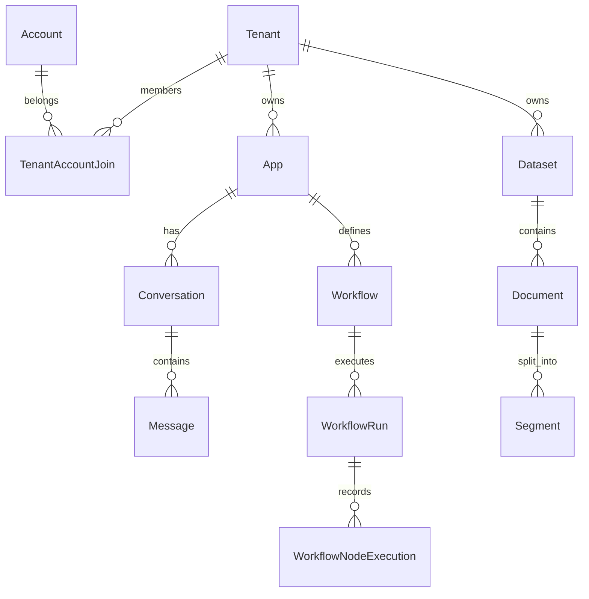

# 第20章：PostgreSQL 数据模型与数据库调优

## 1. 项目背景

Dify 跑了三个月，一切正常。直到运营反馈"消息列表加载特别慢，翻一页要 5 秒钟"。小陈打开数据库一看——Message 表已经有 200 万条记录了，一个简单的 `SELECT COUNT(*) FROM messages` 跑了 3 秒。EXPLAIN 显示全表扫描（Seq Scan），因为查询条件里的 `conversation_id` 字段没有索引。

这不是巧合。Dify 的默认表结构是为"通用性"设计的——它不知道你的业务场景中最高频的查询是什么。你必须在理解表结构的基础上，为你的场景定制索引。而且不仅是索引——连接池大小、查询优化、表分区策略，都需要根据你的数据规模来调整。

本章带你打开 Dify 的"数据心脏"——从核心表 ER 关系图到 SQLAlchemy ORM 定义，再到针对高频查询的索引优化和慢 SQL 分析。

## 2. 项目设计——剧本式交锋对话

**小胖**：（看着 pg_stat_activity 的输出）"大师！Message 表 200 万行了，查消息列表慢得要死——5 秒才翻一页。我是不是该加个索引？但在哪个字段上加？"

**大师**："先看你的查询是什么。大概率是 `SELECT * FROM messages WHERE conversation_id = 'xxx' ORDER BY created_at DESC LIMIT 20`。这个查询需要在 `(conversation_id, created_at)` 上建一个**复合索引**，两个字段放在一起，数据库一次 B-Tree 查找就能定位。"

**技术映射**：复合索引（Composite Index）= 将多个查询条件字段组合成一个索引，避免回表查询。

**小白**："Dify 的核心表有哪些？我只在 models/model.py 里看到 App、Conversation、Message 这些。"

**大师**："Dify 的核心表按功能分四组：

1. **租户与用户**：Tenant（租户）、Account（账号）、TenantAccountJoin（多对多关系 + 角色）
2. **应用模型**：App（应用定义）、Conversation（会话）、Message（消息记录）——这是每次对话的完整链路
3. **知识库**：Dataset（数据集）、Document（文档）、Segment（文档分段）——RAG 的数据基础
4. **工作流**：Workflow（工作流定义，graph 字段存 JSON DSL）、WorkflowRun（执行记录）、WorkflowNodeExecution（每个节点的执行详情）"

**技术映射**：Dify 的 ORM 设计反映了 DDD 的聚合根（Aggregate Root）——App 是 Conversation 的聚合根，Conversation 是 Message 的聚合根。

**小胖**："连接池又是怎么回事？我经常看到 'too many connections' 错误。"

**大师**："PostgreSQL 的默认最大连接数是 100。如果你的 Dify 有 4 个 Gunicorn Worker、2 个 Celery Worker，每个进程可能开 10 个连接，加起来就是 60 个。高峰时再加几个管理后台的连接，很容易撞到 100 的上限。解决方案有两个：增加 PostgreSQL 的 `max_connections`，或者在应用层用 PgBouncer 做连接池，把 N 个应用连接汇聚成 M 个数据库连接。"

**技术映射**：连接池（Connection Pool）= 应用连接 > 数据库连接的汇聚器，减少数据库的压力。

## 3. 项目实战

### 分步实现

#### 步骤1：理解核心表 ER 图（目标：建立数据模型认知）



#### 步骤2：SQLAlchemy ORM 模型关系解读（目标：读懂源码中的数据定义）

```python
# api/models/model.py（简化）
class App(Base):
    __tablename__ = 'apps'
    id = Column(StringUUID, primary_key=True)
    tenant_id = Column(StringUUID, ForeignKey('tenants.id'))
    name = Column(String(255))
    mode = Column(String(255))  # chat / agent_chat / workflow / completion
    
    # 关系
    conversations = relationship('Conversation', back_populates='app', lazy='dynamic')
    workflow = relationship('Workflow', back_populates='app', uselist=False)

class Conversation(Base):
    __tablename__ = 'conversations'
    id = Column(StringUUID, primary_key=True)
    app_id = Column(StringUUID, ForeignKey('apps.id'))
    user = Column(String(255))
    
    messages = relationship('Message', back_populates='conversation',
                           order_by='Message.created_at', lazy='dynamic')

class Message(Base):
    __tablename__ = 'messages'
    id = Column(StringUUID, primary_key=True)
    conversation_id = Column(StringUUID, ForeignKey('conversations.id'))
    query = Column(Text)
    answer = Column(Text)
    message_tokens = Column(Integer, default=0)
    created_at = Column(DateTime, default=datetime.utcnow)
```

**关键设计点**：
- `lazy='dynamic'`：关系属性返回 Query 对象而不是立即加载，支持后续过滤和分页
- `order_by='Message.created_at'`：在关系定义中预置排序，避免每次查询都写 ORDER BY

#### 步骤3：添加索引解决慢查询（目标：200 万行查询从 5s 降到 10ms）

```sql
-- 1. 定位慢查询
SELECT pid, now() - query_start AS duration, query
FROM pg_stat_activity
WHERE state = 'active' AND now() - query_start > interval '1 second';

-- 2. 分析当前查询计划
EXPLAIN ANALYZE
SELECT m.query, m.answer, m.created_at
FROM messages m
JOIN conversations c ON m.conversation_id = c.id
WHERE c.app_id = 'xxx-app-id'
ORDER BY m.created_at DESC
LIMIT 20;

-- 预期（无索引）：Seq Scan on messages → cost=0.00..45234.00 → time=5234ms

-- 3. 创建复合索引（注意 CONCURRENTLY 避免锁表）
CREATE INDEX CONCURRENTLY idx_messages_conv_created
ON messages (conversation_id, created_at DESC);

CREATE INDEX CONCURRENTLY idx_conversations_app
ON conversations (app_id, created_at DESC);

-- 4. 再次 EXPLAIN ANALYZE
-- 预期（有索引）：Index Scan using idx_messages_conv_created → time=12ms
-- 性能提升：436 倍！
```

**Dify 高频查询的推荐索引**：

```sql
-- Message 表：按对话查消息列表
CREATE INDEX CONCURRENTLY idx_messages_conv_created ON messages (conversation_id, created_at DESC);

-- WorkflowRun 表：按 Workflow 查执行历史
CREATE INDEX CONCURRENTLY idx_workflow_runs_wf ON workflow_runs (workflow_id, created_at DESC);

-- WorkflowNodeExecution 表：按 Run ID 查节点详情
CREATE INDEX CONCURRENTLY idx_node_exec_run ON workflow_node_executions (workflow_run_id);

-- Document 表：按知识库查文档列表
CREATE INDEX CONCURRENTLY idx_documents_dataset ON documents (dataset_id, created_at DESC);
```

#### 步骤4：连接池配置优化（目标：防止连接耗尽）

```python
# 在 .env 或直接修改 ext_database.py
SQLALCHEMY_POOL_SIZE = 30          # 连接池常驻连接数
SQLALCHEMY_POOL_RECYCLE = 1800     # 连接回收时间（秒）
SQLALCHEMY_POOL_PRE_PING = True    # 使用前测试连接有效性
SQLALCHEMY_MAX_OVERFLOW = 10       # 超出 pool_size 的最大临时连接
```

**连接数计算**：
- Gunicorn 4 Workers × 约 5 连接/Worker = 20
- Celery Worker × 约 5 连接 = 5
- 总计约 25 个常驻连接 < pool_size 30 < PostgreSQL max_connections

### 测试验证

```bash
# 1. 查看表大小排名
docker exec docker-db-1 psql -U postgres -d dify -c "
SELECT tablename,
       pg_size_pretty(pg_total_relation_size(schemaname||'.'||tablename)) AS size
FROM pg_tables WHERE schemaname='public'
ORDER BY pg_total_relation_size(schemaname||'.'||tablename) DESC LIMIT 10;
"

# 2. 查看索引使用统计
docker exec docker-db-1 psql -U postgres -d dify -c "
SELECT indexrelname, idx_scan, idx_tup_read, idx_tup_fetch
FROM pg_stat_user_indexes WHERE tablename='messages'
ORDER BY idx_scan DESC;
"
# idx_scan 高 = 索引被频繁使用，效果好
# idx_scan 低 = 索引基本没用，考虑删除

# 3. 查看当前活跃连接数
docker exec docker-db-1 psql -U postgres -c "
SELECT count(*) AS current_connections FROM pg_stat_activity;
"
```

## 4. 项目总结

### 优点与缺点

| 优化手段 | 效果 | 成本 |
|---------|------|------|
| 复合索引 | 查询加速 100-500 倍 | 写入速度轻微下降 + 磁盘占用 |
| 连接池调优 | 防止连接耗尽 | 需根据并发量持续调整 |
| 表分区 | 大表扫描缩小范围 | 需要提前规划分区键 |
| 物化视图 | 预计算统计结果 | 数据有延迟，需定期刷新 |

### 适用场景

| 数据规模 | 优化方案 |
|---------|---------|
| < 10 万行 | 默认配置即可 |
| 10-100 万行 | 添加针对性索引 |
| 100-1000 万行 | 索引 + 表分区 + 连接池调优 |
| > 1000 万行 | 考虑读写分离、归档历史数据 |

### 注意事项

1. **CONCURRENTLY 创建索引**：生产环境不要用普通的 `CREATE INDEX`（会锁表），用 `CONCURRENTLY` 避免阻塞正常读写
2. **索引维护**：定期 `REINDEX` 或 `VACUUM ANALYZE` 保持索引统计信息更新
3. **pg_dump 备份**：每天定时备份，保留至少 7 天

### 常见踩坑经验

1. **坑：索引建了但 EXPLAIN 还是 Seq Scan** → 根因：统计信息过期，PostgreSQL 判断全表扫描更快。解决：`ANALYZE messages;` 更新统计
2. **坑：`too many connections` 错误** → 根因：应用层连接池总量超过 PostgreSQL 上限。解决：增加 `max_connections` 或减小 `pool_size`
3. **坑：数据库突然变慢，不是索引的问题** → 根因：autovacuum 在后台运行（清理死元组），占用 I/O。解决：调整 autovacuum 参数或避开高峰期

### 思考题

1. **进阶题**：Dify 的 `messages` 表在 1000 万行时，按"最近 7 天"查询某用户的对话历史，你会如何设计分区策略？（提示：按 created_at 做 RANGE 分区）

2. **进阶题**：多租户场景下，如果某个租户的数据量特别大（占总数据 80%），会不会影响其他租户的查询性能？如何隔离？（提示：数据隔离 ≠ 性能隔离，考虑表分区按 tenant_id）

> **参考答案**：见附录 D
