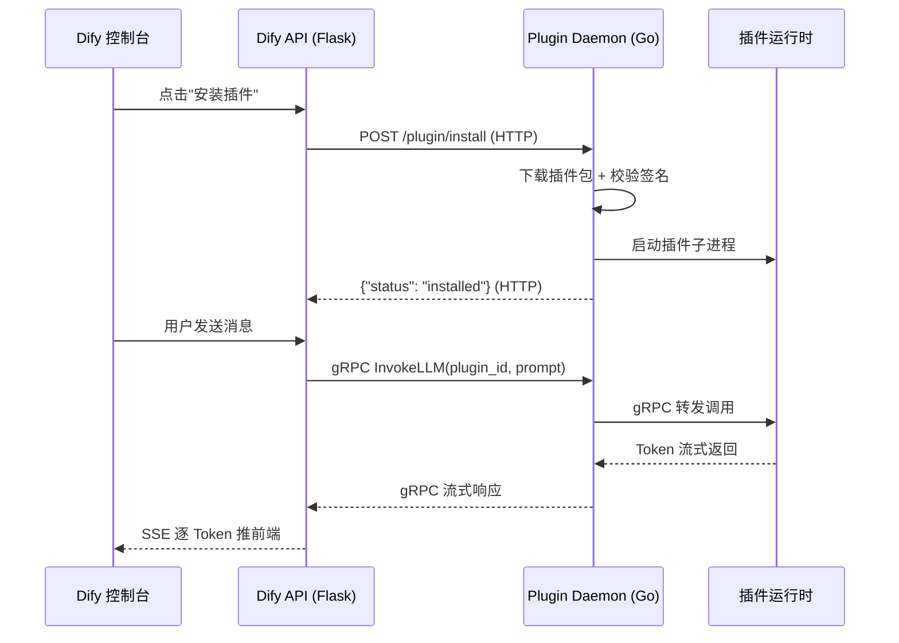

# 第27章：插件系统与 Plugin Daemon 协同样式

## 1. 项目背景

Dify 的模型供应商列表里有 OpenAI、Anthropic，但也有 Ollama、Xinference、LocalAI——甚至你可以接入自己开发的自定义模型后端。这些"非官方" Provider 之所以能无缝接入，靠的是**插件系统（Plugin System）**。插件不是直接跑在 Dify 的 Python 进程里的——而是在一个独立的 Go 服务（Plugin Daemon）中运行。这套"插件沙箱"架构有三个核心价值：

**安全隔离**：一个插件出了 bug（如内存泄漏、死循环）不会拖垮整个 Dify API。Daemon 可以独立 kill 插件进程并重启。

**语言无关**：插件可以用 Python 写，也可以用 Go 写。Python 插件通过 gRPC 与 Daemon 通信，Go 插件直接被 Daemon 加载为子进程。

**热插拔**：安装、升级、卸载插件都不需要重启 Dify——Daemon 动态管理插件生命周期。

理解这套架构意味着你能：评估第三方插件的安全性、排查"插件模型调不通"时知道是 Daemon 问题还是网络问题、甚至自己开发一个插件发布到 Marketplace。

## 2. 项目设计——剧本式交锋对话

**小胖**：（看着 docker-compose 里的 plugin_daemon 服务）"大师，为啥 Plugin Daemon 用 Go 写？Dify 后端全是 Python，搞两种语言不是增加维护负担吗？"

**大师**："因为插件需要进程级隔离。如果插件是 Python 写的，直接在 Dify API 进程里 `import plugin_module`——万一副里有个 `while True: pass` 死循环，或者内存泄漏——Dify 整个 API 就挂了。Daemon 作为独立进程，用 Go 的 `os/exec` 启动插件子进程，用 cgroups 限制资源（CPU/内存），超时直接 kill。Go 天然适合做这种高性能、高并发的进程管理中间件。"

**技术映射**：Plugin Daemon = 插件进程的"保姆"——启动、监控、限制资源、kill，全部由 Daemon 控制。

**小白**："插件有哪几种类型？我只看到过 Model Provider 插件。"

**大师**："四种：
1. **Model Provider**（最常用）：让 Dify 支持新的模型供应商，如 AWS Bedrock、百度文心、腾讯混元
2. **Tool**：新工具类型，如 Jira 操作、飞书消息发送
3. **Agent Strategy**：自定义 Agent 决策策略（如你之前的'金融安全决策链'）
4. **Endpoint**：在 Dify API 上挂载自定义 HTTP 端点（如 `/my-custom-webhook`）

最常用的是前两种——99% 的插件需求都是'接一个新模型'或'加一个新工具'。"

**小胖**："那 Daemon 和 Dify API 怎么通信的？"

**大师**："两层通信：
- **HTTP**：管理类操作——安装插件、卸载插件、查询插件列表。Dify API 发 HTTP 请求到 Daemon 的 `/plugin/install` 等端点。
- **gRPC**：性能敏感的操作——调用模型、执行工具。gRPC 比 HTTP 快（基于 HTTP/2 + Protobuf 序列化），适合高频、低延迟的调用。"

## 3. 项目实战

### 环境准备

| 条件 | 说明 |
|------|------|
| Dify 已部署 | `docker ps` 确认 plugin_daemon 运行中 |
| Dify 控制台可访问 | 用于安装插件 |

### 分步实现

#### 步骤1：理解 Plugin Daemon 的架构和通信



**关键时序**：插件调用是同步的（API 等 Daemon 返回结果），但 Daemon 和 Plugin 之间的 gRPC 支持流式返回——每个 Token 生成后立刻推送，而不是等全部生成完。

#### 步骤2：安装插件并追踪调用链（目标：动手验证通信过程）

```bash
# 1. 确认 Daemon 运行
docker ps --format "table {{.Names}}\t{{.Status}}" | Select-String "plugin"

# 2. 在 Dify 控制台 → 插件 → Marketplace → 搜索 "DALL-E"
# 点击安装

# 3. 同时观察 Daemon 日志
docker logs docker-plugin_daemon-1 -f --tail 20
# 预期： [INFO] Downloading plugin: langgenius/dalle
#       [INFO] Verifying plugin signature...
#       [INFO] Plugin installed: langgenius/dalle v1.2.0

# 4. 在 Agent 中使用该插件
# Agent 编辑页 → 工具 → 勾选 "DALL-E 图片生成"
# 发送消息："画一只戴着墨镜的柴犬"
# 同时观察 Daemon 日志中的 gRPC 调用记录
docker logs docker-plugin_daemon-1 --tail 10 | Select-String "grpc|InvokeTool"
```

#### 步骤3：理解 Inner API 通信协议（目标：看懂 API ↔ Daemon 的接口定义）

```python
# api/controllers/inner_api/plugin/plugin.py（简化）
# 这是 Dify API 与 Plugin Daemon 之间的"内部 API"
# 路径前缀：/inner_api/plugin/

class PluginInnerAPI:
    
    @staticmethod
    def install_plugin(plugin_id: str, tenant_id: str):
        """通知 Daemon 安装一个插件"""
        resp = requests.post(
            f"{PLUGIN_DAEMON_URL}/plugin/install",
            json={
                "plugin_id": plugin_id,
                "tenant_id": tenant_id,
            },
            timeout=30
        )
        return resp.json()
    
    @staticmethod
    def invoke_llm(plugin_id: str, model: str, messages: list, tenant_id: str):
        """通过 Daemon 调用插件的 LLM 模型"""
        # 使用 gRPC（更快、支持流式）
        channel = grpc.insecure_channel(PLUGIN_DAEMON_GRPC_URL)
        stub = PluginServiceStub(channel)
        
        request = InvokeLLMRequest(
            plugin_id=plugin_id,
            model=model,
            messages=[Message(role=m['role'], content=m['content']) for m in messages],
            tenant_id=tenant_id,
        )
        
        # 流式接收 Token
        for response in stub.InvokeLLMStream(request):
            yield response.token  # 逐 Token 推送
```

#### 步骤4：排查"插件调不通"的故障

```bash
# 症状 1：安装了插件但在模型列表里看不到
# 排查：检查 Daemon 是否正常运行
docker logs docker-plugin_daemon-1 --tail 20 | Select-String "error|Error"

# 症状 2：调用插件模型报"Daemon connection refused"
# 排查：检查 API 到 Daemon 的网络连通性
docker exec docker-api-1 curl -s http://plugin_daemon:5003/health
# 预期：{"status": "ok"}

# 症状 3：插件执行超时
# 排查：检查 Daemon 的 timeout 配置
docker exec docker-api-1 cat /app/api/configs/plugin_daemon_config.py | Select-String "timeout"
```

### 测试验证

```bash
# 查看当前安装的插件列表
curl http://localhost/console/api/workspaces/current/plugins \
  -H "Cookie: dify_session=<从浏览器复制>"
# 预期：返回 JSON 数组，包含已安装插件的名称和版本

# 验证 Daemon 健康状态
docker exec docker-api-1 curl -s http://plugin_daemon:5003/health
```

## 4. 项目总结

### 架构角色总览

| 角色 | 技术栈 | 通信方式 | 职责 |
|------|-------|---------|------|
| Dify API | Python Flask | HTTP + gRPC → Daemon | 接收用户请求、编排调用 |
| Plugin Daemon | Go | HTTP/gRPC ← API, gRPC → Plugin | 管理插件生命周期 |
| Plugin Runtime | Python/Go | gRPC → Daemon | 执行模型推理/工具逻辑 |
| Marketplace | Web Service | HTTPS | 插件分发和版本管理 |

### 适用场景

| 场景 | 推荐方案 |
|------|---------|
| 对接新的模型供应商（AWS Bedrock） | Model Provider 插件 |
| 封装公司内部的复杂 API | Tool 插件 |
| 自定义 Agent 决策策略 | Agent Strategy 插件 |
| 需要自定义 HTTP 端点 | Endpoint 插件 |
| 简单的 REST API 封装 | OpenAPI 工具（更简单） |

### 注意事项

1. **Daemon 挂了的影响范围**：所有插件功能不可用（插件模型、插件工具），但内置模型和内置工具仍然可用
2. **插件权限**：插件可以访问网络（调用 API）、读写自己的数据目录，但不能访问 Dify 的文件系统或数据库
3. **插件版本管理**：Marketplace 上的插件有版本号，升级前需要确认兼容性

### 常见踩坑经验

1. **坑：插件安装成功但调用时报"plugin not found"** → 根因：Daemon 重启后没有重新加载已安装的插件。解决：重启 Daemon 后手动触发"重新加载插件"（`POST /plugin/reload`）
2. **坑：Python 插件在 Daemon 中运行报 ImportError** → 根因：插件的依赖没有在插件包中声明。解决：在 `plugin.yaml` 中声明 `requirements: [requests, numpy]`
3. **坑：gRPC 调用超时但 HTTP 正常** → 根因：gRPC 端口和 HTTP 端口不同（通常 gRPC 是 5004，HTTP 是 5003），防火墙可能只开放了 5003。解决：检查防火墙规则

### 思考题

1. **进阶题**：如果 Plugin Daemon 挂了，Dify 是否应该自动切换到"无插件模式"（禁用所有插件功能）？还是应该重试等待 Daemon 恢复？（提示：考虑熔断器模式和优雅降级）

2. **进阶题**：开发一个插件让 Dify 支持 AWS Bedrock 的 Claude 模型，你需要实现哪几个接口？Auth 认证如何处理？（提示：参考已有的 OpenAI Plugin 源码）

> **参考答案**：见附录 D

---

> **推广计划提示**：本章适合需要扩展 Dify 能力的开发人员。如果想深入了解插件开发，推荐阅读 Dify 官方插件的源码（GitHub: langgenius/dify-plugin-sdks）。
