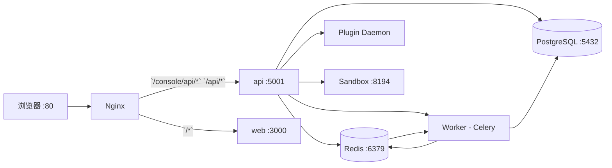

# 第2章：Docker 单机极速部署与目录结构解析

## 1. 项目背景

小张是公司的初级开发工程师，工位旁边的测试老周天天催他："你说的那个 Dify 智能客服，啥时候能让我测？"小张看了看手边的电脑——一台 16G 内存的 Windows 笔记本，心里有点虚："这个平台听说过有 Python、Node.js、PostgreSQL、Redis、Celery……光环境搭建就得花一周吧？"

这不是小张一个人的焦虑。Dify 虽然功能强大，但其技术栈相当"重"：后端 Flask + Celery，前端 Next.js，依赖 PostgreSQL、Redis、向量数据库、沙箱服务、插件守护进程等 7+ 个子服务。如果从源码编译安装，光是解决 Python 依赖冲突和 Node.js 版本兼容就能让新人崩溃。更别提那些"微妙的"配置项——SECRET_KEY 不能乱填，API URL 要区分内部外部，Redis 连接串的格式稍错就报"Connection refused"。

好在小张的师傅指了指 `docker/` 目录："试试 `docker compose up -d`，一条命令全搞定。"小张将信将疑地敲下命令，5 分钟后，浏览器里出现了 Dify 的登录界面。他瞪大了眼睛："这就跑起来了？那些 Python 虚拟机、Node 包管理器、数据库配置文件……我一个都没碰啊。"

Docker Compose 部署是 Dify 的官方推荐方式，也是新手最容易上手的入口。但"能跑起来"只是第一步。更重要的是，你要理解 `docker-compose.yaml` 里到底定义了哪些服务，每个服务是干什么的，它们之间怎么通信。只有理解了这些，你才能应对后续的"知识库索引失败""Workflow 执行超时""模型调用 500"等需要进去容器里排查的问题。本章的目标就是：用一条命令让 Dify 跑起来，再用一个小时让你看懂背后的服务拓扑。

## 2. 项目设计——剧本式交锋对话

**小胖**：（抱着一袋薯片，盯着屏幕上滚动的 Docker log）"大师，神奇啊！我就敲了 `docker compose up -d`，这一堆 Python、Node.js、数据库啥的都自动装好了？这跟变魔术似的！"

**大师**："不是魔术，是集装箱。Docker 把每个服务打包成一个独立的'集装箱'，里面有自己的操作系统环境、依赖库、网络。你看到的 `docker-compose.yaml` 就是一张'装箱单'，告诉 Docker 需要几个集装箱，每个集装箱里装什么，它们之间怎么连接。"

**小白**：（翻看 docker 目录）"但我看 `docker-compose.yaml` 里定义了十几个服务：api、worker、web、db、redis、nginx、sandbox、plugin_daemon……这也太多了吧？我只是跑一个聊天应用而已。"

**大师**："这恰恰说明 Dify 是一个完整的应用平台，不是一个简单的 API 包装。每个服务都有独立职责。最关键的是这四个：**api** 是大脑（处理请求），**web** 是脸面（前端界面），**db** 是记忆（存数据），**redis** 是神经（传消息给 Worker）。其余的都是'能力插件'——Worker 负责后台苦力活，Nginx 负责接待和引路，Sandbox 负责安全执行代码，Plugin Daemon 管理第三方插件。"

**小胖**："等等，api 和 worker 这两个容器里装的好像是同一个 docker 镜像？"

**大师**：（点头）"观察力不错。api 和 worker 用的都是 `langgenius/dify-api` 这个镜像，只是启动命令不一样。api 容器启动的是 Gunicorn 进程（Web 服务器），worker 容器启动的是 Celery worker 进程（任务消费者）。这就像你买了一台电脑——可以开机当服务器用，也可以当办公电脑用，硬件一样，用法不同。"

**技术映射**：同一 Docker 镜像 + 不同启动命令 = 关注点分离（Separate process concerns），避免代码重复部署。

**小白**："那环境变量呢？我看 `docker/.env.example` 里有一大堆配置，哪些是必须要改的？"

**大师**："五类配置要关注：

1. **密钥类**：`SECRET_KEY` 必须改，这是 Flask Session 加密用的，用 `openssl rand -hex 32` 生成一个。
2. **地址类**：`CONSOLE_API_URL`（控制台 API 地址）和 `APP_API_URL`（应用 API 地址），单机部署保持默认的 `http://localhost` 就行。
3. **数据库类**：`DB_USERNAME`、`DB_PASSWORD`、`DB_HOST`、`DB_PORT`、`DB_DATABASE`，默认值就能跑。
4. **Redis 类**：`REDIS_HOST`、`REDIS_PORT`，默认就行。
5. **存储类**：`STORAGE_TYPE` 默认 `opendal`（本地文件系统），你要用 S3 的话再改。"

**技术映射**：环境变量（Environment Variables）是实现"配置与代码分离"的标准方式。

**小胖**："那我部署完了，下一步干啥？"

**大师**："三步走。第一步，`docker ps` 确认所有容器都是 Up 状态。第二步，浏览器打开 `http://localhost` 注册账号。第三步，创建一个 Chat App，随便问个问题，看它回不回你。如果这三步都通了，恭喜你，Dify 单机版部署成功。"

**小白**："那如果其中有一步不通呢？比如 web 容器启动了但页面打不开？"

**大师**："排查口诀：先看容器状态（`docker ps -a`），再看容器日志（`docker logs <容器名>`），最后检查端口占用（`netstat -an | findstr 80`）。80% 的问题出在端口冲突上——你电脑上的 IIS 或者别的软件可能占用了 80 端口。"

**小胖**："明白了，那我先去部署，有问题再来找你！"

**大师**："等一下，还有最后一个重要的概念你要带走——Dify 的容器之间是通过 Docker 的内部网络通信的。比如 web 容器调用 api 容器时，用的地址是 `http://api:5001`，不是 `http://localhost:5001`。这是因为 Docker Compose 会自动创建一个以服务名为域名的内部 DNS。如果你哪天想在外面用 curl 直接调 API，那才用 `localhost`。"

**小胖**："原来如此！那如果将来我想在生产环境部署，是不是还得配置持久化存储？不然容器重启数据就丢了？"

**大师**："问得好。`docker-compose.yaml` 里已经为 PostgreSQL、Redis、向量数据库配置了 volumes——把容器内的数据目录映射到宿主机。你去看 `docker-compose.yaml` 里的 `volumes` 配置段，就能看到每个有状态服务的持久化配置。这就是接下来中级篇要深入讲的。"

**技术映射**：Docker volumes 实现容器数据的持久化，是"无状态容器 + 有状态存储"架构的基础。

## 3. 项目实战

### 环境准备

| 依赖 | 版本要求 | 检查命令 |
|------|---------|---------|
| Docker Desktop | 24.0+ | `docker --version` |
| Docker Compose | v2.20+ | `docker compose version` |
| 可用内存 | ≥ 8GB | 任务管理器查看 |
| 可用磁盘 | ≥ 20GB | `Get-PSDrive C` |

**Windows 特别注意**：
- 确认 WSL2 已正确安装：`wsl --status`
- Docker Desktop 设置中开启 "Use WSL 2 based engine"
- 如果 80 端口被占用：`net stop http` 停止 IIS，或在 `.env` 中修改 `EXPOSE_NGINX_PORT`

### 分步实现

#### 步骤1：获取部署配置（目标：拿到官方部署文件）

```bash
# 克隆 Dify 仓库（如果还没做）
git clone https://github.com/langgenius/dify.git
cd dify/docker

# 复制环境变量模板
Copy-Item .env.example .env

# 生成安全的 SECRET_KEY
python -c "import secrets; print(secrets.token_hex(32))" | Tee-Object -Variable secretKey
# 手动将上面生成的密钥替换 .env 文件中的 SECRET_KEY
```

**常见坑**：Windows 下不要用记事本编辑 `.env` 文件，可能导致编码问题。推荐使用 VS Code。

#### 步骤2：启动服务（目标：一条命令拉起全部服务）

```bash
# 在 docker/ 目录下执行
docker compose up -d

# 预期输出：
# [+] Running 12/12
#  ✔ Network docker_default       Created
#  ✔ Container docker-db-1       Started
#  ✔ Container docker-redis-1    Started
#  ✔ Container docker-weaviate-1 Started
#  ✔ Container docker-sandbox-1  Started
#  ✔ Container docker-web-1      Started
#  ✔ Container docker-api-1      Started
#  ✔ Container docker-worker-1   Started
#  ✔ Container docker-nginx-1    Started
# ...
```

**常见坑**：
- 如果某容器 Restarting 循环：`docker logs docker-api-1 --tail 50` 查看具体报错
- 如果提示端口冲突：修改 `.env` 中 `EXPOSE_NGINX_PORT=8080` 改为其他端口
- 如果拉取镜像慢：配置 Docker 镜像加速器（阿里云/中科大镜像源）

#### 步骤3：验证服务状态（目标：确认所有服务健康）

```bash
# 查看容器运行状态
docker ps --format "table {{.Names}}\t{{.Status}}\t{{.Ports}}"

# 预期看到类似输出：
# NAMES              STATUS          PORTS
# docker-nginx-1     Up 2 minutes    0.0.0.0:80->80/tcp
# docker-api-1       Up 2 minutes    5001/tcp
# docker-web-1       Up 2 minutes    3000/tcp
# docker-worker-1    Up 2 minutes
# docker-db-1        Up 2 minutes    5432/tcp
# docker-redis-1     Up 2 minutes    6379/tcp
# docker-sandbox-1   Up 2 minutes    8194/tcp
# docker-weaviate-1  Up 2 minutes    8080/tcp

# 检查 API 健康状态
curl http://localhost/health
# 预期输出：{"pid": xxx, "status": "ok", "version": "1.14.0"}

# 查看各服务关键日志
docker logs docker-api-1 --tail 5
# 预期看到：Booting worker with pid: 7
```

**排查技巧**：如果 API 返回 502 Bad Gateway，通常是 api 容器还没启动完毕（等待数据库连接），等 1-2 分钟后重试。

#### 步骤4：初始化 Dify（目标：完成首次注册和登录）

1. 浏览器打开 `http://localhost`（如果改了端口就用 `http://localhost:8080`）
2. 首次访问会自动跳转到初始化页面，填写：
   - 邮箱：`admin@example.com`
   - 密码：至少 8 位，包含大小写字母和数字
   - 确认密码
3. 点击"设置"，进入工作空间
4. 如果出现"初始化失败"：
   - `docker logs docker-api-1 | Select-String "Error"`
   - 常见原因：数据库迁移未完成，等待 30 秒后刷新页面重试

#### 步骤5：探索容器内的目录结构（目标：理解每个服务的文件布局）

```bash
# 进入 api 容器，查看目录结构
docker exec -it docker-api-1 ls -la /app/api/

# 预期看到：
# app.py           -- 应用程序入口
# app_factory.py   -- 应用工厂
# configs/         -- 配置目录
# controllers/     -- 控制器
# core/            -- 核心业务
# extensions/      -- 扩展初始化
# models/          -- 数据模型
# services/        -- 服务层
# tasks/           -- 异步任务

# 进入 web 容器，查看前端构建产物
docker exec -it docker-web-1 ls -la /app/

# 查看 nginx 配置文件
docker exec -it docker-nginx-1 cat /etc/nginx/conf.d/default.conf
# 观察 proxy_pass 指令如何将请求转发到 api 和 web
```

**关键发现**：
- api 容器的应用目录是 `/app/api/`，Gunicorn 的入口是 `app.py`
- web 容器里是 Next.js 的 `standalone` 构建产物，由自带的 Node.js server 提供服务
- nginx 根据请求路径前缀做路由：`/console/api/*` → api，`/api/*` → api，其他 → web

### 完整服务拓扑图



### 测试验证

```bash
# 测试 1：确认 Nginx 路由正确
curl -s -o /dev/null -w "%{http_code}" http://localhost/
# 预期：200

curl -s -o /dev/null -w "%{http_code}" http://localhost/health
# 预期：200（返回 JSON）

# 测试 2：通过 API 测试模型连通性（需要先在控制台添加 Provider）
# 替换 YOUR_API_KEY 为你自己的 OpenAI key
curl -X POST http://localhost/console/api/workspaces/current/models/test-model \
  -H "Content-Type: application/json" \
  -H "Cookie: <从浏览器复制你的 session cookie>" \
  -d '{"provider": "openai", "model": "gpt-3.5-turbo", "credentials": {"openai_api_key": "sk-xxx"}}'

# 测试 3：确认 Celery Worker 正常工作
docker logs docker-worker-1 --tail 10
# 预期看到：celery@xxx ready.
```

## 4. 项目总结

### 优点与缺点

| 维度 | 优点 | 缺点 |
|------|------|------|
| **部署速度** | `docker compose up -d` 一条命令，5 分钟内完成 | 首次拉取镜像耗时长（约 3-5GB），需稳定网络 |
| **环境一致性** | 容器化消除了"在我机器上能跑"的问题 | 占用内存较多（8GB+），不适合低配机器 |
| **配置管理** | `.env` 文件统一管理所有环境变量 | 配置项多（50+），新手容易遗漏 |
| **服务可观测** | `docker logs` / `docker stats` 直接查看状态 | 没有内置监控面板，需要自行搭建 |
| **扩展性** | Worker 和 API 天然支持水平扩展 | 单机部署不支持真正的高可用 |

### 适用场景

| 场景 | 说明 |
|------|------|
| **本地开发调试** | 一键搭建完整的 Dify 环境，不需要手动配置各项依赖 |
| **团队 Demo 演示** | 快速拉起一个全功能实例，给客户或领导展示 |
| **小规模生产** | 团队内部使用（< 50 人），单机足以支撑 |
| **CI/CD 自动化测试** | 在 CI 管道中用 Docker Compose 拉起环境跑集成测试 |
| **学习研究** | 通过探索容器内部结构，深入理解 Dify 架构 |

**不适用场景**：
- 生产环境高可用部署（需要 K8s 或手动 multinode 部署）
- 极小资源 IoT 设备（内存需 8GB+）

### 注意事项

1. **数据持久化**：`docker compose down` 不会删除 volumes，但 `docker compose down -v` 会！生产环境慎用 `-v` 参数
2. **密码安全**：`.env` 文件不要提交到 Git，`.gitignore` 已默认排除，请勿手动移除
3. **端口冲突**：80/443 端口是默认值，如果宿主机已占用，修改 `EXPOSE_NGINX_PORT` 和 `EXPOSE_NGINX_SSL_PORT`
4. **内存限制**：Windows/macOS 的 Docker Desktop 默认内存限制可能是 2GB，需手动调整到 8GB+

### 常见踩坑经验

1. **坑：`docker compose up -d` 后 Nginx 一直重启** → 根因：`.env` 文件编码格式错误（UTF-8 BOM）或 SECRET_KEY 包含特殊字符导致配置文件生成失败。解决：用 VS Code 重新保存 `.env` 为 UTF-8（无 BOM）
2. **坑：登录后页面一片空白** → 根因：前端环境变量 `NEXT_PUBLIC_API_PREFIX` 与 `NEXT_PUBLIC_PUBLIC_API_PREFIX` 配置不同步。单机部署一般不触发此问题，但自定义域名部署时要特别注意
3. **坑：知识库上传文档后索引进度一直是 0** → 根因：Celery Worker 与 Redis 的连接失败，查看 `docker logs docker-worker-1`，典型错误：`Error 111 connecting to redis:6379`。解决：重启 Redis 容器后等待 10 秒再试

### 思考题

1. **进阶题**：Dify 的 docker-compose.yaml 中，为什么 api 和 worker 容器共用同一个镜像，但 web 容器使用独立镜像？如果让你来设计镜像策略，你会怎么优化？

2. **进阶题**：如果有一天你需要将 Dify 部署到一台无法访问外网的服务器上，你会如何准备？（提示：考虑离线镜像导出、私有 Registry、依赖预下载）

> **参考答案**：见附录 D

---

> **推广计划提示**：本章适合新人开发和测试岗位重点阅读。运维人员可以直接跳到第 30 章（K8s 部署）和第 29 章（性能调优）。开发同学建议完成本章实战操作后，继续阅读第 3 章了解模型配置。
