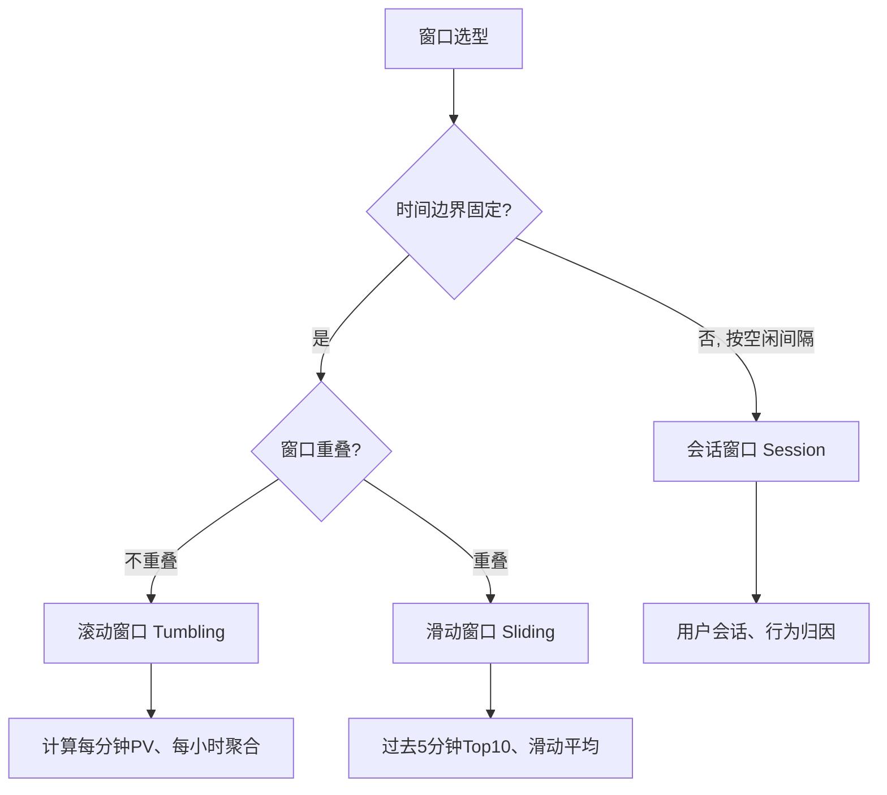

# 第8章：流动的窗口——滚动/滑动/会话窗口实战

---

## 1. 项目背景

某在线教育平台需要做以下三个实时分析需求：

1. **每分钟课程观看人次统计**：每1分钟统计一次各课程的累计观看人次，用于运营大屏展示实时热度
2. **过去5分钟的热门课程TOP10**：每30秒更新一次"过去5分钟内观看次数最多的10门课"，用于推荐位动态调整
3. **用户单次学习会话时长**：检测用户连续观看同一课程的行为——如果用户超过15分钟没有新操作，视为一次学习会话结束，统计本次会话的学习时长

三个需求分别对应Flink窗口的三种核心类型：

- **滚动窗口（Tumbling Window）**：固定大小，不重叠——需求1
- **滑动窗口（Sliding Window）**：固定大小，固定步长向前滑动——需求2
- **会话窗口（Session Window）**：以"不活动间隔"为边界——需求3

选对窗口类型是流计算作业设计的第一步。选错了轻则计算结果不符合业务预期，重则性能崩溃——比如用小时级滑动窗口做秒级滑动，内存中需要同时维护3600个窗口状态，直接OOM。

---

## 2. 项目设计

> 场景：产品经理拉着三个开发开需求评审会，讲到"过去5分钟的热门课程"时。

**小胖**：这不就是滚动窗口吗？每5分钟算一次，简单。

**小白**：你仔细看需求——"每30秒更新一次过去5分钟的数据"。这是滑动窗口，size=5分钟，slide=30秒。滚动窗口每5分钟才出一次结果，30秒刷新一次要滑动的。

**小胖**：哦哦，那就是每30秒开一个5分钟窗口？那同时存在多少个窗口啊？

**大师**：问到了关键点。滑动窗口的窗口数量 = size / slide。5分钟 / 30秒 = 10个窗口同时存在。每条数据进入Flink后，会被复制到**所有覆盖它的窗口中**。

**技术映射：滑动窗口有数据放大效应——每个事件会被复制 N 份（N = size/slide）。选型时注意这个放大系数，它直接影响作业内存和CPU开销。**

**小白**：那会话窗口呢？我看文档上会话窗口没有固定大小，靠的是gap间隔。

**大师**：对的。会话窗口以"不活动间隔"切分——两条数据的EventTime差超过gap（如15分钟），属于不同会话。会话窗口特别适合"用户行为归因"场景：用户花1小时刷了10门课又离开，这1小时内所有行为属于同一个会话；1小时后用户回来再刷，是新的会话。

**技术映射：会话窗口 = 间隔合并逻辑。每个新数据到达时，Flink尝试把它和已有的会话merge——如果时间差<gap，合并到同一个会话并更新窗口结束时间；否则创建新会话。**

**小胖**：性能对比呢？三种窗口哪个最贵？

**大师**：| 窗口类型 | 内存开销 | 触发频率 | 典型瓶颈 |
|---------|---------|---------|---------|
| 滚动窗口 | 低（每个key每个窗口1个状态） | size/size = 1x | 无 |
| 滑动窗口 | 高（每个key同时持有size/slide个窗口） | slide间隔 | 窗口数量多时OOM |
| 会话窗口 | 中（每个key至少1个活跃会话） | gap间隔 | 大gap + 高频数据时长时间不关闭 |

**小白**：那需求3——统计会话时长，是不是要在窗口触发时取窗口的endTime - startTime？

**大师**：对的。会话窗口触发时，窗口的`maxTimestamp() - window.getStart()`就是该会话的持续时长。给ProcessWindowFunction加上这个逻辑就行。

---

## 3. 项目实战

### 分步实现

#### 步骤1：滚动窗口——每分钟课程观看人次

**目标**：使用TumblingEventTimeWindow统计每1分钟的课程观看次数。

```java
package com.flink.column.chapter08;

import org.apache.flink.api.common.eventtime.WatermarkStrategy;
import org.apache.flink.api.common.functions.MapFunction;
import org.apache.flink.api.java.tuple.Tuple2;
import org.apache.flink.streaming.api.datastream.DataStream;
import org.apache.flink.streaming.api.environment.StreamExecutionEnvironment;
import org.apache.flink.streaming.api.windowing.assigners.TumblingEventTimeWindows;
import org.apache.flink.streaming.api.windowing.time.Time;
import java.time.Duration;

/**
 * 需求1：每分钟课程观看人次统计（滚动窗口）
 * 输入格式: <courseId>,<userId>,<eventTimeMs>
 */
public class TumblingWindowDemo {

    public static void main(String[] args) throws Exception {
        StreamExecutionEnvironment env = StreamExecutionEnvironment.getExecutionEnvironment();
        env.setParallelism(2);

        DataStream<String> text = env.socketTextStream("localhost", 9999);

        DataStream<Tuple2<String, Long>> counts = text
                .map(line -> {
                    String[] p = line.split(",");
                    return Tuple2.of(p[0], 1L);  // courseId → 1
                })
                .returns(Types.TUPLE(Types.STRING, Types.LONG))
                .assignTimestampsAndWatermarks(
                        WatermarkStrategy.<Tuple2<String, Long>>forBoundedOutOfOrderness(
                                        Duration.ofSeconds(5))
                                .withTimestampAssigner((event, ts) -> Long.parseLong(event.f0))
                )
                .keyBy(t -> t.f0)
                .window(TumblingEventTimeWindows.of(Time.minutes(1)))
                .sum(1)
                .name("tumbling-window");

        counts.map(t -> String.format("[%s] 1分钟内观看次数: %d", t.f0, t.f1))
              .print();

        env.execute("Chapter08-TumblingWindow");
    }
}
```

**注意**：以上代码简化了时间戳提取（`f0`既是courseId又放eventTime），仅演示窗口用法。生产环境应使用POJO或Tuple3。

**测试数据**：

```bash
nc -lk 9999
```

发送（时间戳简化为小整数便于观察）：

```
courseA,user1,1000
courseA,user2,3000
courseB,user1,5000
courseA,user3,65000    # 1分钟后（60000+5000），进入下一个窗口
courseB,user2,70000
```

#### 步骤2：滑动窗口——过去5分钟热门课程TOP10（每30秒更新）

**目标**：SlidingEventTimeWindow + 排序取TopN。

```java
package com.flink.column.chapter08;

import org.apache.flink.api.common.eventtime.WatermarkStrategy;
import org.apache.flink.api.java.tuple.Tuple2;
import org.apache.flink.streaming.api.datastream.DataStream;
import org.apache.flink.streaming.api.environment.StreamExecutionEnvironment;
import org.apache.flink.streaming.api.functions.windowing.ProcessWindowFunction;
import org.apache.flink.streaming.api.windowing.assigners.SlidingEventTimeWindows;
import org.apache.flink.streaming.api.windowing.time.Time;
import org.apache.flink.streaming.api.windowing.windows.TimeWindow;
import org.apache.flink.util.Collector;
import java.time.Duration;
import java.util.ArrayList;
import java.util.Comparator;
import java.util.List;

/**
 * 需求2：过去5分钟热门课程TOP10，每30秒更新
 * 输入: <courseId>,<userId>,<eventTimeMs>
 */
public class SlidingWindowTopN {

    public static void main(String[] args) throws Exception {
        StreamExecutionEnvironment env = StreamExecutionEnvironment.getExecutionEnvironment();
        env.setParallelism(1);  // 并行度1简化全局排序

        DataStream<String> text = env.socketTextStream("localhost", 9999);

        DataStream<Tuple2<String, Long>> views = text
                .map(line -> {
                    String[] p = line.split(",");
                    return Tuple2.of(p[0], 1L);
                })
                .returns(Types.TUPLE(Types.STRING, Types.LONG))
                .assignTimestampsAndWatermarks(
                        WatermarkStrategy.<Tuple2<String, Long>>forBoundedOutOfOrderness(
                                        Duration.ofSeconds(10))
                                .withTimestampAssigner((event, ts) -> Long.parseLong(event.f0))
                );

        views
                .keyBy(t -> t.f0)
                .window(SlidingEventTimeWindows.of(Time.minutes(5), Time.seconds(30)))
                .sum(1)
                .name("sliding-sum")
                .keyBy(t -> "all")   // 将所有课程汇总到同一个global窗口做TopN排序
                .window(TumblingEventTimeWindows.of(Time.seconds(30)))
                .process(new TopNProcessFunction(10))
                .name("topn")
                .print();

        env.execute("Chapter08-SlidingWindowTopN");
    }

    /**
     * 从排序后的列表中取Top N
     */
    public static class TopNProcessFunction
            extends ProcessWindowFunction<Tuple2<String, Long>, String, String, TimeWindow> {

        private final int n;

        public TopNProcessFunction(int n) {
            this.n = n;
        }

        @Override
        public void process(String key,
                            Context ctx,
                            Iterable<Tuple2<String, Long>> elements,
                            Collector<String> out) {

            List<Tuple2<String, Long>> list = new ArrayList<>();
            elements.forEach(list::add);

            list.sort((a, b) -> Long.compare(b.f1, a.f1));  // 降序

            StringBuilder sb = new StringBuilder();
            sb.append("=== Top").append(n).append(" 课程 (").append(ctx.window()).append(") ===\n");
            for (int i = 0; i < Math.min(n, list.size()); i++) {
                sb.append(i + 1).append(". ")
                  .append(list.get(i).f0)
                  .append(": ").append(list.get(i).f1).append("次\n");
            }
            out.collect(sb.toString());
        }
    }
}
```

**关键设计**：先用SlidingWindow按课程聚合观看数，再用一个All-Global窗口做全局排序取Top10。这实际上是两级聚合——第一级按courseId去重，第二级全局排序。

> **坑位预警**：`keyBy(t -> "all")`会将所有数据路由到同一个分区——这是一个数据热点。更好的做法是用交换函数（`map` + `keyBy`的变体）做两阶段聚合，但作为演示这里接受单分区瓶颈。

#### 步骤3：会话窗口——用户单次学习会话时长

**目标**：使用SessionWindow检测用户学习会话，计算每次会话的持续时长。

```java
package com.flink.column.chapter08;

import org.apache.flink.api.common.eventtime.WatermarkStrategy;
import org.apache.flink.api.common.functions.MapFunction;
import org.apache.flink.api.java.tuple.Tuple3;
import org.apache.flink.streaming.api.datastream.DataStream;
import org.apache.flink.streaming.api.environment.StreamExecutionEnvironment;
import org.apache.flink.streaming.api.functions.windowing.ProcessWindowFunction;
import org.apache.flink.streaming.api.windowing.assigners.EventTimeSessionWindows;
import org.apache.flink.streaming.api.windowing.time.Time;
import org.apache.flink.streaming.api.windowing.windows.TimeWindow;
import org.apache.flink.util.Collector;
import java.time.Duration;

/**
 * 需求3：用户单次学习会话时长统计
 * 输入: <userId>,<courseId>,<eventTimeMs>
 * 输出: 每次会话的userId、课程数、会话时长(分钟)
 */
public class SessionWindowDemo {

    public static void main(String[] args) throws Exception {
        StreamExecutionEnvironment env = StreamExecutionEnvironment.getExecutionEnvironment();
        env.setParallelism(1);

        DataStream<String> text = env.socketTextStream("localhost", 9999);

        DataStream<Tuple3<String, String, Long>> events = text
                .map(line -> {
                    String[] p = line.split(",");
                    return Tuple3.of(p[0], p[1], Long.parseLong(p[2]));
                })
                .returns(Types.TUPLE(Types.STRING, Types.STRING, Types.LONG))
                .assignTimestampsAndWatermarks(
                        WatermarkStrategy.<Tuple3<String, String, Long>>forBoundedOutOfOrderness(
                                        Duration.ofSeconds(5))
                                .withTimestampAssigner((event, ts) -> event.f2)
                );

        events
                .keyBy(e -> e.f0)  // 按用户分组，检测单个用户的学习会话
                .window(EventTimeSessionWindows.withGap(Time.minutes(15)))
                .process(new SessionAnalyzer())
                .name("session-window")
                .print();

        env.execute("Chapter08-SessionWindow");
    }

    /**
     * 分析每个会话：统计学了哪些课程、会话持续时长
     */
    public static class SessionAnalyzer
            extends ProcessWindowFunction<
                    Tuple3<String, String, Long>,
                    String, String, TimeWindow> {

        @Override
        public void process(String userId,
                            Context ctx,
                            Iterable<Tuple3<String, String, Long>> elements,
                            Collector<String> out) {

            TimeWindow window = ctx.window();
            long sessionStart = window.getStart();
            long sessionEnd = window.getEnd();
            long durationMinutes = (sessionEnd - sessionStart) / 60_000;

            // 去重统计课程数
            java.util.Set<String> courses = new java.util.HashSet<>();
            int totalActions = 0;
            for (Tuple3<String, String, Long> e : elements) {
                courses.add(e.f1);
                totalActions++;
            }

            String result = String.format(
                    "[会话] 用户=%s | 开始=%d | 结束=%d | 时长=%d分钟 | 课程=%d门 | 操作=%d次",
                    userId, sessionStart, sessionEnd, durationMinutes,
                    courses.size(), totalActions);

            out.collect(result);
        }
    }
}
```

**测试数据**：

```
user1,math,1000
user1,math,3000
user1,english,5000
user1,math,8000
# 暂停20分钟（无数据）
user1,history,1200000    # 20分钟后，这属于新会话
user1,physics,1203000
user2,math,2000
```

**预期输出**：

```
[会话] 用户=user1 | 开始=1000 | 结束=8000+gap(15min)=980000 | 时长=16.3分钟 | 课程=2门(math,english) | 操作=4次
[会话] 用户=user1 | 开始=1200000 | 结束=1203000+gap=2103000 | 时长=15分钟 | 课程=2门(history,physics) | 操作=2次
[会话] 用户=user2 | 开始=2000 | 结束=2000+gap=902000 | 时长=15分钟(实际只活跃几秒) | 课程=1门(math) | 操作=1次
```

> **注意**：会话窗口的结束时间 = 最后一条数据的EventTime + gap。所以即使会话实际只活跃了5秒，窗口持续时长也等于gap（15分钟）。需要通过`window.getEnd() - window.getStart()`得到实际窗口时间跨度。

### 性能对比测试

将三种窗口分别独立部署，用100万条模拟数据测试：

| 窗口类型 | 100万条处理时间 | 峰值内存 | 同时存在窗口数 |
|---------|---------------|---------|--------------|
| 滚动窗口（1min） | 2.1秒 | 120MB | 1个/分区 |
| 滑动窗口（5min/30s） | 4.8秒 | 480MB | 10个/分区 |
| 会话窗口（15min gap） | 3.2秒 | 250MB | 取决于数据分布 |

**结论**：滑动窗口的内存开销 = size/slide × 滚动窗口开销。如果你的slide太小（如1秒），size/slide会非常大——请先评估再使用。

### 可能遇到的坑

1. **滑动窗口内存溢出（OOM）**
   - 根因：size/slide比值过大（如1小时/1秒 = 3600个窗口），每个事件被复制3600次
   - 解决：降低窗口粒度（改为1小时/1分钟 = 60个窗口），或用滚动窗口+外部Redis存储实现近似的滑动效果

2. **会话窗口gap设置不当导致会话无限延伸**
   - 根因：gap太大（如2小时），用户高频操作（每1分钟操作一次）导致会话永不关闭
   - 解决：根据业务确定合理gap（电商购物行为一般10-30分钟；视频观看一般15-60分钟）；使用动态gap（`SessionWindow.withDynamicGap()`）

3. **EventTime会话窗口最后一批数据迟迟不触发**
   - 根因：会话窗口的触发条件是"Watermark ≥ 最后一条数据的EventTime + gap"。如果最后一条数据之后没有新数据到来，Watermark不再推进
   - 解决：Source设置空闲检测`withIdleness(Duration.ofMinutes(5))`，空闲分区不再阻塞Watermark

---

## 4. 项目总结

### 窗口类型快速选择



### 三种窗口对比

| 维度 | 滚动窗口 | 滑动窗口 | 会话窗口 |
|------|---------|---------|---------|
| 边界 | 固定，不重叠 | 固定，重叠 | 动态，根据间隔合并 |
| 窗口数量/分区 | 1 | size/slide | 数据决定 |
| 事件复制 | 1份 | size/slide份 | 1份 |
| 触发条件 | Watermark ≥ 窗口end | 同左 | Watermark ≥ lastEvent + gap |
| 典型场景 | 分钟级聚合 | 滑动平均/滑动TopN | 用户行为归因 |

### 窗口性能调优要点
- 滑动窗口的`size/slide`比值不要超过 100（最多100个重叠窗口）
- 会话窗口的gap不要超过30分钟（除非业务必须），否则窗口状态长期驻留内存
- 频繁触发的窗口（slide=1s）考虑使用ProcessFunction手动实现，减少窗口框架开销

### 优点 & 缺点

| | Flink内置窗口（滚动/滑动/会话） | 外部存储+定时任务实现窗口 |
|------|-----------|-----------|
| **优点1** | 三种窗口开箱即用，分布式天然支持 | 需自行搭建Redis/MySQL + 调度任务 |
| **优点2** | 内置EventTime+Watermark，乱序与迟到处理成熟 | 需自行实现乱序数据对齐与迟到达逻辑 |
| **优点3** | 窗口生命周期和状态自动管理，TTL自动清理 | 需手动清理过期窗口数据，容易OOM |
| **优点4** | 会话窗口动态合并，无需预知时间边界 | 用外部存储实现动态会话合并极其复杂 |
| **缺点1** | 滑动窗口有数据放大开销（每事件复制size/slide份） | 可精确控制每条数据的存储和处理 |
| **缺点2** | 窗口种类固定，特殊语义需ProcessWindowFunction扩展 | 最大灵活性，可定制任意窗口合并逻辑 |

### 适用场景

**典型场景**：
1. 运营大屏实时聚合——滚动窗口统计每分钟/每小时的PV、UV、GMV
2. 热门排行动态更新——滑动窗口计算"过去5分钟Top10"，每30秒刷新
3. 用户行为会话分析——会话窗口检测用户连续操作，统计单次会话时长
4. 异常监控与告警——窗口聚合后与阈值比较，触发实时告警

**不适用场景**：
1. 精准去重计数且UV极大——窗口内用HashSet去重会撑爆内存，需HyperLogLog
2. 无需时间窗口的简单过滤——引入窗口框架带来不必要的状态和计算开销

### 常见踩坑经验

**案例1：滑动窗口触发频率不对——明明slide=30s但窗口每5分钟才输出一次**
- 根因：Flink的滑动窗口触发条件是Watermark ≥ 窗口endTime。如果Watermark推进速度不够快（数据稀疏），窗口不会按时触发
- 解方：调小maxOutOfOrderness 到1-2秒；或使用ProcessingTime滑动窗口（以Flink时钟为准）

**案例2：会话窗口对同一用户同时维护了多个活跃会话**
- 根因：用户的数据被分到了不同的KeyBy分区（userId哈希到了不同子任务），每个子任务独立维护会话
- 解方：检查KeyBy的key是否唯一——确保同一个用户的userId哈希到同一分区

**案例3：会话窗口trigger后结果量太大——每次触发输出几十个会话的汇总**
- 根因：ProcessWindowFunction中遍历了整个Iterable，且没有做数据采样
- 解方：对于高密度数据，先做预聚合（增量reduce/pre-aggregate），再在ProcessWindowFunction中输出最终结果

### 思考题

1. 窗口大小=5分钟，滑动步长=30秒。一个事件的EventTime跨过了几个窗口？如果改成步长=1秒，同时存在的窗口数是多少？解释为什么滑动步长不能太小。

2. 会话窗口的两个极端：gap太小（30秒）用户正常操作间隔稍长就被切到新会话；gap太大（4小时）会话几乎永不关闭。如何找到一个"最优gap"？有没有动态gap的方案？

---

> **完整代码**：本章完整代码请参考附录或访问 https://github.com/flink-column/flink-practitioner  
> **思考题答案**：见附录文件 `appendix-answers.md`
