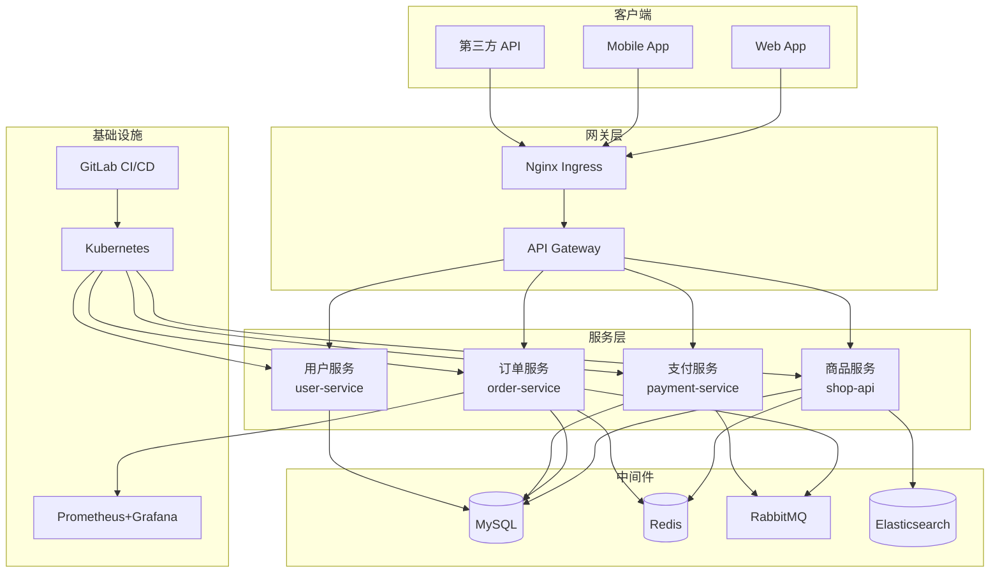
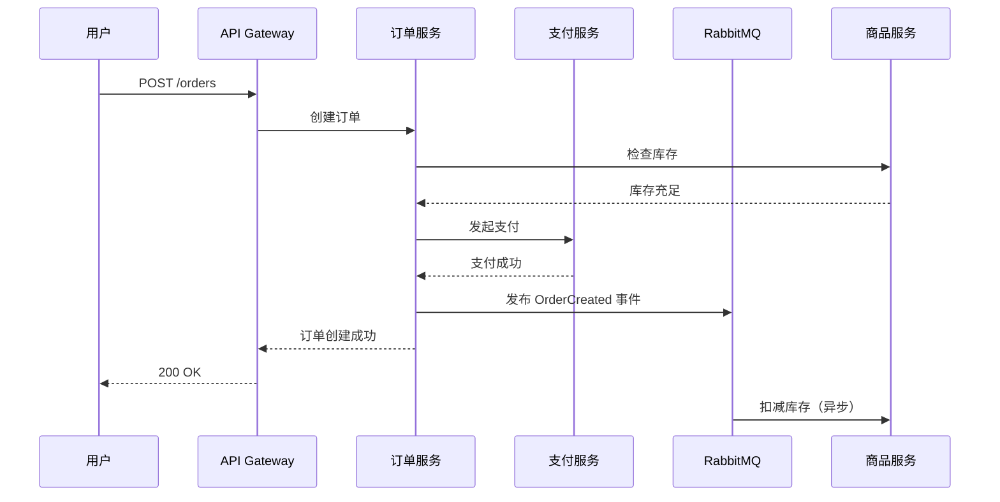
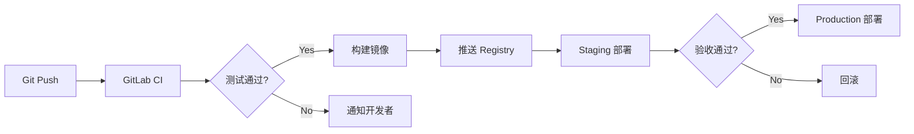

# 第8章：Wiki 与文档协作

## 1. 项目背景

> **业务场景**：一家 100 人的技术团队，项目文档散落在各个角落——有的在 Confluence，有的在飞书文档，有的在开发者本地 Markdown 文件里，还有的口口相传（俗称"人肉文档"）。新人入职至少要花两周才能搞清楚代码结构，因为所有架构文档要么过时要么压根就没有。

有一次线上故障，值班的运维想要找到支付服务的数据库 schema 来定位问题，结果发现：
- Confluence 上的架构图是两年前的，数据库已增加了 5 张新表
- 飞书文档里的 API 文档只写了创建接口，没写更新和删除
- 本地 Markdown 的最新版本在某个已离职开发者的电脑上
- 最后只能直接查数据库的 `information_schema`，耗时 1 小时才找到问题字段

CTO 拍板："所有技术文档必须和代码放在一起，至少要做到文档的版本和代码的版本一致。"

**痛点放大**：文档的痛苦不在于"写"，而在于"维护"。传统的文档工具（Confluence、语雀、飞书文档）与代码仓库分离，文档更新没有和代码提交绑定，时间一长就变成"僵尸文档"。GitLab Wiki 的核心价值是：Wiki 本身就是一个 Git 仓库——你可以 clone 到本地编辑，可以在 MR 中 review 文档变更，可以用 CI 自动部署为 Pages 站点。文档就是代码，代码就是文档。

## 2. 项目设计——剧本式交锋对话

**场景**：新人入职第三天的晨会，小陈还在翻找各种文档。

---

**小胖**："小陈你入职三天了还没搞清楚项目结构？我们又不是没有文档，Wiki 上不是有吗？"

**小陈**（新人）："Wiki 上那个'系统架构'页面最后更新是 2024 年 3 月，但是 git log 显示今年 1 月做了一次大的微服务拆分……我不知道该信哪个。"

**小白**："这就是传统 Wiki 的通病——文档更新不跟代码走。GitLab Wiki 跟代码仓库是分离的，但它有个隐藏特性：Wiki 本身也是一个 Git 仓库。你可以 `git clone` Wiki 下来，在本地用你熟悉的编辑器修改，然后 `git push` 回去。"

**大师**："小陈的痛点很真实。文档的关键不在于写得有多详细，而在于'当你读到它的时候，它是否仍然准确'。技术映射——传统 Wiki 就像贴在公司墙上的海报，贴上去就没人管；GitLab Wiki + Git 工作流就像代码仓库，有 version history、有 blame、有 MR review，你能看到谁在什么时候改了什么。"

**小胖**："那如果我想画架构图呢？Markdown 能画图吗？"

**大师**："GitLab 的 Markdown 支持 Mermaid 语法，可以直接在 Markdown 中写架构图、时序图、流程图——而且是纯文本，可以 diff，可以 review。不需要截图贴到文档里。"

**小白**："说到 Mermaid，我之前在 Confluence 画架构图用的是 draw.io，截图贴上去的。过几周发现少了几个组件，但谁能记得更新截图？Mermaid 的优势就是——修改架构图就是修改几行代码，和代码一样走 MR 流程。"

**大师**："还有一个高级用法——GitLab Pages。你可以用 CI 把 Wiki 内容自动构建成一个静态文档站点，配置自定义域名和 HTTPS。这样你的文档既有版本管理（Git），又有优雅的阅读体验（网页），还有自动化发布（CI）。"

**小陈**："那如果我需要写 API 文档呢？Swagger 那种？"

**大师**："API 文档建议用代码注释 + OpenAPI/Swagger 规范生成，但作为'API 使用指南'层面的文档——比如认证方式、限流策略、常见错误码——这些放在 Wiki 里最合适，因为它们是给人读的，而不是给机器解析的。"

---

## 3. 项目实战

### 环境准备

> **目标**：搭建一个团队 Wiki，包含系统架构图（Mermaid）、API 文档、新人入职指南，并克隆到本地编辑。

**前置条件**：GitLab 项目（参考第4章），有 Developer 以上权限。

### 分步实现

#### 步骤1：创建 Wiki 首页与目录结构

**目标**：通过 GitLab UI 和 Git 命令行两种方式创建 Wiki 页面。

**通过 GitLab UI 创建**：

```
项目 → Wiki → "Create your first page"
```

**首页内容（Home.md）**：

```markdown
# 电商平台技术文档

> 最后更新：2026-05-12 | 维护团队：基础架构组

## 快速导航

### 🏗 系统架构
- [系统架构全景图](architecture)
- [微服务拆分方案](microservices)
- [数据库设计](database-schema)

### 🔌 API 接口
- [API 认证方式](api-auth)
- [接口限流策略](api-rate-limit)
- [常见错误码](api-error-codes)

### 📋 开发指南
- [新人入职指南](onboarding)
- [代码规范](coding-standards)
- [Git 工作流](git-workflow)

### 🚀 部署运维
- [环境说明](environments)
- [发布流程](release-process)
- [故障排查手册](troubleshooting)

## 如何贡献

本文档使用 GitLab Wiki 管理，你可以：
1. 直接在 GitLab UI 上编辑（页面右上角 "Edit" 按钮）
2. 克隆到本地编辑：
   ```bash
   git clone http://gitlab.local:8929/acme-corp/ecommerce/shop-api.wiki.git
   ```
3. 在 Slack #tech-docs 频道讨论文档改进
```

**克隆 Wiki 到本地编辑**：

```bash
# 每个 GitLab 项目的 Wiki 都是一个独立的 Git 仓库
# URL 格式：<project-url>.wiki.git
git clone http://gitlab.local:8929/acme-corp/ecommerce/shop-api.wiki.git
cd shop-api.wiki

# 查看当前 Wiki 的文件结构
ls -la
# home.md     ← 首页
# _sidebar.md ← 侧边栏（如有）

# Wiki 支持子目录组织
mkdir -p architecture api dev-guide ops

# 在本地创建新页面
cat > architecture/microservices.md << 'EOF'
# 微服务拆分方案

## 当前架构

| 服务名称 | 职责 | 技术栈 | 负责人 |
|---------|------|--------|--------|
| shop-api | 商品管理 | Node.js 20 | 张三 |
| order-service | 订单处理 | Go 1.21 | 李四 |
| payment-service | 支付对接 | Java 17 | 王五 |

## 服务间通信

- **同步调用**：gRPC（order-service → payment-service）
- **异步消息**：RabbitMQ（shop-api → order-service）
- **事件总线**：内部 Event Bus（跨服务通知）
EOF

# 提交并推送
git add .
git commit -m "docs: add microservices architecture page"
git push origin main
```

#### 步骤2：使用 Mermaid 绘制架构图

**目标**：在 Markdown 中嵌入 Mermaid 图表，实现"代码即图表"。

**创建架构全景图页面**：

```bash
cat > architecture/system-architecture.md << 'EOF'
# 系统架构全景图

## 整体架构



## 订单处理时序图



## 部署流水线



> 📝 架构图修改后需要更新此文档。Mermaid 语法参考：[Mermaid Docs](https://mermaid.js.org/)
EOF

git add architecture/system-architecture.md
git commit -m "docs: add system architecture diagram with Mermaid"
git push origin main
```

#### 步骤3：配置 Wiki 侧边栏和自定义样式

**目标**：创建 `_sidebar.md` 来组织导航结构。

```bash
# 创建侧边栏文件（_sidebar.md 是特殊文件名）
cat > _sidebar.md << 'EOF'
## 📚 电商平台文档

### 系统架构
- [架构全景图](architecture/system-architecture)
- [微服务拆分](architecture/microservices)
- [数据库设计](database-schema)

### API 接口
- [认证方式](api/api-auth)
- [限流策略](api/api-rate-limit)
- [错误码](api/api-error-codes)

### 开发指南
- [新人入职](dev-guide/onboarding)
- [代码规范](dev-guide/coding-standards)
- [Git 工作流](dev-guide/git-workflow)

### 部署运维
- [环境说明](ops/environments)
- [发布流程](ops/release-process)
- [故障排查](ops/troubleshooting)
EOF

# 创建页脚文件（_footer.md）
cat > _footer.md << 'EOF'
---
> 如有文档问题，请提 Issue 或在 Slack #tech-docs 频道反馈。
> 维护团队：基础架构组 | 最后更新：2026-05
EOF

git add _sidebar.md _footer.md
git commit -m "docs: add sidebar navigation and footer"
git push origin main
```

#### 步骤4：新人入职指南实战

**目标**：编写一份完整的新人入职指南，涵盖环境搭建、项目克隆到第一个 commit。

```bash
cat > dev-guide/onboarding.md << 'EOF'
# 新人入职指南 🚀

> 欢迎加入电商平台团队！本文档帮你在一小时内完成开发环境搭建并提交第一个 MR。

## 第一步：环境准备（15 分钟）

### 必须安装的工具

| 工具 | 版本 | 安装方式 | 验证命令 |
|------|------|---------|---------|
| Git | ≥2.40 | `brew install git` / `winget install Git.Git` | `git --version` |
| Node.js | 20 LTS | `nvm install 20` / 官网下载 | `node -v` |
| Docker | 24+ | Docker Desktop | `docker --version` |
| VS Code | 最新版 | [官网下载](https://code.visualstudio.com) | `code --version` |

### 配置 Git

```bash
git config --global user.name "你的姓名"
git config --global user.email "your-email@company.com"
git config --global pull.rebase true  # 避免多余 merge commit
```

### 配置 GitLab SSH（可选但推荐）

```bash
# 生成 SSH 密钥
ssh-keygen -t ed25519 -C "your-email@company.com"

# 添加到 GitLab：Settings → SSH Keys
cat ~/.ssh/id_ed25519.pub
```

## 第二步：克隆项目（5 分钟）

```bash
# 主仓库
git clone git@gitlab.local:acme-corp/ecommerce/shop-api.git
cd shop-api

# 安装依赖
npm ci

# 启动本地开发服务
npm run dev
# 访问 http://localhost:3000/api/health 确认服务正常
```

## 第三步：提交第一个 MR（40 分钟）

1. **选择 Issue**：在 [Issue Board](https://gitlab.local/acme-corp/ecommerce/shop-api/-/boards) 找一个 `~good-first-issue` 标签的任务
2. **创建分支**：`git checkout -b feature/<issue-id>-<short-desc>`
3. **编写代码 + 测试**
4. **提交**：遵循 [Conventional Commits](https://www.conventionalcommits.org/) 规范
5. **创建 MR**：见 [MR 流程](dev-guide/mr-process)

## 需要帮助？

- 技术问题：Slack #team-dev
- 文档问题：提 MR 修改本文档
- 环境问题：找 @devops-support
EOF

git add dev-guide/onboarding.md
git commit -m "docs: add comprehensive onboarding guide"
git push origin main
```

### 完整代码清单

- `home.md`：Wiki 首页
- `_sidebar.md`：侧边栏导航
- `_footer.md`：页脚
- `architecture/system-architecture.md`：架构全景图（Mermaid）
- `architecture/microservices.md`：微服务方案
- `dev-guide/onboarding.md`：新人入职指南

### 测试验证

```bash
# 验证1：Wiki 页面可访问
curl -s http://gitlab.local:8929/acme-corp/ecommerce/shop-api/-/wikis/home | grep -o "<title>.*</title>"

# 验证2：Clone Wiki 并验证内容
git clone http://gitlab.local:8929/acme-corp/ecommerce/shop-api.wiki.git /tmp/wiki-test
ls /tmp/wiki-test/
grep "新人入职指南" /tmp/wiki-test/dev-guide/onboarding.md

# 验证3：Mermaid 图表在 GitLab UI 中正确渲染
# 访问 http://gitlab.local:8929/.../wikis/architecture/system-architecture
# 确认架构图和时序图正常显示
```

## 4. 项目总结

### 优点 & 缺点

| 维度 | 优点 | 缺点 |
|------|------|------|
| 版本管理 | Wiki 即 Git 仓库，有 commit 历史、blame、diff | 纯 Markdown，不支持富文本表格的拖拽操作 |
| 协作 | 支持 MR review，文档修改也可以走 Code Review 流程 | 多人同时编辑同一页面没有实时协同（需手动 merge） |
| 图表 | Mermaid 纯文本图表，版本可追踪 | 复杂图表（如 UI 原型）不如 draw.io |
| 发布 | 可通过 CI + Pages 发布为静态站点 | 外观定制能力有限 |

### 适用场景

- **技术文档**：架构设计、API 规范、数据库 Schema、运维手册——版本敏感型文档
- **新人指南**：环境搭建、代码规范——需要随项目演进持续更新的文档
- **知识沉淀**：故障复盘报告、技术调研、设计决策记录（ADR）

**不适用场景**：
- 产品需求文档（需要跨部门协作、审批流程，建议用专业工具）
- 高度格式化的内容（如复杂表格、多级嵌套列表，Markdown 表达能力有限）

### 注意事项

- **Wiki 是独立仓库**：删除项目不会自动删除 Wiki，备份项目时需要单独备份 Wiki
- **Mermaid 语法在不同平台有差异**：GitLab 支持大部分 Mermaid 语法，但某些复杂图表可能在本地渲染不一致
- **权限**：Wiki 的可见性跟随项目，Private 项目的 Wiki 也只有项目成员可见

### 常见踩坑经验

1. **Wiki 首页用 home.md 而不是 README.md**：GitLab Wiki 的首页固定是 `home.md`，创建 `README.md` 不会自动显示。根因：不熟悉 Wiki 的命名约定。解决：始终用 `home.md` 作为首页。
2. **侧边栏不显示**：创建了 `_sidebar.md` 但 Wiki 页面侧边栏没变化。根因：`_sidebar.md` 必须在 Wiki 根目录，且文件名必须完全匹配（带下划线前缀）。解决：确认文件路径为 `<wiki-root>/_sidebar.md`。
3. **Mermaid 图表空白**：在 GitLab Wiki 中写 Mermaid 代码块但页面显示为空。根因：Mermaid 代码块的开头必须是 ` ```mermaid`（小写），不能是 ` ```Mermaid` 或 ` ```MERMAID`。解决：严格使用小写 `mermaid`。

### 思考题

1. 如果一个项目的 Wiki 有 50+ 个页面，现在需要做一次大规模文档重构（重新组织目录结构），如何用 Git 操作高效完成？具体步骤是什么？
2. GitLab Pages 可以将 Wiki 发布为静态站点。请设计一个 CI 流水线，在每次 Wiki 有新 commit 时自动构建并部署到 Pages。

> 答案见附录 D。

### 推广计划提示

- **开发**：Wiki 即代码——用 MR 流程 review 文档变更和 review 代码一样重要
- **运维**：故障排查手册和 on-call 指南放在 Wiki 上，确保值班人员随时可访问
- **测试**：测试用例和验收标准文档可以放在 Wiki，通过 Page History 追踪变更
