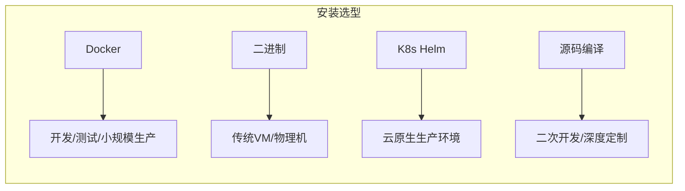

# 第2章：安装部署与初体验

## 1. 项目背景

"这个工具到底怎么装？Docker、二进制、Kubernetes、Helm……光安装方式就有四五种！"小张刚从运维转开发，接到的第一个任务就是在本地搭建一套Grafana环境做技术预研，"而且装完了也不知道对不对，连个验收标准都没有。"

小张遇到的问题非常有代表性。Grafana作为一款Go编写的前后端分离应用，官方提供了几乎全平台的安装方式，但每种方式都有各自的适用场景和坑点。Docker单机部署最快但不适合生产持久化，二进制部署灵活但需要手工管理systemd，Kubernetes部署强依赖但对环境要求高。

更关键的是，安装只是第一步。Grafana默认绑定3000端口，首次登录后有一系列初始化操作：设置密码、配置数据源、导入Dashboard。很多人在这一步就会走偏——要么所有配置都走UI点点点导致无法版本管理，要么遗漏了关键配置文件grafana.ini中的核心参数（如domain、root_url），后续接入SSO时就抓瞎了。



本章将以"5分钟跑起来，10分钟理解透"为目标，通过三种主流安装方式的对比实战，让你不仅能装好Grafana，还能清楚为什么这样装，装完第一步该做什么，以及配置文件里那些容易被忽略的关键参数。

## 2. 项目设计

**小胖**（抱着一台旧笔记本）：大师救命！我照官网教程用Docker装Grafana，跑是跑起来了，但重启电脑后Dashboard全没了！这不就跟玩网游没存档就关机一样吗？

**大师**（笑着摇头）：你这属于经典的"Docker未挂载数据卷"事故。Docker容器默认是无状态的，容器销毁数据就消失。解决方法是把`/var/lib/grafana`目录挂载到宿主机。不过你这个问题，正好引出一个更根本的问题——Grafana到底有哪些安装方式，各有什么优劣？

**小白**（打开笔记本准备记）：我先梳理一下。Docker适合快速验证，Kubernetes适合生产，二进制适合传统运维，源码编译适合深度定制？

**大师**：没错。但我再补充几个细节。Docker虽然简单，但官方镜像有两个Tag要注意：`grafana/grafana`完整版（包含所有内置插件），`grafana/grafana-oss`纯净版（AGPLv3开源版本）。如果你用的是企业版功能（如报表、LDAP高级映射），就要用带Enterprise标签的。

**小胖**：那这些安装方式，配置文件grafana.ini怎么管理？我看这个文件好几百行，都是注释，哪些是关键参数？

**大师**：好问题！grafana.ini有十几个section，但刚上手你只需要关心几个：

**小胖**（举手插嘴）：等等，"section"是什么？又是新名词？

**大师**：sorry，就是配置文件里的`[server]`、`[database]`这种用方括号括起来的部分，每个section下有多条key=value配置。最核心的section就三个：

`[server]`段里的`http_port`（端口号，默认3000）、`domain`（域名，涉及cookie作用域，设错会导致登录循环）、`root_url`（完整URL，影响OAuth回调、邮件链接等）。

`[database]`段里的`type`（默认sqlite3，生产环境强烈建议改成mysql或postgres）、`host`、`name`、`user`、`password`。

`[security]`段里的`admin_user`、`admin_password`、`secret_key`（用于加密session和cookie，多实例部署必须统一）、`disable_gravatar`。

**小白**（皱眉头）：那Grafana的数据到底存在哪里？SQLite和PostgreSQL有什么实际差异？

**大师**：这就涉及到Grafana的持久化设计。Dashboard、DataSource、用户信息、告警规则、组织设置全都存在数据库里。SQLite是默认选择，零配置但并发能力弱，多副本高可用场景下SQLite直接不可用——因为每个Grafana实例各有一个SQLite文件，数据不同步。

而换成PostgreSQL或MySQL后，多个Grafana实例可以连接同一个数据库，加上Redis做Session共享，就实现了真正的无状态水平扩展。

**小胖**（掰着手指）：所以正确的步骤是：1.确定安装方式 2.配好数据库 3.调好grafana.ini 4.启动。对吧？

**大师**：90分！还差一步——验证安装是否健康。`/api/health`端点返回OK表示服务正常，`/metrics`端点暴露Grafana自身的监控指标。

**技术映射**：Docker挂载卷 = 租房签合同（不挂卷=住酒店退房就没了），外部数据库 = 云盘（多设备共享数据），grafana.ini = 系统设置（决定应用的行为边界）。

## 3. 项目实战

**环境准备**

| 组件 | 版本 | 说明 |
|------|------|------|
| Docker | 24.x+ | 方案A的核心依赖 |
| Docker Compose | 2.x+ | 多服务编排 |
| Grafana | 11.0.0 | 目标软件 |
| PostgreSQL | 16.x | 生产级数据库 |

### 方案A：Docker Compose部署（推荐实战方案）

```yaml
# docker-compose.yml
version: '3.8'
services:
  postgres:
    image: postgres:16-alpine
    container_name: grafana-db
    environment:
      POSTGRES_DB: grafana
      POSTGRES_USER: grafana
      POSTGRES_PASSWORD: grafana_secret
    volumes:
      - postgres_data:/var/lib/postgresql/data
    ports:
      - "5432:5432"
    healthcheck:
      test: ["CMD-SHELL", "pg_isready -U grafana"]
      interval: 5s
      timeout: 5s
      retries: 5

  grafana:
    image: grafana/grafana:11.0.0
    container_name: grafana
    environment:
      - GF_SECURITY_ADMIN_USER=admin
      - GF_SECURITY_ADMIN_PASSWORD=admin123
      - GF_DATABASE_TYPE=postgres
      - GF_DATABASE_HOST=postgres:5432
      - GF_DATABASE_NAME=grafana
      - GF_DATABASE_USER=grafana
      - GF_DATABASE_PASSWORD=grafana_secret
      - GF_SERVER_ROOT_URL=http://localhost:3000
      - GF_LOG_LEVEL=info
      - GF_LOG_MODE=console
      - GF_SERVER_ENFORCE_DOMAIN=false
    ports:
      - "3000:3000"
    volumes:
      - grafana_data:/var/lib/grafana
      - ./provisioning:/etc/grafana/provisioning
    depends_on:
      postgres:
        condition: service_healthy

volumes:
  postgres_data:
  grafana_data:
```

启动命令：
```bash
docker compose up -d
docker compose logs -f grafana  # 观察启动日志
```

验证安装：
```bash
# 健康检查
curl -s http://localhost:3000/api/health | jq
# 预期输出：{"commit":"xxx","database":"ok","version":"11.0.0"}

# 查看Grafana自身监控指标
curl -s http://localhost:3000/metrics | head -20
```

### 方案B：二进制部署（传统环境）

```bash
# CentOS/RHEL
sudo tee /etc/yum.repos.d/grafana.repo <<EOF
[grafana]
name=grafana
baseurl=https://rpm.grafana.com
repo_gpgcheck=1
enabled=1
gpgcheck=1
gpgkey=https://rpm.grafana.com/gpg.key
sslverify=1
sslcacert=/etc/pki/tls/certs/ca-bundle.crt
EOF
sudo yum install -y grafana

# 配置PostgreSQL数据库
sudo vim /etc/grafana/grafana.ini
# 修改 [database] 段：
# type = postgres
# host = 127.0.0.1:5432
# name = grafana
# user = grafana
# password = grafana_secret

# 启动并设置开机自启
sudo systemctl daemon-reload
sudo systemctl start grafana-server
sudo systemctl enable grafana-server
sudo systemctl status grafana-server
```

### 方案C：Kubernetes Helm部署

```bash
helm repo add grafana https://grafana.github.io/helm-charts
helm repo update

# 创建values.yaml
cat > grafana-values.yaml <<EOF
adminPassword: admin123
datasources:
  datasources.yaml:
    apiVersion: 1
    datasources:
    - name: Prometheus
      type: prometheus
      url: http://prometheus-server.monitoring.svc.cluster.local
      access: proxy
      isDefault: true
persistence:
  enabled: true
  size: 10Gi
service:
  type: LoadBalancer
  port: 80
EOF

helm install grafana grafana/grafana -f grafana-values.yaml --namespace monitoring
```

### 安装后的第一组关键操作

**1. 进入Dashboard管理界面**

登录后左侧菜单依次探索：
- Home → 默认首页Dashboard
- Starred → 可收藏常用Dashboard
- Dashboards → 新建/管理所有Dashboard
- Connections → 管理数据源和插件
- Alerting → 告警规则管理
- Administration → 用户、组织、配置

**2. grafana.ini关键参数速查**

| 参数 | 默认值 | 建议 | 说明 |
|------|--------|------|------|
| `[server].http_port` | 3000 | 按需 | 端口冲突时修改 |
| `[server].domain` | localhost | 真实域名 | 影响cookie域 |
| `[server].root_url` | %(protocol)s://%(domain)s:%(http_port)s/ | https://grafana.example.com/ | 影响OAuth回调和邮件链接 |
| `[server].enforce_domain` | false | 生产环境true | 防止Host头攻击 |
| `[database].type` | sqlite3 | postgres或mysql | 生产环境必改 |
| `[database].max_open_conn` | 100 | 根据负载调整 | 数据库连接池上限 |
| `[security].secret_key` | 随机值 | 所有副本统一 | 多副本部署反斜杠 |
| `[security].cookie_secure` | false | 生产环境true | HTTPS下必须开启 |
| `[users].allow_sign_up` | true | false | 禁止自行注册 |
| `[auth].disable_login_form` | false | OAuth启用时true | 隐藏登录表单 |

**3. 数据持久化验证**

停止并删除Grafana容器，重新启动后检查Dashboard是否还存在：
```bash
docker compose down
docker compose up -d
# 检查之前创建的Dashboard是否还在
```

### 常见坑点

1. **Docker容器内localhost问题**：容器内`localhost`指向容器自身，不可访问宿主机或其他容器的服务。必须使用`host.docker.internal`（host网络模式）或Docker服务名。
2. **PostgreSQL权限不足**：Grafana默认会自动创建表，但需要数据库用户具备CREATE TABLE权限。
3. **时区问题**：Grafana默认使用UTC时间，需要设置`GF_DEFAULT_TIMEZONE=Asia/Shanghai`或在grafana.ini中配置。
4. **内存不足**：Grafana默认JVM-like内存管理，建议给容器至少512MB内存。
5. **信号处理**：二进制部署时，`systemctl stop grafana-server`发送SIGTERM，Grafana需要3-10秒完成优雅关闭。

## 4. 项目总结

**优点 & 缺点**

| 安装方式 | 优点 | 缺点 | 适用场景 |
|----------|------|------|---------|
| Docker Compose | 一条命令搞定，环境一致 | 数据持久化需额外配置 | 开发、测试、小型生产 |
| 二进制包 | 资源占用低，systemd管理 | 依赖管理手动处理 | 传统运维环境 |
| Kubernetes Helm | 声明式配置，自动恢复 | 集群依赖，门槛高 | 云原生生产环境 |

**适用场景**
1. 个人开发者学习：Docker Compose，5分钟搭建
2. 小型团队（<10人）：Docker Compose + 外部PostgreSQL
3. 中型企业（10-100人）：K8s Helm + 外部数据库 + Redis缓存
4. 大型企业（>100人）：多实例集群 + CDN + 读写分离
5. 边缘/嵌入场景：二进制部署，资源占用可控

**注意事项**
1. `secret_key`是所有加密操作的根基，多副本部署必须一致，泄露后用户需重新登录
2. SQLite数据库文件需定期备份，且不支持并发写入
3. `root_url`配错会导致OAuth登录后无限重定向
4. Helm chart默认不开启持久化，生产环境必须启用PVC
5. 如果在反向代理（Nginx/ALB）后面，需要正确设置`X-Forwarded-*`头

**常见踩坑经验**
1. **Docker重启丢失数据**：没有挂载`/var/lib/grafana`，容器删除后Dashboard全丢。根因：对Docker有状态服务机制不了解。
2. **多副本Dashboard不一致**：使用SQLite且没有共享存储，每个副本各自维护数据。根因：SQLite不适合多写入场景。
3. **登录页无限重定向**：`root_url`配置为HTTP但HTTPS通过反向代理终止，cookie_secure=true导致。根因：代理协议配置不一致。

**思考题**
1. 如果需要在3台服务器上部署Grafana高可用集群，每台服务器上运行一个Grafana实例，需要哪些基础设施组件？
2. Docker Compose启动Grafana后，如何在不重启容器的情况下修改grafana.ini的某个配置？
