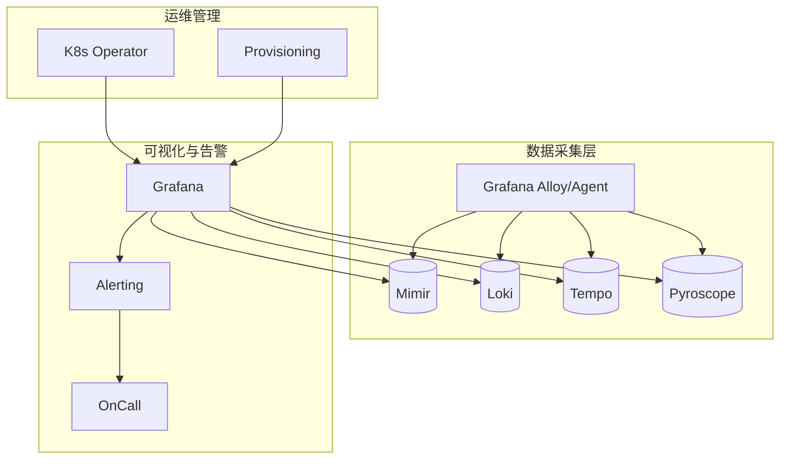

# 第31章：【中级篇综合实战】微服务全栈可观测性平台

## 1. 项目背景

"50+微服务、每日新增200GB日志、Prometheus采集300万条活跃Series、每天发生约30次服务间调用超时。现在排查一个线上问题平均需要30分钟——打开4个工具、看10个Dashboard、查3种查询语言。老板说MTTR必须降到5分钟以内。"

这是典型的中型企业可观测性建设中期困境——数据有了、工具也有了，但信息孤岛严重，同一个问题的排查需要在Metrics/Logs/Traces之间来回切换复制粘贴TraceID。目标不是"更多数据"，而是"更快的根因定位"。

本章将运用第17-30章所学的中级篇全部知识，整合Prometheus、Grafana、Loki、Tempo、Pyroscope、Mimir和Alerting，搭建一套"5分钟内从告警到根因"的全栈可观测性平台。从架构设计到验收标准，完成一次端到端的平台级交付。

## 2. 项目设计

**小胖**（兴奋又紧张）：大师，中级篇我学完了——Loki、Tempo、Mimir、Pyroscope、OnCall、SLO、HA、K8s Operator……学的时候觉得每个都能用，但真要搭一个完整平台，感觉无从下手。

**大师**：正常。现在需要把这些模块像乐高一样拼起来。我给你一个平台架构蓝图：



**核心设计原则**：

1. **一个Agent采集所有**：用Grafana Alloy替代多个Agent（Promtail、OTel Collector、Prometheus Agent）

2. **统一标签体系**：所有数据（Metrics/Logs/Traces/Profiles）共享`service`、`env`、`cluster`标签

3. **Exemplar关联**：TraceID贯穿Prometheus Metrics → Loki Logs → Tempo Traces

4. **三层Dashboard**：总览→服务→详情，按第16章规范设计

5. **SLO驱动告警**：不铺天盖地设告警规则，只设核心服务的SLO告警

**小白**：验收标准怎么定？

**大师**：量化目标——MTTR（平均修复时间）从30分钟降到5分钟。这不是一个工具能做到的，需要整个流程优化：告警触发→通知值班→打开Dashboard→Metric发现异常→点Exemplar跳到Trace→Trace定位Span→Span关联Log→Log给出根因。

## 3. 项目实战

**步骤一：数据采集层——Alloy统一接入**

Grafana Alloy配置文件（替代Promtail + OTel Collector）：

```hcl
// alloy-config.river
prometheus.scrape "kubernetes" {
  targets = discovery.kubernetes.pods.targets
  forward_to = [prometheus.remote_write.mimir.receiver]
}

prometheus.remote_write "mimir" {
  endpoint {
    url = "http://mimir:9009/api/v1/push"
  }
}

loki.source.kubernetes "pods" {
  targets = discovery.kubernetes.pods.targets
  forward_to = [loki.write.default.receiver]
}

loki.write "default" {
  endpoint {
    url = "http://loki:3100/loki/api/v1/push"
  }
}

otelcol.receiver.otlp "default" {
  grpc {}
  http {}
  output {
    traces  = [otelcol.exporter.otlp.tempo.input]
  }
}

otelcol.exporter.otlp "tempo" {
  client {
    endpoint = "tempo:4317"
    tls { insecure = true }
  }
}

pyroscope.write "default" {
  endpoint {
    url = "http://pyroscope:4040"
  }
}
```

**步骤二：统一标签设计**

在所有采集组件中统一打标：

```yaml
# 全局标签
labels:
  env: "production"
  cluster: "primary"
  region: "cn-north-1"
  team: "core-platform"

# 在应用中注入
# OpenTelemetry：
resource:
  attributes:
    service.name: "order-service"
    service.namespace: "ecommerce"
    service.version: "v3.4.0"
    
# Prometheus：
external_labels:
  service: "order-service"
  env: "production"
```

**步骤三：Dashboard三层架构落地**

**总览Dashboard（1个）**：
- 所有核心服务的SLO状态（Gauge：SLI当前值 vs 目标值）
- 全局QPS/错误率/P99延迟聚合
- 日志ERROR速率趋势
- 活跃告警列表

**服务Dashboard（50个，变量模板复用）**：
```promql
# RED指标（从Prometheus Metrics或Span Metrics获取）
sum(rate(http_requests_total{service=~"$service"}[5m])) by (service)
histogram_quantile(0.99, sum(rate(http_request_duration_seconds_bucket{service=~"$service"}[5m])) by (le))

# 日志面板（从Loki获取）
{service=~"$service"} |= "ERROR" | rate [5m]

# Trace摘要（从Tempo Span Metrics获取）
{ resource.service.name = "$service" } | rate() by (status)
```

**详情Dashboard（按需打开，每个服务一个）**：

从服务Dashboard中任何面板点击Data Link → 跳转到详情Dashboard，携带变量`${service}`和`${__from}`。

**步骤四：Exemplar三柱联动**

在应用HTTP中间件统一注入TraceID：

```go
// 中间件伪代码
func TracingMiddleware(next http.Handler) http.Handler {
    return http.HandlerFunc(func(w http.ResponseWriter, r *http.Request) {
        // 1. 从Header提取或创建TraceID
        traceID := r.Header.Get("traceparent")
        if traceID == "" {
            traceID = generateTraceID()
        }
        
        // 2. 注入到Context
        ctx := context.WithValue(r.Context(), "trace_id", traceID)
        
        // 3. 注入到日志
        log.WithField("trace_id", traceID).Info("request started")
        
        // 4. 注入到Prometheus Exemplar
        timer := prometheus.NewTimer(httpDuration.WithLabelValues(...))
        defer timer.ObserveDurationWithExemplar(
            prometheus.Labels{"trace_id": traceID},
        )
        
        // 5. 注入到响应Header（传播给下游）
        w.Header().Set("X-Trace-Id", traceID)
        
        next.ServeHTTP(w, r.WithContext(ctx))
    })
}
```

配置Grafana数据源间关联关系：

**Prometheus → Tempo**：
Prometheus DS Settings → Exemplars → Add → Tempo → 
- Label: `trace_id`
- URL: `$${__value.raw}`

**Tempo → Loki**：
Tempo DS Settings → Trace to logs → Loki → 
- Tag: `trace_id`
- Query: `{${__tags}}`

验证联动：
在Grafana Explore中查询Prometheus指标`http_request_duration_seconds` → Time series中出现蓝色Exemplar点 → 点击 → 跳转到Tempo查看完整Trace → 在Span上点击"Logs for this span" → 跳转到Loki查看该Span期间的日志。

**步骤五：SLO驱动的告警体系**

只为关键服务设SLO告警（避免告警泛滥）：

```yaml
# 5个核心服务的SLO
services:
  - order-service:   availability 99.95%, latency P99 < 500ms
  - payment-service: availability 99.99%, latency P99 < 200ms  
  - user-service:    availability 99.9%, latency P99 < 300ms
  - inventory-service: availability 99.9%, latency P99 < 100ms
  - notification-service: availability 99.5%, latency P99 < 1000ms
```

每个服务配置Multi-window Burn Rate告警（见第28章），通过OnCall分发（见第29章）。

**步骤六：平台化运维**

```bash
# 一键部署脚本
#!/bin/bash
# deploy-observability.sh

echo "[1/6] Deploying Mimir..."
helm upgrade --install mimir grafana/mimir-distributed -n monitoring

echo "[2/6] Deploying Loki..."
helm upgrade --install loki grafana/loki -n monitoring

echo "[3/6] Deploying Tempo..."
helm upgrade --install tempo grafana/tempo -n monitoring

echo "[4/6] Deploying Pyroscope..."
helm upgrade --install pyroscope grafana/pyroscope -n monitoring

echo "[5/6] Deploying Grafana..."
helm upgrade --install grafana grafana/grafana -n monitoring -f grafana-values.yaml

echo "[6/6] Deploying Alloy agents..."
kubectl apply -f alloy/

echo "Done! Verify: kubectl get pods -n monitoring"
```

**验收测试**：
```bash
# 1. 注入模拟故障
kubectl scale deployment order-service --replicas=0

# 2. 计时开始
START_TIME=$(date +%s)

# 3. 等待告警触发（约2分钟）
sleep 120

# 4. 从告警链接打开Dashboard
# 手动验证：
# a) 告警通知中是否包含正确的Dashboard URL
# b) Dashboard是否已自动选择order-service
# c) 从Metric Panel点击Exemplar是否跳到Tempo
# d) Tempo中是否能看到失败的Span
# e) 从Span是否跳转到对应的错误日志

# 5. 记录MTTR
END_TIME=$(date +%s)
MTTR=$(( $END_TIME - $START_TIME ))
echo "MTTR: ${MTTR}s (目标<300s)"  # 即5分钟
```

**步骤七：平台自动化运维脚本**

日常巡检脚本：
```bash
#!/bin/bash
# daily-observability-check.sh

echo "=== 可观测性平台日巡检 ==="
DATE=$(date +%Y-%m-%d)

# 1. 检查核心组件健康
echo "[1/6] 检查核心组件..."
for svc in grafana mimir loki tempo pyroscope prometheus; do
    STATUS=$(kubectl get pods -n observability -l app=$svc \
        -o jsonpath='{.items[0].status.phase}')
    if [ "$STATUS" != "Running" ]; then
        echo "  ❌ $svc: $STATUS"
    else
        echo "  ✅ $svc: $STATUS"
    fi
done

# 2. 检查数据写入
echo "[2/6] 检查Mimir数据写入..."
SAMPLE_RATE=$(curl -s "http://mimir:9009/prometheus/api/v1/query" \
    --data-urlencode 'query=rate(cortex_distributor_received_samples_total[5m])' | \
    jq -r '.data.result[0].value[1]')
echo "  当前写入速率: ${SAMPLE_RATE} samples/s"

# 3. 检查Dashboard数量（防膨胀）
echo "[3/6] 检查Dashboard数量..."
DASH_COUNT=$(curl -s -H "Authorization: Bearer $TOKEN" \
    "http://grafana:3000/api/search?type=dash-db&limit=1" | jq '. | length')
echo "  总Dashboard数: $DASH_COUNT"

# 4. 检查活跃告警
echo "[4/6] 检查活跃告警..."
FIRING_COUNT=$(curl -s -H "Authorization: Bearer $TOKEN" \
    "http://grafana:3000/api/alertmanager/grafana/api/v2/alerts" | \
    jq '[.[] | select(.status.state=="active")] | length')
echo "  活跃告警数: $FIRING_COUNT"
if [ "$FIRING_COUNT" -gt 20 ]; then
    echo "  ⚠️ 活跃告警过多，可能存在问题！"
fi

# 5. 检查查询延迟
echo "[5/6] 检查Grafana查询延迟..."
P99_LATENCY=$(curl -s "http://mimir:9009/prometheus/api/v1/query" \
    --data-urlencode 'query=histogram_quantile(0.99, rate(cortex_request_duration_seconds_bucket[5m]))' | \
    jq -r '.data.result[0].value[1]')
echo "  P99查询延迟: ${P99_LATENCY}s"

# 6. 清理过期静默
echo "[6/6] 清理过期静默..."
EXPIRED=$(curl -s -H "Authorization: Bearer $TOKEN" \
    "http://grafana:3000/api/alertmanager/grafana/api/v2/silences" | \
    jq '[.[] | select(.status.state=="expired")] | length')
echo "  过期静默数: $EXPIRED"

echo "=== 巡检完成 ==="
```

**平台容量日报**：
```python
# capacity-report.py
import requests

# 每日生成容量报告
metrics = {
    "Active Series": "cortex_ingester_memory_series",
    "S3 Storage (GB)": "cortex_blocks_storage_s3_blocks_size_bytes / 1e9",
    "Ingest Rate (samples/s)": "rate(cortex_distributor_received_samples_total[5m])",
    "Query Rate (qps)": "rate(cortex_query_frontend_queries_total[5m])",
}

for name, query in metrics.items():
    resp = requests.get(f"{MIMIR_URL}/api/v1/query",
                       params={"query": query})
    value = resp.json()["data"]["result"][0]["value"][1]
    print(f"{name}: {value}")
```

## 4. 项目总结

**可观测性平台成熟度**

| 级别 | 特征 | 本章达成 |
|------|------|---------|
| L1: 碎片化 | Prometheus + ELK + Jaeger，互不联通 | 起点 |
| L2: 统一化 | LGTM栈部署，数据统一采集 | ✅ 步骤1-2 |
| L3: 联动化 | Metrics→Logs→Traces三柱联动 | ✅ 步骤4 |
| L4: SLO化 | SLO驱动告警和服务治理 | ✅ 步骤5 |
| L5: 平台化 | Operator自动化+K8s原生+GitOps | ✅ 步骤6 |

**中级篇知识点应用索引**

| 中级篇章节 | 本综合实战应用 |
|-----------|-------------|
| 第17章 认证体系 | 统一LDAP/OAuth登录Grafana |
| 第18章 MySQL数据源 | 业务Dashboard从MySQL取数 |
| 第19章 ES日志可视化 | (过渡到Loki前的老ES数据) |
| 第20章 Loki集成 | 日志采集→Dashboard→关联Trace |
| 第21章 Tempo | Trace采集→Grafana可视化→关联 |
| 第22章 高级告警 | 静默+分组+通知策略 |
| 第23章 统一告警 | Grafana Alerting桥接Alertmanager |
| 第24章 Mimir | Prometheus长期存储 |
| 第25章 HA | 多实例Grafana+PostgreSQL+Redis |
| 第26章 Dashboard优化 | 三层Dashboard+慢查询优化 |
| 第27章 Pyroscope | Profiling集成 |
| 第28章 SLO | SLO Dashboard+ Burn Rate告警 |
| 第29章 OnCall | 告警值班+升级链 |
| 第30章 K8s Operator | 声明式Dashboard管理 |

**思考题**
1. 某天凌晨，payment-service的SLO告警触发（1小时Burn Rate > 14.4x）。从告警通知到根因定位的全流程是什么？每个步骤在哪个工具上完成？预计需要多少时间？
2. 当前平台支撑50个微服务。如果业务扩展到500个微服务，这个架构的瓶颈会在哪里？哪个组件最先需要优化？
