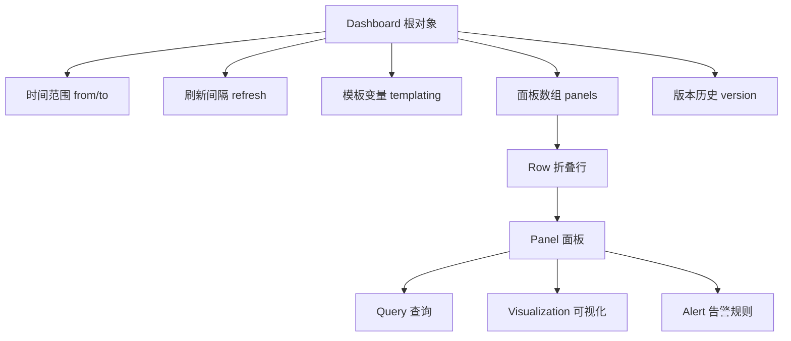

# 第3章：仪表盘Dashboard核心概念

## 1. 项目背景

"谁能给我解释一下，为什么同一个Grafana，老王做的Dashboard像飞机驾驶舱一样专业，我做的就像小学生涂鸦？"新入职的运维工程师小李看着同事分享的Dashboard截图陷入了深深的自我怀疑。

小李的问题其实是Dashboard设计能力的缺乏。Dashboard不是简单地把几个图表堆在一起——它涉及时间范围控制、变量联动、布局层级、版本管理等一系列设计思想。就像写代码一样，写一个能跑的Dashboard很简单，但写出一个清晰、可维护、能复用的大盘需要系统的方法论。

现实中，很多团队的Grafana使用现状是：Dashboard数量爆炸式增长（"又建了一个新的，旧的找不到在哪了"），变量配置混乱（"怎么点了这个下拉框，整个页面都变空白了"），时间范围管理不当（"为啥我看的数据跟运维看到的不一样"），以及更致命的——Dashboard修改后无法追溯是谁改了什么。



本章将深入Dashboard的JSON模型本质、layout布局策略、变量模板化设计和版本管理，帮你从"能建Dashboard"进阶到"能设计好Dashboard"。

## 2. 项目设计

**小胖**（指着屏幕上一张50多个面板的Dashboard）：大师你看，我把公司所有服务的监控都放在一张Dashboard里了！怎么样，是不是很酷？

**大师**（扫了一眼，眉头微蹙）：这个Dashboard加载一次要多久？

**小胖**（挠头）：差不多……20秒？有时还超时报错。

**小白**（凑过来）：50个面板，每个面板2-3个查询，一次至少100多个查询打到后端。大师，这是不是就是典型的Dashboard设计反模式？

**大师**：正是。Dashboard设计有一条铁律——一个Dashboard只解决一个问题。运维同事看的是主机负载和网络流量，开发同事关心的是应用QPS和错误率，业务同事看的是订单量和转化率。你把所有人的需求塞进一张Dashboard，结果就是谁看了都一知半解，而且加载的时候也在浪费所有人的时间。

**小胖**（放下薯片）：那应该怎么分？按团队？按服务？按场景？

**大师**：三个维度都要考虑。我的建议是三层Dashboard架构：

第一层叫Overview概览大盘——给值班人员看，一张Dashboard就能看出系统整体是否健康。通常只放5-8个面板：全局QPS、P99延迟、错误率、主机CPU均值、关键业务量。每个面板用Stat+Sparkline展示，一目了然。

第二层叫Service服务大盘——给开发团队看，每个核心服务一个大盘。比如订单服务的Dashboard，放QPS、延迟分位数、错误码分布、数据库连接池、Redis命中率。

第三层叫Drill-down深入分析大盘——给排查问题的专家看，比如某个服务的慢查询详情、GC日志分析、调用链追踪。

**小白**：这就像是医院的体检流程——先量血压体温（Overview），异常了再去做专项检查（Service），最后CT/MRI精确定位（Drill-down）。

**大师**（赞许点头）：这个比喻非常精准！除此之外，Dashboard本身的时间结构和变量设计也很关键。

**小胖**：说到变量，我上次配置了一个多选变量，选了10个值后页面直接卡死了，这是为什么？

**大师**：这是变量重复面板（Repeat）和查询基数叠加的问题。你的变量叫`$instance`，有10个值，每个值的查询又返回50条时间序列，那一个面板实际渲染了500条线。再加上你没有设置`Max data points`，每条线都是原始精度——浏览器根本承受不住。

正确的做法：第一，用Repeat Panel时每个变量值单独一个面板，而不是全部堆在一个面板里；第二，设置合理的Max data points（通常1000点左右）；第三，对于多选变量，考虑用Ad hoc filter代替硬编码。

**小胖**：还有，时间范围这块我也踩过坑。有一次领导问我"上周一早上8点到10点之间的数据"，我发现选自定义时间后，相对时间的偏移设置全乱了。

**大师**：这是Grafana时间模型的核心。每个Dashboard有两个时间维度：from和to（绝对时间或者相对时间），所有面板共享这个时间范围。但有时你需要看同比数据——比如今天和昨天同一时段对比。这时就要用到Time Shift（时间偏移）功能，把B系列的查询时间偏移-1d。

**小白**：那版本管理呢？我们团队经常出现"Dashboard被改坏了不知道谁改的"这种情况。

**大师**：Grafana有两种方案。轻量方案是开启Dashboard Version History，每次保存自动生成一个快照，可以Diff对比和回滚。重量方案是Provisioning——用JSON/文件管理Dashboard，纳入Git版本控制，通过CI/CD自动同步。你们团队现在用哪种？

**小白**：都还没用……我们手动复制粘贴Dashboard JSON做备份。

**大师**（扶额）：这样，你先在grafana.ini里加一行`versions_to_keep = 20`，至少保留最近20个版本记录。然后慢慢迁移到Provisioning方案。

**技术映射**：三层Dashboard = 体检流程（概览→专项→深入），Dashboard版本 = Git提交记录（可Diff可回滚），Repeat变量 = 复印机（一个模板复制N份）。

## 3. 项目实战

**环境准备**

基于第2章的环境，确保Grafana + Prometheus正常运行。本次不需要新增组件。

**步骤一：理解Dashboard JSON模型**

创建一个简单的Dashboard，导出JSON分析其结构：

```bash
# 通过API导出Dashboard JSON（需要先创建Dashboard并获取uid）
curl -H "Authorization: Bearer <API_KEY>" \
  http://localhost:3000/api/dashboards/uid/<dashboard_uid> | jq
```

核心JSON结构解析：

```json
{
  "dashboard": {
    "uid": "abc123",           // 全局唯一标识（跨环境不变）
    "title": "主机监控大盘",
    "timezone": "browser",
    "time": {
      "from": "now-6h",       // 默认显示最近6小时
      "to": "now"
    },
    "refresh": "30s",          // 每30秒自动刷新
    "templating": {
      "list": []               // 模板变量列表
    },
    "panels": [                // 面板数组
      {
        "id": 1,
        "title": "CPU使用率",
        "type": "timeseries",
        "gridPos": {"h": 8, "w": 12, "x": 0, "y": 0},
        "targets": [{
          "expr": "rate(node_cpu_seconds_total{mode!=\"idle\"}[5m])"
        }]
      }
    ],
    "version": 3               // 当前版本号
  }
}
```

**步骤二：设计分层Dashboard架构**

创建三层Dashboard：

**第一层：总览Dashboard（Overview）**

新建Dashboard → 命名"系统总览" → Settings → 设置uid为`system-overview`。

Dashboard级别设置：
- Time range：`now-1h` to `now`
- Refresh interval：`30s`（但数据查询实际间隔由面板独立控制）
- 开启`Now delay` = `30s`，避免查询时间到当前秒导致的精度波动

添加5个核心面板：

```promql
# 面板1：总QPS（Stat面板）
sum(rate(http_requests_total[5m]))

# 面板2：P99延迟（Stat面板）  
histogram_quantile(0.99, sum(rate(http_request_duration_seconds_bucket[5m])) by (le))

# 面板3：错误率（Stat面板）
sum(rate(http_requests_total{status=~"5.."}[5m])) / sum(rate(http_requests_total[5m])) * 100

# 面板4：主机CPU使用率（Time series）
100 - (avg(rate(node_cpu_seconds_total{mode="idle"}[5m])) * 100)

# 面板5：内存使用率（Time series）
(1 - (node_memory_MemAvailable_bytes / node_memory_MemTotal_bytes)) * 100
```

布局设置：
```
[面板1: 4x4] [面板2: 4x4] [面板3: 4x4]
[        面板4: 12x8          ]
[        面板5: 12x8          ]
```

**第二层：服务Dashboard（Node Exporter服务视图）**

创建新Dashboard → 命名"Node Exporter 主机监控" → uid设为`host-monitor`。

关键变量配置：
1. `$env`：Custom类型，值`dev, staging, prod`，方便切换环境
2. `$instance`：Query类型，查询`label_values(node_uname_info{job="node_exporter"}, instance)`

添加具体服务的详细面板：
```promql
# CPU各模式分解（Time series - 堆叠显示）
rate(node_cpu_seconds_total{instance="$instance"}[5m])

# 磁盘IO（Time series）
rate(node_disk_read_bytes_total{instance="$instance"}[5m])
rate(node_disk_written_bytes_total{instance="$instance"}[5m])

# 网络流量（Time series）
rate(node_network_receive_bytes_total{instance="$instance"}[5m])
rate(node_network_transmit_bytes_total{instance="$instance"}[5m])
```

**第三层：深入分析Dashboard（进程级视图）**

创建"Process Detail" Dashboard，针对单个进程做深度分析。

关键操作——设置Drill-down链接：在服务Dashboard的Stat面板中，点击`Links` → `Add link` → Type=`Dashboard` → 选择目标Dashboard → 传递变量`${__data.fields.instance}`或`$instance`。

**步骤三：配置变量联动与Repeat**

场景：同一套模板在不同环境下复用。

```json
// 模板变量配置示例
{
  "templating": {
    "list": [
      {
        "name": "datacenter",
        "type": "custom",
        "current": {"text": "北京", "value": "bj"},
        "options": [
          {"text": "北京", "value": "bj"},
          {"text": "上海", "value": "sh"},
          {"text": "广州", "value": "gz"}
        ]
      },
      {
        "name": "cluster",
        "type": "query",
        "query": "label_values(node_uname_info{dc=\"$datacenter\"}, cluster)",
        "refresh": 2  // 上级变量变化时自动刷新
      },
      {
        "name": "instance",
        "type": "query",
        "query": "label_values(node_cpu_seconds_total{cluster=\"$cluster\"}, instance)",
        "multi": true,
        "includeAll": true
      }
    ]
  }
}
```

Repeat Panel设置：在Panel编辑器中 → Repeat options → Repeat by variable = `instance` → 每个instance自动生成一个面板副本。

**步骤四：Dashboard版本管理实战**

```bash
# 查看Dashboard版本历史
curl -H "Authorization: Bearer <API_KEY>" \
  http://localhost:3000/api/dashboards/id/<dashboard_id>/versions | jq

# 获取特定版本
curl -H "Authorization: Bearer <API_KEY>" \
  http://localhost:3000/api/dashboards/id/<dashboard_id>/versions/<version_id> | jq

# 批量导出所有Dashboard
curl -H "Authorization: Bearer <API_KEY>" \
  http://localhost:3000/api/search?type=dash-db | jq '.[].uid' | \
  xargs -I {} curl -H "Authorization: Bearer <API_KEY>" \
  http://localhost:3000/api/dashboards/uid/{} -o dashboards/{}.json
```

**步骤五：Dashboard权限控制**

```bash
# 设置Dashboard权限（需要dashboard uid）
curl -X POST -H "Authorization: Bearer <API_KEY>" \
  -H "Content-Type: application/json" \
  -d '{
    "items": [
      {"role": "Viewer", "permission": 1},
      {"role": "Editor", "permission": 2},
      {"teamId": 3, "permission": 2}
    ]
  }' \
  http://localhost:3000/api/dashboards/uid/<dashboard_uid>/permissions
```

**常见坑点**
1. **变量依赖死循环**：变量A依赖B，B又依赖A，导致无限刷新。解决方法：设置`refresh`为1（从不自动刷新）。
2. **Repeat Panel导致Dashboard过大**：一个变量的10个值 × 每个面板500KB数据 = 5MB渲染负担。解决：限制变量可选项，减少每个面板的查询数据量。
3. **时间偏移导致数据不一致**：不同的Time Shift可能使用不同的采样粒度。解决：手动设置Step interval。

## 4. 项目总结

**优点**
| 特性 | 说明 |
|------|------|
| JSON模型 | Dashboard完全由JSON定义，可编程创建和修改 |
| 变量系统 | 同一模板适配多环境/多集群，减少Dashboard冗余 |
| 权限粒度 | 支持Dashboard级别的View/Edit/Admin权限 |
| 版本历史 | 自带diff和回滚，避免"改坏了改不回来" |
| Link跳转 | Dashboard间可传递变量，实现下钻分析 |

**缺点**
| 特性 | 说明 |
|------|------|
| 布局僵硬 | 12列Grid布局，复杂自定义布局困难 |
| 没有文件夹继承 | 权限和变量不能从文件夹继承 |
| 变更通知弱 | Dashboard被修改后不会主动通知相关人 |
| 大规模搜索慢 | 1000+ Dashboard时搜索性能下降 |

**适用场景**
1. 环境不变、实例变化：用变量切换环境，Dashboard不变
2. 多集群监控：一个Dashboard用$cluster变量覆盖所有集群
3. 服务化治理：每个微服务独立Dashboard，通过Link关联
4. 值班大屏：全屏TV Mode + 自动刷新 + 最优时间范围
5. 故障排查：三层Dashboard从总览迅速下钻到根因

**不适用场景**
1. 高度动态的面板布局（如拖拽式自定义仪表盘）
2. 数据量巨大的报表（需要离线生成，不适合实时查询）

**思考题**
1. 如果一个Dashboard有30个面板，每个面板查询不同的Prometheus实例，如何避免打开Dashboard时对后端造成"查询风暴"？
2. 变量联动（A→B→C）的级联查询会增加Dashboard加载时间，如何优化变量查询性能？
