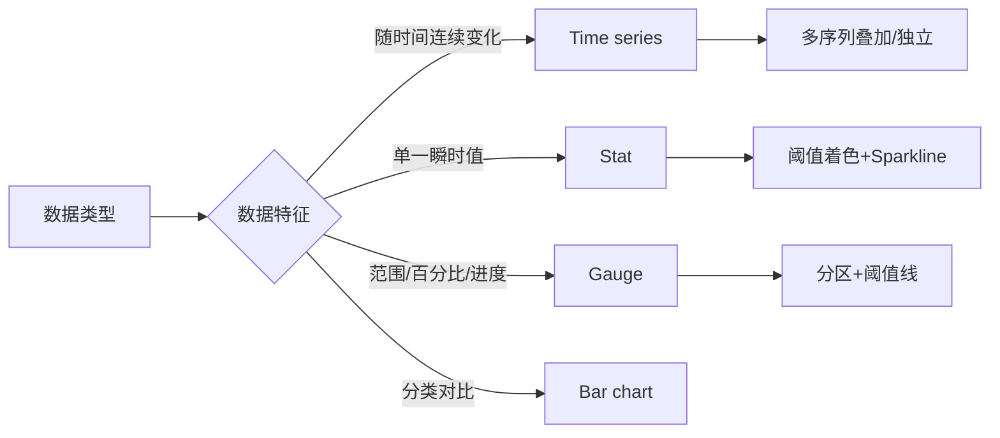

# 第4章：面板Panel类型详解（上）——时序与统计

## 1. 项目背景

"我们后端给了我一堆Prometheus指标，但我不知道用什么图展示。"产品研发团队的数据分析师小王面临一个可视化选型难题。服务端暴露了数百个指标：QPS是数值、延迟是分位数、错误码是标签、CPU是百分比、磁盘是字节、连接数是瞬时值……这些不同性质的指标，究竟应该用什么样的面板来呈现？

选错面板类型轻则造成认知偏差，重则导致决策失误。例如，用单一Stat面板展示P99延迟——当延迟从50ms上升到500ms时，Stat面板因为阈值设置问题依然显示"绿色正常"，实际上用户体验已经严重恶化。又如，用Time series面板展示少量几个分类数据，不如用Bar chart一目了然。

Grafana提供了超过30种内置面板类型，但日常工作中真正高频使用的其实就6-8种。本章聚焦最核心的三类面板：Time series（时序图）、Stat（统计数值）、Gauge（仪表盘），掌握它们就能覆盖80%的监控可视化场景。每种面板我们不仅讲"怎么配"，更会揭示其设计哲学——背后的数据结构和渲染机制。



## 2. 项目设计

**小胖**（对着Grafana界面发愁）：大师，我发现Grafana的面板类型比我手机里的APP还多，Time series、Stat、Gauge、Bar chart、Pie chart、Table……我到底该用哪个？我现在不管什么数据都往Time series里塞，结果被同事吐槽"你的图比毕加索的抽象画还难懂"。

**大师**（笑了）：你这个问题触及了可视化设计的本质。不同的数据类型对应不同的视觉通道。连续的时间序列数据适合用折线图（位置通道），分类对比适合用柱状图（长度通道），一个关键值适合用大字（数值通道）。选错通道，就像用温度计称体重——工具不合适。

**小白**（推了推眼镜）：能不能具体讲一下Time series面板有什么容易忽略的配置？

**大师**：Time series面板看似简单，实则暗藏玄机。我给你挑四个要点讲。

第一，Series override（序列覆盖）。这是Time series最强大的功能——你可以对不同的序列单独设置颜色、线型、填充、Y轴等。比如把error请求设置为红色虚线加粗，normal请求设置为绿色细线。使用方法：在`Overrides`中添加`Fields with name matching regex`，然后添加覆盖属性。

第二，Gradient mode（渐变模式）。默认的scheme模式是按序列分配不同颜色，但如果序列很多（比如每个Pod一根线），颜色就不够用了。这时换成opacity模式，所有线同色但新数据透明度高、旧数据透明度低，能直观看出时序趋势。

第三，Thresholds（阈值）。很多人以为阈值是Stat和Gauge的专属功能。实际上Time series也可以设置阈值——超过阈值的区域会自动变色。这在查看CPU使用率时特别有用，超过80%的区域自动变红。

第四，Y轴左边的单位设置。Grafana支持从`none`到`percent(0-100)`、`bytes(IEC)`、`s`、`ms`、`currency(USD)`等数十种单位。选对单位，Grafana会自动格式化数字——1024变成1.0KB，0.05变成50ms。

**小胖**（似懂非懂）：那Stat面板呢？我看有些人用Stat展示CPU使用率就是一个数字，有些人却能展示趋势小图。

**大师**：Stat面板的核心是"一个值+一种状态"。可以通过Sparkline开启趋势小图，通过Thresholds控制背景色或值颜色。Stat面板的最佳实践是"少即是多"——一个Stat代表一个KPI，阈值干净利落。比如：
- CPU使用率：Green(<60%) → Orange(60-85%) → Red(>85%)
- 错误率：Green(<0.1%) → Orange(0.1-1%) → Red(>1%)

**小白**（追问）：那Value mapping呢？我在Stat面板里看到有Value mapping选项。

**大师**：Value mapping是数值到文本的映射。最经典的应用是"健康状态"显示。比如你的应用暴露了一个`application_health`指标，值1=正常，0=异常。用Value mapping把1映射为带绿色圆圈的"Healthy"，0映射为带红色圆圈的"Unhealthy"。甚至可以使用正则表达式匹配区间。

**小胖**：那Gauge面板是不是就是Stat面板的"变种"？

**大师**：可以这么理解。Gauge = Stat + 进度条/半圆弧。Gauge的优势在于"范围可视化"——一眼就能看出当前值在整个阈值区间中的位置。比如磁盘使用率80%，Gauge会显示指针指向红色区域，直观感受比看"80%"这个数字强烈得多。

Gauge有两种方向：Horizontal（水平条）和Vertical（竖直条），以及经典的Semicircle（半圆）。此外，Gauge还支持重复元素——比如你有一个变量叫`$disk`，包含/、/data、/home三个值，你可以设置Gauge的Repeat来给每个磁盘画一个独立的Gauge。

**大师总结**：最后我给你一个"面板选型速查表"：

| 你想展示什么 | 推荐面板 | 禁用面板 |
|-------------|---------|---------|
| 指标随时间变化的趋势 | Time series | Stat（看不出趋势） |
| 一个关键KPI的当前值 | Stat + Sparkline | Gauge（信息密度低） |
| 资源使用率等百分比 | Gauge | Stat（直观性弱） |
| 多个分类的数值对比 | Bar chart | Pie chart（超过5个分类难识别） |
| 占比分布（3-5个分类）| Pie chart | Bar chart（不够直观） |

**技术映射**：Time series override = 给不同赛道上色（各跑各的），阈值 = 温度计红线（进入危险范围自动变色），Value mapping = 翻译官（把机器语言转成人话）。

## 3. 项目实战

**环境准备**

沿用第2章的Docker Compose环境，确保Prometheus + Node Exporter已启动。

**步骤一：Time series面板深度配置**

创建新Dashboard → Add visualization → 选择Prometheus数据源。

查询：CPU使用率分解到各个模式：
```promql
rate(node_cpu_seconds_total{instance="node_exporter:9100"}[5m])
```

关键配置（右侧面板）：
1. **Panel options** → Title：`CPU各模式使用率`
2. **Graph styles** → Fill opacity：`15`（半透明填充）
3. **Graph styles** → Gradient mode：`Scheme` → 选择`Single color`（蓝色渐变）
4. **Legend** → Mode：`Table`，Placement：`Bottom`，开启`Values → Max/Mean/Total`
5. **Y轴** → Unit：`Percent (0-100)`，Scale：`Linear`

Overrides配置（创建两个序列覆盖规则）：
- Override 1：
  - Fields with name matching regex：`/idle/`
  - Add override property → `Graph styles → Line style` → 选择`Dashes`
  - Add override property → `Color` → 选择灰色
- Override 2：
  - Fields with name matching regex：`/iowait/`
  - Add override property → `Graph styles → Line width` → `3`
  - Add override property → `Color` → 选择红色

Thresholds：
- Add threshold：`80` → 红色（超过80%的使用率区域高亮）
- 模式：`Absolute`，Show thresholds：`As filled regions`

设置完成后，你将看到CPU各个模式的折线图，idle模式显示为灰色虚线，iowait高亮为红色粗线，超过80%的区域自动填充红色。

**步骤二：Stat面板与阈值设计**

新增面板 → 选择Stat类型。

查询：获取当前95分位延迟：
```promql
histogram_quantile(0.95, sum(rate(http_request_duration_seconds_bucket[5m])) by (le))
```

Stat面板核心配置：
1. **Value options** → Unit：`milliseconds (ms)`，Decimals：`1`
2. **Value options** → Show：`Calculate` → Last (not null)
3. **Stat styles** → Orientation：`Horizontal`，Color mode：`Background`
4. **Stat styles** → Graph mode：`Area`（开启Sparkline趋势图）
5. **Text size** → `Auto`
6. **Thresholds**：
   - 0 → Green
   - 200 → Yellow
   - 500 → Orange
   - 1000 → Red

添加Value mapping（如果Indicator是0/1的健康状态）：
- Type：`Value` → Value：`1` → Display text：`✅ 正常` → Color：`Green`
- Type：`Value` → Value：`0` → Display text：`❌ 异常` → Color：`Red`

**步骤三：Gauge面板——磁盘使用率**

新增面板 → 选择Gauge类型
```promql
(1 - (node_filesystem_avail_bytes{mountpoint="/"} / node_filesystem_size_bytes{mountpoint="/"})) * 100
```

Gauge核心配置：
1. **Display** → Show：`Calculate` → Last (not null)
2. **Display** → Orientation：`Horizontal`
3. **Display** → Show threshold markers：开启
4. **Display** → Show threshold labels：开启
5. **Field** → Unit：`Percent (0-100)`
6. **Thresholds**：
   - 0 → Green
   - 60 → Yellow（Warning）
   - 80 → Red（Critical）
7. **Value options** → Decimals：`1`

完成后的效果：一个水平进度条，绿色段(0-60)、黄色段(60-80)、红色段(80-100)，指针指向当前使用率。

**Repeat Gauge——多磁盘监控**：
1. 在Dashboard级别创建变量`$mountpoint`：Query类型，查询`label_values(node_filesystem_size_bytes, mountpoint)`
2. 在Gauge面板编辑器中 → Repeat options → Repeat by variable：`$mountpoint` → 选择Horizontal排列
3. 这时会自动为每个挂载点生成一个独立的Gauge（/, /boot, /home等）

**步骤四：复合Dashboard——最佳实践布局**

将所有面板组合成一个Dashboard：

```
Row 1: 资源总览
[CPU Stat 3x3][Memory Stat 3x3][Disk Stat 3x3][Network Stat 3x3]

Row 2: CPU详情
[CPU Time series 8x8][CPU Gauge 4x8]

Row 3: 磁盘详情
[Disk Gauge(×N)(Repeat by mountpoint)]

Row 4: 应用指标
[QPS Stat 4x4][P99 Stat 4x4][Error Rate Stat 4x4]

Row 5: 趋势图
[App QPS Time series 12x6]
[App Latency Time series 12x6]
```

**常见坑点**
1. **Time series data outside threshold**：阈值只对数值字段起作用，如果数据源返回的是字符串，阈值不起作用。
2. **Stat面板的Sparkline不显示**：需要确保查询返回的是Range数据而非Instant数据（即查询语句中包含了时间范围，如`[5m]`）
3. **Gauge面板负数不生效**：默认最小值为0，如果指标可能是负数，需要在Standard options中设置Min为负值。
4. **颜色模式冲突**：如果同时设置了Thresholds和Value mapping的颜色，Value mapping的优先级更高。

## 4. 项目总结

**优点 & 缺点对比**

| 面板类型 | 优点 | 缺点 | 最佳搭档 |
|----------|------|------|---------|
| Time series | 趋势清晰，支持多序列叠加、渐变、阈值 | 序列 > 20条时颜色不可区分 | Prometheus Range Query |
| Stat | 信息密度高，一眼看KPI，支持Sparkline | 无法展示分布和趋势细节 | Instant Query + 阈值 |
| Gauge | 直观展示数值在区间中的位置 | 信息密度低，占用空间大 | 百分比类指标 |
| Bar chart | 分类对比清晰，支持分组/堆叠 | 历史趋势不如折线图自然 | 分类数据、Top N排行 |

**适用场景**
1. 运维值班大屏：Time series展示趋势 + Stat展示关键KPI + Gauge展示资源利用率
2. 应用性能大盘：Stat面板展示QPS/延迟/错误率（RED三大指标），Time series展示趋势
3. 容量规划：Gauge展示当前资源使用率 vs 配额
4. 告警规则可视化：Time series上叠加告警状态线
5. 业务数据大盘：Stat展示当日关键指标（订单量/GMV/活跃用户）

**注意事项**
1. Time series的Legend开启Table模式+计算值后，会触发额外的聚合计算，面板多的Dashboard可能卡顿
2. Stat面板的Color mode选Background时，如果面板很小（2x2），文字可能溢出
3. Gauge面板的Repeat必须搭配变量使用，且每次变量变化都会重新查询数据库
4. 所有面板的Decimal设置不会影响Grafana的计算精度，只是显示截断

**常见踩坑经验**
1. **CPU使用率time series图变成波浪状**：因为`rate(node_cpu_seconds_total[1m])`的采样窗口太短，计算出的rate波动大。解决：使用`[5m]`或更大的窗口。
2. **Stat面板的Threshold不生效**：指标返回的是Range类型（即历史值数组），Stat默认取第一个值而不是Last。解决：在Value options中选择`Last (not null)`。
3. **Gauge面板的单位设置错误导致数值异常**：如果Prometheus返回的是小数（如0.8代表80%），但Unit设置为percent(0-100)，Grafana会自动×100，显示80%而不是0.8%。正确处理：要么数据源返回时就×100，要么Unit选percent(0.0-1.0)。

**思考题**
1. 如果你有一个指标每秒采样一次，Time series面板如何避免查询30天的数据时浏览器的崩溃？
2. Stat面板和Gauge面板都能展示单个数值，什么场景下选Stat，什么场景下选Gauge？请给出3个具体例子。
