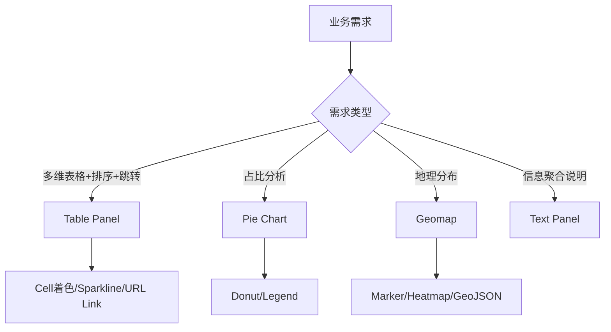

# 第5章：面板Panel类型详解（下）——表格与特殊面板

## 1. 项目背景

"我要看每个服务实例的CPU、内存、QPS，最好按QPS降序排列，QPS超过1000的行标红，点击实例名还能跳转到该实例的详细监控页面。这种需求用什么面板？"

这是运维主管老陈在周会上提出的需求。团队成员面面相觑——Time series做不了排序，Stat做不了多列，Gauge做不了点击跳转。最后有人弱弱地说："要不……导出CSV用Excel看？"这个"方案"被老陈当场否决——都上Grafana了还天天导出CSV，那不是开倒车吗？

答案就是Table面板。很多人对Grafana有误解，认为它只是一个"画图工具"。实际上，Table面板是Grafana最被低估的"瑞士军刀"——它支持列的排序/过滤/着色、URL跳转、JSON渲染、甚至是内嵌的迷你折线图（Sparkline）。更重要的是，Table面板不挑数据格式——时序数据、表格数据、混合数据通吃。

除了Table之外，Grafana还提供了Pie chart（饼图）、Geomap（地理图）、Text（文本面板）、Canvas（画布面板）等特殊面板，每种都针对特定的可视化场景优化。本章将通过4个典型业务案例，逐一拆解这些"非主流"但关键时刻能救场的面板类型。



## 2. 项目设计

**小胖**（把一个CSV文件拖到Grafana界面上，理所当然没反应）：大师，Grafana难道就只会画折线图和数字吗？我想看一个"服务器Top10资源消耗排行"怎么就这么难？运维那边天天发邮件，邮件里贴一张Excel截图，这不是现代化监控该有的样子啊！

**大师**（放下手中的键盘）：你忽视了Grafana最强大的面板之一——Table。你刚才说的"Top10排行"、"多列排序"、"条件着色"、"点击跳转"，Table全都能做，而且比你想象得更强。

**小白**（侧过头）：Table不就是个表格吗？Excel不也是表格？

**大师**：Grafana的Table远超Excel静态表格。它有三个核心能力：第一，Cell display mode——每个单元格可以是纯文本、彩色背景块、迷你Sparkline折线图、甚至是JSON渲染；第二，Column filter——按列值动态过滤，比如只看QPS>1000的行；第三，Data links——点击某个单元格可以带参数跳转到其他Dashboard。这些能力让你一个Table面板就能替代以前三四个工具。

**小胖**：具体怎么用？举个实际例子呗。

**大师**：好。假设你有100个微服务实例，你想监控每个实例的实时状态。用Table面板，列结构可以设计成这样：

| 实例名 | 状态(Color) | CPU(Sparkline) | 内存(Gauge) | QPS | 错误率 | P99延迟 |
|--------|------------|----------------|------------|-----|--------|---------|
| order-svc-1 | 🟢运行中 | ▁▂▃▄▅▆(迷你趋势) | 65% | 1200 | 0.1% | 45ms |
| user-svc-2 | 🟡降级 | ▃▃▃▃▃▃(趋势) | 85% | 800 | 2.5% | 230ms |

"状态"列用Color background + Value mapping，"CPU"列用Sparkline，"QPS"列设置Threshold——超过1000的单元格自动变橙色。点击"实例名"可以跳转到该实例的详细Dashboard。

**小白**：听起来很美好，但Table面板的数据怎么来？Prometheus查询返回的是时序数据，Table能直接展示吗？

**大师**：这就涉及Grafana数据模型的关键了。Prometheus默认返回时间序列数据，但你可以用Transform把它转成表格格式。两种方案：

方案一：把Prometheus查询模式从"Range"改成"Instant"——只取最新值，配合`group by`聚合，天然就是表格形式。

方案二：使用Transform。比如你先查时序数据，然后加一个`Reduce` Transform把每条时间序列聚合为一个值（取Last/Max/Avg），再`Organize fields`重命名列，最后给Table面板使用。

**小胖**（掰着手指数）：那除了Table，还有哪些"特殊"面板应该学？

**大师**：我再讲三个。

**Pie Chart饼图**。很多人吐槽饼图"不科学"——如果超过5个分类，人类的视觉系统很难精确对比角度大小。但饼图在展示"占比"时有不可替代的直观性。Grafana的Pie chart支持Donut模式（甜甜圈），中间可以放总和数字。也支持Label+Value同时显示。最佳实践：分类不超过5个，超过的部分合并为"Other"。

**Geomap地理面板**。如果你的业务有地域属性——比如全国各机房的健康状态、CDN节点的流量分布、各省份的用户活跃度——Geomap就是不二之选。它支持Marker Layer（打点）和Heatmap Layer（热力），数据格式接受经纬度坐标或者GeoJSON。

**Text/Markdown面板**。这是Dashboard的"注释面板"。很多Dashboard的左上角放一个Text面板，用Markdown写好标题、说明、更新日志、相关链接。它的作用相当于Dashboard的"封面"——让别人一打开就知道这个大盘是干什么的、谁负责的、看哪些关键指标。

**小白**：那这么多面板类型，选型的决策逻辑是什么？

**大师**：记住一个口诀——"趋势看时序，阈值看Stat，占比看饼图，排行看表格，位置看地图"。最后加一句："信息说明用Text，需要画自己写Canvas。"

**技术映射**：Table面板 = Excel Pro版（动态着色+点击跳转+迷你图表），Pie Chart = 分蛋糕（一眼看占比），Geomap = 作战地图（地理位置映射状态），Text面板 = 说明书（Dashboard的使用指南）。

## 3. 项目实战

**环境准备**

沿用之前的Docker Compose环境。新增一个Mock JSON数据源用于Pie chart演示。

**步骤一：Table面板——服务健康排行榜**

创建新Dashboard → Add visualization → 选择Table面板 → 选择Prometheus数据源。

查询（切换到Instant模式）：
```promql
# 每个实例的最新CPU使用率
100 - (avg by (instance) (rate(node_cpu_seconds_total{mode="idle"}[5m]) * 100))

# 配合内存使用率
(1 - (node_memory_MemAvailable_bytes / node_memory_MemTotal_bytes)) * 100
```

使用Transform合并两个查询的结果：
1. Add transform → `Join by field` → Field: `instance` → Mode: `Outer join`
2. Add transform → `Organize fields` → 重命名为 `Instance`, `CPU%`, `Memory%`
3. Add transform → `Sort by` → Field: `CPU%` → Descending（按CPU降序排列）

Table面板设置：
1. **Table** → 开启`Show header`、`Enable pagination`（每页20条）
2. **Column: CPU%** → Cell display mode: `Color background` → Thresholds: 0→Green, 60→Yellow, 80→Red
3. **Column: Memory%** → Cell display mode: `Sparkline` → 需要Range数据源
4. **Column: Instance** → Data links → Type: `Dashboard` → 传递`${__data.fields.Instance}`到详情Dashboard
5. **Column filter** → 开启（表头出现搜索框和过滤图标）

添加Sparkline列的高级配置：
```promql
# 独立一个查询用于CPU Sparkline
rate(node_cpu_seconds_total{instance="node_exporter:9100",mode!="idle"}[5m])
```

在Table面板中添加第二个查询，Transform用`Reduce`将时序转为一个值，Cell display mode选择`Sparkline`。

**步骤二：Pie Chart——磁盘空间占比分布**

由于Prometheus不容易直接获取磁盘占比的"饼图友好"数据，这里用Mock数据演示：

创建Data Source → 选择`TestData DB`（Grafana内置测试数据源）。

新建Query：
- Scenario: `CSV Content`
- CSV Content:
```csv
mountpoint,size_gb,used_gb
/,100,65
/data,500,220
/backup,200,80
/home,50,15
```

使用Transform：
1. `Reduce` → Field: `used_gb` → Calculation: `Total`（计算总使用量）
2. `Add field from calculation` → 创建`FreeGB` = `size_gb - used_gb`

Panel设置：
1. **Panel type** → 切换为`Pie chart`
2. **Pie chart** → Pie type: `Donut`
3. **Labels** → Name → `mountpoint`，Value → `Percent`
4. **Legend** → Placement: `Right`，Values: `Value + Percent`
5. **Display** → 开启`Reduce options → Show all values`
6. **Standard options** → Unit: `gigabytes (GB)`

最终的Donut图在中间显示总磁盘容量，各扇区显示每个挂载点的使用比例。

**步骤三：Geomap——数据中心健康状态**

使用TestData DB数据源模拟地理数据。

Query配置：
- Scenario: `CSV Content`
```csv
datacenter,lat,lon,status,connections
北京,39.9042,116.4074,1,1200
上海,31.2304,121.4737,1,800
广州,23.1291,113.2644,1,650
成都,30.5728,104.0668,0,0
```

Panel类型切换为`Geomap`。

Geomap配置：
1. **Map layer** → Layer type: `Markers`
2. **Location** → Latitude: `lat`，Longitude: `lon`
3. **Color** → Based on: `status` → 1=Green(marker), 0=Red(marker)
4. **Size** → Based on: `connections`（连接数大的点更大）
5. **Tooltip** → Title: `datacenter`，Body: `Connections: ${connections}`
6. Base layer: `OpenStreetMap`（默认底图）

这样得到一张中国地图，北京/上海/广州的点是绿色（正常），成都的点是红色（异常），点的大小反映连接数。

**步骤四：Text面板——Dashboard说明文档**

Add panel → 选择`Text`面板。

在Markdown编辑器中输入：
```markdown
## 系统健康监控总览

**负责人**：运维团队 | **更新日期**：2025-01-15 | **数据源**：Prometheus

### 大盘说明
- **第一行 Stat面板**：当前系统核心指标的实时值
- **第二行 Time series**：各指标24小时趋势
- **第三行 Table**：各实例健康度排行，点击实例名可下钻

### 告警阈值参考
| 指标 | 警告 (WARNING) | 严重 (CRITICAL) |
|------|---------------|-----------------|
| CPU使用率 | > 60% | > 80% |
| 内存使用率 | > 70% | > 90% |
| 磁盘使用率 | > 75% | > 90% |
| 错误率 | > 1% | > 5% |

### 相关链接
- [事故处理SOP](https://wiki.example.com/incident-sop)
- [值班排班表](https://oncall.example.com)
- [架构文档](https://wiki.example.com/arch)
```

Panel设置：Transparent background（透明背景），无边框，放置在Dashboard最顶部，横跨12列。

**步骤五：交互式仪表盘整合**

将所有面板按以下布局组合：

```
Row 0: [Text Panel 12x2]          ← 大盘使用说明
Row 1: [CPU Stat 3x3][Mem Stat 3x3][Disk Stat 3x3][QPS Stat 3x3]
Row 2: [CPU Time series 6x6][Memory Time series 6x6]
Row 3: [Service Table 12x6]       ← 可排序、可过滤、可点击跳转
Row 4: [Disk Pie chart 4x5][Geo Map 8x5]
```

**常见坑点**
1. **Table面板Sparkline不显示**：Sparkline需要数据源返回实际的时间序列数据（Range query），不能是Single value。解决方法：确保该列的查询是Range模式，返回`[时间戳, 数值]`对的数组。
2. **Pie chart数据聚合混乱**：如果查询返回多条记录但没做聚合，饼图会自动计算各值占比，可能出现100个扇区。解决：在Transform中先用`Filter by value`缩小范围。
3. **Geomap不显示点**：经纬度必须是数字类型，字符串格式的经纬度无效。检查Fields的类型是否正确。
4. **Table的Data link带不过变量**：Data link中的`${__data.fields.xxx}`只对点击的那个单元格有效，不能跨字段引用。且字段名区分大小写。

## 4. 项目总结

**面板类型总对比**

| 面板 | 适用数据类型 | 交互能力 | 性能开销 | 学习难度 |
|------|-------------|---------|---------|---------|
| Table | 表格/时序 | 排序/过滤/跳转 | 中 | 中 |
| Pie chart | 分类占比 | 钻取 | 低 | 低 |
| Geomap | 地理坐标 | 缩放/点击 | 高 | 高 |
| Text | Markdown | 静态链接 | 极低 | 极低 |
| Canvas | 自定义图形 | 拖拽编辑 | 中 | 极高 |

**适用场景**
1. **Table面板**：资源消耗排行榜、告警事件列表、实例健康度总览（可排序可点击下钻）、多维度指标对比
2. **Pie chart**：流量来源渠道占比、错误类型分布、存储空间分配可视化
3. **Geomap**：多机房/多区域健康监控、CDN回源质量、IoT设备地理分布
4. **Text面板**：Dashboard说明文档、值班信息公告、重要通知、参数说明
5. **Canvas面板**：自定义拓扑图、流程图、定制化的业务驾驶舱

**不适用场景**
1. Table面板不适合展示超过1000行的数据（分页后也影响加载速度）
2. Pie chart不适合展示超过7个分类的数据（人类视觉难以区分小扇区）

**注意事项**
1. Table面板开启Column filter后，所有列都会被加载到浏览器前端过滤，数据量大时影响渲染性能
2. Geomap的Marker数量超过500时，建议改为Heatmap图层以减少渲染负担
3. Text面板支持HTML但谨慎使用，XSS风险需要评估
4. 多个Table面板共享同一Dashboard时，注意翻页和排序会各自独立维护状态

**常见踩坑经验**
1. **Table面板"值显示为-0.00"**：这是因为Source数据源返回了极小负值（如-0.00003）。解决：在Standard options中设置Decimals为2。
2. **Pie chart标签重叠**：扇区过多时标签会重叠在一起。解决：减少分类数，或者把Legend放到右侧（Legend placement = Right），扇区上不显示标签。
3. **Geomap在离线环境白屏**：Map默认使用OpenStreetMap在线瓦片，内网环境无法加载。解决：配置自定义Tile server（如自建TileServer-GL）。

**思考题**
1. Table面板如何实现"同一行展示不同数据源的指标"？（比如CPU来自Prometheus，实例名来自MySQL）
2. Geomap在展示全国1000+个门店的健康状态时，每个点实时刷新会导致浏览器卡顿，如何优化？
