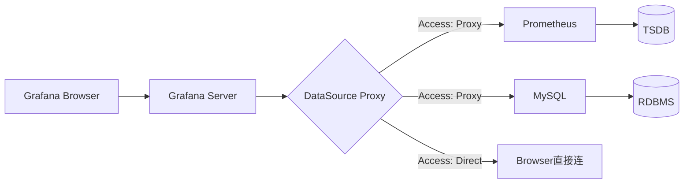

# 第6章：数据源DataSource基本配置与使用

## 1. 项目背景

"为什么我在Grafana里配置的MySQL数据源总是连接超时？""Prometheus的数据源连接成功了，但查询编辑器里什么也搜不到。""我们同时用了Prometheus、InfluxDB和Elasticsearch，这三个数据源在Grafana里的配置方式完全不同，有没有统一的套路？"

这是开发工程师阿杰在技术分享会上抛出的三个问题。他的团队刚进行完微服务化改造，从原来的单一MySQL存储变成了多数据源架构——指标走Prometheus、日志走Elasticsearch、业务数据走MySQL、时序事件走InfluxDB。数据丰富了，但管理复杂度也指数级上升。

Grafana要做的就是把这些异构数据源统一接入、统一查询、统一展示。但"统一"不等于"一样"——每种数据源有自己的查询语言、连接方式、权限体系。理解数据源在Grafana中的工作机制（特别是代理模式、连接池、查询转换），是做好可视化的前提。



## 2. 项目设计

**小胖**（揉着太阳穴）：大师，我又踩坑了！配置Elasticsearch数据源，URL填了`http://es-cluster:9200`，测试连接一直红字"Bad Gateway"。但我用curl去`curl es-cluster:9200`明明能通啊？

**大师**：你这个问题的关键在Grafana数据源的Access Mode（访问模式）。Grafana数据源有两种访问模式：

Proxy模式（默认）：浏览器发请求给Grafana Server，Grafana Server作为代理转发给数据源。所以请求是浏览器→Grafana→数据源，Grafana必须能访问数据源。

Direct模式：浏览器直接连接数据源。请求是浏览器→数据源，这要求你的浏览器网络能直接连通数据源。

你刚才的情况，es-cluster:9200在宿主机网络可访问，但Docker容器内的Grafana Server解析不了es-cluster这个主机名。你curl能通是因为你在宿主机上，不是Grafana容器里。

**小胖**（恍然大悟）：那我在Docker Compose里把Elasticsearch也加进来，用服务名当hostname就行了？

**大师**：对，这是最简单的方案。如果ES必须独立部署，那就用`host.docker.internal`或者宿主机IP。

**小白**（在本子上划重点）：那数据源连接测试时，Grafana具体做了什么？

**大师**：不同的数据源类型，健康检查的行为不同。Prometheus数据源，Grafana会请求`/api/v1/status/buildinfo`端点；MySQL会执行`SELECT 1`；Elasticsearch会请求根路径。如果健康检查通过但查询失败，说明连接通了但认证/权限有问题。

**小胖**（继续问）：那连接池呢？我公司有100个开发用Grafana，每个人开一个Dashboard，每个Dashboard有10个面板，这就是1000个并发查询。会不会把数据源打垮？

**大师**：好问题！Grafana到每个数据源有一个连接池，由参数`max_open_conn`控制（默认100）。如果并发查询超过这个数，多余的请求会排队等待。但注意两件事：

第一，连接池是按数据源实例计算的，不是按Dashboard。如果你有两个Prometheus数据源实例，每个有独立的连接池。

第二，从Grafana 10开始，查询有并发限制（默认在grafana.ini的`[dataproxy]`段里），防止单个用户或面板发起过多并发请求。

**小白**（追问）：我一直有个疑问——Grafana是怎么把不同数据源的查询结果统一成图表数据的？

**大师**：统一靠的是Data Frame（数据帧）。不管数据源是Prometheus返回的Matrix、MySQL返回的Rows、还是InfluxDB返回的Series，Grafana后端都会把它们转成统一的DataFrame结构——一个DataFrame包含多个Field，每个Field有一个Name、Type、Values数组。比如Prometheus的一个Range Query返回结果，会被转成至少两个Field：一个是time（类型time.Time），一个是value（类型float64）。

这个统一抽象让你可以用同一套Transform对不同数据源的数据做合并、连接、聚合——这是Grafana最精妙的设计之一。

**小胖**（指着界面）：还有个问题——数据源配置里有个"Custom HTTP Headers"，这是干啥的？

**大师**：某些场景下有用。比如你的数据源前面有反向代理要求特定Header认证；或者你需要Grafana在请求中添加`X-Scope-OrgID`来支持多租户（Mimir/Loki常用）。但注意：所有Dashboard用户共享这个Header，不是每个用户独立的。

**技术映射**：Proxy模式 = 代办处（所有请求统一经过Grafana中转），Direct模式 = 直达通道（浏览器自己找数据源），DataFrame = 通用货币（不管来自哪个国家，先换成统一货币再交易）。

## 3. 项目实战

**环境准备**

在之前的环境基础上添加新的数据源容器。

```yaml
# docker-compose.yml 增加服务
  mysql:
    image: mysql:8.0
    container_name: mysql-demo
    environment:
      MYSQL_ROOT_PASSWORD: root123
      MYSQL_DATABASE: demo
      MYSQL_USER: grafana
      MYSQL_PASSWORD: grafana123
    ports:
      - "3306:3306"
    volumes:
      - mysql_data:/var/lib/mysql
      - ./init.sql:/docker-entrypoint-initdb.d/init.sql

  influxdb:
    image: influxdb:2.7
    container_name: influxdb-demo
    ports:
      - "8086:8086"
    environment:
      DOCKER_INFLUXDB_INIT_MODE: setup
      DOCKER_INFLUXDB_INIT_USERNAME: admin
      DOCKER_INFLUXDB_INIT_PASSWORD: admin123
      DOCKER_INFLUXDB_INIT_ORG: demo-org
      DOCKER_INFLUXDB_INIT_BUCKET: demo-bucket
      DOCKER_INFLUXDB_INIT_ADMIN_TOKEN: my-super-secret-token
    volumes:
      - influxdb_data:/var/lib/influxdb2

volumes:
  mysql_data:
  influxdb_data:
```

初始化MySQL测试数据：
```sql
-- init.sql
CREATE TABLE orders (
    id INT AUTO_INCREMENT PRIMARY KEY,
    amount DECIMAL(10,2),
    status VARCHAR(20),
    created_at TIMESTAMP DEFAULT CURRENT_TIMESTAMP
);

INSERT INTO orders (amount, status, created_at) VALUES
(99.99, 'completed', NOW() - INTERVAL 1 HOUR),
(149.50, 'completed', NOW() - INTERVAL 30 MINUTE),
(200.00, 'pending', NOW() - INTERVAL 15 MINUTE),
(75.00, 'cancelled', NOW() - INTERVAL 5 MINUTE),
(320.00, 'completed', NOW());
```

重启Docker Compose：
```bash
docker compose down && docker compose up -d
```

**步骤一：Prometheus数据源进阶配置**

Prometheus是最重要的数据源，有一些高级配置容易被忽略。

在Grafana → Connections → Data sources → Prometheus（之前已创建）→ 编辑：

1. **Scrape interval**：设为`15s`（与Prometheus的scrape_interval一致），Grafana会自动推断查询Step。
2. **Query timeout**：设为`60s`（默认30s），复杂PromQL查询可能超时。
3. **Custom HTTP Headers**：如果Prometheus有认证，添加Header `Authorization: Bearer <token>`。
4. **Exemplars**：开启后可以在Time series面板上看到Trace关联标记。
5. **Derived fields**（派生字段）：高级功能，一般留空。

验证查询：
```promql
# 在Explore中测试
up{job="prometheus"}
# 返回1表示正常
```

**步骤二：MySQL数据源配置**

添加新数据源 → 搜索MySQL → 配置：

| 参数 | 值 | 说明 |
|------|-----|------|
| Host | `mysql:3306` | Docker内部服务名 |
| Database | `demo` | |
| User | `grafana` | |
| Password | `grafana123` | |
| Max open conn | `25` | 最大连接数 |
| Max idle conn | `10` | 最大空闲连接 |
| Conn max lifetime | `14400` | 连接最大存活时间（秒）|

Save & test → 预期结果："Database Connection OK"

创建测试Dashboard，添加Table面板，选择MySQL数据源。

查询（切换到Code模式）：
```sql
SELECT
  DATE_FORMAT(created_at, '%Y-%m-%d %H:00:00') AS time,
  status,
  COUNT(*) AS cnt,
  SUM(amount) AS total_amount
FROM orders
WHERE $__timeFilter(created_at)
GROUP BY time, status
ORDER BY time
```

关键点：
- `$__timeFilter(created_at)` 是Grafana的魔法宏，自动替换为Dashboard时间范围的WHERE条件。
- `$__timeGroup(created_at, '1h')` 可按时间粒度分组。
- 将查询Format设为`Time series`，Grafana自动识别time和metric列。

**步骤三：InfluxDB数据源配置**

添加InfluxDB数据源：

| 参数 | 值 |
|------|-----|
| Query Language | Flux（InfluxQL也可选） |
| URL | `http://influxdb:8086` |
| Organization | `demo-org` |
| Token | `my-super-secret-token` |
| Default Bucket | `demo-bucket` |

Save & test → 预期成功。

写入一些测试数据（通过InfluxDB CLI）：
```bash
docker exec influxdb-demo influx write \
  --org demo-org \
  --bucket demo-bucket \
  --token my-super-secret-token \
  'cpu,host=server01 usage=65.3'
```

**步骤四：DataFrame统一数据结构验证**

理解DataFrame是Grafana高级用户的分水岭。通过API可以直观看到不同数据源查询后的DataFrame：

```bash
# 通过Grafana API代理查询Prometheus数据源
# 先获取数据源ID
curl -H "Authorization: Bearer <API_KEY>" \
  http://localhost:3000/api/datasources | jq '.[] | {id, name, type}'

# 通过数据源代理API查询（替换ds_id和查询参数）
curl -H "Authorization: Bearer <API_KEY>" \
  "http://localhost:3000/api/ds/query" \
  -H "Content-Type: application/json" \
  -d '{
    "queries": [{
      "refId": "A",
      "datasource": {"type": "prometheus", "uid": "<ds_uid>"},
      "expr": "up",
      "instant": true
    }],
    "from": "now-1h",
    "to": "now"
  }' | jq '.results.A.frames'
```

返回结果中每个frame包含schema和data，schema定义了fields（name/type），data是实际的values数组。

**步骤五：数据源权限与安全**

Production环境下的数据源安全配置：

1. **最小权限原则**：Grafana连接数据源使用的数据库账号只给必要权限（Prometheus给只读viewer、MySQL给SELECT权限）
2. **TLS/SSL配置**：在数据源配置中开启TLS Client Auth，上传客户端证书
3. **IP白名单**：在数据库层面限制只有Grafana Server的IP可以连接
4. **审计日志**：在数据源配置中开启`Forward OAuth Identity`（仅支持部分数据源），将Grafana用户身份传递给后端数据源

**常见坑点**
1. **Access Mode选错导致连接失败**：如果Grafana部署在内网但浏览器在外网，Direct模式不可用，必须Proxy模式。
2. **MySQL的$__timeFilter报错**：确认时间列的数据类型是datetime/timestamp，如果是varchar存的时间字符串会报错。
3. **Prometheus的Scrape interval设置错误**：如果Grafana中设的interval大于实际scrape值，可能导致数据点丢失。
4. **InfluxDB Token过期**：使用InfluxDB Cloud时，Token有过期时间，过期后所有面板变空白。

## 4. 项目总结

**优点 & 缺点**

| 特性 | 说明 |
|------|------|
| 多数据源统一接入 | 同一Dashboard混合展示Prometheus+MySQL+ES数据 |
| 代理模式安全 | 浏览器无需直接暴露数据源地址 |
| DataFrame抽象 | 不同数据源查询结果统一处理，Transform通用 |
| 健康检查 | 数据源配置即时验证，减少排错时间 |
| Custom Headers | 适配反向代理、多租户等特殊场景 |

| 缺点 | 说明 |
|------|------|
| 无查询结果缓存（OSS版） | 同查询重复执行，浪费数据库资源 |
| 数据源权限粗粒度 | OSS版无法按用户区分数据源权限 |
| 代理模式性能瓶颈 | 所有查询经Grafana中转，大结果集可能成为瓶颈 |

**适用场景**
1. 异构数据源混合展示：Prometheus指标 + MySQL业务数据 + ES日志在同一大盘
2. 统一监控网关：所有数据源的访问都通过Grafana代理，统一认证
3. 多环境数据源切换：通过变量切换不同环境的Prometheus/MySQL数据源

**注意事项**
1. 生产环境MySQL/PostgreSQL数据源一定使用只读账号
2. 数据源的Custom Header对当前Org内所有用户生效，不能用于个性化登录
3. Elasticsearch数据源的版本必须与Grafana支持的版本匹配（参考Grafana官方兼容性矩阵）
4. 多个数据源共用一个Server地址时，注意Grafana的DNS缓存可能导致连接异常

**常见踩坑经验**
1. **数据源ID变化导致Dashboard失效**：Grafana Dashboard JSON中引用数据源用的是UID（不是ID），导入导出时UID不变就能正确关联。
2. **Prometheus数据源Custom Header不生效**：确认Header key拼写完全正确，Grafana对大小写敏感，且Header只在Server发起请求时携带。
3. **MySQL查询"Table not found"**：Grafana查询时带着默认的数据库名，如果SQL中没写数据库前缀，确认数据源配置的Database字段正确。

**思考题**
1. 如果Prometheus自带Grafana使用的查询超时是30s，但某个Dashboard的查询经常需要60s，如何在不修改全局配置的情况下解决？
2. 如何实现一个Grafana实例同时连接两个完全隔离的Prometheus集群，且不同团队的Dashboard只能看到自己被授权的数据源？
