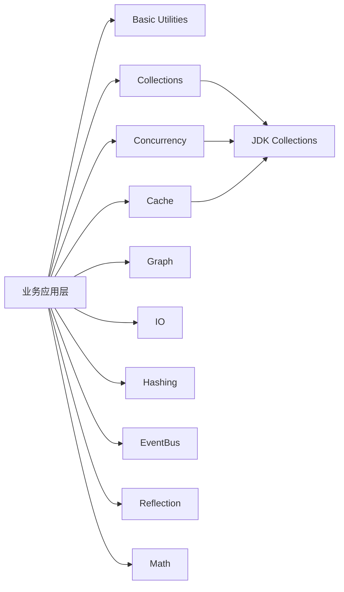

# Guava 学习专栏大纲（40章，三级进阶）

## 专栏定位
- 目标：兼顾趣味性、实战性、深度，帮助开发、测试、运维从 API 使用走向架构与源码能力。
- 结构：基础篇 15 章 + 中级篇 15 章 + 高级篇 10 章，共 40 章。
- 统一写作模板：每章均按「项目背景 -> 剧本式交锋对话 -> 项目实战 -> 项目总结」组织，单章 3000–5000 字。

## 第1章术语与原理（含架构图建议）
第 1 章建议给出 Guava 模块认知图，用于建立全局心智模型：

---

## 基础篇（第1-15章，面向新人开发与测试）

第 1 章：Guava 术语地图与工作原理总览  
目标与实战方向：理解 Guava 在工程中的定位、核心模块边界、与 JDK/Apache Commons 的关系，完成最小示例工程搭建。

第 2 章：Null 处理与 Optional 实战  
目标与实战方向：掌握 null-hostile 设计、Optional 使用边界，改造一个 NPE 高频接口。

第 3 章：Preconditions 前置校验与失败早发现  
目标与实战方向：用 Preconditions 重构参数校验逻辑，输出可读错误信息与单元测试。

第 4 章：Objects、MoreObjects 与基础对象方法增强  
目标与实战方向：规范 equals/hashCode/toString 实现，降低日志排查成本。

第 5 章：Strings 工具集快速提效（Joiner/Splitter/CaseFormat）  
目标与实战方向：完成配置解析与字段命名转换工具，覆盖常见异常输入。

第 6 章：CharMatcher 文本清洗与规则过滤  
目标与实战方向：实现敏感字符过滤、空白归一化、输入合法化流水线。

第 7 章：ImmutableList/Set/Map 不可变集合入门  
目标与实战方向：改造共享配置与常量数据，避免并发写入和误修改。

第 8 章：Lists/Sets/Maps 常用集合工具 API 速用  
目标与实战方向：用集合工具替换样板代码，完成分页结果拼装与去重。

第 9 章：Multiset 计数场景建模  
目标与实战方向：实现词频统计与热词排行，比较与 Map<String,Integer> 的可读性差异。

第 10 章：Multimap 一键处理一对多关系  
目标与实战方向：实现用户-角色、订单-标签等映射，减少手写嵌套集合代码。

第 11 章：BiMap、Table 与二维关系表达  
目标与实战方向：构建双向字典与二维配置索引，提升查询语义清晰度。

第 12 章：Range 与 DiscreteDomain 范围建模  
目标与实战方向：实现年龄段、价格区间、时间窗口判定规则。

第 13 章：Primitives 工具与基础性能优化  
目标与实战方向：掌握装箱拆箱成本，优化高频数值处理逻辑。

第 14 章：Ordering 与 Comparator 链式排序  
目标与实战方向：实现多条件排序和空值排序规则，落地排行榜功能。

第 15 章：基础篇综合实战：用户画像清洗与标签引擎（单机版）  
目标与实战方向：串联 Optional/Preconditions/Immutable 集合/Range/Ordering，完成可测试的小型规则引擎。

---

## 中级篇（第16-30章，面向核心开发与运维）

第 16 章：CacheBuilder 本地缓存架构设计  
目标与实战方向：设计缓存键、容量与过期策略，搭建本地缓存基线。

第 17 章：LoadingCache 自动加载与回源治理  
目标与实战方向：实现 CacheLoader 与异常回退，避免缓存穿透导致的雪崩。

第 18 章：缓存淘汰策略与性能压测（size/time/reference）  
目标与实战方向：评估不同驱逐策略对命中率和延迟的影响，形成调参方法。

第 19 章：RemovalListener 与缓存可观测性  
目标与实战方向：打通删除事件日志、指标上报、故障溯源链路。

第 20 章：ListenableFuture 并发编排入门  
目标与实战方向：实现并行调用聚合接口，减少串行等待时间。

第 21 章：Futures.transform/callback 异步回调与错误传播  
目标与实战方向：构建可追踪的异步流水线，解决回调地狱和异常吞噬。

第 22 章：Service 框架管理后台任务生命周期  
目标与实战方向：将定时同步任务改造为可启动、可停止、可监控服务。

第 23 章：RateLimiter 限流设计与热点保护  
目标与实战方向：实现接口分级限流，验证突发流量下系统稳定性。

第 24 章：Hashing 与 BloomFilter 防重与快速判定  
目标与实战方向：实现去重过滤链路，平衡误判率与内存成本。

第 25 章：EventBus 解耦事件驱动流程  
目标与实战方向：将订单状态流转拆成事件订阅模型，降低模块耦合。

第 26 章：IO 工具（ByteSource/CharSource/Files）工程实践  
目标与实战方向：完成大文件读取、配置加载与资源关闭规范化。

第 27 章：Graph/ValueGraph/Network 业务关系建模  
目标与实战方向：建模依赖关系与路径查询，支持拓扑视图输出。

第 28 章：Streams + Guava 协同写法与可读性权衡  
目标与实战方向：统一团队编码规范，明确何时优先 Streams、何时优先 Guava。

第 29 章：兼容性与版本升级策略（JDK/Android/Guava）  
目标与实战方向：制定升级 checklist，规避二方包冲突与方法废弃风险。

第 30 章：中级篇综合实战：高并发商品查询与本地缓存加速平台  
目标与实战方向：综合缓存、异步编排、限流、观测指标，实现可压测可回归的服务样例。

---

## 高级篇（第31-40章，面向架构师与资深开发）

第 31 章：Immutable 集合源码剖析与内存布局取舍  
目标与实战方向：理解构建过程、结构压缩策略，指导生产内存优化。

第 32 章：Concurrent 包与原子语义设计思路  
目标与实战方向：解析并发工具实现细节，形成正确的并发建模方式。

第 33 章：LocalCache 内核机制深拆（段、队列、清理）  
目标与实战方向：定位缓存抖动与长尾延迟根因，给出针对性调优方案。

第 34 章：ListenableFuture 执行模型与线程池隔离策略  
目标与实战方向：构建 CPU/IO 分池方案，降低线程饥饿和级联超时。

第 35 章：BloomFilter 参数推导与误判率工程化校准  
目标与实战方向：根据数据规模反推参数，建立离线评估与在线校准流程。

第 36 章：Graph 算法能力扩展与复杂依赖治理  
目标与实战方向：实现环路检测、关键路径分析，落地发布依赖检查器。

第 37 章：反射工具（TypeToken/Invokable）与泛型陷阱  
目标与实战方向：构建类型安全的通用组件，避免运行时类型擦除问题。

第 38 章：弃用 API 迁移与大规模代码改造策略  
目标与实战方向：制定批量替换方案与自动化测试护栏，安全推进技术债治理。

第 39 章：Guava 在 SRE 场景的稳定性治理实践  
目标与实战方向：围绕限流、缓存、异步、降级形成故障演练与应急手册。

第 40 章：高级篇综合实战：可观测、高可用、可演进的推荐服务内核  
目标与实战方向：整合缓存、并发、图建模、哈希过滤与治理策略，输出架构评审级项目案例。

---

## 角色阅读与协作建议
- 开发：按基础 -> 中级 -> 高级顺序完整学习，重点在第 16-40 章形成设计与调优能力。
- 测试：优先第 1-15 章与第 30/40 章，沉淀 API 边界、并发与缓存场景测试用例模板。
- 运维/SRE：优先第 16-30 章与第 39-40 章，关注可观测性、压测、限流和故障演练。
- 跨团队协作：每个综合实战章统一产出「接口契约 + 指标口径 + 回归清单 + 发布预案」。

## 写作落地约束（每章都要满足）
- 固定结构：项目背景（约500字）+ 剧本式交锋对话（约1200字）+ 项目实战（约1500-2000字）+ 项目总结（约500-800字）。
- 对话角色固定：小胖、小白、大师；每轮结束增加一句“技术映射”。
- 实战必须包含：环境准备、分步实现、运行结果说明、坑点与解决、测试验证、完整代码清单。
- 总结必须包含：优缺点对比、适用/不适用场景、注意事项、生产踩坑案例、思考题、部门推广建议。