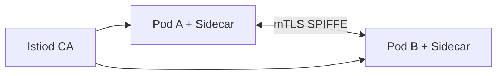

# 第10章 mTLS基础：服务间通信的自动加密

## 10.1 项目背景

**业务场景（拟真）：等保审计与「内网明文」**

审计报告：东西向 **HTTP 明文**、无法证明「调用方身份」。若用手工 TLS，每个服务证书签发、轮换、吊销会拖垮平台团队。Istio **自动 mTLS** 让 Sidecar 持有 **SPIFFE 身份** 与短周期证书，应用仍发 `http://` 到 localhost，由代理完成双向 TLS——这是零信任在数据面的落地入口。

**痛点放大**

- **横向移动风险**：单点突破后明文 RPC 可被窃听与伪造。
- **运维不可扩展**：人工证书无法跟上 Pod 弹性。
- **渐进迁移**：一刀切 STRICT 会打爆未注入工作负载。



## 10.2 项目设计：小胖、小白与大师的自动加密

**第一轮**

> **小胖**：都内网了还加密，CPU 不要钱？
>
> **小白**：PERMISSIVE 和 STRICT 啥区别？切 STRICT 会断谁？
>
> **大师**：Sidecar 之间用 **X.509 + SPIFFE ID** 双向认证；`PERMISSIVE` 同时接受明文与 mTLS，便于迁移；`STRICT` 只接受 mTLS，**未注入 Sidecar 的客户端会断**。
>
> **大师 · 技术映射**：**Citadel/istiod CA ↔ 证书签发；PeerAuthentication.mode ↔ PERMISSIVE/STRICT。**

**第二轮**

> **小白**：应用要改 HTTPS 吗？
>
> **大师**：应用对本地仍可用明文，由 Sidecar 终止/发起 TLS。对外部非网格服务需 **ServiceEntry + TLS 策略** 另行说明。

**类比**：车管所发电子车牌（SPIFFE）；路上行车自动加密对话。

## 10.3 项目实战：配置与验证mTLS

**步骤 1：理解默认（PERMISSIVE）与自检**

Istio 安装后默认 **PERMISSIVE**，Sidecar 同时接受明文与 mTLS，便于与未注入 Pod 共存。

```bash
# 检查当前mTLS状态
istioctl authn tls-check <pod-name>.<namespace>

# 典型输出：
# HOST:PORT                                  STATUS     SERVER     CLIENT     AUTHN POLICY
# order-service.order.svc.cluster.local:8080  OK         mTLS       mTLS       default/
# payment-service.pay.svc.cluster.local:9090   OK        PERMISSIVE mTLS       default/
```

**步骤 2：启用 STRICT（目标：全网格或分命名空间强制 mTLS）**

```yaml
apiVersion: security.istio.io/v1beta1
kind: PeerAuthentication
metadata:
  name: default
  namespace: istio-system  # 根命名空间，影响全网格
spec:
  mtls:
    mode: STRICT  # 强制所有服务间通信使用mTLS
```

**渐进式迁移策略**

| 阶段 | 配置 | 验证要点 |
|:---|:---|:---|
| 初始 | 全局PERMISSIVE | 确保所有服务正常通信，建立基线 |
| 命名空间试点 | 核心服务STRICT | 监控错误率，验证证书自动轮换 |
| 逐步扩大 | 更多命名空间STRICT | 关注跨命名空间调用兼容性 |
| 全局强制 | 根命名空间STRICT + 例外配置 | 遗留系统配置端口级PERMISSIVE例外 |

**步骤 3：验证加密状态与证书**

```bash
# 验证两个服务之间的mTLS协商
istioctl authn tls-check deploy/payment -n default

# 查看Envoy的证书信息
istioctl proxy-config secret <pod-name> -n <namespace>

# 详细证书内容分析
kubectl exec -it <pod-name> -c istio-proxy -- \
  openssl x509 -in /etc/certs/cert-chain.pem -text -noout | head -20
```

**证书关键字段**

| 字段 | 示例值 | 说明 |
|:---|:---|:---|
| Subject | URI:spiffe://cluster.local/ns/default/sa/httpbin | SPIFFE身份标识 |
| Issuer | CN=cluster.local | Istio集群根CA |
| Validity | 24h | 默认有效期，自动轮换 |
| SAN | URI:spiffe://... | 服务身份验证关键字段 |

**测试验证**：切 STRICT 前后对比 `tls-check` 与失败请求数；监控 `istio_cert_expiry_seconds`（若暴露）。

## 10.4 项目总结

**优点与缺点（与手工 TLS 对比）**

| 维度 | Istio 自动 mTLS | 手工证书 |
|:---|:---|:---|
| 轮换 | 短周期自动 | 易遗漏 |
| 身份 | SPIFFE 统一 | 各团队不一 |
| 开销 | CPU/握手成本 | 证书运维人力 |

**适用场景**：合规；多租户；零信任演进。

**不适用场景**：未注入 Sidecar 且无法改造的工作负载（需 PERMISSIVE 或例外）。

**典型故障**：STRICT 后未注入 Pod 不可达；istiod 异常影响证书；时钟漂移。

**思考题（参考答案见第11章或附录）**

1. PERMISSIVE 与 STRICT 在数据面行为上的主要差异是什么？
2. 为什么外部 SaaS 通常无法参与网格内 mTLS，需要哪些补充配置？

**推广与协作**：安全定迁移节奏；平台监控证书；开发确认 Sidecar 覆盖范围。

---

## 第二部分：核心能力篇（第11-22章）

---

## 编者扩展

> **本章导读**：IP 信任 → 证书身份；**实战演练**：PERMISSIVE→STRICT 窗口观测；**深度延伸**：长连接与证书轮转。

---

上一章：[第9章 网格运维基础：istioctl 诊断、分析与升级意识](第9章 网格运维基础：istioctl 诊断、分析与升级意识.md) | 下一章：[第11章 PeerAuthentication深度：细粒度的传输安全](第11章 PeerAuthentication深度：细粒度的传输安全.md)

*返回 [专栏目录](README.md)*
