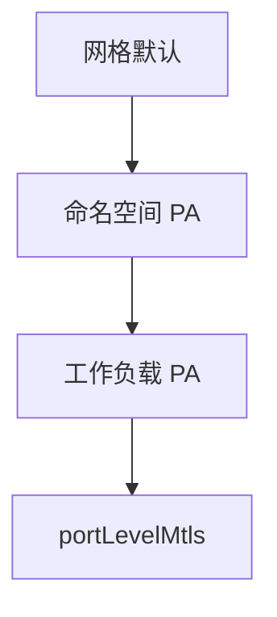

# 第11章 PeerAuthentication深度：细粒度的传输安全

## 11.1 项目背景

**业务场景（拟真）：支付要 STRICT，Prometheus 还不会 mTLS**

核心支付已计划 **全 STRICT**，但监控侧 Prometheus 仍直连 `9090` 拉指标、LB 健康探测走 **明文 HTTP**——若整工作负载一刀切 STRICT，采集与健康检查会同时挂。需要 **PeerAuthentication**：在网格/命名空间/工作负载分层叠加，并用 **portLevelMtls** 给单端口「开例外」。

**痛点放大**

- **一刀切**：根命名空间 STRICT 未评估采集路径 → 生产静默失败。
- **策略叠加心智**：`UNSET`、selector、端口级覆盖的优先级需与团队对齐。
- **遗留兼容**：部分 sidecar 外客户端短期无法 TLS。



## 11.2 项目设计：小胖、小白与大师的细粒度传输策略

**第一轮**

> **小胖**：加密还搞这么多层？安全部门开心，我们运维头发掉光。
>
> **小白**：端口级 DISABLE 和 PERMISSIVE 啥区别？健康检查一定要 DISABLE 吗？
>
> **大师**：分层是为了 **渐进加固**：网格→命名空间→工作负载。`portLevelMtls` 解决「同一 Pod 里业务端口 STRICT、采集端口明文」这类现实约束。DISABLE 该端口完全不参与 mTLS；PERMISSIVE 仍接受双方。
>
> **大师 · 技术映射**：**PeerAuthentication ↔ 传输认证；portLevelMtls ↔ 端口例外。**

**第二轮**

> **小白**：`UNSET` 什么时候用？
>
> **大师**：工作负载策略里 **继承上级**、只改个别端口时用 `UNSET` 避免重复声明 mode。

## 11.3 项目实战：多层次mTLS策略配置

**步骤 1：工作负载级 + 端口例外**

```yaml
apiVersion: security.istio.io/v1beta1
kind: PeerAuthentication
metadata:
  name: payment-core-policy
  namespace: payment
spec:
  selector:
    matchLabels:
      app: payment-core
      tier: critical
  mtls:
    mode: STRICT
  portLevelMtls:
    # 健康检查端口：负载均衡器探测需要明文
    8080:
      mode: DISABLE
    # 监控指标端口：Prometheus采集，计划Q2接入网格
    9090:
      mode: PERMISSIVE  # 过渡期允许明文
    # 调试端口：仅开发环境启用
    5005:
      mode: DISABLE
```

**步骤 2：继承与 UNSET**

```yaml
apiVersion: security.istio.io/v1beta1
kind: PeerAuthentication
metadata:
  name: inherit-with-exception
  namespace: payment
spec:
  selector:
    matchLabels:
      app: legacy-adapter
  mtls:
    mode: UNSET  # 继承命名空间的STRICT设置
  portLevelMtls:
    # 仅对特定端口覆盖
    3306:  # MySQL兼容端口
      mode: DISABLE
```

**测试验证**：`istioctl authn tls-check` 针对受影响 Pod；LB 探测与 metrics 拉取各测一次。

## 11.4 项目总结

**优点与缺点**

| 维度 | PeerAuthentication 分层 | 仅全局 STRICT |
|:---|:---|:---|
| 渐进 | 可端口例外 | 易误伤采集/探活 |
| 复杂度 | 高，要文档化 | 低 |

**适用场景**：混合安全等级；Prometheus/探活明文过渡；遗留客户端。

**不适用场景**：希望「一条策略管全世界」且无例外需求（仍建议显式评审）。

**典型故障**：探活端口被加密；策略优先级理解错误；selector 未命中。

**思考题（参考答案见第12章或附录）**

1. `portLevelMtls` 与全局 `mode: STRICT` 同时存在时，冲突如何消解（用文字描述优先级）？
2. mTLS 与 NetworkPolicy 各解决哪一类问题？各举一个单点不足的例子。

**推广与协作**：安全定分层标准；SRE 维护例外清单；监控团队排 mTLS 采集路线图。

---

## 编者扩展

> **本章导读**：谁必须加密——契约落到工作负载与端口；**实战演练**：单 Deployment STRICT + 未注入访问失败；**深度延伸**：与 NetworkPolicy 互补。

---

上一章：[第10章 mTLS基础：服务间通信的自动加密](第10章 mTLS基础：服务间通信的自动加密.md) | 下一章：[第12章 AuthorizationPolicy：零信任的访问控制](第12章 AuthorizationPolicy：零信任的访问控制.md)

*返回 [专栏目录](README.md)*
