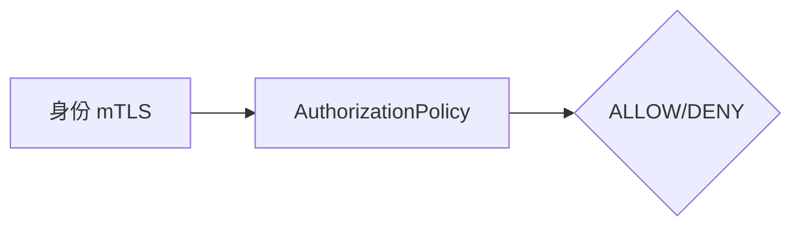

# 第12章 AuthorizationPolicy：零信任的访问控制

## 12.1 项目背景

**业务场景（拟真）：支付只能被订单调，管理端只读**

支付服务暴露 `/charge`、`/refund` 等敏感接口；**防火墙只能按 IP/端口**，无法表达「**SPIFFE 身份**为 `order-service` 的服务账户才允许 POST」。**AuthorizationPolicy** 在 Sidecar 上执行 **L7 授权**：`from`（谁）、`to`（做什么）、`when`（附加条件），与 mTLS 身份绑定，替代散落在各仓库的 `if (role==admin)`。

**痛点放大**

- **越权**：同命名空间内任意服务默认可达，若未设策略则「内网即信任」。
- **审计**：代码里改权限难追溯；策略 YAML 可 Git 审计。
- **默认拒绝**：从 ALLOW 渐进到 DENY 需 Runbook，避免误杀。



## 12.2 项目设计：小胖、小白与大师的零信任防线

**第一轮**

> **小胖**：应用里写权限判断不就行了？搞这么多 YAML。
>
> **小白**：`from.principals` 和 K8s ServiceAccount 怎么对应？DENY 和 ALLOW 谁优先？
>
> **大师**：策略在数据面执行，**语言无关**、**集中审计**。`principals` 来自 SPIFFE 身份（与 mTLS 一致）。Istio 评估顺序：**CUSTOM → DENY → ALLOW**（以当前版本文档为准，升级前核对 Release Notes）。
>
> **大师 · 技术映射**：**AuthorizationPolicy ↔ L7 RBAC；from/to/when ↔ 来源/操作/条件。**

**第二轮**

> **小白**：默认拒绝怎么上？先 ALLOW 再收紧？
>
> **大师**：生产推荐 **渐进**：先观测流量基线，再按服务粒度加 ALLOW，最后缩紧；必要时用 `audit` 模式（若版本支持）或先日志验证。

## 12.3 项目实战：多维度授权策略配置

**步骤 1：工作负载选择器 + ALLOW 规则**

```yaml
apiVersion: security.istio.io/v1beta1
kind: AuthorizationPolicy
metadata:
  name: payment-service-policy
  namespace: payment
spec:
  selector:
    matchLabels:
      app: payment-service
  action: ALLOW
  rules:
  # 规则1：order-service可以扣款
  - from:
    - source:
        principals: ["cluster.local/ns/order/sa/order-service"]
    to:
    - operation:
        methods: ["POST"]
        paths: ["/charge", "/refund"]
  
  # 规则2：admin-service可以查询
  - from:
    - source:
        principals: ["cluster.local/ns/admin/sa/admin-service"]
    to:
    - operation:
        methods: ["GET"]
        paths: ["/transactions", "/balance"]
  
  # 默认拒绝所有其他访问
```

**步骤 2：验证**

```bash
# 以当前 istioctl 版本为准
istioctl authz check <pod-name> -n payment
```

**可能踩坑**：selector 未命中 Pod；principal 与 SA 不一致；与 RequestAuthentication 未配合导致 JWT 不可用。

## 12.4 项目总结

**优点与缺点（与应用内 RBAC 对比）**

| 维度 | AuthorizationPolicy | 应用内 if |
|:---|:---|:---|
| 一致性 | 全网格统一 | 各语言分裂 |
| 审计 | YAML/Git | 难 |
| 性能 | Sidecar 评估 | 应用 CPU |

**适用场景**：敏感微服务；多租户；合规「谁访问谁」证据链。

**不适用场景**：极复杂业务规则（可 ext-authz）；无 Sidecar 流量。

**典型故障**：策略过严 403；principal 写错；与 PA mTLS 未就绪。

**思考题（参考答案见第13章或附录）**

1. 仅有 mTLS、没有 AuthorizationPolicy 时，「任意已注入服务」是否仍可能访问支付接口？为什么？
2. 何时需要 `ext-authz` 外部授权服务？

**推广与协作**：安全定 principal 命名规范；开发列资源与操作矩阵；测试矩阵化用例。

---

## 编者扩展

> **本章导读**：验票（RequestAuthentication）与进厅（AuthorizationPolicy）分工；**实战演练**：`authz check`；**深度延伸**：CUSTOM/DENY/ALLOW 顺序与 ext-authz。

---

上一章：[第11章 PeerAuthentication深度：细粒度的传输安全](第11章 PeerAuthentication深度：细粒度的传输安全.md) | 下一章：[第13章 RequestAuthentication：终端用户身份与 JWT 验证](第13章 RequestAuthentication：终端用户身份与 JWT 验证.md)

*返回 [专栏目录](README.md)*
