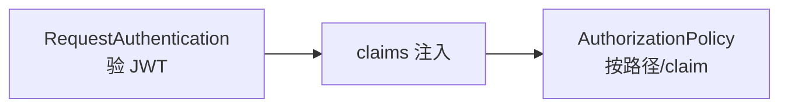

# 第13章 RequestAuthentication：终端用户身份与 JWT 验证

## 13.1 项目背景

**业务场景（拟真）：统一入口上的「用户是谁」**

管理后台与开放 API 共用 `api-gateway`：安全要求 **OAuth2/OIDC 颁发的 JWT** 在入口即验签，且 **`/admin` 仅内部员工组**可访问。仅 mTLS 只能证明「订单服务在调支付」，无法证明「是哪个员工或租户」——**终端身份**必须靠 **RequestAuthentication**（验令牌）+ **AuthorizationPolicy**（按 claim 授权）。

**痛点放大**

- **重复造轮子**：每个服务自己验 JWT，密钥轮换与 issuer 漂移难统一。
- **401 vs 403**：认证失败与授权拒绝需分层排障。
- **预检与令牌**：浏览器 CORS 预检（OPTIONS）与 Bearer 共存需规划。



## 13.2 项目设计：小胖、小白与大师的「你是谁 vs 你能做什么」

**第一轮**

> **小胖**：网关验一遍 JWT，后面服务再验一遍，算双份保险还是双份浪费？
>
> **小白**：`jwksUri` 挂了会怎样？`forwardOriginalToken` 要不要开？
>
> **大师**：RequestAuthentication 在 **Sidecar** 执行验签与元数据提取；**AuthorizationPolicy** 用 `request.auth.claims[...]` 做授权。JWKS 可用性要做缓存与告警；是否转发原 Token 取决于后端是否还要读完整 JWT。
>
> **大师 · 技术映射**：**RequestAuthentication ↔ JWT 验证；AuthorizationPolicy ↔ 基于 claims 的 L7 授权。**

**第二轮**

> **小白**：issuer/aud 写错会怎样？
>
> **大师**：典型 **401**——认证阶段失败；若认证通过但策略拒绝，多为 **403**。排障时先看响应码与 `istio` 访问日志。

**类比**：mTLS 像园区工牌；JWT 像业务系统登录态——进门与进财务室是两道逻辑。

## 13.3 项目实战：RequestAuthentication 与 AuthorizationPolicy 组合

**步骤 1：RequestAuthentication + AuthorizationPolicy**

```yaml
apiVersion: security.istio.io/v1beta1
kind: RequestAuthentication
metadata:
  name: api-jwt
  namespace: production
spec:
  selector:
    matchLabels:
      app: api-gateway
  jwtRules:
  - issuer: "https://auth.example.com/"
    jwksUri: "https://auth.example.com/.well-known/jwks.json"
    audiences:
    - "api.example.com"
    forwardOriginalToken: true
---
apiVersion: security.istio.io/v1beta1
kind: AuthorizationPolicy
metadata:
  name: admin-api
  namespace: production
spec:
  selector:
    matchLabels:
      app: api-gateway
  action: ALLOW
  rules:
  - to:
    - operation:
        paths: ["/admin/*"]
    when:
    - key: request.auth.claims[groups]
      values: ["employees"]
  - to:
    - operation:
        paths: ["/public/*"]
```

**步骤 2：验证**

```bash
# 验证 JWT 校验是否生效（需携带有效 Bearer Token）
curl -H "Authorization: Bearer $TOKEN" https://api.example.com/admin/health -vk
```

**可能踩坑**：issuer/aud 与 IdP 不一致；时钟 skew；未处理 OPTIONS。

## 13.4 项目总结

**优点与缺点（与应用内验签对比）**

| 维度 | RequestAuthentication + Authz | 每服务自验 JWT |
|:---|:---|:---|
| 一致性 | 入口统一 | 库与密钥分裂 |
| 运维 | JWKS 一处配置 | 多处轮换 |

**适用场景**：API 网关、BFF、多租户 SaaS。

**不适用场景**：无 JWT 的内网 RPC；需复杂外部 ABAC（考虑 ext-authz）。

**典型故障**：401（验签失败）；403（claim 不满足）；JWKS 拉取失败。

**思考题（参考答案见第14章或附录）**

1. 仅有 RequestAuthentication、无 AuthorizationPolicy 时，未携带 JWT 的请求通常如何被处理（需结合默认拒绝语义说明）？
2. `forwardOriginalToken: true` 的主要用途与隐私风险各是什么？

**推广与协作**：安全对接 IdP 与 audience；开发列路径与 claim 矩阵；测试覆盖 401/403/过期令牌。

---

## 编者扩展

> **本章导读**：验签与授权分层；**实战演练**：对比有效/无效/过期 Token；**深度延伸**：401/403 与 ext-authz。

### 实战演练

用 Keycloak/Okta 或 `jwt.io` 生成的 token 测一条合法与过期请求；在 Envoy 访问日志里找 `authorization` 相关字段（注意脱敏）。

### 深度延伸

对比 **网关终止 JWT** 与 **每跳传递** 的 trust 边界；简述 bearer token 在服务间传递时的最小暴露原则。

---

上一章：[第12章 AuthorizationPolicy：零信任的访问控制](第12章 AuthorizationPolicy：零信任的访问控制.md) | 下一章：[第14章 金丝雀发布：渐进式交付的艺术](第14章 金丝雀发布：渐进式交付的艺术.md)

*返回 [专栏目录](README.md)*
