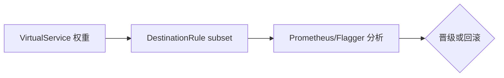

# 第14章 金丝雀发布：渐进式交付的艺术

## 14.1 项目背景

**业务场景（拟真）：订单服务 v2 从 5% 到 100%**

大版本上线若一次全量，故障爆炸半径等于全部用户。**金丝雀**用 **VirtualService 权重 + DestinationRule 子集** 把新版本先接 5% 流量，配合 **错误率/P99/业务 KPI** 门禁再逐步放大；必要时 **一条 YAML 回滚**到 0%。Istio 提供路由层能力；**Flagger/Argo Rollouts** 提供自动化分析与晋级。

**痛点放大**

- **只改权重不看指标**：比例上去了，监控没跟上，等于盲飞。
- **会话与数据**：粘性会话、Schema 不兼容会导致「小流量也乱」。
- **双版本成本**：两套 Deployment 与资源需纳入容量规划。



## 14.2 项目设计：小胖、小白与大师的灰度大戏

**第一轮**

> **小胖**：5% 和 95% 用户会不会同一单跨两个版本？数据乱了咋办？
>
> **小白**：手写改权重和 Flagger 自动晋级差在哪？回滚只改 VS 就够吗？
>
> **大师**：金丝雀是**路由层**分流；数据面要 **向后兼容、幂等、特性开关** 配合。Flagger 用指标门禁自动改权重；手写适合强定制。回滚至少把 **canary 权重置 0** 并确认指标，必要时 **Deployment 回滚**。
>
> **大师 · 技术映射**：**subset + weight ↔ 金丝雀；分析门禁 ↔ Flagger/运维 Runbook。**

**第二轮**

> **大师**：先定 **SLO**（成功率、P99）与 **观察窗口**，再动比例——否则「渐进」只是心理安慰。

## 14.3 项目实战：完整的金丝雀发布流水线

**步骤 1：VirtualService 5%/95%**

```yaml
# 阶段1：5%金丝雀流量
apiVersion: networking.istio.io/v1beta1
kind: VirtualService
metadata:
  name: order-service-canary
spec:
  hosts:
  - order-service
  http:
  - route:
    - destination:
        host: order-service
        subset: stable
      weight: 95
    - destination:
        host: order-service
        subset: canary
      weight: 5

---
# 结合Flagger实现自动化
apiVersion: flagger.app/v1beta1
kind: Canary
metadata:
  name: order-service
spec:
  targetRef:
    apiVersion: apps/v1
    kind: Deployment
    name: order-service
  service:
    port: 8080
  analysis:
    interval: 1m
    threshold: 5
    maxWeight: 50
    stepWeight: 10
    metrics:
    - name: request-success-rate
      thresholdRange:
        min: 99
    - name: request-duration
      thresholdRange:
        max: 500
```

**步骤 2（可选）**：结合 Flagger `Canary` CR 做自动分析（需集群已安装 Flagger）。

**测试验证**：晋级前后对比 `istio_requests_total`、P99；回滚演练将 canary weight→0。

## 14.4 项目总结

**优点与缺点**

| 维度 | Istio 权重金丝雀 | 一次全量发布 |
|:---|:---|:---|
| 风险半径 | 小 | 大 |
| 复杂度 | 双版本+路由+观测 | 低 |

**适用场景**：核心服务、大版本、敏感变更。

**不适用场景**：强 Schema 无法双写兼容且无法 feature flag（需先解数据）。

**典型故障**：subset 标签错误；指标滞后误判晋级；会话粘到旧版。

**思考题（参考答案见第15章或附录）**

1. 金丝雀阶段若 canary Pod 数很少，统计显著性不足时如何决策（定性说明）？
2. Flagger 分析失败自动回滚时，通常应改动哪些 Istio 资源？

**推广与协作**：SRE 定指标门禁；开发保证 API 兼容；测试预发全链路验收。

---

## 编者扩展

> **本章导读**：可观测 + 可回滚的渐进发布；**实战演练**：5%/95% + Runbook；**深度延伸**：Flagger vs 手写。

---

上一章：[第13章 RequestAuthentication：终端用户身份与 JWT 验证](第13章 RequestAuthentication：终端用户身份与 JWT 验证.md) | 下一章：[第15章 东西向网关与多集群流量：East-West Gateway 入门](第15章 东西向网关与多集群流量：East-West Gateway 入门.md)

*返回 [专栏目录](README.md)*
