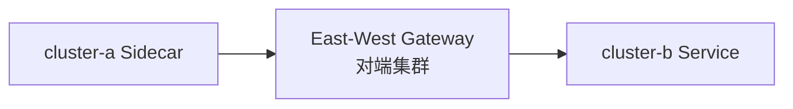

# 第15章 东西向网关与多集群流量：East-West Gateway 入门

## 15.1 项目背景

**业务场景（拟真）：双活集群里的 `catalog` 互访**

同城 **cluster-a / cluster-b** 各跑一套 `catalog`，业务希望 **故障时互调**，且流量仍走 **mTLS、可观测、可策略**。公网裸连或纯 VPN 往往只有连通，没有「服务身份 + 指标分解」。**East-West Gateway** 把**集群间 RPC** 变成网格内的「第二类南北向」——先过 **E-W 门脸**，再进本集群 Sidecar。

**痛点放大**

- **发现与命名**：`*.svc.cluster.local` 默认不跨集群，需多集群 DNS / 全局服务名方案。
- **信任**：根 CA、中间 CA 与 **remote secret** 需平台一次性做对。
- **与 Ingress 混淆**：对外用户走 Ingress；集群间走 East-West。



**说明**：完整多集群安装步骤以 [Istio 多集群文档](https://istio.io/latest/docs/setup/install/multicluster/) 为准；本章聚焦 **Gateway/VS 概念**。

## 15.2 项目设计：小胖、小白与大师的「集群间收费站」

**第一轮**

> **小胖**：多集群不就是 VPN 打通吗？还要专门网关？
>
> **小白**：共享控制面 vs 多控制面选哪个？East-West 端口 15443 干啥用？
>
> **大师**：连通≠治理。E-W Gateway 提供 **集群间 mTLS 入口** 与路由挂载点，便于和网格策略一致。拓扑（单/多控制面）决定 **证书与 secret 分发** 方式；15443 为常见 **ISTIO_MUTUAL** 监听（以实际安装为准）。
>
> **大师 · 技术映射**：**East-West Gateway ↔ 跨集群 TLS 入口；mesh + gateway 绑定 ↔ 集群内与跨集群路由。**

**第二轮**

> **小白**：和 Ingress 区别？
>
> **大师**：**Ingress**：公网/边缘用户；**East-West**：集群间服务流量，常由平台统一 DNS 与防火墙策略。

**类比**：Ingress 像机场；East-West 像高铁站换乘口。

## 15.3 项目实战：East-West Gateway 概念配置

**步骤 1：Gateway（集群间监听）**

```yaml
apiVersion: networking.istio.io/v1beta1
kind: Gateway
metadata:
  name: eastwest-gateway
  namespace: istio-system
spec:
  selector:
    istio: eastwestgateway
  servers:
  - port:
      number: 15443
      name: tls
      protocol: TLS
    tls:
      mode: ISTIO_MUTUAL
    hosts:
    - "*.local"
```

**步骤 2：VirtualService 绑定 mesh 与 eastwest**

```yaml
apiVersion: networking.istio.io/v1beta1
kind: VirtualService
metadata:
  name: catalog-cross-cluster
  namespace: catalog
spec:
  hosts:
  - catalog.catalog-global.svc.cluster.local
  gateways:
  - mesh
  - istio-system/eastwest-gateway
  http:
  - route:
    - destination:
        host: catalog.catalog-global.svc.cluster.local
        port:
          number: 8080
```

**步骤 3：验证**

```bash
istioctl proxy-config cluster deploy/catalog -n catalog | grep -i global
```

**可能踩坑**：`gateways` 列表未包含 eastwest；对端服务未导出；防火墙未放行 15443。

## 15.4 项目总结

**优点与缺点**

| 维度 | East-West + 网格 | 仅 VPN 连通 |
|:---|:---|:---|
| mTLS/策略 | 统一 | 无 |
| 运维 | 高 | 中 |

**适用场景**：多活、隔离集群互访、合规分区。

**不适用场景**：单集群（无需 E-W）。

**典型故障**：remote secret 错误；DNS 无法解析全局服务名；TLS 握手失败。

**思考题（参考答案见第16章或附录）**

1. 为何 East-West Gateway 常与 `ISTIO_MUTUAL` 一同出现？
2. 多集群场景下，`VirtualService` 同时写 `mesh` 与 `istio-system/east-west-gateway` 的意图是什么？

**推广与协作**：平台负责拓扑与证书；网络放行端口；应用使用全局服务名。

---

## 编者扩展

> **本章导读**：集群间握手门面；**实战演练**：`proxy-config cluster` 查 global；**深度延伸**：单/多控制面选型。

### 实战演练

在单集群先用文档画出「子集群 A ↔ 子集群 B」的证书与 discovery 信任链；若环境允许，部署最小多集群并验证 `istioctl remote-clusters`。

### 深度延伸

primary-remote vs multi-primary 在运维负担与脑裂风险上的权衡表（各写三条）。

---

上一章：[第14章 金丝雀发布：渐进式交付的艺术](第14章 金丝雀发布：渐进式交付的艺术.md) | 下一章：[第16章 熔断与降级：韧性设计的核心](第16章 熔断与降级：韧性设计的核心.md)

*返回 [专栏目录](README.md)*
