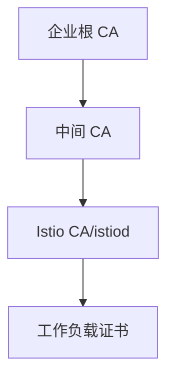

# 第19章 自定义 CA 与证书：企业 PKI 与 Istio 的衔接

## 19.1 项目背景

**业务场景（拟真）：合规要求「工作负载证书链到公司 PKI」**

POC 阶段 Istio **自签根**足够；进入生产，金融/政务常要求：**私钥进 HSM/KMS**、**链到企业根**、**吊销与审计**可对接。直接替换根会导致 **全网格 mTLS 握手失败**——必须 **双信任、灰度、再收敛**。

**痛点放大**

- **一刀切换根**：数据面不信任新链 → 业务全断。
- **中间 CA 与签发频率**：要与 Istio 工作负载证书 TTL 匹配运维节奏。
- **多集群**：根/中间证书分发与 **cacerts** 一致性。



## 19.2 项目设计：小胖、小白与大师的「信任锚」

**第一轮**

> **小胖**：证书不就是文件吗？换一套新的分发下去不就完了？
>
> **小白**：双信任阶段要持续多久？谁监控握手失败率？
>
> **大师**：**信任锚变更**是变更事件。新旧根/中间须**同时**被 Sidecar 信任，再切签发与再移除旧锚。监控 **TLS 错误、istiod 签发、证书过期指标**。
>
> **大师 · 技术映射**：**cacerts/Secret ↔ 信任链；中间 CA ↔ 合规与自动化平衡。**

**第二轮**

> **大师**：企业流程慢 → 用 **企业签的中间 CA** 给 Istio 用，工作负载仍自动化签发。

## 19.3 项目实战：概念步骤（需结合企业 PKI 流程）

**步骤 1：检视当前链**

```bash
# 检查当前 CA 与证书链（示例）
kubectl get secret -n istio-system istio-ca-secret -o yaml
istioctl proxy-config secret <pod> -n <ns>
```

**检查清单**

| 阶段 | 动作 |
|:---|:---|
| 准备 | 生成中间 CA、私钥管控、备份 |
| 并行 | 双根信任、观察握手失败指标 |
| 收敛 | 去掉旧根、回收权限 |

**步骤 2**：在测试集群演练双信任与滚动工作负载（勿直接生产单步替换）。

## 19.4 项目总结

**优点与缺点**

| 维度 | 企业 PKI 衔接 | 默认自签 |
|:---|:---|:---|
| 合规 | 强 | 弱 |
| 复杂度 | 高 | 低 |

**适用场景**：金融政企；多集群统一信任。

**不适用场景**：纯内网 POC（可默认 CA）。

**典型故障**：单步换根；cacerts 未同步；私钥泄露。

**思考题（参考答案见第20章或附录）**

1. 为何「双信任」阶段在根轮换中几乎总是必要？
2. 中间 CA 方案相比直接让 Istio 自签根，主要解决什么组织问题？

**推广与协作**：安全/PKI 主导流程；平台执行轮换；SRE 监控握手与过期。

---

## 编者扩展

> **本章导读**：信任根级变更；**实战演练**：测试集群 openssl 链；**深度延伸**：中间 CA 与回退。

---

上一章：[第18章 DNS 代理与流量捕获细节：为什么“解析对了”仍连错](第18章 DNS 代理与流量捕获细节：为什么“解析对了”仍连错.md) | 下一章：[第20章 Sidecar 资源治理：配额、限制与调度协同](第20章 Sidecar 资源治理：配额、限制与调度协同.md)

*返回 [专栏目录](README.md)*
