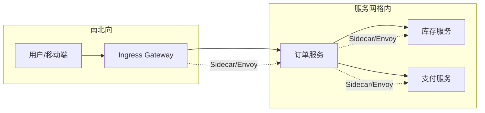

# 第1章 Istio架构详解：掌控微服务的中枢神经系统

## 1.1 项目背景

**业务场景（拟真）：促销季的订单链路**

设想一家正在做「618」大促的电商平台：下单服务调用库存、支付、优惠券、风控等多个后端。团队把单体拆成十几个微服务后，业务迭代变快了，但线上却开始出现「偶发超时」「同一接口 Java 和 Go 两套重试策略互相放大」「出了问题不知道请求到底经过了哪几跳」等现象。架构组接到诉求：在不冻结业务开发的前提下，把**服务间通信**变成可治理、可观测、可渐进加固的一层基础设施——这正是本章要引出的 Istio 服务网格。

**痛点放大：没有这一层时，具体问题是什么**

- **一致性与可维护性**：每个团队在各自语言里手写熔断、重试、超时，行为不一致，排障时无法复现「当时到底重试了几次」。
- **性能与弹性**：Kubernetes Service 只做四层转发，无法按版本、Header、权重做细粒度分流；金丝雀、灰度往往依赖入口网关「打补丁」，与东西向流量脱节。
- **安全与合规**：服务间明文 HTTP、证书各自管理，审计问「谁访问了谁」时只能翻零散日志，难以形成**身份 + 策略**的统一证据链。

下面用一张简化的调用关系图，帮助建立「用户请求如何在集群里穿行」的心智（细节将在后续章节展开）。



**本章主题映射**：Istio 通过**控制面（istiod）+ 数据面（Envoy Sidecar）**把上述能力从业务代码中抽离，用声明式 API 统一治理；接下来用一节「剧本式对话」把抽象落到角色分工上。

## 1.2 项目设计：小胖、小白与大师的架构交锋

**场景设定**：团队刚接入 Istio，Java 开发小白发现 Pod 里多了一个 `istio-proxy`；后端「吃货」小胖觉得多一个容器费钱费电；架构负责人大师要把**业务约束**和**技术选型**说透。

**第一轮：小胖开球 → 小白追问 → 大师落锤**

> **小胖**：这不就跟食堂打饭多排一队吗？我业务容器一个就够，非要再塞个「跟班」图啥？多占内存你请客啊？
>
> **小白**：我补充一下技术细节——这个跟班会拖慢启动吗？如果它挂了，我的进程是不是也跟着被 kubelet 判死刑？
>
> **大师**：Sidecar 不是「为了多一个容器」，而是把**流量治理**从业务里抽出去。`istio-proxy` 本质是 Envoy：进出的连接先经过它，再由它跟 `istiod` 下发的 xDS 配置对齐——路由、mTLS、指标、访问日志都在这一层统一做。应用容器仍然跑你的业务；Sidecar 挂了，Kubernetes 会按 Pod 语义处理，生产上我们会配好探针、资源和版本，避免「跟班」成为单点糊涂账。
>
> **大师 · 技术映射**：**数据平面 = Envoy Sidecar；控制平面 = istiod；策略与发现 = xDS 动态配置下发。**

**第二轮：从「司令部」到「语言无关」**

> **小胖**：行吧，那为啥不直接在 Java 里用个现成 SDK 搞定？我们公司又不会十种语言一起上。
>
> **小白**：SDK 方案边界在哪？比如我们要全局改超时、要做服务间 TLS，每个仓库发一版吗？和 Envoy 比，谁更适合做审计口径一致的访问日志？
>
> **大师**：SDK 能解决问题，但会带来**版本碎片化**和**治理行为不一致**。Istio 的方向是：业务保持多语言，治理策略在控制面一份 YAML，全网格复用；证书轮转、L7 策略、遥测字段对齐，都按平台走。代价就是每个 Pod 多一份 Sidecar 成本——这是显式要付的「治理税」，用容量规划换一致性与演进速度。
>
> **大师 · 技术映射**：**策略集中 = Istio CRD + istiod；数据面执行 = Envoy Filter Chain；与语言解耦 = Sidecar 代理拦截。**

**第三轮：Kubernetes 与服务网格的分工**

> **小胖**：K8s 不是已经有 Service 了吗？再加一层 mesh，我是不是要学两套东西？
>
> **小白**：对，Service 只做四层负载均衡，那七层路由、mTLS、按 Header 分流，应该落在哪？入口和东西向能不能同一套模型描述？
>
> **大师**：可以这么记：**Kubernetes 负责调度与连通**（Pod 起来、有 IP、能 DNS 解析）；**Istio 在连通之上做「策略与可观测」**（谁可以访问谁、超时重试、金丝雀、服务间身份）。入口用 Gateway / VirtualService，服务间继续用同一套对象模型，运维用 `istioctl` 把数据面对齐到控制面意图。
>
> **大师 · 技术映射**：**K8s Service/Endpoint → 发现与负载；Istio → L7 与零信任策略、遥测与渐进式发布。**

**小结**：把 Istio 想成「微服务的交通指挥中心」——`istiod` 定规则，Envoy Sidecar 在每条链路上执行；业务车辆只关心目的地，不必自建整套红绿灯。

## 1.3 项目实战：从零部署 Istio 控制平面与数据平面

**环境准备**

- **依赖**：Kubernetes 集群（1.28+ 与 Istio 支持矩阵对照）、`kubectl` 可用；本机可执行 `curl`。
- **版本**：示例以 `istio-1.21.x` 与 `istioctl` 为准；若你使用其他版本，请把路径与镜像标签换成对应版本。

**分步实现**

**步骤 1：安装控制面（目标：集群内出现 `istio-system` 且 `istiod` 就绪）**

Istio 提供多种安装方式，其中 `istioctl` 最常用。以下命令演示典型安装：

```bash
# 下载并安装istioctl
curl -L https://istio.io/downloadIstio | sh -
cd istio-1.21.0
export PATH=$PWD/bin:$PATH

# 查看可用的配置profile
istioctl profile list
# 输出：default, demo, minimal, empty, preview, ambient

# 使用demo profile安装（适合学习和测试，包含所有功能组件）
istioctl install --set profile=demo -y

# 验证安装
kubectl get pods -n istio-system
```

**预期输出（文字描述）**：`istiod`、（若选用 demo）`istio-ingressgateway` 等 Pod 为 `Running` / `READY` 正常。

**可能踩坑**：`ImagePullBackOff` → 检查镜像仓库可达性或预先同步镜像；`Webhook` 失败 → 核对 API Server 到 `istiod` 的连通与证书。

`istioctl` 支持多种 profile，资源占用与功能差异如下：

| Profile   | 适用场景    | 控制平面组件                                         | 资源占用 | 功能特性                                 |
| --------- | ------- | ---------------------------------------------- | ---- | ------------------------------------ |
| `minimal` | 仅需要流量管理 | istiod                                         | 最低   | 基础路由、负载均衡                            |
| `default` | 标准生产环境  | istiod + ingressgateway                        | 中等   | 完整流量管理、可观测性                          |
| `demo`    | 学习评估    | istiod + ingressgateway + egressgateway + 附加组件 | 较高   | 完整功能+Kiali、Prometheus、Grafana、Jaeger |
| `empty`   | 自定义高级配置 | 无                                              | 按需   | 完全自定义                                |

**步骤 2：启用命名空间自动注入（目标：新 Pod 自动带 `istio-proxy`）**

Istio 的自动注入基于 Kubernetes `MutatingAdmissionWebhook`。为命名空间启用注入：

```bash
# 为default命名空间启用自动注入
kubectl label namespace default istio-injection=enabled

# 验证标签
kubectl get namespace default -o jsonpath='{.metadata.labels.istio-injection}'
# 输出：enabled
```

在Pod级别，可以通过注解覆盖注入行为：

```yaml
apiVersion: v1
kind: Pod
metadata:
  name: myapp
  annotations:
    sidecar.istio.io/inject: "false"  # 禁用注入
    # 或自定义注入参数
    proxy.istio.io/config: '{"holdApplicationUntilProxyStarts": true}'
spec:
  containers:
  - name: app
    image: myapp:v1
```

**步骤 3：部署示例 `sleep` 并验证 Sidecar（目标：2/2 容器、iptables 拦截生效）**

以官方 `samples/sleep` 为例，验证注入与出向访问：

```bash
# 部署sleep服务
kubectl apply -f samples/sleep/sleep.yaml

# 查看Pod状态，确认2/2容器就绪
kubectl get pod -l app=sleep
# 输出：sleep-xxxxxx 2/2 Running

# 查看Pod详情，确认容器组成
kubectl get pod -l app=sleep -o jsonpath='{.items[0].spec.containers[*].name}'
# 输出：sleep istio-proxy

# 进入Pod，测试外部访问
kubectl exec -it deploy/sleep -- curl -sS http://httpbin.org/headers
```

**预期输出**：`kubectl get pod -l app=sleep` 显示 `2/2 Running`；`kubectl get pod ... -o jsonpath='{.items[0].spec.containers[*].name}'` 为 `sleep istio-proxy`。

**可能踩坑**：仍为 `1/1` → 命名空间未打 `istio-injection=enabled` 或 Revision 标签与当前控制面不一致；出向访问失败 → 检查 `ServiceEntry` / 出口策略（进阶章节）。

**关键观察**：`istio-init` 写入 iptables，将流量重定向到 Envoy 监听端口（常见为 15001/15006 等，随版本与模式可能变化），可在 `kubectl describe pod` 中核对注解与事件。

**步骤 4：用 `istioctl proxy-config` 对照控制面意图（目标：能读出 listener/cluster/route）**

`istioctl proxy-config` 可直接查询 Envoy 管理接口，核对运行态配置：

```bash
# 获取sleep Pod的Envoy监听器配置
istioctl proxy-config listener $(kubectl get pod -l app=sleep -o jsonpath='{.items[0].metadata.name}')

# 获取集群（上游服务）配置
istioctl proxy-config cluster $(kubectl get pod -l app=sleep -o jsonpath='{.items[0].metadata.name}')

# 获取路由配置
istioctl proxy-config route $(kubectl get pod -l app=sleep -o jsonpath='{.items[0].metadata.name}')

# 获取完整配置dump（用于深度分析）
istioctl proxy-config all $(kubectl get pod -l app=sleep -o jsonpath='{.items[0].metadata.name}') -o json > envoy-config.json
```

这些命令输出的配置，正是 Istio 通过 xDS 下发给 Envoy 的。对比不同 Pod 可观察服务发现、路由与集群对象如何落到数据面。

**测试验证**

```bash
# 快速健康检查：控制面 Pod
kubectl get pods -n istio-system

# 数据面：确认 sleep 带 sidecar 且能出网（示例）
kubectl exec -it deploy/sleep -- curl -sS -o /dev/null -w "%{http_code}\n" https://httpbin.org/get
```

**完整示例清单**：官方示例位于 Istio 发行包内 `samples/` 目录；若需固定仓库，可克隆 [istio/istio](https://github.com/istio/istio) 并对照你本机安装版本选择 tag。

## 1.4 项目总结

**优点与缺点（与同类技术对比）**

| 维度 | Istio | 典型对比：Linkerd（简述） | 典型对比：Kubernetes 原语 alone |
|:---|:---|:---|:---|
| 流量与路由 | L7 路由、权重、故障注入、流量镜像等 CRD 丰富 | 侧重轻量与简单，功能集相对收敛 | 仅 Service/Ingress，高级路由依赖各 Ingress 控制器方言 |
| 安全模型 | mTLS、RequestAuth、AuthorizationPolicy 等一体化 | 同样提供 mTLS 等，生态与工具链不同 | 无内置服务间身份，TLS 需各应用自行处理 |
| 资源与复杂度 | 功能全、控制面+数据面组件多，学习曲线陡 | 控制面通常更轻，Sidecar 仍占资源 | 无 Sidecar，但缺少统一策略层 |
| 可观测性 | 与 Telemetry、Envoy 访问日志、指标约定强 | 内置指标与 UI 友好 | 需额外堆栈（Prometheus、Tracing 等）自行拼装 |
| 运维心智 | `istioctl`、多版本修订、多集群模型成熟 | 相对「少旋钮」 | 简单但缺少网格级治理 |

**适用场景（3–5 个）**

- 多语言微服务需要**同一套**超时、重试、mTLS、审计口径。
- 中大型集群：服务数量多、发布频繁，需要金丝雀与流量治理与平台化。
- 安全与合规：要对服务间访问做**身份 + 策略**的持续演进。

**不适用场景（1–2 个）**

- 极低延迟、极小 payload 的少数路径（Sidecar 与一跳转发成本需量化压测）。
- 仅少量服务、无治理诉求，引入网格**收益低于**运维与培训成本。

**注意事项（配置陷阱 / 版本 / 安全边界）**

- Sidecar 与业务启动顺序：`holdApplicationUntilProxyStarts` 等按需配置。
- Init 容器流量不经过 Sidecar（`istio-init` 仅负责规则）。
- Pod 资源配额需计入 Sidecar；Istio 与 Kubernetes 版本需查支持矩阵。
- 大规模集群配置传播延迟可数十秒，变更窗口与回滚需纳入 SRE 流程。

**常见生产故障案例（根因分析）**

1. **503 / UH（no healthy upstream）**：DestinationRule 子集标签与 Pod 标签不一致，或端点未就绪；Envoy 集群无健康主机。
2. **mTLS 握手失败**：`PERMISSIVE` 与 `STRICT` 混用、或证书未轮转完成；`istioctl authn tls-check` 可定位。
3. **路由/策略「看起来不生效」**：VirtualService `hosts` 与 Gateway 不一致、或 `exportTo` / 命名空间隔离导致规则未应用到目标 Sidecar。

**思考题（参考答案见第2章或附录）**

1. 命名空间已启用 `istio-injection=enabled`，为何某个 Pod 仍只有 `1/1` 容器？至少列出三种可能原因。
2. Mutating Webhook 在 Pod 创建路径上的位置是什么？若 Webhook 超时或失败，对集群有什么影响？

**推广与协作（多部门阅读顺序）**

- **开发**：先理解「控制面 / 数据面 / Sidecar」与 CRD 职责，再学本仓库第2–3 章注入与入口。
- **运维/SRE**：优先安装、升级、revision、`istioctl analyze` 与排障路径；与第9章运维内容衔接。
- **测试**：关注金丝雀、故障注入、流量镜像（第7–8 章等），在预发搭建与生产变更对齐的验收清单。

---

## 编者扩展

> **本章导读**：从「两个容器一个 Pod」看清控制面与数据面协作；**深度延伸**：对比 xDS 推送与 Envoy 拉取在故障恢复与配置抖动上的差异；**实战演练**：在实验集群完成 `demo` 安装、`default` 注入、`samples/sleep` 与 `istioctl proxy-config listener` 各保存一条输出作为「网格体检报告」。

---

下一章：[第2章 Sidecar自动注入：简化部署的秘密武器](第2章 Sidecar自动注入：简化部署的秘密武器.md)

*返回 [专栏目录](README.md)*
