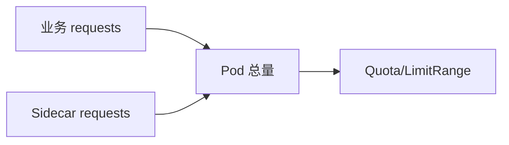

# 第20章 Sidecar 资源治理：配额、限制与调度协同

## 20.1 项目背景

**业务场景（拟真）：配额过了、Pod 却 Pending**

团队把业务 `requests` 压到刚好过 **ResourceQuota**，启用网格注入后，**istio-proxy** 占用未计入心理账户 → **调度失败**或 **Quota 超额**。HPA 若按 Pod CPU 扩容，Sidecar 消耗算进副本，易 **过早扩容**；容量规划若忽略 Sidecar，则 **节点规划偏小**。

**痛点放大**

- **LimitRange + Quota**：需按「业务+Sidecar」联合建模。
- **降配副作用**：proxy 过小可能增延迟、丢包。



## 20.2 项目设计：小胖、小白与大师的「代理也算人头」

**第一轮**

> **小胖**：不就多 128Mi 吗，能差多少？
>
> **小白**：注解覆盖和全局默认谁优先？HPA 目标要改吗？
>
> **大师**：**Pod 可调度资源 = 所有容器之和**（含 Sidecar）。注解可 per-workload 覆盖；全局在 IstioOperator。HPA 是否包含 sidecar CPU 取决于指标与对象，要 **统一复盘**。
>
> **大师 · 技术映射**：**sidecar.istio.io/proxy* ↔ 覆盖；全局 values.global.proxy.resources ↔ 默认。**

**第二轮**

> **大师**：压降 proxy 前做 **延迟与错误率** 基线对比。

## 20.3 项目实战：覆盖 Sidecar 资源

**步骤 1：Pod 注解覆盖**

```yaml
metadata:
  annotations:
    sidecar.istio.io/proxyCPU: "500m"
    sidecar.istio.io/proxyMemory: "256Mi"
```

```yaml
# 全局默认（示意，以 IstioOperator/MeshConfig 为准）
apiVersion: install.istio.io/v1alpha1
kind: IstioOperator
spec:
  values:
    global:
      proxy:
        resources:
          requests:
            cpu: 100m
            memory: 128Mi
```

**步骤 2：观测与配额**

```bash
kubectl describe quota -n production
kubectl top pod -n production
```

## 20.4 项目总结

**优点与缺点**

| 维度 | 显式计入 Sidecar | 忽略 Sidecar |
|:---|:---|:---|
| 调度 | 可预测 | Pending/碎片化 |
| 成本 | 透明 | 低估 |

**适用场景**：多租户 Quota；大规模集群；FinOps。

**不适用场景**：无注入（无此问题）。

**典型故障**：Quota 满；proxy 过小延迟升；HPA 震荡。

**思考题（参考答案见第21章或附录）**

1. 为何 `kubectl describe pod` 在 Pending 时常能看到「Insufficient cpu」与 Sidecar 相关？
2. 调低 `istio-proxy` 的 memory limit 可能引发哪类运行时问题？

**推广与协作**：平台发布默认 Sidecar 规格；租户申报加注入；SRE 监控 OOMKilled。

---

## 编者扩展

> **本章导读**：容量模型含 Sidecar；**实战演练**：top 对比 app/proxy；**深度延伸**：HPA 与 VPA。

### 深度延伸

大连接数场景下 Envoy 内存与 `concurrency` 调优的定性关系。

---

上一章：[第19章 自定义 CA 与证书：企业 PKI 与 Istio 的衔接](第19章 自定义 CA 与证书：企业 PKI 与 Istio 的衔接.md) | 下一章：[第21章 Egress流量管控：安全的出站管理](第21章 Egress流量管控：安全的出站管理.md)

*返回 [专栏目录](README.md)*
