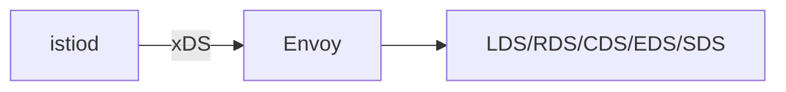

# 第23章 Envoy配置深度解析：xDS协议与动态配置

## 23.1 项目背景

**业务场景（拟真）：线上行为与 YAML 不一致，要「看见 Envoy 真相」**

排障深入到「为什么这条路由没生效」时，只看 Kubernetes CRD 不够，需要理解 **istiod → xDS → Envoy** 的映射：**LDS**（监听器）、**RDS**（路由）、**CDS**（集群）、**EDS**（端点）、**SDS**（证书）。大规模集群还存在 **推送延迟与增量 xDS** 问题。

**痛点放大**

- **配置自认为对**：CRD 对了但数据面旧快照。
- **EnvoyFilter 误用**：升级后 patch 不兼容。



## 23.2 项目设计：小胖、小白与大师的「配置魔法」

**第一轮**

> **小胖**：不就是个代理吗，为啥要五个字母缩写？
>
> **小白**：改完 VirtualService，`proxy-config route` 多久变？全量和 Delta 啥区别？
>
> **大师**：xDS 把**监听器、路由、集群、端点、证书**拆开下发，才能细粒度热更新。延迟用 `proxy-status` 与日志观察；Delta 减少带宽与 CPU，但心智更复杂。
>
> **大师 · 技术映射**：**CRD ↔ istiod 翻译 ↔ xDS 资源 ↔ Envoy 运行时。**

**第二轮**

> **大师**：**EnvoyFilter** 是最后手段：先确认能否用原生 CRD 表达。

## 23.3 项目实战：xDS调试与自定义

**步骤 1：dump 与理解结构**

```bash
# 查看完整Envoy配置
istioctl proxy-config all <pod-name> -o json > envoy_config.json

# 理解动态配置
cat envoy_config.json | jq 'keys'
# 输出：bootstrap, clusters, dynamicListeners, dynamicRouteConfigs, endpoints, listeners, routes, secrets
```

**步骤 2（慎用）：EnvoyFilter 示例**

```yaml
apiVersion: networking.istio.io/v1alpha3
kind: EnvoyFilter
metadata:
  name: custom-lua-filter
spec:
  configPatches:
  - applyTo: HTTP_FILTER
    match:
      context: SIDECAR_INBOUND
    patch:
      operation: INSERT_BEFORE
      value:
        name: envoy.filters.http.lua
        typed_config:
          "@type": type.googleapis.com/envoy.extensions.filters.http.lua.v3.Lua
          inlineCode: |
            function envoy_on_request(request_handle)
              request_handle:headers():add("x-processed-by", "lua-filter")
            end
```

**测试验证**：`istioctl proxy-config cluster` / `route` / `endpoint` 与 CRD 对齐交叉验证。

## 23.4 项目总结

**优点与缺点**

| 维度 | 懂 xDS 排障 | 仅看 CRD |
|:---|:---|:---|
| 深度 | 可定位翻译层 | 易卡住 |

**适用场景**：高级定制；性能优化；疑难路由。

**不适用场景**：常规 CRD 可表达的需求（避免 EnvoyFilter）。

**典型故障**：配置未推送；Filter 版本不兼容；secret 未下发。

**思考题（参考答案见第24章或附录）**

1. 简述 LDS 与 RDS 在 Envoy 中的职责分工。
2. 为何生产环境对 EnvoyFilter 持谨慎态度？

**推广与协作**：架构师/资深开发读；变更评审含 EnvoyFilter；SRE 建立 proxy-config 取证模板。

---

## 编者扩展

> **本章导读**：LDS/RDS/CDS/EDS；**实战演练**：cluster→endpoint 追链；**深度延伸**：Delta xDS。

---

上一章：[第22章 核心能力篇复盘：从对象模型到运维闭环](第22章 核心能力篇复盘：从对象模型到运维闭环.md) | 下一章：[第24章 Ambient 模式与架构演进：Sidecar 之外的选择](第24章 Ambient 模式与架构演进：Sidecar 之外的选择.md)

*返回 [专栏目录](README.md)*
