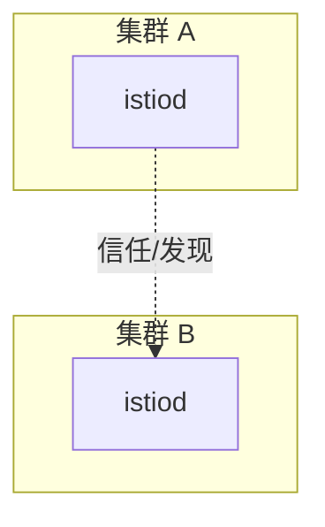

# 第25章 多集群与联邦：控制平面拓扑与信任

## 25.1 项目背景

**业务场景（拟真）：双集群活，但「服务发现 + 证书」不能各说各话**

单集群可能因控制面、升级或分区整体不可用；业务要 **同城双活 / 异地灾备**。多集群引入：**跨集群服务发现**、**根证书互信**、**控制面拓扑**（单控制面多集群 vs 每集群 istiod）、**East-West** 与 **remote secret**。抄 YAML 简单，**信任链与 DNS 一体规划**错一步全红。

**痛点放大**

- **服务名冲突**：全局命名与导出规则未对齐。
- **只通业务网**：控制面或 discovery 不通 → 端点不同步。



## 25.2 项目设计：小胖、小白与大师的「先选拓扑」

**第一轮**

> **小胖**：两个 K8s 不就两套 kubectl 吗？联邦是啥，能吃吗？
>
> **小白**：共用一个 istiod 和每集群一个各有什么坑？
>
> **大师**：共用一个 istiod 要扛**跨集群 API 访问**与单点风险；更常见 **每集群控制面 + 证书互信 + 服务导出**。先定拓扑，再写 `remote secret` 与多集群安装。
>
> **大师 · 技术映射**：**remote secret ↔ kubeconfig；信任根 ↔ mTLS 跨集群。**

**第二轮**

> **大师**：最费事的是 **身份信任链** 与 **跨集群 DNS/服务名**，不是 VirtualService 抄作业。

## 25.3 项目实战：检查项

**步骤 1：Secret 与远端发现**

```bash
# 远程集群 kubeconfig secret（示意，具体以官方多集群安装为准）
kubectl get secret -n istio-system
kubectl get remoteclusters -A 2>/dev/null || true
```

| 检查项 | 说明 |
|:---|:---|
| 根证书 | 多集群是否互信 |
| 服务导出 | 远端服务是否可见 |
| 网络 | 控制平面与网关连通性 |

## 25.4 项目总结

**优点与缺点**

| 维度 | 多集群网格 | 单集群 |
|:---|:---|:---|
| 容灾 | 强 | 单点 |
| 运维 | 极复杂 | 简单 |

**适用场景**：双活；灾备；组织多集群。

**不适用场景**：无多集群诉求。

**典型故障**：信任链错误；remote secret 权限；服务不可见。

**思考题（参考答案见第26章或附录）**

1. 简述「primary-remote」与「multi-primary」在故障域上的主要差异。
2. `remote secret` 在 Istio 多集群中通常解决什么问题？

**推广与协作**：架构师定拓扑；平台管证书与 secret；网络保证控制面连通。

---

## 编者扩展

> **本章导读**：多集群是「信任与发现」的乘法：先选拓扑，再谈流量。

### 趣味角

多集群像多国签证：光有护照（证书）不够，还要落地签（服务发现）和海关口径（路由）。

### 实战演练

用表格列出 primary-remote 中「证书」「endpoint 发现」「故障域」三列由谁负责；与团队讨论你们更适合哪一种。

### 深度延伸

跨集群 mTLS 与 **控制面单点**的关系；灾难恢复 RTO/RPO 如何写进网格 SLO？

---

上一章：[第24章 Ambient 模式与架构演进：Sidecar 之外的选择](第24章 Ambient 模式与架构演进：Sidecar 之外的选择.md) | 下一章：[第26章 性能调优：从毫秒到微秒的优化之路](第26章 性能调优：从毫秒到微秒的优化之路.md)

*返回 [专栏目录](README.md)*
