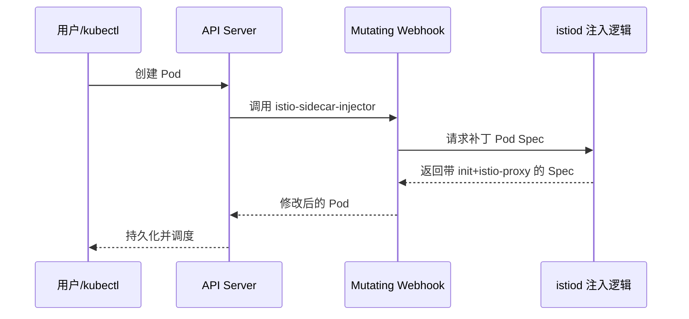

# 第2章 Sidecar自动注入：简化部署的秘密武器

## 2.1 项目背景

**业务场景（拟真）：流水线里的「注入」谁说了算**

某团队在灰度发布新支付服务：开发把 Deployment 推到 Git，CI 构建镜像，CD 用 Helm 部署到 `production` 命名空间。安全组要求：**所有业务 Pod 必须带网格 Sidecar**，且 Sidecar 版本与当前 `istiod` 修订一致。若仍靠 `istioctl kube-inject` 在流水线里改 YAML，经常出现「有人忘了跑注入」「本地 istioctl 版本与集群不一致」「注入后的 YAML 与业务 YAML 双份维护」——本章从这一真实矛盾引出 **自动 Sidecar 注入**。

**痛点放大**

- **可维护性**：注入后的清单臃肿，Code Review 难以聚焦业务变更。
- **一致性**：人工注入易遗漏 Pod（CronJob、第三方 Helm Chart 等），造成网格「漏网之鱼」。
- **审计与合规**：需要证明「每个工作负载在创建时即被策略覆盖」，Admission 路径比事后脚本更符合审计叙事。

**机制要点（心智图）**



**本章主题**：基于 **MutatingAdmissionWebhook** 的自动注入，让「命名空间/工作负载标签 → 统一模板 → 审计可追溯」成为默认路径。

## 2.2 项目设计：小胖、小白与大师的注入交锋

**场景设定**：小白发现新 Pod 里多了 `istio-proxy`；小胖担心「Webhook 卡一下，发布就黄」；大师要讲清 **Admission 路径**与**失败策略**。

**第一轮**

> **小胖**：我就加了个 Deployment，咋 Pod 里凭空多俩人？是不是谁给我镜像里塞东西了？
>
> **小白**：我查了 YAML，确实没写 `istio-proxy`。这是变异准入吗？如果 API Server 调 Webhook 超时，Pod 还能创建吗？
>
> **大师**：这是 **Mutating Webhook** 在 Pod 持久化前改了 Spec：加上 `istio-init`、`istio-proxy`、卷与注解。API Server 同步调注入服务，拿到 JSON Patch 后再入库。你们看到的多出来的容器，来自注入模板，不是业务镜像被篡改。
>
> **大师 · 技术映射**：**istio-sidecar-injector ↔ MutatingWebhookConfiguration；注入结果 ↔ Pod Spec 补丁 + `sidecar.istio.io/status` 注解。**

**第二轮**

> **小胖**：那流水线里我还要不要 `kube-inject`？我们以前都脚本里跑一遍。
>
> **小白**：命名空间 `istio-injection=enabled` 和 Pod 注解 `sidecar.istio.io/inject: "false"` 谁优先？多控制面 revision 时标签怎么写？
>
> **大师**：生产推荐以**自动注入**为主：业务清单保持干净，Sidecar 版本跟 `istiod` 走。优先级一般是 Pod 注解 > 命名空间标签；revision 场景用 `istio.io/rev=<revision>` 与集群内多套控制面共存。手动 `kube-inject` 适合调试或特殊 CI，但不适合作为长期真相源。
>
> **大师 · 技术映射**：**注入决策 = 命名空间标签 + Pod 注解 + revision；模板真相源 = `istio-sidecar-injector` ConfigMap（或等价配置）。**

**第三轮**

> **小胖**：万一 Webhook 挂了，我整个公司都不能发版？这锅谁背？
>
> **小白**：`failurePolicy` 是 `Fail` 还是 `Ignore`？我们有没有监控 Webhook 延迟和证书过期？
>
> **大师**：策略与集群风险偏好相关：`Fail` 更安全但可能阻塞创建；`Ignore` 不阻塞但可能产生未注入 Pod。生产应监控 Webhook 可用性、证书轮换、istiod 副本健康，并把「未注入」纳入策略巡检。Job/CronJob 还要考虑 Sidecar 生命周期与退出，避免任务永远完不成。
>
> **大师 · 技术映射**：**准入失败策略 ↔ failurePolicy；批处理负载 ↔ 注入/终止与 `terminationDrainDuration` 等调优。**

**类比**：Webhook 像「登机前安检改票」——你交的仍是那张 Deployment，系统在入库前贴上 Sidecar 与 Init，全程可审计。

## 2.3 项目实战：配置与调试自动注入

**环境准备**：已安装 Istio 的集群、`kubectl`；本章命令与第1章控制面版本一致为佳。

**步骤 1：命名空间级启用/禁用（目标：标签驱动批量注入）**

命名空间级别是最常用方式，适合按环境或团队划界：

```bash
# 创建新命名空间并启用注入
kubectl create namespace production
kubectl label namespace production istio-injection=enabled

# 验证标签
kubectl get namespace production -o jsonpath='{.metadata.labels}'

# 批量为多个命名空间启用
for ns in frontend backend api; do
  kubectl create namespace $ns
  kubectl label namespace $ns istio-injection=enabled
done

# 禁用注入（删除标签或设置为disabled）
kubectl label namespace production istio-injection-
# 或
kubectl label namespace production istio-injection=disabled --overwrite
```

**预期**：`kubectl get ns production -o jsonpath='{.metadata.labels}'` 中含 `istio-injection":"enabled"`（或 revision 标签）。

**可能踩坑**：标签写错键名；多 revision 时仍用旧 `istio-injection` 导致注入到错误控制面。

**步骤 2：Pod 级覆盖（目标：单工作负载禁用或定制 Sidecar）**

命名空间已启用时，个别 Pod 用注解精细控制：

```yaml
apiVersion: apps/v1
kind: Deployment
metadata:
  name: special-workload
spec:
  template:
    metadata:
      annotations:
        # 完全禁用注入
        sidecar.istio.io/inject: "false"

        # 或：启用但自定义配置
        # sidecar.istio.io/inject: "true"
        # proxy.istio.io/config: |
        #   {
        #     "holdApplicationUntilProxyStarts": true,
        #     "resources": {
        #       "limits": {"cpu": "1", "memory": "256Mi"},
        #       "requests": {"cpu": "100m", "memory": "128Mi"}
        #     }
        #   }
    spec:
      containers:
      - name: app
        image: myapp:v1
```

常用注入注解清单：

| 注解                                              | 用途       | 示例值                       |
|:----------------------------------------------- |:-------- |:------------------------- |
| `sidecar.istio.io/inject`                       | 控制是否注入   | `"true"` / `"false"`      |
| `proxy.istio.io/config`                         | 自定义代理配置  | JSON格式的ProxyConfig        |
| `sidecar.istio.io/proxyCPU`                     | 覆盖CPU限制  | `"500m"`                  |
| `sidecar.istio.io/proxyMemory`                  | 覆盖内存限制   | `"256Mi"`                 |
| `sidecar.istio.io/interceptionMode`             | 流量拦截模式   | `"REDIRECT"` / `"TPROXY"` |
| `traffic.sidecar.istio.io/includeInboundPorts`  | 指定入向拦截端口 | `"8080,9090"`             |
| `traffic.sidecar.istio.io/excludeOutboundPorts` | 排除出向拦截端口 | `"27017"`                 |

**步骤 3（进阶）：自定义注入模板**

企业级场景可能需在模板中加入监控 Agent 等（需熟悉 Go template）：

```bash
# 导出当前注入模板
kubectl get configmap istio-sidecar-injector -n istio-system -o jsonpath='{.data.config}' > injector-config.yaml

# 编辑模板（添加自定义容器）
# 注意：需要熟悉Go template语法

# 应用修改后的模板
kubectl create configmap istio-sidecar-injector-custom \
  --from-file=config=injector-config.yaml \
  -n istio-system --dry-run=client -o yaml | kubectl apply -f -

# 更新Webhook使用新模板（需要修改Deployment挂载）
```

**步骤 4：注入失败系统化排查**

```bash
# 步骤1：确认Pod是否被Webhook处理
kubectl get pod <pod-name> -o jsonpath='{.metadata.annotations.sidecar\.istio\.io\/status}'
# 无输出 = 未被处理，检查命名空间标签和Pod注解

# 步骤2：查看Pod事件，确认注入是否成功
kubectl describe pod <pod-name> | grep -A5 Events
# 关注"Successfully assigned"、"Created container istio-proxy"等事件

# 步骤3：检查Webhook配置和证书
kubectl get mutatingwebhookconfiguration istio-sidecar-injector -o yaml | grep -A3 caBundle
# 确保证书未过期

# 步骤4：查看Istiod注入日志
kubectl logs -n istio-system deployment/istiod | grep inject
# 查找"Injecting pod"或错误信息

# 步骤5：Sidecar启动失败时，查看istio-proxy日志
kubectl logs <pod-name> -c istio-proxy --tail=100
# 常见错误：证书获取失败、xDS连接失败、配置解析错误
```

**测试验证**

```bash
kubectl run netcheck --image=curlimages/curl --restart=Never --rm -it -- curl -sS -o /dev/null -w "%{http_code}\n" https://kubernetes.default
# 在已注入的 Pod 内对集群内 Service 发请求，确认经 Sidecar（与业务相关章节结合）
kubectl get mutatingwebhookconfiguration istio-sidecar-injector -o jsonpath='{.webhooks[0].failurePolicy}'
```

**完整清单**：注入模板与 Webhook 定义随 Istio 版本发布；请以你安装的 `istio-system` 下 ConfigMap / Webhook 为准，官方仓库 [istio/istio](https://github.com/istio/istio) 可对照源码与示例。

## 2.4 项目总结

**优点与缺点（对比）**

| 维度 | 自动注入（Webhook） | 手动 `kube-inject` / 静态清单 |
|:---|:---|:---|
| 清单维护 | 业务 YAML 干净，Sidecar 由平台统一 | 易双份维护、Review 噪声大 |
| 一致性 | 新 Pod 强制走同一模板 | 易遗漏、版本漂移 |
| 排障 | 需懂 Admission / Webhook / 证书 | 问题前置在 CI，但难全局审计 |
| 适用 | 生产默认推荐 | 调试、一次性 YAML 导出 |

**适用场景**：平台化网格接入；多命名空间分阶段启用；多 revision 金丝雀升级控制面。

**不适用场景**：强需求「绝不允许变更 Pod Spec」的合规流水线（需评估 policy 例外）；极简集群仅做试用且不愿承担 Webhook 可用性风险（可评估 `failurePolicy` 与监控）。

**注意事项**：Job/CronJob 与 Sidecar 生命周期；ResourceQuota；Init 容器不经过 Sidecar；私有镜像拉取。

**典型生产故障与根因**

1. **Pod 长时间 Pending**：节点资源不足，Sidecar request 触发调度失败。
2. **CronJob 永不完成**：主容器退出后 Sidecar 仍运行，需关闭注入或调终止/Drain 参数。
3. **注入突然全失败**：Webhook 证书过期或 istiod 不可用，或 API Server 到 Webhook 网络中断。

**思考题（参考答案见第3章或附录）**

1. 同一命名空间 `istio-injection=enabled`，某 Deployment 的 Pod 注解为 `sidecar.istio.io/inject: "false"`，最终是否注入？为什么？
2. 修改 `istio-sidecar-injector` 模板后，为何已运行的 Pod 不会自动变？要让存量工作负载生效有哪些办法？

**推广与协作**：开发掌握注解与命名空间策略；运维负责 Webhook 证书、istiod 健康与准入监控；测试在预发验证「注入开关」与批处理任务行为。

---

## 编者扩展

> **本章导读**：Admission 上的「合规改装」；**实战演练**：未注入与已注入命名空间各部署一组 Pod，对比 `sidecar.istio.io/status`；**深度延伸**：`failurePolicy` 与变更窗口风险。

---

上一章：[第1章 Istio架构详解：掌控微服务的中枢神经系统](第1章 Istio架构详解：掌控微服务的中枢神经系统.md) | 下一章：[第3章 Gateway与VirtualService：流量入口的守门人](第3章 Gateway与VirtualService：流量入口的守门人.md)

*返回 [专栏目录](README.md)*
