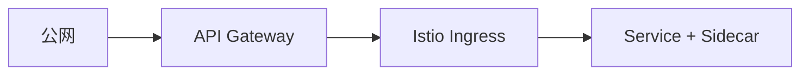

# 第31章 API 网关与网格协同：边界在哪里

## 31.1 项目背景

**业务场景（拟真）：已有 Kong/云 API 网关，又上了 Istio**

能力重叠：**JWT、TLS、限流** 若在 **边缘与网格各做一遍**，会出现 **双重 TLS**、**重复验签延迟**、**排障链路变长**。本章划 **边缘（南北向终端协议）** 与 **网格（服务身份与东西向）** 的边界。

**痛点放大**

- **信任头伪造**：若网关与网格未约定传递 **用户身份** 的方式，易产生安全洞。
- **客户端 IP**：经多层代理后失真，影响审计。

## 31.2 项目设计：小胖、小白与大师的「边缘 vs 网格」

**第一轮**

> **小胖**：网关都验 JWT 了，网格还验啥？
>
> **小白**：限流放哪层？WAF 谁做？
>
> **大师**：常见：**网关注 JWT**（终端用户），**网格**做 **mTLS + 服务间 AuthorizationPolicy**。入口限流/WAF/Bot **优先网关**；服务间保护与连接池 **DR**。重复验签要有 **合规或零信任** 理由，否则合并。
>
> **大师 · 技术映射**：**边缘 = 南北向协议与终端身份；网格 = 服务身份与 L7 细粒度。**

## 31.3 项目实战：职责表

**步骤 1：对照**

| 能力 | 边缘网关 | 服务网格 |
|:---|:---|:---|
| 南北向 TLS 终止 | 优先 | 可选 |
| WAF/ Bot 防护 | 优先 | 通常不做 |
| 东西向 mTLS | 不涉及 | 优先 |
| 细粒度服务授权 | 粗 | 细 |

## 31.4 项目总结

**优点与缺点**

| 维度 | 职责清晰 | 重复堆叠 |
|:---|:---|:---|
| 延迟/排障 | 较优 | 差 |

**适用场景**：已有成熟网关；混合云。

**不适用场景**：极简无网关（可直接 Istio Ingress）。

**典型故障**：双重 TLS；伪造身份头；限流双杀。

**思考题（参考答案见第32章或附录）**

1. 何种情况下「网关与网格都验 JWT」仍合理？
2. 东西向 mTLS 与南北向 TLS 终止通常各发生在链路的哪一段？

**推广与协作**：架构组定边界文档；网关团队与网格团队联合 Runbook。

---

## 编者扩展

> **本章导读**：终端身份 vs 服务身份；**实战演练**：画三条链路与终止点；**深度延伸**：header 信任链与横向移动。

---

上一章：[第30章 渐进式落地：从试点到全面推广](第30章 渐进式落地：从试点到全面推广.md) | 下一章：[第32章 高级进阶篇复盘：从“会用”到“敢上生产”](第32章 高级进阶篇复盘：从“会用”到“敢上生产”.md)

*返回 [专栏目录](README.md)*
