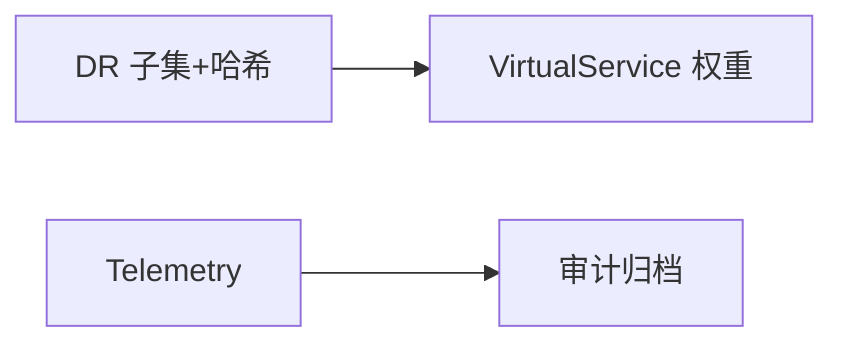

# 第33章 金融级交易服务：流量治理实战

## 33.1 项目背景

**业务场景（拟真）：交易核心同城双活 + 监管要审计**

支付/交易链路要求 **高可用**、**会话与订单一致性**、**调用可审计**；监管关心 **mTLS、访问日志、策略变更可追溯**。网格侧通过 **一致哈希/子集**、**locality 与 failover**、**Telemetry + mTLS + GitOps** 组合应对——但 **业务层幂等、对账、数据库事务** 仍是第一性原理。

**痛点放大**

- **错误重试**：资金类 POST **禁止盲重试**（与第8章联动）。
- **只调网格不调架构**：一致性仅靠哈希不够。



## 33.2 项目设计：小胖、小白与大师的金融防线

**第一轮**

> **小胖**：上了 Istio 交易就不会亏钱了？
>
> **小白**：一致哈希和会话粘滞差在哪？双活切换打多少权重？
>
> **大师**：网格解决 **流量落点与韧性**；**账务正确**靠业务。`consistentHash` 减少跨分片；**locality failover** 需与数据复制 RPO/RTO 对齐。监管要 **日志+身份+变更链**。
>
> **大师 · 技术映射**：**DR subset + hash ↔ 落点；PeerAuth+Telemetry ↔ 传输与证据。**

**核心挑战与Istio应对**：

| 挑战 | Istio能力 | 配置要点 |
|:---|:---|:---|
| 强一致性 | 会话亲和性 + 一致性哈希 | `loadBalancer.consistentHash` |
| 多活架构 | locality负载均衡 + 故障转移 | `localityLbSetting.failover` |
| 审计合规 | 全链路访问日志 + mTLS身份 | Telemetry API + PeerAuthentication |
| 实时性要求 | 性能优化 + 边缘部署 | Sidecar资源调优 + 区域Gateway |

## 33.3 项目实战：端到端解决方案

**步骤 1：DestinationRule + VirtualService 骨架**

```yaml
# 金融交易服务：强一致性配置
apiVersion: networking.istio.io/v1beta1
kind: DestinationRule
metadata:
  name: trading-service
spec:
  host: trading-core
  trafficPolicy:
    loadBalancer:
      consistentHash:
        httpHeaderName: x-session-id  # 会话粘性
    connectionPool:
      tcp:
        maxConnections: 500
    outlierDetection:
      consecutive5xxErrors: 3  # 更敏感的熔断
      interval: 10s
      baseEjectionTime: 60s
  subsets:
  - name: primary
    labels:
      zone: primary
  - name: standby
    labels:
      zone: standby

---
# 同城双活：日常流量走 primary；演练或应急时调整权重。区域/可用区级故障转移在 DestinationRule 的 localityLbSetting 中配置，勿与 VirtualService 混写。
apiVersion: networking.istio.io/v1beta1
kind: VirtualService
metadata:
  name: trading-routing
spec:
  hosts:
  - trading-core
  http:
  - route:
    - destination:
        host: trading-core
        subset: primary
      weight: 100
    - destination:
        host: trading-core
        subset: standby
      weight: 0
```

**测试验证**：压测与故障演练下切换 subset 权重；审计日志抽样对齐订单号（脱敏）。

## 33.4 项目总结

**优点与场景**

| 维度 | 网格+业务协同 | 仅网格 |
|:---|:---|:---|
| 审计/韧性 | 可落地 | 不够 |

**不适用**：无合规与一致性诉求的通用服务（不必过度设计）。

**典型故障**：盲重试；哈希键选错；failover 与数据不一致。

**思考题（参考答案见第34章或附录）**

1. 为何金融支付链路常对 POST/扣款接口禁用或严格限制 mesh 重试？
2. `consistentHash` 能解决哪些类「一致性」问题、哪些不能？

**推广与协作**：架构+风控+合规联合评审；测试做账务对账用例。

---

## 编者扩展

> **本章导读**：钱与订单；**实战演练**：超时/重试预算表；**深度延伸**：幂等与对账。

---

上一章：[第32章 高级进阶篇复盘：从“会用”到“敢上生产”](第32章 高级进阶篇复盘：从“会用”到“敢上生产”.md) | 下一章：[第34章 电商大促：峰值流量下的入口与韧性](第34章 电商大促：峰值流量下的入口与韧性.md)

*返回 [专栏目录](README.md)*
