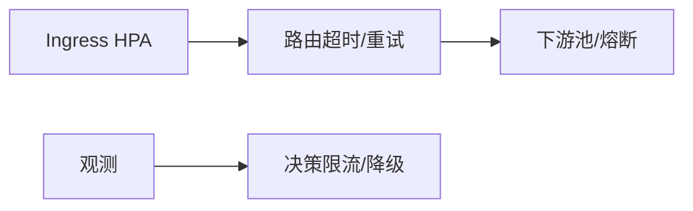

# 第34章 电商大促：峰值流量下的入口与韧性

## 34.1 项目背景

**业务场景（拟真）：秒杀 + 直播，入口脉冲与重试风暴**

**大促**把不确定性压进短时间：Ingress **先顶不住**、**连接池耗尽**、**重试放大下游**、缓存击穿连锁超时。治理顺序：**先识别错误策略（重试/超时）→ 再限流与隔离 → 再扩容与预热**——否则 HPA 只放大混乱。

**痛点放大**

- **只扩业务不扩网关**：Ingress CPU 先触顶。
- **压测与生产不对等**：TLS 会话、连接复用未预热。



## 34.2 项目设计：小胖、小白与大师的「先限流再扩容」

**第一轮**

> **小胖**：扩容机器不就完了？加钱！
>
> **小白**：CPU 不高但超时多是为啥？先查谁？
>
> **大师**：可能是 **排队与重试** 拉长尾延迟，而非算力不足。先看 **VirtualService 重试/超时**、**DR 连接池**、**Gateway 资源**，再谈加副本。
>
> **大师 · 技术映射**：**容量 = f(副本, 池, 重试策略, 网关 TLS)。**

**第二轮**

> **大师**：**预热**：Gateway、连接池、TLS 会话与压测脚本要与生产口径一致。

## 34.3 项目实战：大促检查表

**步骤 1：对照检查**

| 项 | 说明 |
|:---|:---|
| 入口 | HPA、副本下限、预热 |
| 路由 | 超时/重试与业务 SLA 对齐 |
| 下游 | 熔断阈值、隔离非核心路径 |
| 观测 | 黄金指标、队列长度、线程池 |

```bash
kubectl top pod -n istio-system -l app=istio-ingressgateway
istioctl proxy-config cluster deploy/istio-ingressgateway -n istio-system | head
```

## 34.4 项目总结

**优点与缺点**

| 维度 | 预案化大促 | 临场调参 |
|:---|:---|:---|
| 风险 | 可控 | 高 |

**适用场景**：秒杀；直播；全站活动。

**不适用场景**：无脉冲流量（常规优化即可）。

**典型故障**：网关未扩容；重试风暴；压测不对等。

**思考题（参考答案见第35章或附录）**

1. 为何「购物车 CPU 不高但超时多」未必能通过加业务副本解决？
2. 大促前应对 Ingress Gateway 做哪些与业务 Deployment 类似的容量动作？

**推广与协作**：大促指挥台；SRE 盯黄金指标；业务定降级顺序。

---

## 编者扩展

> **本章导读**：脉冲与降级顺序；**实战演练**：核心 vs 浏览优先级；**深度延伸**：环境对等压测。

---

上一章：[第33章 金融级交易服务：流量治理实战](第33章 金融级交易服务：流量治理实战.md) | 下一章：[第35章 零信任企业落地：身份、设备与网格策略的衔接](第35章 零信任企业落地：身份、设备与网格策略的衔接.md)

*返回 [专栏目录](README.md)*
